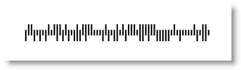

////
|metadata|
{
    "name": "xambarcode-barsfillmode",
    "controlName": ["{BarcodesName}"],
    "tags": [],
    "guid": "f049d804-e9c4-40c9-b7ad-80a3fc098539","buildFlags": [],
    "createdOn": "2015-09-23T20:39:25.9275798Z"
}
|metadata|
////

= Configuring Bars Fill Mode

The link:{BarcodesLink}.{BarcodesBase}{ApiProp}barsfillmode.html[BarsFillMode] property (for all barcode grid symbologiespick:[wpf=", excluding the MaxiCode"]) defines how the internal grid containing the bars will fill the {BarcodesName} control’s dimensions. It has the following values:

* FillSpace – ensures that the internal grid will fill the {BarcodesName} control. Take into consideration that depending on the dimensions of the control and the bars grid and the DPI of the user, in some cases the bars’ width and height differ from the actual ones in pixels. This might make the barcode unreadable – if the internal grid has 200 columns and the width of the control is 300 px then the columns bars will have integer widths (some will be 1px and some 2px) to fill the control. This mode is recommended for all scenarios where there is no machine reading.

ifdef::wpf[]

*In XAML:*
[source,xaml]
----
<ig:XamIntelligentMailBarcode x:Name="Barcode" Width="321"  
    Data="1212312345612345678912345"    
    BarsFillMode="FillSpace" />
----

*In C#:*
[source,csharp]
----
var Barcode = new XamIntelligentMailBarcode();
Barcode.Width = 321;
Barcode.Data = "1212312345612345678912345";
Barcode.BarsFillMode = BarsFillMode.FillSpace;
----
*In Visual Basic:*
[source,vb]
----
Dim Barcode As New XamIntelligentMailBarcode()
Barcode.Width = 321
Barcode.Data = "1212312345612345678912345"
Barcode.BarsFillMode = BarsFillMode.FillSpace
----
endif::wpf[]

ifdef::xamarin[]

*In XAML:*
[source,xaml]
----
<Frame WidthRequest="100" HeightRequest="400" HorizontalOptions="CenterAndExpand" VerticalOptions="CenterAndExpand">
    <ig:XamQRCodeBarcode x:Name="Barcode" Data="1212312345612345678912345" BarsFillMode="FillSpace"/>
</Frame>
----

*In C#:*
[source,csharp]
----
var Barcode = new XamQRCodeBarcode();
Barcode.Data = "1212312345612345678912345";
Barcode.BarsFillMode = BarsFillMode.FillSpace;
----
endif::xamarin[]

ifdef::android[]

*In Java:*

----
Code128BarcodeView bar128 = new Code128BarcodeView();;
bar128.setWidth("321");
bar128.setData("1212312345612345678912345");
bar128.setBarsFillMode(BarsFillMode.FillSpace);
----

endif::android[]

ifdef::win-forms[]

*In Visual Basic:*
[source,vb]
----
Dim barcodeQR As New UltraCode128Barcode With _
{
    .Width = 321, _
    .Data = "Code 128", _
    .BarsFillMode = BarsFillMode.Fillspace _
}
----

endif::win-forms[]

ifdef::win-forms[]

*In C#:*
[source,csharp]
----
var barcode = new UltraCode128Barcode
{
    Width = 321,
    Data = "Code 128",  
    BarsFillMode = BarsFillMode.Fillspace
};
----

endif::win-forms[]

ifdef::wpf[]

image::images/xamBarcode_BarsFillMode_01.png[]

endif::wpf[]

.Note:
[NOTE]
====
FillSpace is the default value of the BarsFillMode property.
====
* EnsureEqualSize – ensures that all internal grid bar cells have the same dimensions. If the internal grid has 200 columns and the width of the control is 300px then the grid will shrink to 200px in width making all cells equal. This mode is recommended for machine reading.

ifdef::wpf[]

*In XAML:*
[source,xaml]
----
<ig:XamIntelligentMailBarcode x:Name="Barcode" Width="321"    
    Data="1212312345612345678912345"    
    BarsFillMode="EnsureEqualSize" />
----

*In Visual Basic:*
[source,vb]
----
Dim Barcode As New XamIntelligentMailBarcode()
Barcode.Width = 321
Barcode.Data = "1212312345612345678912345"
Barcode.BarsFillMode = BarsFillMode.EnsureEqualSize
----

*In C#:*
[source,csharp]
----
XamIntelligentMailBarcode Barcode = new XamIntelligentMailBarcode();
Barcode.Width = 321;
Barcode.Data = "1212312345612345678912345";
Barcode.BarsFillMode = BarsFillMode.EnsureEqualSize;
----
endif::wpf[]

ifdef::xamarin[]

*In XAML:*
[source,xaml]
----
 <Frame WidthRequest="100" HeightRequest="400" HorizontalOptions="CenterAndExpand" VerticalOptions="CenterAndExpand">
    <ig:XamQRCodeBarcode x:Name="Barcode" Data="1212312345612345678912345" BarsFillMode="EnsureEqualSize"/>
</Frame>
----

*In C#:*
[source,csharp]
----
var Barcode = new XamQRCodeBarcode();
Barcode.Data = "1212312345612345678912345";
Barcode.BarsFillMode = BarsFillMode.EnsureEqualSize;
----
endif::xamarin[]

ifdef::android[]

*In Java:*

----
Code128BarcodeView bar128 = new Code128BarcodeView();;
bar128.setWidth("321");
bar128.setData("1212312345612345678912345");
bar128.setBarsFillMode(BarsFillMode.EnsureEqualSize);
----

endif::android[]

ifdef::win-forms[]

*In Visual Basic:*
[source,vb]
----
Dim barcodeQR As New UltraCode128Barcode With _
{
    .Width = 321, _  
    .Data = "Code 128", _
    .BarsFillMode = BarsFillMode.Fillspace _
}
----

endif::win-forms[]

ifdef::win-forms[]

*In C#:*
[source,csharp]
----
var barcode = new UltraCode128Barcode
{
    Width = 321,  
    Data = "Code 128",  
    BarsFillMode = BarsFillMode.Fillspace
};
----

endif::win-forms[]

ifdef::wpf[]

endif::wpf[]