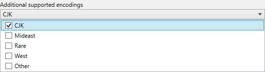
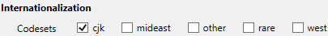
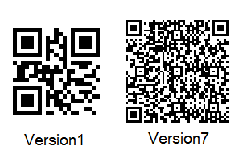
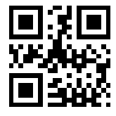
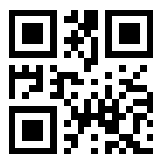

////
|metadata|
{
    "name": "xambarcode-configuring-qr-code",
    "controlName": ["{BarcodesName}"],
    "tags": [],
    "guid": "936860ed-ef6a-47ad-98f6-1d5dfb0b40de","buildFlags": [],
    "createdOn": "2015-09-23T20:38:04.7581431Z"
}
|metadata|
////

= Configuring QR Code

The QR (Quick Response) barcode symbology is a matrix (or two-dimensional) code, readable by QR scanners, mobile phones with a camera, and smartphones. This barcode symbology is one of the most popular types of two-dimensional barcodes, as its content can be decoded at high speed.

The code consists of an array of black square modules arranged in an overall square pattern, including a unique finder pattern located at three corners of the symbol. Module dimensions are user-specified to enable symbol production by a wide variety of techniques.

ifdef::xamarin[]

.Note:
[NOTE]
====
Add support for the CJK encoding to your project. 

For Android project - open Android project properties – select Android Options tab - Additional supported encodings – check CJK encoding.

For iOS project - open iOS Project properties – select iOS Build tab - Internationalization – Codesets – check cjk codeset.

====

endif::xamarin[]

The following properties are specific to the {BarcodeQRName} symbology.

* link:{BarcodesLink}.{BarcodeQRName}{ApiProp}errorcorrectionlevel.html[ErrorCorrectionLevel]
* link:{BarcodesLink}.{BarcodeQRName}{ApiProp}sizeversion.html[SizeVersion]
* link:{BarcodesLink}.{BarcodeQRName}{ApiProp}encodingmode.html[EncodingMode]
* link:{BarcodesLink}.{BarcodeQRName}{ApiProp}ecinumber.html[EciNumber]
* link:{BarcodesLink}.{BarcodeQRName}{ApiProp}fnc1mode.html[Fnc1Mode]
* link:{BarcodesLink}.{BarcodeQRName}{ApiProp}applicationindicator.html[ApplicationIndicator]

== Error Correction Level

QR Code has an error correction feature to restore the encoded data if the barcode is damaged or dirty. The user can choose from four error correction levels in accordance with the use case which are set through {BarcodeQRName} control’s ErrorCorrectionLevel property.

ifdef::xaml[]
*In XAML:*
[source,xaml]
ifdef::xaml[]
----
<ig:XamQRCodeBarcode
    x:Name="Barcode"
    Data="QR Code"
    ErrorCorrectionLevel="Medium" />
----
endif::xaml[]

endif::xaml[]

ifdef::wpf[]

*In Visual Basic:*
[source,vb]
ifdef::wpf[]
----
Dim Barcode As New XamQRCodeBarcode()
Barcode.Data = "QR Code"
Barcode.ErrorCorrectionLevel = QRCodeErrorCorrectionLevel.Medium
----
endif::wpf[]

endif::wpf[]

ifdef::xaml[]

*In C#:*
[source,csharp]
ifdef::xaml[]
----
XamQRCodeBarcode Barcode = new XamQRCodeBarcode();
Barcode.Data = "QR Code";
Barcode.ErrorCorrectionLevel = QRCodeErrorCorrectionLevel.Medium;
----
endif::xaml[]

endif::xaml[]

ifdef::android[]

pick:[android="*In Java:*"]

ifdef::android[]
----
QRCodeBarcodeView QRBar = new QRCodeBarcodeView();
QRBar.setData("QR Code");
QRBar.setErrorCorrectionLevel(QRCodeErrorCorrectionLevel.Medium);
----
endif::android[]

endif::android[]

ifdef::win-forms[]

*In Visual Basic:*
[source,vb]
----
Dim barcodeQR As New UltraQRCodeBarcode With
{
    .Data = "QR Code",
    .ErrorCorrectionLevel = QRCodeErrorCorrectionLevel.Medium
}
Me.Controls.Add(barcodeQR)
----

endif::win-forms[]

ifdef::win-forms[]

*In C#:*
[source,csharp]
----
var barcodeQR = new UltraQRCodeBarcode
{
    Data = "QR Code",
    ErrorCorrectionLevel = QRCodeErrorCorrectionLevel.Medium
};
this.Controls.Add(barcodeQR);
----

endif::win-forms[]

image::images/xamBarcode_Adding_QR_Code_06.png[]

== Size Version

Each size version has a different number of modules (the module refers to the black and white modules that make up the QR code matrix):

* Undefined – this size version is specific to the {BarcodeQRName} and internally calculates the smallest version that accommodates the data;
* Version1 - 21x21 modules;
* Version40 – 177x177 modules.

The size version of the {BarcodeQRName} control is set through its SizeVersion property:

ifdef::xaml[]

*In XAML:*
[source,xaml]
ifdef::xaml[]
----
<ig:XamQRCodeBarcode
    x:Name="Barcode"
    Data="Infragistics"
    SizeVersion="Version1" />
----
endif::xaml[]

endif::xaml[]

ifdef::wpf[]

*In Visual Basic:*
[source,vb]
ifdef::wpf[]
----
Dim Barcode As New XamQRCodeBarcode()
Barcode.Data = "Infragistics"
Barcode.SizeVersion = SizeVersion.Version1
----
endif::wpf[]

endif::wpf[]

ifdef::xaml[]

*In C#:*
[source,csharp]
ifdef::xaml[]
----
XamQRCodeBarcode Barcode = new XamQRCodeBarcode();
Barcode.Data = "Infragistics";
Barcode.SizeVersion = SizeVersion.Version1;
----
endif::xaml[]

endif::xaml[]

pick:[android="*In Java:*"]

ifdef::android[]
----
QRCodeBarcodeView QRBar = new QRCodeBarcodeView();
QRBar.setData("Infragistics");
QRBar.setSizeVersion(SizeVersion.Version1);
----
endif::android[]

ifdef::win-forms[]

*In Visual Basic:*
[source,vb]
ifdef::win-forms[]
----
Dim barcodeQR As New UltraQRCodeBarcode With
{  
    .Data = "Infragistics",
    .SizeVersion = SizeVersion.Version1
}
Me.Controls.Add(barcodeQR)
----
endif::win-forms[]

endif::win-forms[]

ifdef::win-forms[]

*In C#:*
[source,csharp]
----
var barcodeQR = new UltraQRCodeBarcode
{
  Data = "Infragistics",  
  SizeVersion = SizeVersion.Version1
};
this.Controls.Add(barcodeQR);
----

endif::win-forms[]

== Encoding Mode

QR Code is capable of encoding large numbers of characters using compaction depending on the types of the Data characters. The symbology can also encode JIS Kanji characters by setting EncodingMode to Kanji (only Kanji characters are encoded).

.Note:
[NOTE]
====
The current version of the {BarcodeQRName} does not support platform specific characters (encoded with 4 bytes).
====

When the {BarcodeQRName} control has set encoding mode to Undefined, the control internally switches between modes in order to achieve the most efficient compaction for the type of the characters’ data.

You can explicitly set the compaction mode for the {BarcodeQRName} control’s data by its EncodingMode property:

ifdef::xaml[]

*In XAML:*
[source,xaml]
ifdef::xaml[]
----
<ig:XamQRCodeBarcode
    x:Name="Barcode"
    Data="123"
    EncodingMode="Numeric" />
----
endif::xaml[]

endif::xaml[]

ifdef::wpf[]

*In Visual Basic:*
[source,vb]
ifdef::wpf[]
----
Dim Barcode As New XamQRCodeBarcode()
Barcode.Data = "123"
Barcode.EncodingMode = EncodingMode.Numeric
----
endif::wpf[]

endif::wpf[]

ifdef::xaml[]

*In C#:*
[source,csharp]
ifdef::xaml[]
----
XamQRCodeBarcode Barcode = new XamQRCodeBarcode();
Barcode.Data = "123";
Barcode.EncodingMode = EncodingMode.Numeric;
----
endif::xaml[]

endif::xaml[]

pick:[android="*In Java:*"]

ifdef::android[]
----
QRCodeBarcodeView QRBar = new QRCodeBarcodeView();
QRBar.setData("123");
QRBar.setEncodingMode(EncodingMode.Numeric);
----
endif::android[]

ifdef::win-forms[]

*In Visual Basic:*
[source,vb]
----
Dim barcodeQR As New UltraQRCodeBarcode With
{
    .Data = "123",
    .EncodingMode = EncodingMode.Numeric
}
Me.Controls.Add(barcodeQR)
----
endif::win-forms[]

ifdef::win-forms[]

*In C#:*
[source,csharp]
----
var barcodeQR = new UltraQRCodeBarcode
{
  Data = "123", 
  EncodingMode = EncodingMode.Numeric
};
this.Controls.Add(barcodeQR);
----

endif::win-forms[]

== Extended Channel Interpretation Number

The {BarcodeQRName} control supports ECI – this means that the control can encode data from character sets other than the default one (ISO/IEC 8859-1). The ECI code is set through the {BarcodeQRName} control’s EciNumber property.

Refer to the table at the bottom of the topic, containing the supported ECI values and their corresponding character sets. Note that when EciNumber is set to -1 (its default value), the character values and assignments are associated with the default ECI and the ECI protocol is not used in the data encoding. Note that the {BarcodeQRName} control encodes only characters of the specified character set.

Assume that the data to be encoded is in Greek, using character set ISO/IEC 8859-7 (ECI 000009):

ifdef::xaml[]

*In XAML:*
[source,xaml]
ifdef::xaml[]
----
<ig:XamQRCodeBarcode x:Name="Barcode"
                     EciNumber="9"
                     Data="ΑΒΓΔΕ"
                     EciHeaderDisplayMode="Show"/>
----
endif::xaml[]

endif::xaml[]

ifdef::wpf[]

*In Visual Basic:*
[source,vb]
ifdef::wpf[]
----
Dim Barcode As New XamQRCodeBarcode()
Barcode.EciNumber = 9
Barcode.Data = "ΑΒΓΔΕ"
EciHeaderDisplayMode = HeaderDisplayMode.Show
----
endif::wpf[]

endif::wpf[]

ifdef::xaml[]

*In C#:*
[source,csharp]
ifdef::xaml[]
----
XamQRCodeBarcode Barcode = new XamQRCodeBarcode();
Barcode.EciNumber = 9
Barcode.Data = "ΑΒΓΔΕ";
EciHeaderDisplayMode = HeaderDisplayMode.Show;
----
endif::xaml[]

endif::xaml[]

pick:[android="*In Java:*"]

ifdef::android[]
----
QRCodeBarcodeView QRBar = new QRCodeBarcodeView();
QRBar.setEciNumber(9);
QRBar.setData("ΑΒΓΔΕ");
QRBar.setEciHeaderDisplayMode(HeaderDisplayMode.Show);
----
endif::android[]

ifdef::win-forms[]

*In Visual Basic:*
[source,vb]
----
Dim barcodeQR As New UltraQRCodeBarcode With
{
  .EciNumber = 9,
  .Data = "ΑΒΓΔΕ",
  .EciHeaderDisplayMode = HeaderDisplayMode.Show
}
Me.Controls.Add(barcodeQR)
----

endif::win-forms[]

ifdef::win-forms[]

*In C#:*
[source,csharp]
----
var barcodeQR = new UltraQRCodeBarcode
{
    EciNumber = 9,
    Data = "ΑΒΓΔΕ",
    EciHeaderDisplayMode = HeaderDisplayMode.Show
};
this.Controls.Add(barcodeQR);
----

endif::win-forms[]

image::images/xamBarcode_Adding_QR_Code_07.png[]

== FNC1 mode

FNC1 mode is used to specify the format of the encoded data. You can choose the Gs1 mode to designate that the data is formatted in accordance with the GS1 General Specifications or Industry mode for data formatted in accordance with specific industry application previously agreed upon by AIM Inc. FNC1 mode applies to the entire symbol and is not affected by subsequent mode indicators.

The mode is set through {BarcodeQRName} control’s Fnc1Mode property.

ifdef::xaml[]

*In XAML:*
[source,xaml]
ifdef::xaml[]
----
<ig:XamQRCodeBarcode
    x:Name="Barcode"
    Fnc1Mode="Gs1"
    Data="(15)970331" />
----
endif::xaml[]

endif::xaml[]

ifdef::wpf[]

*In Visual Basic:*
[source,vb]
ifdef::wpf[]
----
Dim Barcode As New XamQRCodeBarcode()
Barcode.Fnc1Mode = Fnc1Mode.Gs1
Barcode.Data = "(15)970331"
----
endif::wpf[]

endif::wpf[]

ifdef::xaml[]

*In C#:*
[source,csharp]
ifdef::xaml[]
----
XamQRCodeBarcode Barcode = new XamQRCodeBarcode();
Barcode.Fnc1Mode = Fnc1Mode.Gs1;
Barcode.Data = "(15)970331";
----
endif::xaml[]

endif::xaml[]

pick:[android="*In Java:*"]

ifdef::android[]
----
QRCodeBarcodeView QRBar = new QRCodeBarcodeView();
QRBar.setFnc1Mode(Fnc1Mode.Gs1);
QRBar.setData("(15)970331");
----
endif::android[]

ifdef::win-forms[]

*In Visual Basic:*
[source,vb]
----
Dim barcodeQR As New UltraQRCodeBarcode With
{
  .Data = "(15)970331",
  .Fnc1Mode = Fnc1Mode.Gs1
}
Me.Controls.Add(barcodeQR)
----

endif::win-forms[]

ifdef::win-forms[]

*In C#:*
[source,csharp]
----
var barcodeQR = new UltraQRCodeBarcode
{
  Data = "(15)970331",
  Fnc1Mode = Fnc1Mode.Gs1
};
this.Controls.Add(barcodeQR);
----

endif::win-forms[]

ifdef::wpf,win-forms[]
For the GS1 General Specification codes, see the table at the bottom of this link:xambarcode-configuring-code128.html[article].
endif::wpf,win-forms[]

== Application Indicator

The application indicator property value is used when {BarcodeQRName} control’s Fnc1Mode property is set to Industry. It identifies the relevant specification by AIM Inc.

.Note:
[NOTE]
====
{BarcodeQRName} does not support Structured Append mode and Micro QR Code format. The features will be implemented in the future versions of the control.
====

ifdef::xaml,win-forms[]
== Sample Images With Code Declaration:
endif::xaml,win-forms[]

ifdef::xaml[]

*In XAML:*
[source,xaml]
ifdef::xaml[]
----
<ig:XamQRCodeBarcode
    x:Name="Barcode"
    Data="http://www.infragistics.com" />
----
endif::xaml[]

endif::xaml[]

ifdef::wpf[]

*In Visual Basic:*
[source,vb]
ifdef::wpf[]
----
Dim Barcode As New XamQRCodeBarcode()
Barcode.Data = "http://www.infragistics.com"
----
endif::wpf[]

endif::wpf[]

ifdef::xaml[]

*In C#:*
[source,csharp]
ifdef::xaml[]
----
XamQRCodeBarcode Barcode = new XamQRCodeBarcode();
Barcode.Data = "http://www.infragistics.com";
----
endif::xaml[]

endif::xaml[]

pick:[android="*In Java:*"]

ifdef::android[]
----
QRCodeBarcodeView QRBar = new QRCodeBarcodeView();
QRBar.setData(http://www.infragistics.com);
----
endif::android[]

ifdef::win-forms[]

*In Visual Basic:*
[source,vb]
----
Dim barcodeQR As New UltraQRCodeBarcode With
{
  .Data = "http://www.infragistics.com"
}
Me.Controls.Add(barcodeQR)
----

endif::win-forms[]

ifdef::win-forms[]

*In C#:*
[source,csharp]
----
var barcodeQR = new UltraQRCodeBarcode
{
  Data = "http://www.infragistics.com"
};
this.Controls.Add(barcodeQR);
----

endif::win-forms[]

ifdef::xaml[]
pick:[xaml="*In XAML:*"]

endif::xaml[]

ifdef::xaml[]
----
<ig:XamQRCodeBarcode
    x:Name="Barcode"
    Data="愛"
    EncodingMode="Kanji" />
----
endif::xaml[]

ifdef::wpf[]

*In Visual Basic:*
[source,vb]
ifdef::wpf[]
----
Dim Barcode As New XamQRCodeBarcode()
Barcode.Data = "愛"
Barcode.EncodingMode = EncodingMode.Kanji
----
endif::wpf[]

endif::wpf[]

ifdef::xaml[]

*In C#:*
[source,csharp]
ifdef::xaml[]
----
XamQRCodeBarcode Barcode = new XamQRCodeBarcode();
Barcode.Data = "愛";
Barcode.EncodingMode = EncodingMode.Kanji;
----
endif::xaml[]

endif::xaml[]

pick:[android="*In Java:*"]

ifdef::android[]
----
QRCodeBarcodeView QRBar = new QRCodeBarcodeView();
QRBar.setData("愛");
QRBar.setEncodingMode(EncodingMode.Kanji);
----
endif::android[]

ifdef::win-forms[]

*In Visual Basic:*
[source,vb]
----
Dim barcodeQR As New UltraQRCodeBarcode With
{
  .Data = "愛",
  .EncodingMode = EncodingMode.Kanji
}
Me.Controls.Add(barcodeQR)
----

endif::win-forms[]

ifdef::win-forms[]

*In C#:*
[source,csharp]
----
var barcode = new UltraQRCodeBarcode
{
    Data = "愛",
    EncodingMode = EncodingMode.Kanji
};
this.Controls.Add(barcodeQR);
----

endif::win-forms[]

image::images/xamBarcode_Adding_QR_Code_08.png[]

== Supported ECI Numbers

[options="header", cols="a,a"]
|====
|ECI Number|ISO Character Set

|0
|CP 437

|1
|ISO-8859-1

|2
|CP 437

|3
|ISO-8859-1

|4
|ISO-8859-2

|5
|ISO-8859-3

|6
|ISO-8859-4

|7
|ISO-8859-5

|8
|ISO-8859-6

|9
|ISO-8859-7

|10
|ISO-8859-8

|11
|ISO-8859-9

|13
|ISO-8859-11

|15
|ISO-8859-13

|17
|ISO-8859-15

|20
|Shift JIS

|21
|Windows-1250

|22
|Windows-1251

|23
|Windows-1252

|24
|Windows-1256

|25
|UTF-16

|26
|UTF-8

|27
|ISO-646-US

|28
|Big5

|29
|GB 2312

|30
|KSC-5601

|====