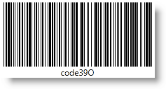

////
|metadata|
{
    "name": "xambarcode-xamcode39barcode",
    "controlName": ["{BarcodesName}"],
    "tags": ["Application Scenarios"],
    "guid": "d5285fae-a3c8-4296-ad8c-df1b3b6dacf5",
    "buildFlags": ["wpf"],
    "createdOn": "2012-01-23T16:12:14.6151029Z"
}
|metadata|
////

= Code 39

The {Barcode39Name}™ generates the Code 39 symbology (also known as USS Code 39, Code 3 of 9), which is the first alpha-numeric symbology developed to be used in a non-retail environment. It can be decoded with virtually any barcode reader.

The variable-length format of the Data value accepts the following 43 characters: 0123456789ABCDEFGHIJKLMNOPQRSTUVWXYZ-.$/+% and space. When needed, a checksum digit based on modulo 32 algorithm can be added at the end of the symbology when the control property ShouldGenerateChecksum is set to True.

The {Barcode39Name} also supports Extended Code 39 for full ASCII support when the control property Extended is set to True.

== Sample Images With pick:[xaml="XAML"] Code Declaration:

ifdef::xaml[]

*In XAML:*

----
<ig:XamCode39Barcode x:Name="Barcode" Data="CODE39" />
----

endif::xaml[]

*In Visual Basic:*

----
Dim Barcode As New {Barcode39Name}()
Barcode.Data = "CODE39"
----

*In C#:*

----
{Barcode39Name} Barcode = new {Barcode39Name}();
Barcode.Data = "CODE39";
----

image::images/xamBarcode_XamCode39Barcode_01.png[]

ifdef::xaml[]

*In XAML:*

----
<ig:XamCode39Barcodex:Name="Barcode"  Data="code39" Extended="True" ShouldGenerateChecksum="True" />
----

endif::xaml[]

*In Visual Basic:*

----
Dim Barcode As New {Barcode39Name}()
Barcode.Data = "code39"
Barcode.Extended = True
Barcode.ShouldGenerateChecksum = True
----

*In C#:*

----
{Barcode39Name} Barcode = new {Barcode39Name}();
Barcode.Data = "code39";
Barcode.Extended = true;
Barcode.ShouldGenerateChecksum = true;
----

