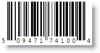
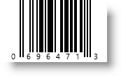

////
|metadata|
{
    "name": "xambarcode-xameanupcbarcode",
    "controlName": ["{BarcodesName}"],
    "tags": ["Application Scenarios"],
    "guid": "03c2c5c6-65af-4cab-b602-d405bdc6dde3",
    "buildFlags": ["wpf"],
    "createdOn": "2012-01-23T16:12:14.6201034Z"
}
|metadata|
////

= Ean/Upc

The {BarcodeEanUpcName}™ supports the following numeric symbologies set by the CodeType property value:

* EAN-13 – set with CodeType=”Ean13”. This symbology encodes 12 digits of numeric characters and adds one Check Digit which is not a part of the Data value itself.

The EAN13 Data consists of the following information: one digit for the Number System, 6 digits for the Manufacturer Code, 5 digits for the Product Code and one Check Digit. The Number System is positioned at the left of the barcode.

The Manufacturer Code and the Product Code are positioned under the barcode, separated by the guard bar.

ifdef::xaml[]
*In XAML:*

----
<ig:XamEanUpcBarcode x:Name="Barcode" CodeType="Ean13" Data="509647174100" />
----
endif::xaml[]

*In Visual Basic:*

----
Dim Barcode As New {BarcodeEanUpcName}()
Barcode.Data = "509647174100"
Barcode.CodeType = EanUpcCodeType.Ean13
----

*In C#:*

----
{BarcodeEanUpcName} Barcode = new {BarcodeEanUpcName}();
Barcode.Data = "509647174100";
Barcode.CodeType = EanUpcCodeType.Ean13;
----

image::images/xamBarcode_XamEanUpcBarcode_04.png[]

* EAN-8 – set with CodeType=”Ean8”. This symbology encodes 7 digits and calculates one Check Digit as a last character which is not part of the Data value itself.

The first two or three digits identify the numbering authority and the remaining digits identify the product.

ifdef::xaml[]
*In XAML:*
----
<ig:XamEanUpcBarcode x:Name="Barcode" CodeType="Ean8" Data="5096471" />
----
endif::xaml[]

*In Visual Basic:*

----
Dim Barcode As New {BarcodeEanUpcName}()
Barcode.Data = "5096471"
Barcode.CodeType = EanUpcCodeType.Ean8
----

*In C#:*

----
{BarcodeEanUpcName} Barcode = new {BarcodeEanUpcName}();
Barcode.Data = "5096471";
Barcode.CodeType = EanUpcCodeType.Ean8;
----

image::images/xamBarcode_XamEanUpcBarcode_03.png[]

* UPC-A – set with CodeType=”UpcA”. This symbology encodes 11 digits and adds a trailing Check Digit which is not part of the Data itself.

ifdef::xaml[]
*In XAML:*
----
<ig:XamEanUpcBarcode x:Name="Barcode" CodeType="UpcA" Data="50947174100" />
----
endif::xaml[]

*In Visual Basic:*

----
Dim Barcode As New {BarcodeEanUpcName}()
Barcode.Data = "509647174100"
Barcode.CodeType = EanUpcCodeType.UpcA
----

*In C#:*

----
{BarcodeEanUpcName} Barcode = new {BarcodeEanUpcName}();
Barcode.Data = "509647174100";
Barcode.CodeType = EanUpcCodeType.UpcA;
----

* UPC-E – set with CodeType=”UpcE”. The UPC-E Bar Code Symbol is used to encode GTIN-12 Element Strings that commence with a zero and contain a sequence of four or five zeroes in defined positions. The zeroes are removed from the data during the encoding by a zero-suppression process to obtain a GTIN-8 Element String.

If a GTIN-8 Element String is passed as a Data value, the zero-process is not applied as we suppose it’s already done. Note that the Data can accept 6 or 10 digits long value. In this case the control adds a 0 at the beginning. If the Data is 7 or 11 digits long, the control just checks for its existence.

The last digit, printed at the right side of the barcode symbol, is the Check Digit character of the original UPC-A symbol and is not part of the Data value itself.

The UPC-A symbology Data value is constructed of the following information: one digit decoding the Number System, five digits for the Manufacturer Code, five digits for the Product Code and one Check Digit.

The Number System is positioned at the left of the barcode. The Manufacturer and the Product Code are printed under the barcode and separated by the guard bar. The Check Digit is the last.

ifdef::xaml[]
*In XAML:*
----
<ig:XamEanUpcBarcode x:Name="Barcode" CodeType="UpcE" Data="0696471" />
----
endif::xaml[]

*In Visual Basic:*

----
Dim Barcode As New {BarcodeEanUpcName}()
Barcode.Data = "0696471"
Barcode.CodeType = EanUpcCodeType.UpcE
----

*In C#:*

----
{BarcodeEanUpcName} Barcode = new {BarcodeEanUpcName}();
Barcode.Data = "0696471";
Barcode.CodeType = EanUpcCodeType.UpcE;
----

