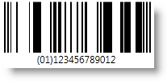
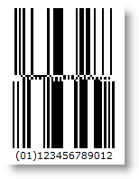
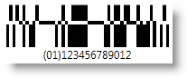
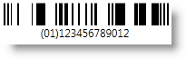
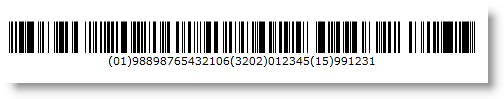

////
|metadata|
{
    "name": "xambarcode-xamgs1databarbarcode",
    "controlName": ["{BarcodesName}"],
    "tags": ["Application Blocks","Application Scenarios"],
    "guid": "76635c9c-bb4e-4e0e-9535-ca285bb3c8c2",
    "buildFlags": ["wpf"],
    "createdOn": "2012-01-23T16:12:14.6221036Z"
}
|metadata|
////

= GS1 DataBar

GS1 DataBar is a code symbology which encodes data starting with an AI and a trailing GTIN. AI is an Application Identifier – ‘(01)’, which is not expected to be in the Data input except in the GS1 DataBar Expanded versions. GTIN is the acronym for Global Trade Item Number that identifies trade items developed by the GS1 organization.

The first digit of the GTIN is a package indicator. The digits 0 and 9 have special meanings – 0 often means that there is one item in the box, and 9 indicates a variable measure item. The package indicator is followed by GS1 company prefix (assigned by GS1) and item number (assigned by the company).

GS1 DataBar is a family of barcode symbologies. The first (including Omnidirectional, Truncated, Stacked and Stacked Omnidirectional) and the second (including Limited) groups of the GS1 DataBar symbols encode the Element String AI (01) which is why it is not part of the Data input itself. This Element String is based on the GTIN-12, GTIN-13, or GTIN-14 Data Structures and the Data input should be 11, 12 or 13 digits long as the last check digit is internally calculated. When using the GTIN-14 Data Structure with Limited symbology, only the indicator value (the first digit) 1 is allowed. The GS1 DataBar Limited Bar Code Symbol is designed for small items that will not need to be read by omnidirectional Point-of-Sale (POS) scanners. The third group of GS1 DataBar symbols, so called Expanded versions, includes Expanded and ExpandedStacked symbologies. They are variable length linear symbologies capable of encoding up to 74 numeric or 41 alphabetic characters of AI Element String data. The two versions are designed to encode primary and supplementary data on items for Point-of-Sale (POS) and other applications.

The GS1 DataBar symbology is set by the CodeType property of the Barcode control.

* DataBar Limited – set with CodeType="Limited" - encodes a maximum of 14 digit item identification with Indicator digits of 0 or 1 in a small symbol.

ifdef::xaml[]
+
*In XAML:*
+
[source,xaml]
----
<ig:XamGs1DataBarBarcode x:Name="Barcode" CodeType="Limited" Data="12345678901" />
----
endif::xaml[]

+
*In Visual Basic:*
+
[source,vb]
----
Dim Barcode As New {BarcodeGS1DataBarName}()
Barcode.Data = "12345678901"
Barcode.CodeType = GS1CodeType.Limited
----
+
*In C#:*
+
[source,csharp]
----
{BarcodeGS1DataBarName} Barcode = new {BarcodeGS1DataBarName}();
Barcode.Data = "12345678901";
Barcode.CodeType = GS1CodeType.Limited;
----
+
image::images/xamBarcode_XamGs1DataBarBarcode_03.png[]

* DataBar Omnidirectional – set with CodeType="Omnidirectinal" - designed to be read by omnidirectional scanners.

ifdef::xaml[]
+
*In XAML:*
+
[source,xaml]
----
<ig:XamGs1DataBarBarcode x:Name="Barcode" CodeType="Omnidirectional" Data="12345678901" />
----
endif::xaml[]

+
*In Visual Basic:*
+
[source,vb]
----
Dim Barcode As New {BarcodeGS1DataBarName}()
Barcode.Data = "12345678901"
Barcode.CodeType = GS1CodeType.Omnidirectional
----
+
*In C#:*
+
[source,csharp]
----
{BarcodeGS1DataBarName} Barcode = new {BarcodeGS1DataBarName}();
Barcode.Data = "12345678901";
Barcode.CodeType = GS1CodeType.Omnidirectional;
----
+

* DataBar Stacked Omnidirectional - set with CodeType="StackedOmnidirectional" - a two row format designed to be read by omnidirectional scanners. A 3X (X is XDimension – the smallest module width) high separator pattern separates the symbol rows.

ifdef::xaml[]
+
*In XAML:*
+
[source,xaml]
----
<ig:XamGs1DataBarBarcode x:Name="Barcode" CodeType="StackedOmnidirectional" Data="12345678901" />
----
endif::xaml[]

+
*In Visual Basic:*
+
[source,vb]
----
Dim Barcode As New {BarcodeGS1DataBarName}()
Barcode.Data = "12345678901"
Barcode.CodeType = GS1CodeType.StackedOmnidirectional
----
+
*In C#:*
+
[source,csharp]
----
{BarcodeGS1DataBarName} Barcode = new {BarcodeGS1DataBarName}();
Barcode.Data = "12345678901";
Barcode.CodeType = GS1CodeType.StackedOmnidirectional;
----
+

* DataBar Stacked - set with CodeType="Stacked".

ifdef::xaml[]
+
*In XAML:*
+
[source,xaml]
----
<ig:XamGs1DataBarBarcode x:Name="Barcode" CodeType="Stacked" Data="12345678901" />
----
endif::xaml[]

+
*In Visual Basic:*
+
[source,vb]
----
Dim Barcode As New {BarcodeGS1DataBarName}()
Barcode.Data = "12345678901"
Barcode.CodeType = GS1CodeType.Stacked
----
+
*In C#:*
+
[source,csharp]
----
{BarcodeGS1DataBarName} Barcode = new {BarcodeGS1DataBarName}();
Barcode.Data = "12345678901";
Barcode.CodeType = GS1CodeType.Stacked;
----
+

* DataBar Truncated – set with CodeType="Truncated" - structured and encoded the same as the standard GS1 DataBar format, except its height is reduced to a 13X minimum. It may be used for small items and is designed to be read by scanners such as wands, handheld lasers, and linear and CCD scanners. It cannot be read efficiently by omnidirectional slot scanners.

ifdef::xaml[]
+
*In XAML:*
+
[source,xaml]
----
<ig:XamGs1DataBarBarcode x:Name="Barcode" CodeType="Truncated" Data="12345678901" />
----
endif::xaml[]

+
*In Visual Basic:*
+
[source,vb]
----
Dim Barcode As New {BarcodeGS1DataBarName}()
Barcode.Data = "12345678901"
Barcode.CodeType = GS1CodeType.Truncated
----
+
*In C#:*
+
[source,csharp]
----
{BarcodeGS1DataBarName} Barcode = new {BarcodeGS1DataBarName}();
Barcode.Data = "12345678901";
Barcode.CodeType = GS1CodeType.Truncated;
----
+

* DataBar Expanded - set with CodeType="Expanded" - an expanded version of DataBar capable of encoding variable length data. Besides encoding the 14 digit GTIN, it can encode additional data like weight, expiry dates and country of origin. With optional data, the barcode can be as long as 70 digits or 34 alphanumeric characters.

ifdef::xaml[]
+
*In XAML:*
+
[source,xaml]
----
<ig:XamGs1DataBarBarcode x:Name="Barcode" CodeType="Expanded"     
    Data="(01)98898765432106(3202)012345(15)991231" />
----
endif::xaml[]

+
*In Visual Basic:*
+
[source,vb]
----
Dim Barcode As New {BarcodeGS1DataBarName}()
Barcode.Data = "(01)98898765432106(3202)012345(15)991231"
Barcode.CodeType = GS1CodeType.Expanded
----
+
*In C#:*
+
[source,csharp]
----
{BarcodeGS1DataBarName} Barcode = new {BarcodeGS1DataBarName}();
Barcode.Data = "(01)98898765432106(3202)012345(15)991231";
Barcode.CodeType = GS1CodeType.Expanded;
----
+

+
.Note:
[NOTE]
====
The DataBar Expanded Stacked symbology is not supported in this version.
====