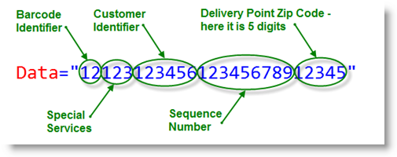
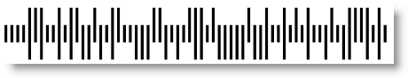

////
|metadata|
{
    "name": "xambarcode-xamintelligentmailbarcode",
    "controlName": ["{BarcodesName}"],
    "tags": ["Application Scenarios"],
    "guid": "22f004dc-02a9-4d12-b1b8-aa6327b07343",
    "buildFlags": ["wpf"],
    "createdOn": "2012-01-23T16:12:14.6251039Z"
}
|metadata|
////

= Intelligent Mail

The Intelligent Mail barcode is a 65-bar code for use in the USPS mail stream. It combines routing ZIP Code information and tracking information into a single barcode using four distinct, vertical bar types (each bar is in one of the following states - full bar, ascender, tracker and descender). It effectively encodes data from POSTNET and PLANET barcodes into a single barcode while providing a greater range of tracking data. Its Data value accepts only numeric characters and should be exactly 20, 25, 29 or 31 characters. The Intelligent Mail barcode carries the following data:

[options="header", cols="a,a,a"]
|====
|Type|Filed|Digits

|Tracking Code
|Barcode Identifier
|2 (2nd digit must be from 0 to 4)

|
|Special Services
|3

|
|Customer Identifier
|6

|
|Sequence Number
|9

|Routing Code
|Delivery Point ZIP Code
|0, 5, 9 or 11

|====

== Fields of the {BarcodeIntelligentMailName}™:

* Barcode Identifier – It is assigned by USPS for the type of tracking service;
* Special Services – It is assigned by USPS for any special services on the mail piece. The encoding range is 000 – 999;
* Customer Identifier – It is assigned by USPS as a unique identifier for each customer. The encoding range is 000000 – 999999;
* Sequence Number – It is assigned by the mailer for tracking mail pieces. The encoding range is 000000000 – 999999999;
* Delivery Point ZIP Code – It is assigned by the mailer for routing the mail piece. This replaces POSTNET for routing the mail piece to its final delivery point. The length may be 0, 5, 9, or 11 digits. The encoding range depends on the number of digits – each digit must be from 0 to 9.

For each of the fields, except the Routing Code, leading or trailing zeros shall be provided to achieve the correct size. Spaces and nulls are not acceptable for padding. No error detection and correction, such as a checksum with POSTNET and PLANET, shall be included as part of the data fields.

== Sample Image With pick:[xaml="XAML"] Code Declaration:

ifdef::xaml[]
*In XAML:*

----
<ig:XamIntelligentMailBarcode x:Name="Barcode" Data="1212312345612345678912345" />
----
endif::xaml[]

*In Visual Basic:*

----
Dim Barcode As New {BarcodeIntelligentMailName}()
Barcode.Data = "1212312345612345678912345"
----

*In C#:*

----
{BarcodeIntelligentMailName} Barcode = new {BarcodeIntelligentMailName}();
Barcode.Data = "1212312345612345678912345";
----

 

