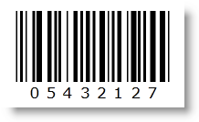

////
|metadata|
{
    "name": "xambarcode-xaminterleaved2of5barcode",
    "controlName": ["{BarcodesName}"],
    "tags": ["Application Scenarios"],
    "guid": "ccb3e80f-6c41-4206-9cdf-af927a240e98",
    "buildFlags": ["wpf"],
    "createdOn": "2012-01-23T16:12:14.6271041Z"
}
|metadata|
////

= Interleaved 2 Of 5

The Interleaved 2 Of 5 barcode is a high-density numeric barcode symbology. It encodes only an even number of digits, as 0 is added at the beginning if an odd number is entered. A checksum can be generated by setting the {BarcodeInterleaved2of5Name}™ control property ShouldGenerateChecksum to True.

Note that the checksum is not part of the Data value property.

== Sample Image With pick:[xaml="XAML"] Code Declaration:

ifdef::xaml[]
*In XAML:*
----
<ig:XamInterleaved2Of5Barcode x:Name="Barcode" Data="543212" ShouldGenerateChecksum="True" />
----
endif::xaml[]

*In Visual Basic:*

----
Dim Barcode As New {BarcodeInterleaved2of5Name}()
Barcode.Data = "543212"
Barcode.ShouldGenerateChecksum = True
----

*In C#:*

----
{BarcodeInterleaved2of5Name} Barcode = new {BarcodeInterleaved2of5Name}();
Barcode.Data = "543212";
Barcode.ShouldGenerateChecksum = true;
----

