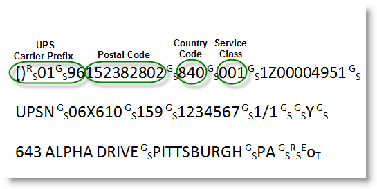
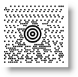

////
|metadata|
{
    "name": "xambarcode-xammaxicodebarcode",
    "controlName": ["{BarcodesName}"],
    "tags": ["Application Scenarios"],
    "guid": "528d4f72-784f-49c2-bb89-7ffdcefabff0",
    "buildFlags": ["wpf"],
    "createdOn": "2012-01-23T16:12:14.6321046Z"
}
|metadata|
////

= Maxi Code

MaxiCode is a 2D error-correcting matrix symbol used by United Parcel Service (UPS) for package tracking. The two-dimensional symbology is made up by offset rows of hexagonal elements around a unique circular finder pattern, called also bullseye, which is useful in quick symbol location regardless of orientation.

* MaxiCode uses 5 modes that determine how the data encodation should be structured. Generally the modes are used to define the format of the message and the level of error correction. Mode0 and Mode1 are obsolete and no longer used. The modes used are as follows.
+
--
** Mode2 – Mode 2 is used in the transport industry for encoding up to 9 digits numeric postal code.
** Mode3 – Mode 3 is designed to be used in the transport industry when the postal code is alphanumeric and up to 6 characters.
** Mode4 – Mode 4 is for Standard symbol encodation, as the primary message employs Enhanced Error Correction (EEC) and the secondary message employs Standard Error Correction (SEC).
** Mode5 – Mode 5 indicates that the symbol employs Enhanced Error Correction (EEC) for both the primary and the secondary message.
** Mode6 – Mode 6 is used for reader programming, and Standard Error Correction is applied over the whole message.
+
When encoding under Mode2 or Mode3 the properties PostalCode, ServiceClass and Country are used unless the message starts with an UPS carrier prefix (see below). When the symbol is encoded under other modes, these properties are not used in the symbol encodation.
--
+
* link:{BarcodesLink}.{BarcodeMaxiName}{ApiProp}postalcode.html[PostalCode] – the postal code/zip code of the delivery address. When in Mode 3, it should be up to 6 characters as only capital letters and digits are acceptable. When in structured mode 2 - up to 9 digits can be set.
* link:{BarcodesLink}.{BarcodeMaxiName}{ApiProp}serviceclass.html[ServiceClass] – a number in the range of 000 to 999 which is defined by the carrier and shipper to identify the service class.
* link:{BarcodesLink}.{BarcodeMaxiName}{ApiProp}country.html[Country] – a number in the range of 000 to 999 which represents a country. For a complete list of country codes, see ISO standard 3166.

The following picture demonstrates what should be the structure of the Data message when UPS Carrier Prefix is used in Mode2 or Mode3.

If the Data value begins with the standard UPS carrier prefix ([)>[RS][GS]01[GS]YY), the related properties (PostalCode, ServiceClass and Country) are ignored during the encodation process. Then the primary and the secondary message are retrieved as follows: The first 9 data characters [)>[RS][GS]01[GS]YY are extracted to be encoded in the secondary message. The next 3 data elements, which represent the postal code, country code and service class code respectively, are extracted from the Data value. The remaining string of data is then encoded in the secondary message after the header [)>[RS][GS]01[GS]YY (excluding three RS characters which separate the 3 data elements). For example, the message above will be broken into the primary message and secondary message like this:

* Primary Message:
+
Postal Code: 152382802
+
Country Code: 840
+
Class of Service Code: 001

* Secondary Message:
+
[)>RS GS01 GS 961Z00004951 GS
+
UPSN GS 06X610 GS 159 GS 1234567 GS 1/1
+
GS Y GS 634 ALPHA DRIVEGSPITTSBURGH GS PA RS EoT

.Note:
[NOTE]
====
The MaxiCode symbology does not support ECI (capability to encode data from alphabets other than the Latin one) in this version. The control also does not support user selection of structured append maximum to 8 linked symbols.
====

== Sample Image With pick:[xaml="XAML"] Code Declaration:

ifdef::xaml[]
*In XAML:*
[source,xaml]
----
<ig:XamMaxiCodeBarcode 
    x:Name="Barcode"
    Data="MaxiCode" 
    ServiceClass="001"
    PostalCode="152382802" 
    Country="840" 
    Mode="Mode2" />
----
endif::xaml[]

*In Visual Basic:*
[source,vb]
----
Dim Barcode As New {BarcodeMaxiName}()
Barcode.Data = "MaxiCode"
Barcode.ServiceClass = 1
Barcode.PostalCode = "152382802"
Barcode.Country = 840
Barcode.Mode = ModeIndicator.Mode2
----

*In C#:*
[source,csharp]
----
{BarcodeMaxiName} Barcode = new {BarcodeMaxiName}();
Barcode.Data = "MaxiCode";
Barcode.ServiceClass = 1;
Barcode.PostalCode = "152382802";
Barcode.Country = 840;
Barcode.Mode = ModeIndicator.Mode2;
----

image::images/xamBarcode_XamMaxiCodeBarcode_03.png[]