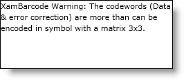
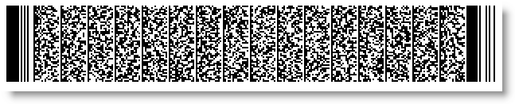

////
|metadata|
{
    "name": "xambarcode-xampdf417barcode",
    "controlName": ["{BarcodesName}"],
    "tags": ["Application Scenarios"],
    "guid": "d7226c35-c4ab-42da-a5d4-11a88ad18cd6",
    "buildFlags": ["wpf"],
    "createdOn": "2012-01-23T16:12:14.6351049Z"
}
|metadata|
////

= PDF 417

PDF417 is a high-capacity 2D symbology.

image::images/xamBarcode_XamPdf417Barcode_05.png[]

The following properties are specific to the {BarcodePDF417Name}™ symbology:

* link:{BarcodesLink}.{BarcodePDF417Name}~rows.html[Rows]
* link:{BarcodesLink}.{BarcodePDF417Name}~columns.html[Columns]
* link:{BarcodesLink}.{BarcodePDF417Name}~errorcorrectionlevel.html[ErrorCorrectionLevel]
* link:{BarcodesLink}.{BarcodePDF417Name}~aspectratio.html[AspectRatio]
* link:{BarcodesLink}.{BarcodePDF417Name}~useminimumerrorcorrectionlevel.html[UseMinimumErrorCorrectionLevel]
* link:{BarcodesLink}.{BarcodePDF417Name}~encodingmode.html[EncodingMode]

== Error Correction Levels

The PDF417 error correction level is calculated on the following properties:

* If UseMinimumErrorCorrectionLevel is set to True (by default) and the minimum error correction level for the current Data code words number is higher than the set ErrorCorrectionLevel value (Level0 by default), then the minimum level is used by the control. If the ErrorCorrectionLevel is set to a higher level than the calculated minimum error correction level, then the set ErrorCorrectionLevel has a priority.

== EncodingMode

The encoding algorithm of the PDF417 is selected by the EncodingMode property of the control. If the property is set to Undefined (the default value), the control chooses the best algorithm and sometimes mixes them to encode the Data value in the most compact way. If there is an EncodingMode set that is not suitable for the data, an error message is displayed:

ifdef::xaml[]
*In XAML:*

----
<ig:XamPdf417Barcode x:Name="Barcode" Data="xamBarcode" EncodingMode="Numeric" />
----
endif::xaml[]

*In Visual Basic:*

----
Dim Barcode As New {BarcodePDF417Name}()
Barcode.Data = "xamBarcode"
Barcode.EncodingMode = CompactionMode.Numeric
----

*In C#:*

----
{BarcodePDF417Name} Barcode = new {BarcodePDF417Name}();
Barcode.Data = "xamBarcode";
Barcode.EncodingMode = CompactionMode.Numeric;
----

image::images/barcode_dataError.png[]

== Rows, Columns and AspectRatio

The PDF417 matrix is defined by different criteria which are verified in the following order:

[start=1]
. If the Columns/Rows property is set, the control checks if the Data and Error Correction code words can be encoded in this cells number, otherwise an error is displayed. Note that PDF417 encodes up to 928 code words. If the combinations of Columns and Rows results in more than 928 cells, an error is generated.
[start=2]
. If the Columns and Rows properties are not set, the control checks if the AspectRatio is specified and uses it to create the matrix size depending on the link:xambarcode-widthtoheightratio.html[WidthToHeightRatio].
[start=3]
. If none of the above are set, the control chooses the best combination of column and row numbers to fit the Data and the Error Correction code words into the matrix with an aspect ratio closest to the default one – 0.5.

If the user has explicitly set some of the above-mentioned properties, the defined matrix might not be suitable for the data – this will cause the {BarcodePDF417Name} control to display a corresponding error message:

ifdef::xaml[]
*In XAML:*

----
<ig:XamPdf417Barcode x:Name="Barcode" Data="xamBarcode" Rows="3" Columns="3" />
----
endif::xaml[]

*In Visual Basic:*

----
Dim Barcode As New {BarcodePDF417Name}()
Barcode.Data = "xamBarcode"
Barcode.Rows = 3
Barcode.Columns = 3
----

*In C#:*

----
{BarcodePDF417Name} Barcode = new {BarcodePDF417Name}();
Barcode.Data = "xamBarcode";
Barcode.Rows = 3;
Barcode.Columns = 3;
----

.Note:
[NOTE]
====
{BarcodePDF417Name} does not support ECI (Extended Channel Interpretation), Structured Append mode and MacroPDF type. The features will be implemented in its future versions.
====

== Sample Image With pick:[xaml="XAML"] Code Declaration:

ifdef::xaml[]
*In XAML:*

----
<ig:XamPdf417Barcode x:Name="Barcode" Data="PDF 417" />
----
endif::xaml[]

*In Visual Basic:*

----
Dim Barcode As New {BarcodePDF417Name}()
Barcode.Data = "PDF 417"
----

*In C#:*

----
{BarcodePDF417Name} Barcode = new {BarcodePDF417Name}();
Barcode.Data = "PDF 417";
----

