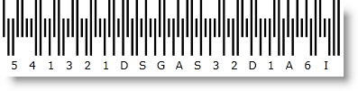

////
|metadata|
{
    "name": "xambarcode-xamroyalmailbarcode",
    "controlName": ["{BarcodesName}"],
    "tags": ["Application Scenarios"],
    "guid": "f3769d7c-8a1e-4926-a095-e1c9bc96a1fe",
    "buildFlags": ["wpf"],
    "createdOn": "2012-01-23T16:12:14.6301044Z"
}
|metadata|
////

= Royal Mail

The Royal Mail 4-state Customer Code (RM4SCC) is a height-modulated barcode for use in automated mail sort process. A checksum is printed as the last character to provide error protection which is not part of the Data itself. The valid characters for the Data value are 0123456789ABCDEFGHIJKLMNOPQRSTUVWXYZ.

== Sample Image With pick:[xaml="XAML"] Code Declaration:

ifdef::xaml[]
*In XAML:*

----
<ig:XamRoyalMailBarcode x:Name="Barcode" Data="541321DSGAS32D1A6" />
----
endif::xaml[]

*In Visual Basic:*

----
Dim Barcode As New {BarcodeRoyalMailName}()
Barcode.Data = "541321DSGAS32D1A6"
----

*In C#:*

----
{BarcodeRoyalMailName} Barcode = new {BarcodeRoyalMailName}();
Barcode.Data = "541321DSGAS32D1A6";
----

