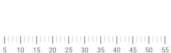

////
|metadata|
{
    "name": "bulletgraph-adding",
    "controlName": ["{BulletGraphName}"],
    "tags": ["Application Scenarios","Charting","Getting Started","How Do I"],
    "guid": "1d4c8246-db15-476a-b025-68aaf9a4a630",
    "buildFlags": [],
    "createdOn": "2014-06-05T19:53:11.991864Z"
}
|metadata|
////

= Adding Bullet Graph

=== Purpose

This topic explains how to add the link:{BulletGraphLink}.{BulletGraphName}.html[_{BulletGraphName}_]™ control to apick:[android="n"] {PlatformName} application.

=== Required background

The following topics are prerequisites to understanding this topic:

[options="header", cols="a,a"]
|====
|Topic|Purpose

| link:bulletgraph-overview.html[ _{BulletGraphName}_ Overview]
|This topic provides conceptual information about the _{BulletGraphName}_ control including its main features, minimum requirements, and user functionality.

|====

toc::[]
 
== Adding _{BulletGraphName}_ – Conceptual Overview

=== Adding {BulletGraphName} summary

To add _{BulletGraphName}_ to a page, you need to create an instance of the control and add it to your pick:[android,xamarin,wpf="page’s root element"]pick:[win-forms="form"]. The control is pre-configured to display a scale with values varying from 0 to 100, major and minor tick marks, and, by default, it takes the size of the container it is placed into.

=== Requirements
 
ifdef::android[]
Add the following Infragistics jars to your main project:

** Infragistics.Gauge.jar
** Infragistics.Core.jar
** Infragistics.UI.jar
** DV.Shared.jar
endif::android[]

ifdef::win-forms[]
Add the following Infragistics assemblies to your main project:

** {ApiPlatform}{BulletGraphAssembly}.{DllVersion}dll 
endif::win-forms[]

ifdef::wpf[]

Add the following NuGet package reference to your main project:

** Infragistics.WPF.Gauges

For more information on setting up the NuGet feed and adding NuGet packages, you can take a look at the following documentation: link:nuget-feeds.html[NuGet Feeds].

endif::wpf[]

ifdef::win-forms[]
** {ApiPlatform}{BulletGraphAssemblyBase}.{DllVersion}dll
** {ApiPlatform}Win.Portable.Core.{DllVersion}dll 
endif::win-forms[]

ifdef::xamarin[]
Add assembly references by following instructions in the link:xamarin-project-with-infragistics-controls.html#NuGetPackages[Add References Through NuGet Packages] topic.
endif::xamarin[]

Also, add the following Infragistics namespaces:

ifdef::xamarin[]
*In XAML:*
[source,xaml]
----
xmlns:ig="clr-namespace:{BulletGraphNamespace};assembly={ApiPlatform}Gauges"
----
*In C#:*
[source,csharp]
----
using {BulletGraphNamespace};
----
endif::xamarin[]

ifdef::wpf[]
*In XAML:*
[source,xaml]
----
xmlns:ig="http://schemas.infragistics.com/xaml"
---- 
*In C#:*
[source,csharp]
----
using {BulletGraphNamespace};
----
*In VB:* 
[source,vb]
----
Imports {BulletGraphNamespace}
---- 
endif::wpf[]
 
 
ifdef::win-forms[] 
*In C#:* 
[source,csharp]
----
using {BulletGraphNamespace};  
----  
*In VB:* 
[source,vb]
----
Imports {BulletGraphNamespace}
---- 
endif::win-forms[]
 
ifdef::android[] 
*In Java:* 
[source,js]
----
import {BulletGraphNamespace}.{BulletGraphName};
---- 
endif::android[] 
 
 

=== Steps

Following are the general conceptual steps for adding _{BulletGraphName}_.

*1. Adding the _{BulletGraphName}_ control*

*2. Configuring the scale*

*3. Configuring the performance bar*

*4. Configuring the comparative marker*

*5. Configuring additional aspects*  (For details, see <<_Ref361422086,Adding _{BulletGraphName}_ – Code Example>> and link:bulletgraph-configuring.html[Configuring _{BulletGraphName}_ ].)

== Adding _{BulletGraphName}_ – Code Example

=== Introduction

The following procedure walks through instantiating a _{BulletGraphName}_ control, adding it to apick:[android="n"] {PlatformName} application, and configuring a performance bar, comparative measure marker, and three comparative ranges on the scale.

=== Preview

The following screenshot is a preview of the final result.

ifdef::wpf,win-universal,win-forms[]
image::images/BulletGraph_Adding_BulletGraph_1.png[]
endif::wpf,win-universal,win-forms[]

ifdef::xamarin,android[]
image::images/BulletGraph_Adding_BulletGraph_XF_1.png[]
endif::xamarin,android[]
 

=== Overview

Following is a conceptual overview of the process:

*1. Adding the _{BulletGraphName}_ control*

*2. Configuring the scale*

*3. Configuring the performance bar*

*4. Configuring the comparative marker*

*5. Adding comparative ranges*

=== Steps

The following steps demonstrate how to add the _{BulletGraphName}_ control to an application.

=== 1. Add the {BulletGraphName} control.

ifdef::wpf,sl,win-universal,xamarin,android[]
*Add a* _{BulletGraphName}_ *declaration to your page’s root*  `Grid`  *element and set its desired*  `Height`  *and*  `Width` *.*
endif::wpf,sl,win-universal,xamarin,android[]

ifdef::win-forms[]
*Add an _{BulletGraphName}_ to your form and set it to its desired size.*
endif::win-forms[]

ifdef::wpf,sl,win-universal[]

*In XAML:*

[source,xaml]
----
<ig:{BulletGraphName} x:Name="bulletGraph"
                   Height="100"
                   Width="300">
</ig:{BulletGraphName}>
----

endif::wpf,sl,win-universal[]

ifdef::xamarin[]

*In XAML:*

[source,xaml]
----
<ig:{BulletGraphName} x:Name="bulletGraph"
                   VerticalOptions="Center"
                   HorizontalOptions="Center"
                   HeightRequest="100"
                   WidthRequest="300">
</ig:{BulletGraphName}>
----

endif::xamarin[]

ifdef::wpf,sl,win-universal[]

*In C#:*

[source,csharp]
----
{BulletGraphName} bulletGraph = new {BulletGraphName}();
bulletGraph.Height = 100;
bulletGraph.Width = 300;
----

*In Visual Basic:*

[source,vb]
----
Dim bulletGraph As New {BulletGraphName}()
bulletGraph.Height = 100
bulletGraph.Width = 300
----

endif::wpf,sl,win-universal[]

ifdef::win-forms[]

*In C#:*

[source,csharp]
----
{BulletGraphName} bulletGraph = new {BulletGraphName}();
bulletGraph.Height = 100;
bulletGraph.Width = 300;
this.Controls.Add(bulletGraph);
----

*In Visual Basic:*

[source,vb]
----
Dim bulletGraph As New {BulletGraphName}()
bulletGraph.Height = 100
bulletGraph.Width = 300
Me.Controls.Add(bulletGraph)
----

endif::win-forms[]

ifdef::xamarin[]

*In C#:*

[source,csharp]
----
{BulletGraphName} bulletGraph = new {BulletGraphName}();
bulletGraph.VerticalOptions = LayoutOptions.Center;
bulletGraph.HorizontalOptions = LayoutOptions.Center;
bulletGraph.HeightRequest = 100;
bulletGraph.WidthRequest = 300;
----

endif::xamarin[]

ifdef::android[]

*In Java:*

[source,js]
----
int height = (int)TypedValue.applyDimension(TypedValue.COMPLEX_UNIT_DIP,
    100, getResources().getDisplayMetrics());
int width = (int) TypedValue.applyDimension(TypedValue.COMPLEX_UNIT_DIP,
    300, getResources().getDisplayMetrics());

RelativeLayout.LayoutParams params = new RelativeLayout.LayoutParams(width, height);

BulletGraphView bulletGraph = new BulletGraphView(rootView.getContext());
bulletGraph.setLayoutParams(params);
----

endif::android[]

This declaration would instantiate _{BulletGraphName}_ with its link:bulletgraph-overview.html#_Ref361168550[default look] and link:bulletgraph-overview.html#_Ref361168497[settings] and fixed size. This means that the scale would display the 0÷100 range with major and minor tick marks so it would need some additional configuring.

ifdef::wpf,win-universal,win-forms[]
image::images/BulletGraph_Adding_BulletGraph_2.png[]
endif::wpf,win-universal,win-forms[]

ifdef::xamarin,android[]
image::images/BulletGraph_Adding_BulletGraph_XF_2.png[]
endif::xamarin,android[]

=== 2. Configure the scale.

In order  *to customize the values of the scale,*   *you need to set its*  link:{BulletGraphLink}.{BulletGraphBase}{ApiProp}MinimumValue.html[MinimumValue]  *and*  link:{BulletGraphLink}.{BulletGraphBase}{ApiProp}MaximumValue.html[MaximumValue]  *properties* . In this example, the scale will start at 5 and end at 55.

ifdef::xaml[]

*In XAML:*

[source,xaml]
----
<ig:{BulletGraphName} x:Name="bulletGraph"
                   MinimumValue="5"
                   MaximumValue="55">
</ig:{BulletGraphName}>
----

endif::xaml[]

ifdef::xaml,win-forms[]

*In C#:*

[source,csharp]
----
bulletGraph.MaximumValue = 55;
bulletGraph.MinimumValue = 5;
----
endif::xaml,win-forms[]

ifdef::wpf,sl,win-universal,win-forms[]

*In Visual Basic:*

[source,vb]
----
bulletGraph.MaximumValue = 55
bulletGraph.MinimumValue = 5
----

endif::wpf,sl,win-universal,win-forms[]

ifdef::android[]

*In Java:*

[source,js]
----
bulletGraph.setMinimumValue(5);
bulletGraph.setMaximumValue(55);
----

endif::android[]

The changed scale is shown on the following screenshot:

ifdef::wpf,win-universal,win-forms[]
image::images/BulletGraph_Adding_BulletGraph_3.png[]
endif::wpf,win-universal,win-forms[]

ifdef::xamarin,android[]

endif::xamarin,android[]

=== 3. Add performance bar.

The primary measure of the _{BulletGraphName}_ is visualized by its performance bar. Its value is managed by the link:{BulletGraphLink}.{BulletGraphBase}{ApiProp}Value.html[Value] property setting. For this example,  *set the*  link:{BulletGraphLink}.{BulletGraphBase}{ApiProp}Value.html[Value] *property* to 35.

ifdef::xaml[]

*In XAML:*

[source,xaml]
----
<ig:{BulletGraphName} x:Name="bulletGraph"
                   Value="35">
</ig:{BulletGraphName}>
----

endif::xaml[]

ifdef::xaml,win-forms[]

*In C#:*

[source,csharp]
----
bulletGraph.Value = 35;
----

endif::xaml,win-forms[]

ifdef::wpf,sl,win-universal,win-forms[]

*In Visual Basic:*

[source,vb]
----
bulletGraph.Value = 35
----

endif::wpf,sl,win-universal,win-forms[]

ifdef::android[]

*In Java:*

[source,js]
----
bulletGraph.setValue(35);
----

endif::android[]

=== 4. Configure the comparative marker.

The position of the comparative measure marker on the scale is managed by the value of the link:{BulletGraphLink}.{BulletGraphBase}{ApiProp}TargetValue.html[TargetValue] property. For this example,  *set the*  link:{BulletGraphLink}.{BulletGraphBase}{ApiProp}TargetValue.html[TargetValue]  *property*  to 43.

ifdef::xaml[]

*In XAML:*

[source,xaml]
----
<ig:{BulletGraphName} x:Name="bulletGraph"
                   TargetValue="43">
</ig:{BulletGraphName}>
----

endif::xaml[]

ifdef::xaml,win-forms[]

*In C#:*

[source,csharp]
----
bulletGraph.TargetValue = 43;
----

endif::xaml,win-forms[]

ifdef::wpf,sl,win-universal,win-forms[]

*In Visual Basic:*

[source,vb]
----
bulletGraph.TargetValue = 43
----

endif::wpf,sl,win-universal,win-forms[]

ifdef::android[]

*In Java:*

[source,js]
----
bulletGraph.setTargetValue(43);
----

endif::android[]

The following screenshot displays what the _{BulletGraphName}_ control would look so far in the procedure.

ifdef::wpf,win-universal,win-forms[]
image::images/BulletGraph_Adding_BulletGraph_4.png[]
endif::wpf,win-universal,win-forms[]

ifdef::xamarin,android[]
image::images/BulletGraph_Adding_BulletGraph_XF_4.png[]
endif::xamarin,android[]

=== 5. Add comparative ranges.

In order to compare the value displayed by the performance bar against some meaningful range(s) of values, these comparative ranges need to be displayed on the scale. Comparative ranges are managed by the link:{BulletGraphLink}.{BulletGraphBase}{ApiProp}Ranges.html[Ranges] property within which several individual link:{BulletGraphLink}.{BulletGraphRange}.html[{BulletGraphRange}s] can be defined, each of which having its own starting and ending values (link:{BulletGraphLink}.{BulletGraphRange}{ApiProp}StartValue.html[StartValue] and link:{BulletGraphLink}.{BulletGraphRange}{ApiProp}EndValue.html[EndValue]) and color (link:{BulletGraphLink}.{BulletGraphRange}{ApiProp}Brush.html[Brush]).

For this example, configure 3 comparative ranges, each of a different shade of gray, starting at the 0, 15, and 30 tick marks of the scale, respectively.

ifdef::xaml[]

*In XAML:*

[source,xaml]
----
<ig:{BulletGraphName} x:Name="bulletGraph" >
    <ig:{BulletGraphName}.Ranges>
        <ig:{BulletGraphRange} StartValue="0"
                                EndValue="15"
                                Brush="#828181"/>
        <ig:{BulletGraphRange} StartValue="15"
                                EndValue="30"
                                Brush="#AAAAAA"/>
        <ig:{BulletGraphRange} StartValue="30"
                                EndValue="55"
                                Brush="#D0D0D0"/>
    </ig:{BulletGraphName}.Ranges>
</ig:{BulletGraphName}>
----

endif::xaml[]

ifdef::xaml,win-forms[]

*In C#:*

[source,csharp]
----
{BulletGraphRange} range1 = new {BulletGraphRange}();
range1.StartValue = 0;
range1.EndValue = 15;
range1.Brush = new SolidColorBrush(Color.Frompick:[wpf="R"]pick:[win-forms="Ar"]gb(47, 47, 47));

{BulletGraphRange} range2 = new {BulletGraphRange}();
range2.StartValue = 15;
range2.EndValue = 30;
range2.Brush = new SolidColorBrush(Color.Frompick:[wpf="R"]pick:[win-forms="Ar"]gb(158, 158, 158));

{BulletGraphRange} range3 = new {BulletGraphRange}();
range3.StartValue = 30;
range3.EndValue = 55;
range3.Brush = new SolidColorBrush(Color.Frompick:[wpf="R"]pick:[win-forms="Ar"]gb(198, 198, 198));

bulletGraph.Ranges.Add(range1);
bulletGraph.Ranges.Add(range2);
bulletGraph.Ranges.Add(range3);
bulletGraph.TargetValueBrush = new SolidColorBrush(Color.Frompick:[wpf="R"]pick:[win-forms="Ar"]gb(255, 255, 255));
----

endif::xaml,win-forms[]

ifdef::wpf,sl,win-universal,win-forms[]

*In Visual Basic:*

[source,vb]
----
Dim range1 As New {BulletGraphRange}()
range1.StartValue = 0
range1.EndValue = 15
range1.Brush = New SolidColorBrush(Color.Frompick:[wpf="R"]pick:[win-forms="Ar"]gb(47, 47, 47))

Dim range2 As New {BulletGraphRange}()
range2.StartValue = 15
range2.EndValue = 30
range2.Brush = New SolidColorBrush(Color.Frompick:[wpf="R"]pick:[win-forms="Ar"]gb(158, 158, 158))

Dim range3 As New {BulletGraphRange}()
range3.StartValue = 30
range3.EndValue = 55
range3.Brush = New SolidColorBrush(Color.Frompick:[wpf="R"]pick:[win-forms="Ar"]gb(198, 198, 198))

bulletGraph.Ranges.Add(range1)
bulletGraph.Ranges.Add(range2)
bulletGraph.Ranges.Add(range3)
bulletGraph.TargetValueBrush = New SolidColorBrush(Color.Frompick:[wpf="R"]pick:[win-forms="Ar"]gb(255, 255, 255))
----

endif::wpf,sl,win-universal,win-forms[]

ifdef::android[]

*In Java:*

[source,js]
----
LinearGraphRange lgrange1 = new LinearGraphRange(); 
lgrange1.setStartValue(0); 
lgrange1.setEndValue(15); 
lgrange1.setBrush(new SolidColorBrush(Color.DKGRAY));

LinearGraphRange lgrange2 = new LinearGraphRange();
lgrange2.setStartValue(15);
lgrange2.setEndValue(30) ;
lgrange2.setBrush(new SolidColorBrush(Color.GRAY));

LinearGraphRange lgrange3 = new LinearGraphRange();
lgrange3.setStartValue(30);
lgrange3.setEndValue(55) ;
lgrange3.setBrush(new SolidColorBrush(Color.LTGRAY));

bulletGraph.addRange(lgrange1);
bulletGraph.addRange(lgrange2);
bulletGraph.addRange(lgrange3);
bulletGraph.setValueBrush(new SolidColorBrush(Color.BLACK));
bulletGraph.setTargetValueBrush(new SolidColorBrush(Color.WHITE));
----

endif::android[]

The final look of the graph is presented below.

ifdef::wpf,win-universal,win-forms[]
image::images/BulletGraph_Adding_BulletGraph_1.png[]
endif::wpf,win-universal,win-forms[]

ifdef::xamarin,android[]
image::images/BulletGraph_Adding_BulletGraph_XF_1.png[]
endif::xamarin,android[]

== Related Content

=== Topics

The following topics provide additional information related to this topic.

[options="header", cols="a,a"]
|====
|Topic|Purpose

| link:bulletgraph-configuring.html[Configuring _{BulletGraphName}_ ]
|This is a group of topics explaining how to configure the various aspects of the _{BulletGraphName}_ control including its orientation and direction and visual elements.

| link:bulletgraph-api-reference.html[API Reference ( _{BulletGraphName}_ )]
|This topic provides reference information about the key classes and properties related to the _{BulletGraphName}_ control.

|====