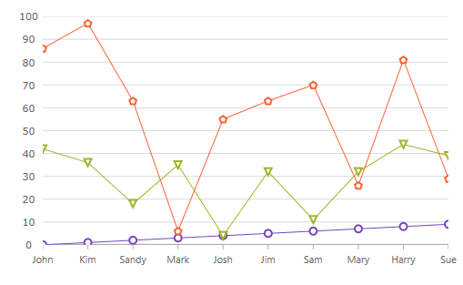

////
|metadata|
{
    "name": "categorychart-binding-to-data",
    "controlName": ["{CategoryChartName}"],
    "tags": [],
    "buildFlags": []
}
|metadata|
////

= Binding to Data

=== Purpose
This topic demonstrates how to bind both flat and hierarchical data to the link:{CategoryChartLink}.{CategoryChartName}.html[{CategoryChartName}] control. At the end of each section, a complete code sample is provided. 

=== In this topic

This topic contains the following sections:

* <<Introduction,Introduction>> 
* <<SupportedChartTypes,Supported Chart Types>>
* <<IncludeExcludeProperties,Include & Exclude Properties>>
* <<Requirements,Requirements>>
* <<PreviewFlatData,Preview Flat Data>>
* <<OverviewFlatData,Overview Flat Data>>
* <<StepsFlatData,Steps - Flat Data>>
* <<PreviewHierarchicalData,Preview Hierarchical Data>>
* <<OverviewHierarchicalData,Overview Hierarchical Data>>
* <<StepsHierarchicalData,Steps – Hierarchical Data>>
* <<PreviewCollectionOfCollection, Preview Collection of Collection>>
* <<OverviewCollectionOfCollection, Overview Collection of Collection>>
* <<StepsCollectionOfCollection, Steps - Collection of Collection>>
* <<RelatedTopics,Related Content>>

[[Introduction]]
== Introduction

The procedure below demonstrates how to bind the {CategoryChartName} control to a data collection. The {CategoryChartName} allows you to bind to any object that implements the IEnumerable interface. Nested collections that implement ICollection and IEnumerable are also supported.

In this topic you will define two sets of data collection (flat and hierarchical), add the Category Chart control to your application, and bind the control’s ItemsSource to an instance of the designated data collection. 

[[SupportedChartTypes]]
== Supported Chart Types

The link:{DataChartLink}.{CategoryChartName}{ApiProp}charttype.html[ChartType] property enables you to choose which series type you wish to display. Configuring the ChartType to Auto will result in the chart selecting an Area or Line series to represent the collection (depending on the amount of data points), otherwise it will resolve to Column series. For more information, refer to the link:categorychart-chart-types.html[Chart Types] topic.

Supported series types:

*   Auto
*	Area
*	Column
*	Line
*	Point
*	Spline
*	StepLine
*   StepArea
*   SplineArea
*	Waterfall

[[IncludeExcludeProperties]]
== Include & Exclude Properties
In some cases you may need to explicitly define whether or not a particular property associated with your data model needs to plot as a series by the chart. There are two options in which you can tag a property to be either included or excluded by the {CategoryChartName}. 

*Set the Include and Exclude properties*

Each property needs to equal an array of strings which correspond to the names of your properties defined in your data model.
ifdef::sl,wpf,win-phone,win-universal,xamarin[]
*In C#:*
[source,csharp]
----
this.xamCategoryChart.IncludedProperties = new string[] { "ID", "Name", "Department" };
this.xamCategoryChart.ExcludedProperties = new string[] { "Age" };

----
endif::sl,wpf,win-phone,win-universal,xamarin[] 
ifdef::win-forms[]
*In C#:*
[source,csharp]
----
this.ultraCategoryChart.IncludedProperties = new string[] { "ID", "Name", "Department" };
this.ultraCategoryChart.ExcludedProperties = new string[] { "Age" };

----
endif::win-forms[] 
ifdef::wpf[]
*In Visual Basic:*
[source,vb]
----
Me.xamCategoryChart.IncludedProperties = New String(){"ID", "Name", "Department"}
Me.xamCategoryChart.ExcludedProperties = New String(){ "Age" };

----
endif::wpf[]
ifdef::win-forms[]
*In Visual Basic:*
[source,vb]
----
Me.UltraCategoryChart.IncludedProperties = New String(){"ID", "Name", "Department"}
Me.UltraCategoryChart.ExcludedProperties = New String(){ "Age" };

----
endif::win-forms[]
*Attribute the properties*

Assign a DataSeriesMemberIntent Attribute to the properties to explicitly define their status. The code snippet below demonstrates the ommision of a property, named department, from appearing as a series plotted in the {CategoryChartName}.

*In C#:*
[source,csharp]
----
[DataSeriesMemberIntent(DataSeriesIntent.DontPlot)]
public string Department
{
   get { return m_Department; }
   set { m_Department = value; }
}

----
ifdef::wpf,win-forms[]
*In Visual Basic:*
[source,vb]
----
<DataSeriesMemberIntent(DataSeriesIntent.DontPlot)> _
Public Property Department() As String
	Get
		Return m_Department
	End Get
	Set
		m_Department = value
	End Set
End Property
----
endif::wpf,win-forms[]

[[Requirements]]
== Requirements

Following are the general requirements for adding the {CategoryChartName} control.

ifdef::android[]
Add the following Infragistics jars to your main project:

** Infragistics.Chart.jar
** Infragistics.Core.jar
** Infragistics.UI.jar
** DV.Shared.jar
endif::android[]

ifdef::wpf[]
Add the following NuGet package reference to your main project:

** Infragistics.WPF.Charts

For more information on setting up the NuGet feed and adding NuGet packages, you can take a look at the following documentation: link:nuget-feeds.html[NuGet Feeds].

endif::wpf[]

ifdef::win-forms[]
Add the following Infragistics assemblies to your main project:

** {ApiPlatform}{CategoryChartAssembly}.{DllVersion}dll 
** {ApiPlatform}{DataVizAssembly}.{DllVersion}dll 
** {ApiPlatform}Win.Portable.Core.{DllVersion}dll 
endif::win-forms[]

ifdef::xamarin[]
1. Add assembly references by following instructions in the link:xamarin-project-with-infragistics-controls.html#NuGetPackages[Add References Through NuGet Packages] topic.

2. You can add the {CategoryChartName} by using either of the following:
* The link:getting-started-with-toolbox.html[Infragistics Toolbox].
* The code-snippets below.

endif::xamarin[]

Also, add the following Infragistics namespaces:

ifdef::xamarin[]
*In XAML:*
[source,xaml]
----
xmlns:ig="clr-namespace:{CategoryChartNamespace};assembly={ApiPlatform}Charts"
---- 
endif::xamarin[]

ifdef::wpf[]
*In XAML:*
[source,xaml]
----
xmlns:ig="http://schemas.infragistics.com/xaml"
----  
endif::wpf[]
 
ifdef::wpf,win-forms,xamarin[] 
*In C#:* 
[source,csharp]
----
using {CategoryChartNamespace};  
----  
endif::wpf,win-forms,xamarin[]
 
ifdef::wpf,win-forms[] 
*In VB:* 
[source,vb]
----
Imports {CategoryChartNamespace}
---- 
endif::wpf,win-forms[]
 
ifdef::android[] 
*In Java:* 
[source,js]
----
import {CategoryChartNamespace}.{CategoryChartName};
---- 
endif::android[] 

*Numeric Fields*

Each numeric property contained in the collection bound to the chart will be translated as data series values and refer to its name as item and series labels. Without a numeric property defined in your data model the chart will not work as expected.
Hierarchical structured data sources are supported to display multiple series without any modifications required to the control or XAML code.  

ifdef::wpf[]
*In XAML:*
[source,xaml]
----
xmlns:ig="http://schemas.infragistics.com/xaml"
xmlns:local="clr-namespace;SampleApp;assembly=SampleApp"
----
endif::wpf[]

[[PreviewFlatData]]
== Preview Flat Data

The {CategoryChartName} control as implemented by the flat data sample code:

Figure #1

[[OverviewFlatData]]
== Overview Flat Data

1.	Defining a Data Model
2.	Adding an Instance of the {CategoryChartName} control
3.	(Optional) Verifying the result

[[StepsFlatData]]
== Steps – Flat Data

*Define a Data Model*

Create a class to model the data. The following code creates a DataItem class representing simple value-label pairs, as well as a Data class representing a collection of those pairs:

*In C#:*
[source, csharp]
----
  public class ViewModel
    {
        public ObservableCollection<DataItem> Data { get; set; }
        
        public ViewModel()
        {
            CreateData();
        }

        private string[] names = { "John", "Kim", "Sandy", "Mark", "Josh", "Jim", "Sam", "Mary", "Harry", "Sue", "Chris", "Joe", "Carl" };
        private void CreateData()
        {
            Random r = new Random();

            for (int j = 0; j <= 2; j++)
            {
                Data = new ObservableCollection<DataItem>();

                for (int i = 0; i <= 9; i++)
                {
                    Data.Add(new DataItem
                    {
                        ID = i,
                        Name = names[i],
                        Value1 = r.Next(1, 50),
                        Value2 = r.Next(1, 100)
                    });
                }               
            }
        }
    }

    public class DataItem
    {  
        public int ID { get; set; }
        public string Name { get; set; }
        public double Value1 { get; set; }
        public double Value2 { get; set; }
    }
----

ifdef::wpf,win-forms[]
*In Visual Basic:*
[source, vb]
----
Public Class ViewModel
    Public Property Data() As ObservableCollection(Of DataItem)
        Get
            Return m_Data
        End Get
        Set(value As ObservableCollection(Of DataItem))
            m_Data = Value
        End Set
    End Property
    Private m_Data As ObservableCollection(Of DataItem)

    Public Sub New()
        CreateData()
    End Sub

    Private names As String() = {"John", "Kim", "Sandy", "Mark", "Josh", "Jim", _
        "Sam", "Mary", "Harry", "Sue", "Chris", "Joe", _
        "Carl"}
    Private Sub CreateData()
        Dim r As New Random()

        For j As Integer = 0 To 2
            Data = New ObservableCollection(Of DataItem)()
            For i As Integer = 0 To 9

                Data.Add(New DataItem() With {
                     .ID = i,
                     .Name = names(i),
                     .Value1 = r.[Next](1, 50),
                     .Value2 = r.[Next](1, 100)
                })
            Next
        Next
    End Sub
End Class

Public Class DataItem

    Public Property ID() As Integer
        Get
            Return m_ID
        End Get
        Set(value As Integer)
            m_ID = value
        End Set
    End Property
    Private m_ID As Integer

    Public Property Name() As String
        Get
            Return m_Name
        End Get
        Set(value As String)
            m_Name = value
        End Set
    End Property
    Private m_Name As String

    Public Property Value1() As Double
        Get
            Return m_Value1
        End Get
        Set(value As Double)
            m_Value1 = value
        End Set
    End Property
    Private m_Value1 As Double

    Public Property Value2() As Double
        Get
            Return m_Value2
        End Get
        Set(value As Double)
            m_Value2 = value
        End Set
    End Property
    Private m_Value2 As Double

End Class
----
endif::wpf,win-forms[]

*Add an instance of the {CategoryChartName} Control*

To the layout root, add an instance of the data collection, a legend instance, and an instance of the {CategoryChartName}:

ifdef::wpf[]
*In XAML*:
[source, xaml]
----

<Window x:Class="MainWindow"
    xmlns="http://schemas.microsoft.com/winfx/2006/xaml/presentation"
    xmlns:x="http://schemas.microsoft.com/winfx/2006/xaml"
    xmlns:local="clr-namespace:SampleApp"
    xmlns:ig="http://schemas.infragistics.com/xaml"
    Title="MainWindow" Height="350" Width="525">
    <Window.DataContext>
        <local:ViewModel/>
    </Window.DataContext>
    <Grid >
        <ig:{CategoryChartName} ItemsSource="{Binding Data}" XAxisLabel="{}{Name}" Margin="10" />
    </Grid>
</Window>
----
endif::wpf[]

ifdef::xamarin[]
*In XAML*
[source, xaml]
----
<ContentView x:Class="Samples.Browser.Views.DataCharts.Axes.ChartEditingCategoryAxes"
             xmlns="http://xamarin.com/schemas/2014/forms"
             xmlns:x="http://schemas.microsoft.com/winfx/2009/xaml"
             xmlns:ig="clr-namespace:{CategoryChartNamespace};assembly={ApiPlatform}Charts">
    <Grid >
        <ig:{CategoryChartName} ItemsSource="{Binding}" XAxisLabel="{}{Name}" Margin="10" />
    </Grid>
</ContentView>
----
endif::xamarin[]

*(Optional) Verify the Result*

Run your application to verify the result. If you have successfully bound the {CategoryChartName} control to the data collection, the resulting chart will look like the one shown in Figure 1, above.

[[PreviewHierarchicalData]]
== Preview Hierarchical Data

Figure #2

image::images/categorychart_data_binding_02.png[]

The {CategoryChartName} control as implemented by the nested sample code. The positive values represent the parent data item’s properties and the negative values show the children property values.

[[OverviewHierarchicalData]]
== Overview Hierarchical Data

. Defining a Nested Data Model
. Adding an Instance of the {CategoryChartName} control
. (Optional) Verifying the result

[[StepsHierarchicalData]]
== Steps – Hierarchical Data

*Define a Data Model*

Create a class to model the data. The following code creates Parent and Child classes representing nested level collections, as well as a ViewModel class representing a collection of those pairs. 

_Prerequisites:_ 

*  The “child-level” class must contain a numeric property.
*  The View Model must Implement ObservableCollection that is the type equal to your “parent-level” collection. This will allow you to add children objects. 
*  The Parent class will implement IEnumerable.

*In C#:*
[source, csharp]
----

    public class ViewModel : ObservableCollection<Parent>
    {
        public ViewModel()
        {
            CreateData();
        }

        private string[] names = {"John","Kim","Sandy","Mark","Josh","Jim","Sam"};
        
        private void CreateData()
        {
            Random r = new Random();

            for (int j = 0; j <= 3; j++)
            {
                Parent dt = new Parent()
                {
                    ID = j,
                    Name = names[j],
                    Value1 = r.Next(1, 50),
                    Value2 = r.Next(1, 100),
                    Children = new ObservableCollection<Child>()
                };    
                       
                for (int y = 0; y <= 3; y++)
                {
                    Child children = new Child()
                    {
                        ID = y + 1,
                        Name = names[y],
                        Value2 = r.Next(-100, 0),
                    };
                
                    dt.Children.Add(children);
                }
                this.Add(dt);
            }
        }
    }

    public class Parent : IEnumerable
    {  
        public ObservableCollection<Child> Children { get; set; }
        public double ID { get; set; }
        public string Name { get; set; }
        public double Value1 { get; set; }
        public double Value2 { get; set; }
 
        public IEnumerator GetEnumerator()
        {
            return this.Children.GetEnumerator();
        }
    }  
    
    public class Child  
    {
    	public double ID { get; set; }
        public string Name { get; set; }       
        public double Value2 { get; set; }
    }  
----

ifdef::wpf,win-forms[]
*In Visual Basic:*
[source, vb]
----

Public Class ViewModel
Inherits ObservableCollection(Of Parent)
    Public Sub New()
        CreateData()
    End Sub

    Private names As String() = {"John", "Kim", "Sandy", "Mark", "Josh", "Jim", "Sam"}
    Private Sub CreateData()
        Dim r As New Random()

        For j As Integer = 0 To 3 Step 1
           
     Dim dt As New Parent With
     {
              .ID = j,
              .Name = names(j),
              .Value1 = r.[Next](1, 50),
              .Value2 = r.[Next](1, 100),
  		.Children = New ObservableCollection(Of Child)()
            }

     For y As Integer = 0 To 3 Step 1

                Dim children As New Child() With
                { 
                    .ID = y,
                    .Name = names(y),
                    .Value2 = r.[Next](-100, 0)
                }
		  dt.Children.Add(children)		 

            Next
		
     Me.Add(dt)
	     
        Next
    End Sub
End Class

Public Class Parent 
Implements IEnumerable
Public Property Children() As ObservableCollection(Of Child) 
        Get
            Return m_Children
        End Get
        Set(value As Integer)
            m_Children = value
        End Set
    End Property
    Public Property ID() As Integer
        Get
            Return m_ID
        End Get
        Set(value As Integer)
            m_ID = value
        End Set
    End Property
    Private m_ID As Integer
    Public Property Name() As String
        Get
            Return m_Name
        End Get
        Set(value As String)
            m_Name = value
        End Set
    End Property
    Private m_Name As String
    Public Property Value1() As Double
        Get
            Return m_Value1
        End Get
        Set(value As Double)
            m_Value1 = value
        End Set
    End Property
    Private m_Value1 As Double
    Public Property Value2() As Double
        Get
            Return m_Value2
        End Get
        Set(value As Double)
            m_Value2 = value
        End Set
    End Property
    Private m_Value2 As Double
    Public Function GetEnumerator() As IEnumerator Implements IEnumerable.GetEnumerator
        Return DirectCast(Children, ICollection).GetEnumerator()
    End Function
End Class

Public Class Child
    Public Property ID() As Double
        Get
            Return m_ID
        End Get
        Set(value As Double)
            m_ID = value
        End Set
    End Property
    Private m_ID As Double
    Public Property Name() As String
        Get
            Return m_Name
        End Get
        Set(value As String)
            m_Name = value
        End Set
    End Property
    Private m_Name As String
    Public Property Value1() As Double
        Get
            Return m_Value1
        End Get
        Set(value As Double)
            m_Value1 = value
        End Set
    End Property
    Private m_Value1 As Double
    Public Property Value2() As Double
        Get
            Return m_Value2
        End Get
        Set(value As Double)
            m_Value2 = value
        End Set
    End Property
    Private m_Value2 As Double

End Class
----
endif::wpf,win-forms[]

*Add an instance of the {CategoryChartName} Control*

To the layout root, add an instance of the nested data collection and an instance of the Category Chart:

ifdef::wpf[]
*In XAML*:
[source, xaml]
----
<Window x:Class="MainWindow"
    xmlns="http://schemas.microsoft.com/winfx/2006/xaml/presentation"
    xmlns:x="http://schemas.microsoft.com/winfx/2006/xaml"
    xmlns:local="clr-namespace:SampleApp"
    xmlns:ig="http://schemas.infragistics.com/xaml"
    Title="MainWindow" Height="350" Width="525">
    <Window.DataContext>
        <local:ViewModel/>
    </Window.DataContext>
    <Grid >
        <ig:{CategoryChartName} ItemsSource="{Binding}" XAxisLabel="{}{Name}" Margin="10" />
    </Grid>
</Window>
----
endif::wpf[]

ifdef::xamarin[]
*In XAML*
[source, xaml]
----
<ContentPage x:Class="Samples.Browser.Views.DataCharts.Axes.ChartEditingCategoryAxes"
             xmlns="http://xamarin.com/schemas/2014/forms"
             xmlns:x="http://schemas.microsoft.com/winfx/2009/xaml"
             xmlns:ig="clr-namespace:{CategoryChartNamespace};assembly={ApiPlatform}Charts">
    <Grid>
        <ig:{CategoryChartName} ItemsSource="{Binding}" XAxisLabel="{}{Name}" Margin="10" />
    </Grid>
</ContentPage>
----
endif::xamarin[]

*(Optional) Verify the Result*

Run your application to verify the result. If you have successfully bound the Category Chart control to the nested data collection, the resulting chart will look like the one shown in Figure 2, above.

[[PreviewCollectionOfCollection]]
== Preview Collection of Collections

Figure #3

The {CategoryChartName} as implemented with a collection of collections data source.

image::images/categorychart_collection_of_collection.png[]

[[OverviewCollectionOfCollection]]
== Overview Collection of Collections

. Defining a Data Model.
. Adding an instance of the {CategoryChartName} control.
. (Optional) Verifying the result.

[[StepsCollectionOfCollection]]
== Steps - Collection of Collections

*Defining a Data Model*

Create a class to model the data. The following code creates a ViewModel class with a nested collection in the format of IList<IList<Type>> and populates it similar to the hierarchical data structure demonstrated above.

*In C#*
[source, csharp]
----
public class ViewModel
{
    public ObservableCollection<ObservableCollection<SampleData>> Data { get; set; }
       
    private string[] names = { "John", "Kim", "Sandy", "Mark", "Josh", "Jim", "Sam", "Mary", "Harry", "Sue", "Chris", "Joe", "Carl" };

    Random r = new Random();
    public ViewModel()
    {
        Data = new ObservableCollection<ObservableCollection<SampleData>>();

        for(int i=0; i<3; i++)
        {
            ObservableCollection<SampleData> innerData = new ObservableCollection<SampleData>();
            for(int j = 0; j <names.Length; j++)
            {
                SampleData sd = new SampleData() { Name = names[j] };

                if(i == 0)
                {
                    sd.Value = r.Next(10, 30);
                }
                else if(i == 1)
                {
                    sd.Value = r.Next(40, 60);
                }
                else
                {
                    sd.Value = r.Next(70, 90);
                }

                innerData.Add(sd);
            }
            Data.Add(innerData);
        }
    }
}

public class SampleData
{
    public string Name { get; set; }
    public int Value { get; set; }        
}

----

ifdef::wpf,win-forms[]

*In Visual Basic*
[source, vb]
----
Public Class ViewModel
    Public Property Data() As ObservableCollection(Of ObservableCollection(Of SampleData))
        Get
            Return m_Data
        End Get
        Set
            m_Data = Value
        End Set
    End Property
    Private m_Data As ObservableCollection(Of ObservableCollection(Of SampleData))

    Private names As String() = {"John", "Kim", "Sandy", "Mark", "Josh", "Jim",
        "Sam", "Mary", "Harry", "Sue", "Chris", "Joe", "Carl"}

    Private r As New Random()
    Public Sub New()
        Data = New ObservableCollection(Of ObservableCollection(Of SampleData))()

        For i As Integer = 0 To 2
            Dim innerData As New ObservableCollection(Of SampleData)()
            For j As Integer = 0 To names.Length - 1
                Dim sd As New SampleData() With {
                    .Name = names(j)
                }

                If i = 0 Then
                    sd.Value = r.[Next](10, 30)
                ElseIf i = 1 Then
                    sd.Value = r.[Next](40, 60)
                Else
                    sd.Value = r.[Next](70, 90)
                End If

                innerData.Add(sd)
            Next

            Data.Add(innerData)
        Next
    End Sub
End Class

Public Class SampleData
    Public Property Name() As String
        Get
            Return m_Name
        End Get
        Set
            m_Name = Value
        End Set
    End Property
    Private m_Name As String
    Public Property Value() As Integer
        Get
            Return m_Value
        End Get
        Set
            m_Value = Value
        End Set
    End Property
    Private m_Value As Integer
End Class
----
endif::wpf,win-forms[]

*Add an instance of the {CategoryChartName} control*
To the layout root, add an instance of the {CategoryChartName}, binding it to the IList<IList<Type>>.

ifdef::wpf[]

*In XAML*
[source, xaml]
----
<Window x:Class="MainWindow"
    xmlns="http://schemas.microsoft.com/winfx/2006/xaml/presentation"
    xmlns:x="http://schemas.microsoft.com/winfx/2006/xaml"
    xmlns:local="clr-namespace:MyAppNamespace"
    xmlns:ig="http://schemas.infragistics.com/xaml"
    Title="MainWindow" Height="350" Width="525">
    <Window.DataContext>
        <local:ViewModel/>
    </Window.DataContext>
    <Grid >
        <ig:{CategoryChartName} ItemsSource="{Binding Data}"
                             XAxisLabel="{}{Name}"
                             Margin="10"
                             YAxisMinimumValue="0"
                             YAxisMaximumValue="100"/>
    </Grid>
</Window>
----
endif::wpf[]

ifdef::xamarin[]
*In XAML*
[source, xaml]
----
<ContentPage xmlns="http://xamarin.com/schemas/2014/forms"
             xmlns:x="http://schemas.microsoft.com/winfx/2009/xaml"
             xmlns:local="clr-namespace:MyAppNamespace"
             xmlns:ig="clr-namespace:{CategoryChartNamespace};assembly={ApiPlatform}Charts">
     <Grid>
        <Grid.BindingContext>
            <local:ViewModel />
        </Grid.BindingContext>
        
        <ig:{CategoryChartName} ItemsSource="{Binding Data}"
                         ChartType="Line" 
                         YAxisMinimumValue="0"
                         YAxisMaximumValue="100"/>
    </Grid>
</ContentPage>
----
endif::xamarin[]

*(Optional) Verify the Result*
Run your application to verify the result. If you have successfully bound the {CategoryChartName} to the IList<IList<Type>>, the resulting chart will look like the one shown in Figure 3, above.

[[RelatedTopics]]
== Related Content

=== Topics

The following topics provide additional information related to this topic:

[options="header", cols="a,a"]
|====
|Topic|Purpose

| link:categorychart-overview.html[Overview]
|This topic provides a conceptual overview of the Category Chart control.

|====