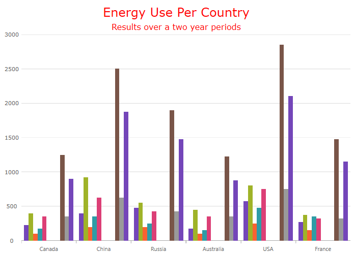

////
|metadata|
{
    "name": "categorychart-chart-title-subtitle",
    "controlName": ["{CategoryChartName}"],
    "tags": [],
    "buildFlags": []
}
|metadata|
////

= Chart Title and Subtitle

== Topic Overview

=== Purpose

The title and subtitle feature of the link:{CategoryChartLink}.{CategoryChartName}.html[{CategoryChartName}] control allows you to add information to the top section of the chart control.

When adding a title or subtitle to the chart control, the content of the chart automatically resizes allowing for the title and subtitle information.

=== Required Background
The following topics are prerequisites to understanding this topic:

[options="header", cols="a,a"]
|====
|Topic|Purpose

| link:categorychart-overview.html[ {CategoryChartName} Overview]
|This topic provides conceptual information about the {CategoryChartName} control including its main features, minimum requirements, and user functionality.

| link:categorychart-binding-to-data.html[Binding to Data]
|This topic explains how to bind data to the {CategoryChartName} control.
|====

=== In this topic

This topic contains the following sections:

* <<propertysettings,Property Settings>>
* <<codesnippet,Code Snippet>>
* <<RelatedContent,Related Content>>

[[propertysettings]]
== Property Settings

You can customize the look and feel of the category chart's subtitle and title in many different ways such as applying different font styles, margins, and alignment. This can be achieved through the following properties:

ifdef::wpf[]

[options="header", cols="a,a,a"]
|====
|Property Name|Property Type|Description

| link:{CategoryChartLink}.{CategoryChartDomain}{ApiProp}Title.html[Title]
|`string`
|Title’s text content.

| link:{CategoryChartLink}.{CategoryChartDomain}{ApiProp}TitleAlignment.html[TitleAlignment]
|`HorizontalAlignment`
|Title’s horizontal alignment.

| link:{CategoryChartLink}.{CategoryChartDomain}{ApiProp}TitleFontFamily.html[TitleFontFamily]
|`FontFamily`
|Title’s font name.

| link:{CategoryChartLink}.{CategoryChartDomain}{ApiProp}TitleFontSize.html[TitleFontSize]
|`double`
|Title’s font size

| link:{CategoryChartLink}.{CategoryChartDomain}{ApiProp}TitleFontStyle.html[TitleFontStyle] 
|`FontStyle`
|Title’s font style such as italic.

| link:{CategoryChartLink}.{CategoryChartDomain}{ApiProp}TitleFontStretch.html[TitleFontStretch]
|`FontStretch`
|Title’s font stretch

|link:{CategoryChartLink}.{CategoryChartDomain}{ApiProp}TitleFontWeight.html[TitleFontWeight]
|`FontWeight` 
|Title’s font weight such as bold.

|link:{CategoryChartLink}.{CategoryChartDomain}{ApiProp}TitleForeGround.html[TitleForeGround]
|`Brush` 
|Title’s text color.

|link:{CategoryChartLink}.{CategoryChartDomain}{ApiProp}TitleMargin.html[TitleMargin] 
|`Thickness` 
|Title’s margin.

| link:{CategoryChartLink}.{CategoryChartDomain}{ApiProp}Subtitle.html[Subtitle] 
|`string`
|Subtitle’s text content.

| link:{CategoryChartLink}.{CategoryChartDomain}{ApiProp}SubtitleForeground.html[SubtitleForeground] 
|`Brush`
|Subtitle’s text color.

| link:{CategoryChartLink}.{CategoryChartDomain}{ApiProp}SubtitleFontFamily.html[SubtitleFontFamily]
|`FontFamily`
|Subtitle’s font name.

| link:{CategoryChartLink}.{CategoryChartDomain}{ApiProp}SubtitleFontSize.html[SubtitleFontSize] 
|`double`
|Subtitle’s text size.

| link:{CategoryChartLink}.{CategoryChartDomain}{ApiProp}SubtitleFontStyle.html[SubtitleFontStyle] 
|`FontStyle`
|Subtitle’s font style such as italic.

|link:{CategoryChartLink}.{CategoryChartDomain}{ApiProp}SubtitleFontWeight.html[SubtitleFontWeight]
|`FontWeight` 
|Subtitle’s font weight such as bold.

| link:{CategoryChartLink}.{CategoryChartDomain}{ApiProp}SubtitleAlignment.html[SubtitleAlignment]
|`HorizontalAlignment`
|Subtitle’s horizontal alignment.

|link:{CategoryChartLink}.{CategoryChartDomain}{ApiProp}SubtitleMargin.html[SubtitleMargin] 
|`Thickness` 
|Subtitle’s margin.

|====

endif::wpf[]

ifdef::xamarin[]

[options="header", cols="a,a,a"]
|====
|Property Name|Property Type|Description

| link:{CategoryChartLink}.{CategoryChartDomain}{ApiProp}Title.html[Title]
|`string`
|Title’s text content.

| link:{CategoryChartLink}.{CategoryChartDomain}{ApiProp}TitleAlignment.html[TitleAlignment]
|`HorizontalAlignment`
|Title’s horizontal alignment.

| link:{CategoryChartLink}.{CategoryChartDomain}{ApiProp}TitleBottomMargin.html[TitleBottomMargin]
|`double`
|Title’s bottom margin.

| link:{CategoryChartLink}.{CategoryChartDomain}{ApiProp}TitleFontAttributes.html[TitleFontAttributes]
|`FontAttributes`
|Title’s font style.

| link:{CategoryChartLink}.{CategoryChartDomain}{ApiProp}TitleFontFamily.html[TitleFontFamily]
|`string`
|Title’s font name.

| link:{CategoryChartLink}.{CategoryChartDomain}{ApiProp}TitleFontSize.html[TitleFontSize]
|`double`
|Title’s font size

| link:{CategoryChartLink}.{CategoryChartDomain}{ApiProp}TitleLeftMargin.html[TitleLeftMargin]
|`double`
|Title’s left margin.

| link:{CategoryChartLink}.{CategoryChartDomain}{ApiProp}TitleRightMargin.html[TitleRightMargin]
|`double`
|Title’s right margin.

| link:{CategoryChartLink}.{CategoryChartDomain}{ApiProp}TitleTextColor.html[TitleTextColor]
|link:{DataVizLinkBase}.Brush.html[Brush]
|Title’s text color.

|link:{CategoryChartLink}.{CategoryChartDomain}{ApiProp}TitleTopMargin.html[TitleTopMargin] 
|`double` 
|Title’s top margin.

| link:{CategoryChartLink}.{CategoryChartDomain}{ApiProp}Subtitle.html[Subtitle] 
|`string`
|Subtitle’s text content.

| link:{CategoryChartLink}.{CategoryChartDomain}{ApiProp}SubtitleAlignment.html[SubtitleAlignment] 
|`HorizontalAlignment`
|Subtitle’s horizontal alignment.

| link:{CategoryChartLink}.{CategoryChartDomain}{ApiProp}SubtitleBottomMargin.html[SubtitleBottomMargin] 
|`double`
|Subtitle’s bottom margin.

| link:{CategoryChartLink}.{CategoryChartDomain}{ApiProp}SubtitleFontAttributes.html[SubtitleFontAttributes] 
|`FontAttributes`
|Subtitle’s font style.

| link:{CategoryChartLink}.{CategoryChartDomain}{ApiProp}SubtitleFontFamily.html[SubtitleFontFamily] 
|`string`
|Subtitle’s font name.

| link:{CategoryChartLink}.{CategoryChartDomain}{ApiProp}SubtitleFontSize.html[SubtitleFontSize] 
|`double`
|Subtitle’s text size.

| link:{CategoryChartLink}.{CategoryChartDomain}{ApiProp}SubtitleLeftMargin.html[SubtitleLeftMargin] 
|`double`
|Subtitle’s left margin.

|link:{CategoryChartLink}.{CategoryChartDomain}{ApiProp}SubtitleRightMargin.html[SubtitleRightMargin]
|`double` 
|Subtitle’s right margin.

| link:{CategoryChartLink}.{CategoryChartDomain}{ApiProp}SubtitleTextColor.html[SubtitleTextColor]
|link:{DataVizLinkBase}.Brush.html[Brush]
|Subtitle’s text color.

|link:{CategoryChartLink}.{CategoryChartDomain}{ApiProp}SubtitleTopMargin.html[SubtitleTopMargin] 
|`double` 
|Subtitle’s top margin.

|====

endif::xamarin[]

[[codesnippet]]
== Code Snippet

The following code example shows how to customize the title and subtitle:
ifdef::sl,wpf,win-phone,win-universal,xamarin[]
*In XAML:*
endif::sl,wpf,win-phone,win-universal,xamarin[] 
ifdef::wpf[]

[source,xaml]
----
<ig:{CategoryChartName} x:Name="CategoryChart" 
                     Title="Energy Use Per Country"
                     TitleForeground="Red"
                     TitleFontFamily="Verdana"
                     TitleFontSize="24"
                     Subtitle="Results over a two year periods"
                     SubtitleForeground="Red"
                     SubtitleFontFamily="Verdana"
                     SubtitleFontSize="16">
</ig:{CategoryChartName}>
----
endif::wpf[]

ifdef::xamarin[]

[source,xaml]
----
<ig:{CategoryChartName} x:Name="CategoryChart" 
                     Title="Energy Use Per Country"
                     TitleTextColor="Red"
                     TitleFontFamily="Verdana"
                     TitleFontSize="24"
                     Subtitle="Results over a two year periods"
                     SubtitleTextColor="Red"
                     SubtitleFontFamily="Verdana"
                     SubtitleFontSize="16">
</ig:{CategoryChartName}>
----
endif::xamarin[]
*In C#:*
ifdef::win-forms[]

[source,csharp]
----
            this.ultraCategoryChart1.Name = "CategoryChart";
            this.ultraCategoryChart1.Title = "Energy Use Per Country";
            this.ultraCategoryChart1.TitleTextColor = System.Drawing.Color.FromArgb(244, 68, 75, 0);
            this.ultraCategoryChart1.TitleFontFamily = "Verdana";
            this.ultraCategoryChart1.TitleFontSize = 24;
            this.ultraCategoryChart1.Subtitle = "Results over a two year periods";
            this.ultraCategoryChart1.SubtitleTextColor = System.Drawing.Color.FromArgb(244, 68, 75, 0);
            this.ultraCategoryChart1.SubtitleFontFamily = "Verdana";
            this.ultraCategoryChart1.SubtitleFontSize = 16;
----
endif::win-forms[]
*In Visual Basic:*
ifdef::win-forms[]

[source,vb]
----
            Me.ultraCategoryChart1.Name = "CategoryChart"
            Me.ultraCategoryChart1.Title = "Energy Use Per Country"
            Me.ultraCategoryChart1.TitleTextColor = System.Drawing.Color.FromArgb(244, 68, 75, 0)
            Me.ultraCategoryChart1.TitleFontFamily = "Verdana"
            Me.ultraCategoryChart1.TitleFontSize = 24
            Me.ultraCategoryChart1.Subtitle = "Results over a two year periods"
            Me.ultraCategoryChart1.SubtitleTextColor = System.Drawing.Color.FromArgb(244, 68, 75, 0)
            Me.ultraCategoryChart1.SubtitleFontFamily = "Verdana"
            Me.ultraCategoryChart1.SubtitleFontSize = 16
----
endif::win-forms[]

[[RelatedContent]]
== Related Content

[options="header", cols="a,a"]
|====
|Topic|Purpose

| link:categorychart-walkthrough.html[Adding Category Chart]
|This article will get you up and running with the Category Chart control.

|====