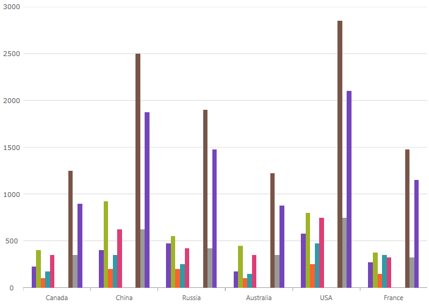
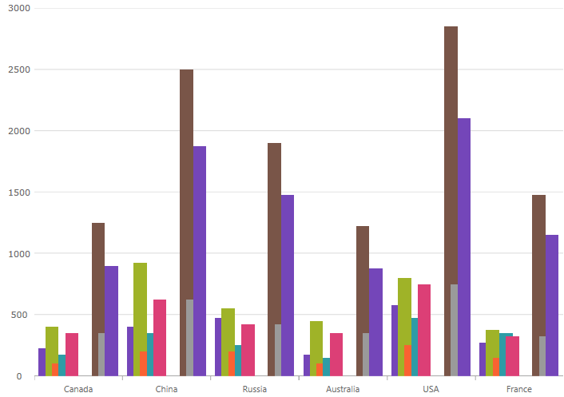

////
|metadata|
{
    "name": "categorychart-configuring-axis-gap-and-overlap",
    "controlName": ["{CategoryChartName}"],
    "tags": [],
    "buildFlags": []
}
|metadata|
////

= Configuring Axis Gap and Overlap

=== Purpose

This topic provides information on configuring axis gap and axis overlap in the link:{CategoryChartLink}.{CategoryChartName}.html[{CategoryChartName}] control.

=== Required background

The following topic is a prerequisite to understanding this topic:
link:categorychart-walkthrough.html[Adding Category Chart]

=== In this topic

This topic contains the following sections:

* <<ConfigureAxisGap,Axis Gap>> 
* <<ConfigureAxisOverlap,Axis Overlap>>
* <<RelatedContent,Related Content>>

[[ConfigureAxisGap]]
== Axis Gap

=== Overview

The Axis Gap feature of the {CategoryChartName} control allows setting the gap between series of the chart.

=== Property

The link:{CategoryChartLink}.{CategoryChartName}{ApiProp}XAxisGap.html[XAxisGap] property accepts a numeric float value between 0 and 1. The value represents a relative width of the gap out of the available number of pixels between series. 0 = no gap is rendered between series; 1 = maximum gap is rendered between series.

For example, `XAxisGap` of 0.5 is half of the available space used to draw the gap.

.Note
[NOTE]
====
The XAxisGap property is only applicable to non-continuous series types. This includes the Column and Waterfall ChartTypes.
====

=== Code Snippet

To initialize {CategoryChartName} with `XAxisGap` of `0.5` the following code can be used:
ifdef::sl,wpf,win-phone,win-universal,xamarin[]
*In XAML:*

[source,xaml]
----
<ig:{CategoryChartName} x:Name="CategoryChart" 
                        ItemsSource="{Binding EnergySampleData}"
                        XAxisGap="0.5" 
                        ChartType="Column"
</ig:{CategoryChartName}>
----
endif::sl,wpf,win-phone,win-universal,xamarin[]
ifdef::win-forms[]
*In C#:*

[source,csharp]
----
this.ultraCategoryChart1.XAxisGap = 0.5;
----

*In Visual Basic:*

[source,vb]
----
Me.ultraCategoryChart1.XAxisGap = 0.5
----
endif::win-forms[]

[[ConfigureAxisOverlap]]
== Axis Overlap

=== Overview

The Axis Overlap feature of the {CategoryChartName} control allows setting overlap of rendered categories.

=== Property

The link:{CategoryChartLink}.{CategoryChartName}{ApiProp}XAxisOverlap.html[XAxisOverlap] property accepts a numeric float value between -1 and 1. The value represents a relative overlap out of the available number of pixels dedicated to each series.

Negative value (down to -1): the categories are pushed away from each other producing a gap between themselves.

Positive value (up to 1): the categories are overlapping each other. Value of 1 directs the chart to render categories on top of each other.

For example, `XAxisOverlap` of 0.5 is half of the available space used to draw categories overlapping each other.

.Note
[NOTE]
====
The XAxisOverlap property is only applicable to non-continuous series types. This includes the Column and Waterfall ChartTypes.
====

=== Code Snippet
ifdef::sl,wpf,win-phone,win-universal,xamarin[]
*In XAML:*

[source,xaml]
----
<ig:{CategoryChartName} x:Name="CategoryChart" 
                        ItemsSource="{Binding EnergySampleData}"
                        XAxisOverlap="0.5" 
                        ChartType="Column"
</ig:{CategoryChartName}>
----
endif::sl,wpf,win-phone,win-universal,xamarin[] 
ifdef::win-forms[]
*In C#:*

[source,csharp]
----
this.ultraCategoryChart1.XAxisOverlap = 0.5;
----

*In Visual Basic:*

[source,vb]
----
Me.ultraCategoryChart1.XAxisOverlap = 0.5
----
endif::win-forms[]

[[RelatedContent]]
== Related Content

[options="header", cols="a,a"]
|====
|Topic|Purpose

| link:categorychart-walkthrough.html[Adding Category Chart]
|This article will get you up and running with the Category Chart control.

| link:categorychart-chart-types.html[Chart Types]
|This article describes the available chart types.