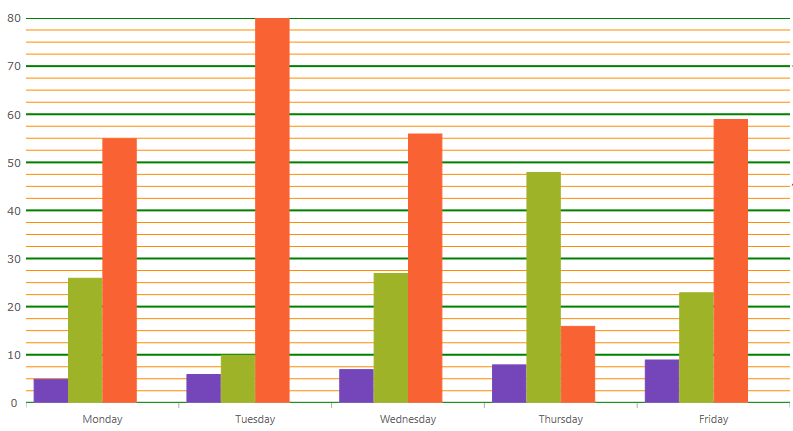

////
|metadata|
{
    "name": "categorychart-configuring-axis-intervals",
    "controlName": ["{CategoryChartName}"],
    "tags": [],
    "buildFlags": []
}
|metadata|
////

= Axis Intervals

=== Purpose
This topic demonstrates how to configure the major and minor intervals for chart axes of the link:{CategoryChartLink}.{CategoryChartName}.html[{CategoryChartName}] control. 

In the {CategoryChartName} control, axis major interval specifies how frequent major gridlines and axis labels are rendered on an axis. Similarly, axis minor interval specifies how frequent minor gridlines are rendered on an axis.

=== In this topic

This topic contains the following sections:

* <<ConfigureXAxis,Configuring XAxis and YAxis Major and Minor Intervals>> 
* <<codesnippet,Code Snippet>>
* <<RelatedContent,Related Content>>

[[ConfiguringXAxis]]
== Configuring XAxis and YAxis Major and Minor Intervals

[options="header", cols="a,a,a"]
|====
|In order to configure|Use this property|And set it to

|The frequency of major interval gridlines	
|link:{DataChartLink}.{CategoryChartName}{ApiProp}XAxisInterval.html[XAxisInterval], link:{DataChartLink}.{CategoryChartName}{ApiProp}YAxisInterval.html[YAxisInterval] 	
|This value provides configurable spacing for axis labels and major gridlines. Note that the interval for axis labels will also be set by this value, displaying one label at the point on the axis associated with the interval.
On the X axis, this value is represented as an index between the first and last category item. Generally, this value should equal to 10-20% of total numbers of category items so that all axis labels fit on axis so that they are not clipped by other axis labels.

On Y axes, this value is represented as double between axis minimum value and axis maximum value. By default, numeric axes will automatically calculate and find a nice and round interval based on axis minimum values and maximum value.
On date time axes, this value is represented as time span between axis minimum value and axis maximum value.

|The color of the major interval gridlines	
|link:{DataChartLink}.{CategoryChartXY}{ApiProp}XAxisMajorStroke.html[XAxisMajorStroke], link:{DataChartLink}.{CategoryChartXY}{ApiProp}YAxisMajorStroke.html[YAxisMajorStroke] 	
|A color of axis major gridlines.
|The thickness of the major interval gridlines	
|link:{DataChartLink}.{CategoryChartXY}{ApiProp}XAxisMajorStrokeThickness.html[XAxisMajorStrokeThickness], link:{DataChartLink}.{CategoryChartXY}{ApiProp}YAxisMajorStrokeThickness.html[YAxisMajorStrokeThickness]	
|A thickness in pixels of the axis major gridline stroke set as a double value.
|The frequency of minor interval gridlines	
|link:{DataChartLink}.{CategoryChartName}{ApiProp}XAxisMinorInterval.html[XAxisMinorInterval], link:{DataChartLink}.{CategoryChartName}{ApiProp}YAxisMinorInterval.html[YAxisMinorInterval]	
|This value provides configurable spacing for minor gridlines, which are always rendered between major gridlines. As result, a value of XAxisMinorInterval property should always be much smaller (usually 2-5 time smaller) than the value of XAxisInterval property of an axis.

On category axes, this value is represented as fraction of major Interval property. Generally, this value should equal to between 0.25 and 0.5.

On numeric axes, this value is represented as double between axis minimum value and axis maximum value. By default, numeric axes will not automatically calculate minor interval based on axis minimum values and maximum value.

|The color of the minor interval gridlines	
|link:{DataChartLink}.{CategoryChartXY}{ApiProp}XAxisMinorStroke.html[XAxisMinorStroke], link:{DataChartLink}.{CategoryChartXY}{ApiProp}YAxisMinorStroke.html[YAxisMinorStroke]	
|A color of axis minor gridlines.
|The thickness of the  minor interval gridlines	
|link:{DataChartLink}.{CategoryChartXY}{ApiProp}XAxisMinorStrokeThickness.html[XAxisMinorStrokeThickness], link:{DataChartLink}.{CategoryChartXY}{ApiProp}YAxisMinorStrokeThickness.html[YAxisMinorStrokeThickness]		
|A thickness in pixels of the axis minor gridline stroke set as a double value.

|====

.Note
[NOTE]
====
The `XAxisMinorInterval`, `XAxisMinorStroke`, and `XAxisMinorStrokeThickness` properties only have an effect when a ChartType of either "Column" or "Waterfall" is used.
====

[[codesnippet]]
== Code Snippet

The following code snippet demonstrates how to configure the interval on the x-axis.
ifdef::sl,wpf,win-phone,win-universal,xamarin[]
*In XAML:*
[source,xaml]
----
<ig:{CategoryChartName} x:Name="chart1"  
                     YAxisInterval="10"
                     YAxisMinorInterval="2.5" 
                     YAxisMinorStroke="Orange"    
                     YAxisMajorStroke="Green"  
                     YAxisMinorStrokeThickness="1"
                     YAxisMajorStrokeThickness="2">
</ig:{CategoryChartName}>
----
endif::sl,wpf,win-phone,win-universal,xamarin[] 
ifdef::win-forms[]
*In C#:*

[source,csharp]
----
this.ultraCategoryChart1.YAxisInterval= 10;
this.ultraCategoryChart1.YAxisMinorInterval= 2.5; 
this.ultraCategoryChart1.YAxisMinorStroke= System.Drawing.Color.FromArgb(173, 119, 10, 0);   
this.ultraCategoryChart1.YAxisMajorStroke= System.Drawing.Color.FromArgb(10, 173, 94, 0); 
this.ultraCategoryChart1.YAxisMinorStrokeThickness= 1;
this.ultraCategoryChart1.YAxisMajorStrokeThickness= 2;
----

*In Visual Basic:*

[source,vb]
----
Me.ultraCategoryChart1.YAxisInterval= 10
Me.ultraCategoryChart1.YAxisMinorInterval= 2.5
Me.ultraCategoryChart1.YAxisMinorStroke= System.Drawing.Color.FromArgb(173, 119, 10, 0)   
Me.ultraCategoryChart1.YAxisMajorStroke= System.Drawing.Color.FromArgb(10, 173, 94, 0)  
Me.ultraCategoryChart1.YAxisMinorStrokeThickness= 1
Me.ultraCategoryChart1.YAxisMajorStrokeThickness= 2
----
endif::win-forms[]

[[RelatedContent]]

== Related Content

=== Topics

The following topics provide additional information related to this topic:

[options="header", cols="a,a"]
|====
|Topic|Purpose

| link:categorychart-binding-to-data.html[Data Binding]
|This topic describes in detail how to bind the control to data.

| link:categorychart-overview.html[Overview]
|This topic provides a conceptual overview of the Category Chart control.

|====