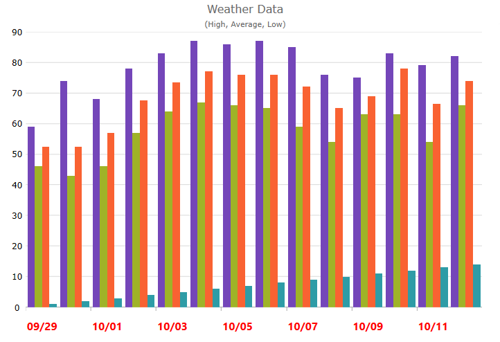

////
|metadata|
{
    "name": "categorychart-configuring-axis-labels",
    "controlName": ["{CategoryChartName}"],
    "tags": [],
    "buildFlags": []
}
|metadata|
////

= Configuring Axis Labels

The link:{CategoryChartLink}.{CategoryChartName}.html[{CategoryChartName}] control allows you full control over configuring, formatting and styling the labels displayed on your chart. By default, you do not need to explicitly set the labels. The Category Chart will use the first appropriate string property that it finds within the data you provided and will use that for the labels.

=== In this topic

This topic contains the following sections:

* <<ConfigureLabelSettings,Label Settings>> 
* <<ConfigureStyling,Styling>>
* <<RelatedContent,Related Content>>

[[ConfigureLabelSettings]]
=== Label Settings

In the {CategoryChartName} control, you can change the rotation angle, margin, horizontal/vertical alignment, opacity, padding and visibility, of the x-axis and y-axis labels using the following properties:

ifdef::wpf[]

[options="header", cols="a,a,a"]
|====
|Property Name|Property Type|Description

|link:{CategoryChartLink}.{CategoryChartXY}{ApiProp}xaxislabelangle.html[XAxisLabelAngle], link:{CategoryChartLink}.{CategoryChartXY}{ApiProp}yaxislabelangle.html[YAxisLabelAngle] 
|`double`
|Determines angle rotation of x-axis or y-axis labels

|link:{CategoryChartLink}.{CategoryChartXY}{ApiProp}XAxisLabelHorizontalAlignment.html[XAxisHorizontalAlignment],
link:{CategoryChartLink}.{CategoryChartXY}{ApiProp}YAxisLabelHorizontalAlignment.html[YAxisHorizontalAlignment]
|`HorizontalAlignment`
|Determines horizontal alignment of the x-axis or y-axis labels 

|link:{CategoryChartLink}.{CategoryChartXY}{ApiProp}XAxisLabelVerticalAlignment.html[XAxisVerticalAlignment],
link:{CategoryChartLink}.{CategoryChartXY}{ApiProp}YAxisLabelVerticalAlignment.html[YAxisVerticalAlignment]
|`VerticalAlignment`
|Determines vertical alignment of the x-axis or y-axis labels

|link:{CategoryChartLink}.{CategoryChartXY}{ApiProp}XAxisLabelVisibility.html[XAxisLabelVisibility],
link:{CategoryChartLink}.{CategoryChartXY}{ApiProp}YAxisLabelVisibility.html[YAxisLabelVisibility]
|`Visibility`
|Determines whether or not x-axis or y-axis labels are visible

|link:{CategoryChartLink}.{CategoryChartXY}{ApiProp}XAxisLabelMargin.html[XAxisLabelMargin], link:{CategoryChartLink}.{CategoryChartXY}{ApiProp}YAxisLabelMargin.html[YAxisLabelMargin]
|`Thickness`
|Determines the margin applied to each x-axis or y-axis labels

|link:{CategoryChartLink}.{CategoryChartXY}{ApiProp}XAxisLabelOpacity.html[XAxisLabelOpacity], link:{CategoryChartLink}.{CategoryChartXY}{ApiProp}YAxisLabelOpacity.html[YAxisLabelOpacity]
|`double`
|Determines the opacity of the  x-axis or y-axis labels 

|link:{CategoryChartLink}.{CategoryChartXY}{ApiProp}XAxisLabelPadding.html[XAxisLabelPadding], link:{CategoryChartLink}.{CategoryChartXY}{ApiProp}YAxisLabelPadding.html[YAxisLabelPadding]
|`Thickness`
|Determines the padding applied to the x-axis or y-axis labels

|====

endif::wpf[]

ifdef::xamarin[]

[options="header", cols="a,a,a"]
|====
|Property Name|Property Type|Description

|link:{CategoryChartLink}.{CategoryChartXY}{ApiProp}xaxislabelangle.html[XAxisLabelAngle], link:{CategoryChartLink}.{CategoryChartXY}{ApiProp}yaxislabelangle.html[YAxisLabelAngle] 
|`double`
|Determines angle rotation of x-axis or y-axis labels

|link:{CategoryChartLink}.{CategoryChartXY}{ApiProp}XAxisLabelHorizontalAlignment.html[XAxisHorizontalAlignment],
link:{CategoryChartLink}.{CategoryChartXY}{ApiProp}YAxisLabelHorizontalAlignment.html[YAxisHorizontalAlignment]
|`HorizontalAlignment`
|Determines horizontal alignment of the x-axis or y-axis labels 

|link:{CategoryChartLink}.{CategoryChartXY}{ApiProp}XAxisLabelVerticalAlignment.html[XAxisVerticalAlignment],
link:{CategoryChartLink}.{CategoryChartXY}{ApiProp}YAxisLabelVerticalAlignment.html[YAxisVerticalAlignment]
|`VerticalAlignment`
|Determines vertical alignment of the x-axis or y-axis labels

|link:{CategoryChartLink}.{CategoryChartXY}{ApiProp}XAxisLabelVisibility.html[XAxisLabelVisibility], link:{CategoryChartLink}.{CategoryChartXY}{ApiProp}YAxisLabelVisibility.html[YAxisLabelVisibility]
|`Visibility`
|Determines whether or not x-axis or y-axis labels are visible

|link:{CategoryChartLink}.{CategoryChartXY}{ApiProp}XAxisLabelBottomMargin.html[XAxisLabelBottomMargin],
link:{CategoryChartLink}.{CategoryChartXY}{ApiProp}XAxisLabelLeftMargin.html[XAxisLabelLeftMargin],
link:{CategoryChartLink}.{CategoryChartXY}{ApiProp}XAxisLabelRightMargin.html[XAxisLabelRightMargin],
link:{CategoryChartLink}.{CategoryChartXY}{ApiProp}XAxisLabelTopMargin.html[XAxisLabelTopMargin]

link:{CategoryChartLink}.{CategoryChartXY}{ApiProp}YAxisLabelBottomMargin.html[YAxisLabelBottomMargin],
link:{CategoryChartLink}.{CategoryChartXY}{ApiProp}YAxisLabelLeftMargin.html[YAxisLabelLeftMargin],
link:{CategoryChartLink}.{CategoryChartXY}{ApiProp}YAxisLabelRightMargin.html[YAxisLabelRightMargin],
link:{CategoryChartLink}.{CategoryChartXY}{ApiProp}YAxisLabelTopMargin.html[YAxisLabelTopMargin]
|`double`
|Determines the margin applied to each x-axis or y-axis labels

|====

endif::xamarin[]

[[ConfigureStyling]]
=== Styling
The look and feel of the category chart's x-axis and y-axis labels can be styled in many aspects, the main of which are applying different font styles such as font type, font size and font weight to the labels. This can be achieved through the following properties:

ifdef::wpf[]

[options="header", cols="a,a,a"]
|====
|Property Name|Property Type|Description

|link:{CategoryChartLink}.{CategoryChartXY}{ApiProp}XAxisLabelFontFamily.html[XAxisLabelFontFamily],
link:{CategoryChartLink}.{CategoryChartXY}{ApiProp}YAxisLabelFontFamily.html[XAxisLabelFontFamily] 
|`FontFamily`
|Determines the font family to be used for the x-axis or y-axis labels

|link:{CategoryChartLink}.{CategoryChartXY}{ApiProp}XAxisLabelFontSize.html[XAxisLabelFontSize],
link:{CategoryChartLink}.{CategoryChartXY}{ApiProp}YAxisLabelFontSize.html[YAxisLabelFontSize]
|`double`
|Determines the size of the font for the x-axis or y-axis labels 

|link:{CategoryChartLink}.{CategoryChartXY}{ApiProp}XAxisLabelFontStretch.html[XAxisLabelFontStretch],
link:{CategoryChartLink}.{CategoryChartXY}{ApiProp}YAxisLabelFontStretch.html[YAxisLabelFontStretch]
|`FontStretch`
|Determines the font stretch to applied to the x-axis or y-axis labels

|link:{CategoryChartLink}.{CategoryChartXY}{ApiProp}XAxisLabelFontStyle.html[XAxisLabelFontStyle],
link:{CategoryChartLink}.{CategoryChartXY}{ApiProp}YAxisLabelFontStyle.html[YAxisLabelFontStyle]
|`FontStyle`
|Determines the font style of the x-axis or y-axis labels

|link:{CategoryChartLink}.{CategoryChartXY}{ApiProp}XAxisLabelFontWeight.html[XAxisLabelFontWeight],
link:{CategoryChartLink}.{CategoryChartXY}{ApiProp}YAxisLabelFontWeight.html[YAxisLabelFontWeight]
|`FontWeight`
|Determines the font weight of the x-axis or y-axis labels

|link:{CategoryChartLink}.{CategoryChartXY}{ApiProp}XAxisLabelForeground.html[XAxisLabelForeground],
link:{CategoryChartLink}.{CategoryChartXY}{ApiProp}YAxisLabelForeground.html[YAxisLabelForeground]
|`Brush`
|Determines the text color of the x-axis or y-axis labels 

|====

endif::wpf[]

ifdef::xamarin[]

[options="header", cols="a,a,a"]
|====
|Property Name|Property Type|Description

|link:{CategoryChartLink}.{CategoryChartXY}{ApiProp}XAxisLabelFontFamily.html[XAxisLabelFontFamily],
link:{CategoryChartLink}.{CategoryChartXY}{ApiProp}YAxisLabelFontFamily.html[YAxisLabelFontFamily]
|`string`
|Determines the font family to be used for the x-axis or y-axis labels

|link:{CategoryChartLink}.{CategoryChartXY}{ApiProp}XAxisLabelFontSize.html[XAxisLabelFontSize],
link:{CategoryChartLink}.{CategoryChartXY}{ApiProp}YAxisLabelFontSize.html[YAxisLabelFontSize]
|`double`
|Determines the size of the font for the x-axis or y-axis labels 

|link:{CategoryChartLink}.{CategoryChartXY}{ApiProp}XAxisLabelFontAttributes.html[XAxisLabelFontAttributes],
link:{CategoryChartLink}.{CategoryChartXY}{ApiProp}YAxisLabelFontAttributes.html[YAxisLabelFontAttributes]
|`FontAttributes`
|Determines the font style of the x-axis or y-axis labels

|link:{CategoryChartLink}.{CategoryChartXY}{ApiProp}XAxisLabelTextColor.html[XAxisLabelTextColor],
link:{CategoryChartLink}.{CategoryChartXY}{ApiProp}YAxisLabelTextColor.html[YAxisLabelTextColor]
|link:{DataVizLinkBase}.Brush.html[Brush]
|Determines the text color of the x-axis or y-axis labels 

|====

endif::xamarin[]

=== Format

ifdef::xamarin[]

In the {CategoryChartName} control, axis labels always display simple text without any formatting applied to them. However, you can change the format of axis labels by handling the link:{CategoryChartLink}.{CategoryChartXY}{ApiProp}XAxisFormatLabel_ev.html[XAxisFormatLabel] and link:{CategoryChartLink}.{CategoryChartXY}{ApiProp}XAxisFormatLabel_ev.html[YAxisFormatLabel] events. For example, if you are plotting monetary data along y-axis, the default labels will simply display a decimal representation of your monetary values. If you want to display these values with currency symbols, you need to handle the link:{CategoryChartLink}.{CategoryChartXY}{ApiProp}YAxisFormatLabel_ev.html[YAxisFormatLabel] event and provide a currency formatted string for the label to use.

endif::xamarin[]

ifdef::wpf[]

In the {CategoryChartName} control, axis labels always display simple text without any formatting applied to them. However, you can change the format of axis labels by setting the formatting string for the link:{DataChartLink}.{CategoryChartXY}{ApiProp}XAxisLabel.html[XAxisLabel] property. For example, if you are plotting monetary data along y-axis, the default labels will simply display a decimal representation of your monetary values. If you want to display these values with currency symbols, you need to set the link:{DataChartLink}.{CategoryChartXY}{ApiProp}XAxisLabel.html[XAxisLabel] property such that it uses C format specifier followed by a number specifying decimal precision.

For detailed information on .NET Framework composite format strings please refer to the following online resources:

* link:http://msdn.microsoft.com/en-us/library/dwhawy9k.aspx[Standard Numeric Format Strings]
* link:http://msdn.microsoft.com/en-us/library/az4se3k1(v=VS.100).aspx[Standard Date and Time Format Strings]

.Note:
[NOTE]
====
Curly braces ('{' and '}') in XAML are special characters for markup extensions. If the first value of a string needs to be a curly brace, an empty set of curly braces must be used as an escape sequence. This allows the text following the empty set of curly braces to be taken as a literal value.
====
endif::wpf[]

=== Code Snippet
The following code example shows how to format and style labels on the x-axis using date formatting and other style properties:

ifdef::wpf,win-forms[]
ifdef::wpf[]
*In XAML:*
[source,xaml]
----
<ig:{CategoryChartName} x:Name="chart1"  
                     Title="Weather Data"
                     Subtitle="(High, Average, Low)"
                     XAxisLabelFontSize="16"
                     XAxisLabelMargin="14"
                     XAxisLabel="{}{Date:MM/dd}"
                     XAxisLabelForeground="Red"
                     XAxisLabelFontWeight="Bold">
</ig:{CategoryChartName}>
----

*In C#:*
[source,csharp]
----
chart1.XAxisLabel = "{Date:MM/dd}";
chart1.XAxisLabelFontSize = 16;
chart1.XAxisLabelLeftMargin = 14;
chart1.XAxisLabelTextColor = new SolidColorBrush(Color.Red);
chart1.XAxisLabelTextStyle = FontStyle.Bold;
----

*In Visual Basic:*
[source,vb]
----
chart1.XAxisLabel = "{Date:MM/dd}"
chart1.XAxisLabelFontSize = 16
chart1.XAxisLabelLeftMargin = 14
chart1.XAxisLabelTextColor = New SolidColorBrush(Color.Red)
chart1.XAxisLabelTextStyle = FontStyle.Bold
----
endif::wpf[]
ifdef::win-forms[]
*In C#:*
[source,csharp]
----
chart1.XAxisLabel = "{Date:MM/dd}";
chart1.XAxisLabelFontSize = 16;
chart1.XAxisLabelLeftMargin = 14;
chart1.XAxisLabelTextColor = new SolidColorBrush(Color.Red);
chart1.XAxisLabelTextStyle = FontStyle.Bold;
----

*In Visual Basic:*
[source,vb]
----
chart1.XAxisLabel = "{Date:MM/dd}"
chart1.XAxisLabelFontSize = 16
chart1.XAxisLabelLeftMargin = 14
chart1.XAxisLabelTextColor = New SolidColorBrush(Color.Red)
chart1.XAxisLabelTextStyle = FontStyle.Bold
----
endif::win-forms[]
ifdef::wpf[]
You can also set the XAxisLabel property using format strings to achieve the same result, as shown by the code snippet below:

*In XAML*
[source,xaml]
----
<ig:{CategoryChartName} x:Name="chart1"  
                     Title="Weather Data"
                     Subtitle="(High, Average, Low)"
                     XAxisLabel="{}{Date:MM/dd}"
                     XAxisLabelFontSize="16"
                     XAxisLabelTextColor="Red"
                     XAxisLabelFontAttributes="Bold">
</ig:{CategoryChartName}>

----
endif::wpf[]
endif::wpf,win-forms[]

ifdef::xamarin[]

*In XAML:*
[source,xaml]
----
<ig:{CategoryChartName} x:Name="chart1"  
                     Title="Weather Data"
                     Subtitle="(High, Average, Low)"
                     XAxisLabelFontSize="16"
                     XAxisLabelTextColor="Red"
                     XAxisLabelFontAttributes="Bold"
                     XAxisFormatLabel="chart1_XAxisFormatLabel">
</ig:{CategoryChartName}>
----

*In C#:*
[source,csharp]
----
chart1.XAxisLabelFontSize = 16;
chart1.XAxisLabelTextColor = new SolidColorBrush(Colors.Red);
chart1.XAxisLabelFontAttributes = FontAttributes.Bold;
chart1.XAxisFormatLabel += chart1_XAxisFormatLabel;

public void chart1_XAxisFormatLabel(object sender, AxisFormatLabelEventArgs e)
{
    var item = e.Item as WeatherData;
    e.Label = item.Date.ToString("MM/dd");
}
----

You can also set the XAxisLabel property using format strings to achieve the same result, as shown by the code snippet below:

*In XAML*
[source,xaml]
----
<ig:{CategoryChartName} x:Name="chart1"  
                     Title="Weather Data"
                     Subtitle="(High, Average, Low)"
                     XAxisLabel="{}{Date:MM/dd}"
                     XAxisLabelFontSize="16"
                     XAxisLabelTextColor="Red"
                     XAxisLabelFontAttributes="Bold">
</ig:{CategoryChartName}>

----

endif::xamarin[]

The following screenshot demonstrates the {CategoryChartName} control with the x-axis label formatted and styled.

[[RelatedContent]]
== Related Content

[options="header", cols="a,a"]
|====
|Topic|Purpose

|link:categorychart-binding-to-data.html[Binding to Data]
|This article explains how to bind data to the Category Chart control.

|link:categorychart-walkthrough.html[Walkthrough]
|This article will get you up and running with the Category Chart control.