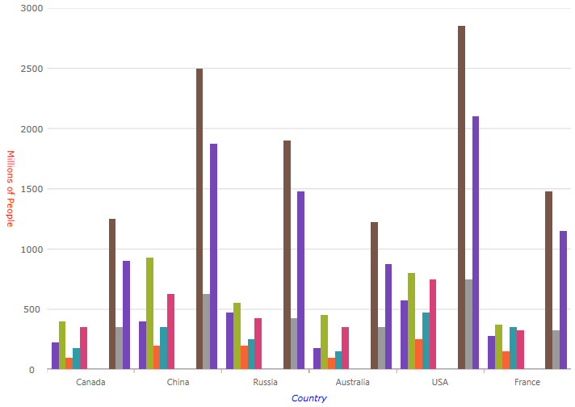

////
|metadata|
{
    "name": "categorychart-configuring-axis-titles",
    "controlName": ["{CategoryChartName}"],
    "tags": [],
    "buildFlags": []
}
|metadata|
////

= Axis Titles
The axis title feature of the {CategoryChartName} control allows you to add contextual information to the x and y axes of the chart.

=== In this topic

This topic contains the following sections:

* <<propertysettings,Property Settings>>
* <<codesnippet,Code Snippet>>
* <<RelatedContent,Related Content>>

[[propertysettings]]
== Property Settings
You can customize the look and feel of the category chart's x-axis and y-axis titles in many different ways such as applying different font styles, margins, and alignment. This can be achieved through the following properties:

ifdef::wpf[]

[options="header", cols="a,a,a"]
|====
|Property Name|Property Type|Description

|link:{CategoryChartLink}.{CategoryChartXY}{ApiProp}XAxisTitle.html[XAxisTitle], link:{CategoryChartLink}.{CategoryChartXY}{ApiProp}YAxisTitle.html[YAxisTitle] 
|`string`
|Determines the text to be used for the x-axis and y-axis title

|link:{CategoryChartLink}.{CategoryChartXY}{ApiProp}XAxisTitleAlignment.html[XAxisTitleAlignment], link:{CategoryChartLink}.{CategoryChartXY}{ApiProp}YAxisTitleAlignment.html[YAxisTitleAlignment] 
|`enumeration`
|Determines the horizontal alignment of the x-axis title and the vertical alignment of the y-axis title

|link:{CategoryChartLink}.{CategoryChartXY}{ApiProp}XAxisTitleAngle.html[XAxisTitleAngle], link:{CategoryChartLink}.{CategoryChartXY}{ApiProp}YAxisTitleAngle.html[YAxisTitleAngle] 
|`double`
|Determines the angle rotation for the x-axis and y-axis titles

|link:{CategoryChartLink}.{CategoryChartXY}{ApiProp}XAxisTitleMargin.html[XAxisTitleMargin], link:{CategoryChartLink}.{CategoryChartXY}{ApiProp}YAxisTitleMargin.html[YAxisTitleMargin] 
ifdef::xamarin[]
|`double`
endif::xamarin[]
ifdef::wpf[]
|`thickness`
endif::wpf[]
|Determines the margin to be applied to the x-axis or y-axis title

|link:{CategoryChartLink}.{CategoryChartXY}{ApiProp}XAxisTitleForeground.html[XAxisTitleForeground],  link:{CategoryChartLink}.{CategoryChartXY}{ApiProp}YAxisTitleForeground.html[YAxisTitleForeground] 
|`string`
|Determines the color for the x-axis or y-axis title

|link:{CategoryChartLink}.{CategoryChartXY}{ApiProp}XAxisTitleFontStyle.html[XAxisTitleFontStyle], link:{CategoryChartLink}.{CategoryChartXY}{ApiProp}YAxisTitleFontStyle.html[YAxisTitleFontStyle] 
|`FontStyle`
|Determines the font styles to be applied to the x-axis or y-axis title

|====

endif::wpf[]

ifdef::xamarin[]

[options="header", cols="a,a,a"]
|====
|Property Name|Property Type|Description

|link:{CategoryChartLink}.{CategoryChartXY}{ApiProp}XAxisTitle.html[XAxisTitle],
link:{CategoryChartLink}.{CategoryChartXY}{ApiProp}YAxisTitle.html[YAxisTitle] 
|`string`
|Determines the text to be used for the x-axis and y-axis title

|link:{CategoryChartLink}.{CategoryChartXY}{ApiProp}XAxisTitleAlignment.html[XAxisTitleAlignment],
link:{CategoryChartLink}.{CategoryChartXY}{ApiProp}YAxisTitleAlignment.html[YAxisTitleAlignment] 
|`enumeration`
|Determines the horizontal alignment of the x-axis title and the vertical alignment of the y-axis title

|link:{CategoryChartLink}.{CategoryChartXY}{ApiProp}XAxisTitleAngle.html[XAxisTitleAngle],
link:{CategoryChartLink}.{CategoryChartXY}{ApiProp}YAxisTitleAngle.html[YAxisTitleAngle] 
|`double`
|Determines the angle rotation for the x-axis and y-axis titles

|link:{CategoryChartLink}.{CategoryChartXY}{ApiProp}XAxisTitleMargin.html[XAxisTitleMargin],
link:{CategoryChartLink}.{CategoryChartXY}{ApiProp}YAxisTitleMargin.html[YAxisTitleMargin]
|`double`
|Determines the margin to be applied around the x-axis or y-axis title

|link:{CategoryChartLink}.{CategoryChartXY}{ApiProp}XAxisTitleTextColor.html[XAxisTitleTextColor],
link:{CategoryChartLink}.{CategoryChartXY}{ApiProp}YAxisTitleTextColor.html[YAxisTitleTextColor] 
|link:{DataVizLinkBase}.Brush.html[Brush]
|Determines the color for the x-axis or y-axis title

|link:{CategoryChartLink}.{CategoryChartXY}{ApiProp}XAxisTitleFontAttributes.html[XAxisTitleFontAttributes],
link:{CategoryChartLink}.{CategoryChartXY}{ApiProp}YAxisTitleFontAttributes.html[YAxisTitleFontAttributes] 
|`FontAttributes`
|Determines the font styles to be applied to the x-axis or y-axis title

|link:{CategoryChartLink}.{CategoryChartXY}{ApiProp}XAxisTitleFontFamily.html[XAxisTitleFontFamily],
link:{CategoryChartLink}.{CategoryChartXY}{ApiProp}YAxisTitleFontFamily.html[YAxisTitleFontFamily] 
|`string`
|Determines the font family for the x-axis or y-axis title

|link:{CategoryChartLink}.{CategoryChartXY}{ApiProp}XAxisTitleFontSize.html[XAxisTitleFontSize],
link:{CategoryChartLink}.{CategoryChartXY}{ApiProp}YAxisTitleFontSize.html[YAxisTitleFontSize] 
|`double`
|Determines the font size for the x-axis or y-axis title

|====

endif::xamarin[]

[[codesnippet]]
== Code Snippet
The following code example shows how to customize the titles on the x-axis and y-axis:
ifdef::wpf[]
*In XAML:*
[source,xaml]
----
<ig:{CategoryChartName} x:Name="chart1"
                     XAxisTitleFontSize="16"
                     XAxisTitleMargin="14"
                     XAxisTitle="Country"
                     XAxisTitleForeground="Blue"
                     XAxisTitleFontStyle="Italic"
                     YAxisTitleFontSize="12"
                     YAxisTitle="Millions of People"
                     YAxisTitleAngle="90"
                     YAxisTitleForeground="Red">
</ig:{CategoryChartName}>
----

endif::wpf[]

ifdef::win-forms[]
*In C#:*
[source,csharp]
----
this.ultraCategoryChart1.Name="chart1";
this.ultraCategoryChart1.XAxisTitleFontSize=16;
this.ultraCategoryChart1.XAxisTitleMargin=14;
this.ultraCategoryChart1.XAxisTitle="Country";
this.ultraCategoryChart1.XAxisTitleTextColor=System.Drawing.Color.FromArgb(29, 10, 173, 0);
this.ultraCategoryChart1.XAxisTitleTextStyle = FontStyle.Italic;
this.ultraCategoryChart1.YAxisTitleFontSize=12;
this.ultraCategoryChart1.YAxisTitle="Millions of People";
this.ultraCategoryChart1.YAxisTitleAngle=90;
this.ultraCategoryChart1.YAxisTitleTextColor=System.Drawing.Color.FromArgb(173, 37, 10, 0);
----

*In Visual Basic:*
[source,csharp]
----
Me.ultraCategoryChart1.Name="chart1"
Me.ultraCategoryChart1.XAxisTitleFontSize=16
Me.ultraCategoryChart1.XAxisTitleMargin=14
Me.ultraCategoryChart1.XAxisTitle="Country"
Me.ultraCategoryChart1.XAxisTitleTextColor=System.Drawing.Color.FromArgb(29, 10, 173, 0)
Me.ultraCategoryChart1.XAxisTitleTextStyle = FontStyle.Italic
Me.ultraCategoryChart1.YAxisTitleFontSize=12
Me.ultraCategoryChart1.YAxisTitle="Millions of People"
Me.ultraCategoryChart1.YAxisTitleAngle=90
Me.ultraCategoryChart1.YAxisTitleTextColor=System.Drawing.Color.FromArgb(173, 37, 10, 0)
----
endif::win-forms[]

ifdef::xamarin[]

[[codesnippet]]
== Code Snippet
The following code example shows how to customize the titles on the x-axis and y-axis:

*In XAML:*

----
<ig:{CategoryChartName} x:Name="chart1"
                     XAxisTitleFontSize="16"
                     XAxisTitleMargin="14"
                     XAxisTitle="Country"
                     XAxisTitleTextColor="Blue"
                     XAxisTitleFontAttributes="Italic"
                     YAxisTitleFontSize="12"
                     YAxisTitle="Millions of People"
                     YAxisTitleAngle="90"
                     YAxisTitleTextColor="Red">
</ig:{CategoryChartName}>
----

endif::xamarin[]

[[RelatedContent]]
== Related Content:

[options="header", cols="a,a"]
|====
|Topic|Purpose

|link:categorychart-binding-to-data.html[Binding to Data]
|This article explains how to bind data to the Category Chart control.

|link:categorychart-walkthrough.html[Walkthrough]
|This article will get you up and running with the Category Chart control.

|====