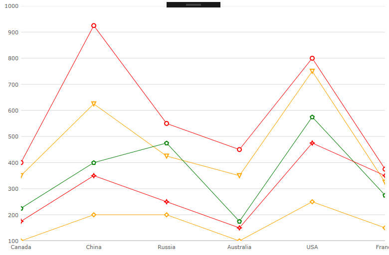

////
|metadata|
{
    "name": "categorychart-configuring-chart-markers",
    "controlName": ["{CategoryChartName}"],
    "tags": [],
    "buildFlags": []
}
|metadata|
////

= Configuring Chart Markers

Markers are visual elements that are displayed at the values of data points in the link:{CategoryChartLink}.{CategoryChartName}.html[{CategoryChartName}] control's plot area. Markers help your end-users immediately identify a data point's value even if the value falls between major or minor grid lines.
This section provides you with useful information about working with the {CategoryChartName} control's Markers.

=== In this topic

This topic contains the following sections:

* <<markerappearance,Marker Appearance>> 
* <<markertypes,Marker Types>>
* <<markerbrushesandoutlines,Marker Brushes and Outlines>>
* <<RelatedContent,Related Content>>

The appearance of chart markers is managed through the marker properties of the {CategoryChartName} class.

[[markerappearance]]
== Marker Appearance

The following table lists all marker appearance properties.

[options="header", cols="a,a,a"]
|====
|Property Name|Property Type|Description

|pick:[wpf,xamarin="link:{CategoryChartLink}.{CategoryChartDomain}{ApiProp}MarkerTypes.html[MarkerTypes]"]pick:[win-forms="link:{CategoryChartLink}.{CategoryChartName}{ApiProp}MarkerTypes.html[MarkerTypes]"] 
|link:{CategoryChartLink}.MarkerTypeCollection.html[MarkerTypeCollection]
|Determines the type of markers to be displayed by all series in the chart

|pick:[wpf,xamarin="link:{CategoryChartLink}.{CategoryChartDomain}{ApiProp}MarkerBrushes.html[MarkerBrushes]"]pick:[win-forms="link:{CategoryChartLink}.{CategoryChartName}{ApiProp}MarkerBrushes.html[MarkerBrushes]"]
|link:{DataVizLinkBase}.BrushCollection.html[BrushCollection]
|Determines fill color of markers

|pick:[wpf,xamarin="link:{CategoryChartLink}.{CategoryChartDomain}{ApiProp}MarkerOutlines.html[MarkerOutlines]"]pick:[win-forms="link:{CategoryChartLink}.{CategoryChartName}{ApiProp}MarkerOutlines.html[MarkerOutlines]"]
|link:{DataVizLinkBase}.BrushCollection.html[BrushCollection]
|Determines outline color of markers
|====

[[markertypes]]
== Marker Types

[options="header", cols="a,a,a"]
|====
|Name|Type|Description

|`CircleMarker`
|link:{CategoryChartLink}.MarkerType.html[MarkerType]
|Displays the Circle marker type.

|`DiamondMarker`
|link:{CategoryChartLink}.MarkerType.html[MarkerType]
|Displays the Diamond marker type.

|`HexagonMarker`
|link:{CategoryChartLink}.MarkerType.html[MarkerType]
|Displays the Hexagon marker type.

|`HexagramMarker`
|link:{CategoryChartLink}.MarkerType.html[MarkerType]
|Displays the Hexagram marker type.

|`PentagramMarker`
|link:{CategoryChartLink}.MarkerType.html[MarkerType]
|Displays the Pentagram marker type.

|`PentagonMarker`
|link:{CategoryChartLink}.MarkerType.html[MarkerType]
|Displays the Pentagon marker type.

|`PyramidMarker`
|link:{CategoryChartLink}.MarkerType.html[MarkerType]
|Displays the Pyramid marker type.

|`SquareMarker`
|link:{CategoryChartLink}.MarkerType.html[MarkerType]
|Displays the Square marker type.

|`TetragramMarker`
|link:{CategoryChartLink}.MarkerType.html[MarkerType]
|Displays the Tetragram marker type.

|`TriangleMarker`
|link:{CategoryChartLink}.MarkerType.html[MarkerType]
|Displays the Triangle marker type.

|====

The code snippet below demonstrates how to change the marker type for the {CategoryChartName}.
ifdef::sl,wpf,win-phone,win-universal,xamarin[]
*In XAML:*
[source,xaml]
----
<ig:XamCategoryChart ItemsSource="{Binding}" ChartType="Line" MarkerTypes=”Circle Diamond Square” />
----
endif::sl,wpf,win-phone,win-universal,xamarin[]

ifdef::win-forms[]
*In C#:*
[source,csharp]
----
this.ultraCategoryChart1.MarkerTypes.Add(MarkerType.Circle);
this.ultraCategoryChart1.MarkerTypes.Add(MarkerType.Diamond);
this.ultraCategoryChart1.MarkerTypes.Add(MarkerType.Square);
----

*In Visual Basic:*
[source,vb]
----
Me.ultraCategoryChart1.MarkerTypes.Add(MarkerType.Circle)
Me.ultraCategoryChart1.MarkerTypes.Add(MarkerType.Diamond)
Me.ultraCategoryChart1.MarkerTypes.Add(MarkerType.Square)
----
endif::win-forms[] 

The following screenshot displays the {CategoryChartName} control using the Line chart type with Diamond markers.

image::images/categorychart_configuring_chart_markers_01.png[]

[[markerbrushesandoutlines]]
== Marker Brush and Outline

The code snippets below demonstrate how to change the MarkerBrushes and MarkerOutlines for the {CategoryChartName}.
ifdef::sl,wpf,win-phone,win-universal,xamarin[]
*In XAML:*
[source,xaml]
----
<ig:XamCategoryChart 
      MarkerBrushes=”White” 
      MarkerOutlines=”Red Orange Green”
      Brushes=”Red Orange Green”
      ChartType="Line">
</ig:XamCategoryChart>

----
endif::sl,wpf,win-phone,win-universal,xamarin[] 

ifdef::win-forms[]
*In C#:*
[source,csharp]
----
this.ultraCategoryChart1.MarkerBrushes.Add(System.Drawing.Color.FromArgb(255, 255, 255, 0));

this.ultraCategoryChart1.MarkerOutlines.Add(System.Drawing.Color.FromArgb(173, 10, 34, 0));
this.ultraCategoryChart1.MarkerOutlines.Add(System.Drawing.Color.FromArgb(173, 119, 10, 0));
this.ultraCategoryChart1.MarkerOutlines.Add(System.Drawing.Color.FromArgb(34, 173, 10, 0));

this.ultraCategoryChart1.Brushes.Add(System.Drawing.Color.FromArgb(173, 10, 34, 0));
this.ultraCategoryChart1.Brushes.Add(System.Drawing.Color.FromArgb(173, 119, 10, 0));
this.ultraCategoryChart1.Brushes.Add(System.Drawing.Color.FromArgb(34, 173, 10, 0));
----

*In Visual Basic:*
[source,vb]
----
Me.ultraCategoryChart1.MarkerBrushes.Add(System.Drawing.Color.FromArgb(255, 255, 255, 0))

Me.ultraCategoryChart1.MarkerOutlines.Add(System.Drawing.Color.FromArgb(173, 10, 34, 0))
Me.ultraCategoryChart1.MarkerOutlines.Add(System.Drawing.Color.FromArgb(173, 119, 10, 0))
Me.ultraCategoryChart1.MarkerOutlines.Add(System.Drawing.Color.FromArgb(34, 173, 10, 0))

Me.ultraCategoryChart1.Brushes.Add(System.Drawing.Color.FromArgb(173, 10, 34, 0))
Me.ultraCategoryChart1.Brushes.Add(System.Drawing.Color.FromArgb(173, 119, 10, 0))
Me.ultraCategoryChart1.Brushes.Add(System.Drawing.Color.FromArgb(34, 173, 10, 0))
----
endif::win-forms[] 

The following screenshot displays the {CategoryChartName} control using the Line chart type with customized markers.

[[RelatedContent]]
== Related Content

[options="header", cols="a,a"]
|====
|Topic|Purpose

| link:categorychart-binding-to-data.html[Data Binding]
|This topic describes in detail how to bind the control to data.

| link:categorychart-overview.html[Overview]
|This topic provides a conceptual overview of the Category Chart control.

|====