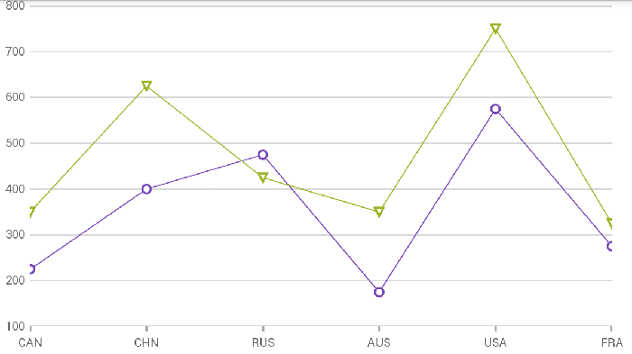

= {CategoryChartName} Property Inclusion and Exclusion

This topic explains, with code examples, how to configure which properties are displayed in the link:{CategoryChartLink}.{CategoryChartName}.html[{CategoryChartName}] control.

=== Purpose

By default, the {CategoryChartName} will plot all properties that exist on the underlying data items in the bound ItemsSource collection. This topic will inform you on how to pick which properties are plotted in the chart.

=== Required Background

The following topics are prerequisites to understanding this topic:
|====
|Topic|Purpose

| link:categorychart-overview.html[ {CategoryChartName} Overview]

| This topic provides conceptual information about the {CategoryChartName} control including its main features, minimum requirements, and user functionality.

| link:categorychart-binding-to-data.html[Binding to Data]

| This topic explains how to bind data to the {CategoryChartName} control.

|====

=== In this topic

This topic contains the following sections:

* <<propertysettings, Property Settings>>
* <<codesnippet, Code Snippet>>
* <<relatedcontent, Related Content>>

[[propertysettings]]
== Property Settings

You can include and exclude properties from the {CategoryChartName} by setting the following properties:

|===
|Property Name|Property Type|Description

|link:{CategoryChartLink}.{CategoryChartDomain}{ApiProp}includedproperties.html[IncludedProperties]
|`string[]`
|Gets or sets a set of property paths that should be included for consideration by the chart, leaving the remainder excluded. If null, all properties will be considered.

|link:{CategoryChartLink}.{CategoryChartDomain}{ApiProp}excludedproperties.html[ExcludedProperties]
|`string[]`
|Gets or sets a set of property paths that should be excluded from consideration by the chart. The complex expressions can be used, for example to exclude a property in a sub-collection ,use wildcards such *.<propertyName> to exclude [0].<propertyName> , [1].<propertyName> and so on.

|===

[[codesnippet]]
== Code Snippet

The following code example uses the link:resources-sample-energy-data.html[Energy Data Source] sample code as its pick:[win-forms="DataSource"]pick:[sl,wpf,win-phone,win-universal,xamarin="ItemsSource"] and shows how to achieve the following chart both by including and excluding properties.

ifdef::xamarin[]
*In XAML*
[source, xaml]
----
xmlns:ig="clr-namespace:{CategoryChartNamespace};assembly={ApiPlatform}Charts"
----
endif::xamarin[]

ifdef::wpf[]
*In XAML*
[source, xaml]
----
xmlns:ig="http://schemas.infragistics.com/xaml"
----
endif::wpf[]
ifdef::sl,wpf,win-phone,win-universal,xamarin[]

*In XAML*
[source, xaml]
----
<ig:{CategoryChartName} x:Name="chart1" ItemsSource="{Binding}" IncludedProperties="Country,Hydro,Nuclear"/>
----

*In XAML*
[source, xaml]
----
<ig:{CategoryChartName} x:Name="chart1" ItemsSource="{Binding}" ExcludedProperties="Coal,Oil,Gas"/>
----
endif::sl,wpf,win-phone,win-universal,xamarin[] 
*In C#*
[source, csharp]
----
string[] inclusion = { "Country", "Hydro", "Nuclear" };
chart1.IncludedProperties = inclusion;
----

*In C#*
[source, csharp]
----
string[] exclusion = { "Coal", "Oil", "Gas" };
chart1.ExcludedProperties = exclusion;
----

ifdef::wpf,win-forms[]
*In Visual Basic*
[source, vb]
----
Dim inclusion As String() = {"Country", "Hydro", "Nuclear"}
chart1.IncludedProperties = inclusion
----

*In Visual Basic*
[source, vb]
----
Dim inclusion As String() = {"Coal", "Oil", "Gas"}
chart1.ExcludedProperties = exclusion
----

endif::wpf,win-forms[]

[[relatedcontent]]
== Related Content

|====
|Topic|Purpose

| link:categorychart-walkthrough.html[Adding Category Chart]

| This article will get you up and running with the {CategoryChartName} control.

|====