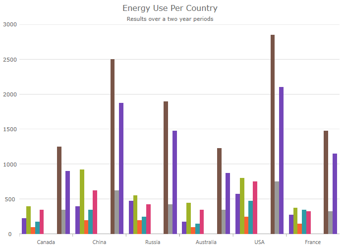

////
|metadata|
{
    "name": "categorychart-overview",
    "controlName": ["{CategoryChartName}"],
    "tags": [],
    "buildFlags": []
}
|metadata|
////

= {CategoryChartName}

The link:{CategoryChartLink}.{CategoryChartName}.html[{CategoryChartName}] is a lightweight, highly performant chart. This chart can be easily configured to display category data using an extremely simple and intuitive API. All you need to do is bind your data (a collection or a collection of collections) and the chart takes care of everything else.

The following screenshot demonstrates a column series displayed within the Category Chart.

By using a smart Data Adapter, the data is analyzed and the appropriate visualization is rendered. For example, if the link:{DataChartLink}.{CategoryChartName}{ApiProp}charttype.html[ChartType] is set to "Auto", the control can determine that if it is provided a small data set, then a column chart should be plotted, while a larger data set will draw a line chart. For more information, refer to the link:categorychart-chart-types.html[Chart Types] topic.

You can also explicitly specify the chart type by setting the link:{DataChartLink}.{CategoryChartName}{ApiProp}charttype.html[ChartType] to:
    
    * Line
    * Area
    * Column
    * Point
    * Spline
    * SplineArea
    * StepArea
    * StepLine
    * Waterfall

Another example of the intuitive behavior of the Category Chart control is that you do not need to explicitly set the labels. The Category Chart will use the first appropriate string property that it finds within the data you provided and will use that for the labels.

Built to be easily configurable, it uses the Data Chart control as its engine, which means that it benefits from the high performing and powerful Data Chart. You can also utilize the features of the data chart control if desired.

== Related Content

[options="header", cols="a,a"]
|====
|Topic|Purpose

|link:categorychart-binding-to-data.html[Binding to Data]
|This article explains how to bind data to the Category Chart control.

|link:categorychart-walkthrough.html[Getting Started]
|This article will get you up and running with the Category Chart control.

|====