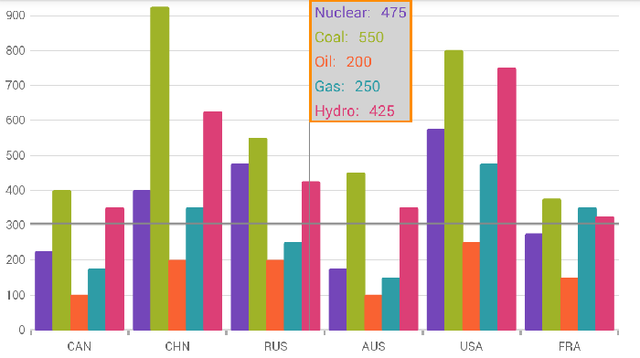

= {CategoryChartName} Tooltips

This topic explains, with code examples, how to configure the tooltips in the link:{CategoryChartLink}.{CategoryChartName}.html[{CategoryChartName}] control.

== Introduction

In the {CategoryChartName}, tooltips are displayed when the tap and hold gesture is performed within the chart's plot area. Also, tapping and holding and then moving the finger over other parts of the plot area without releasing will update tooltip values.

=== Required Background

The following topics are prerequisites to understanding this topic:

|====
|Topic|Purpose

| link:categorychart-overview.html[ {CategoryChartName} Overview]

| This topic provides conceptual information about the {CategoryChartName} control including its main features, minimum requirements, and user functionality.

| link:categorychart-binding-to-data.html[Binding to Data]

| This topic explains how to bind data to the {CategoryChartName} control.

|====

=== In this Topic

This topic contains the following sections:

* <<tooltipoverview, Tooltips Overview>>
* <<propertysettings, Property Settings>>
* <<codesnippet, Code Snippet>>
* <<relatedcontent, Related Content>>

[[tooltipoverview]]
== Tooltips Overview

The tooltip content is provided through the link:{CategoryChartLink}.{CategoryChartName}{ApiProp}tooltiptemplate.html[ToolTipTemplate] property of the {CategoryChartName} object. In {PlatformName} this is done using a link:https://developer.xamarin.com/guides/xamarin-forms/application-fundamentals/templates/data-templates/creating/[DataTemplate], which contains the visual elements that make up the tooltip.

The tooltip in the {CategoryChartName} will represent each of the series plotted in the chart. As such, unless you are using a hierarchical structure where your value property names are the same, a link:https://developer.xamarin.com/guides/xamarin-forms/application-fundamentals/templates/data-templates/selector/[DataTemplateSelector] may be a wise choice to use with the ToolTipTemplate property.

The elements placed in the DataTemplate used for the ToolTipTemplate will have a binding context of a link:{DataVizLink}.DataContext.html[DataContext] object. This object can access the underlying data item for that particular tooltip via its Item property and the Series that it is representing via its Series property. The usage of this DataContext class and the DataTemplateSelector are shown in the code snippet below.

[[propertysettings]]
== Property Settings

You can further customize the look and feel of the {CategoryChartName} control's tooltips by setting the following properties in addition to the ToolTipTemplate property:

|====
|Property Name|Property Type|Description

|link:{CategoryChartLink}.{CategoryChartName}{ApiProp}tooltipbackgroundcolor.html[ToolTipBackgroundColor]
|link:{DataVizLinkBase}.Brush.html[Brush]
|Gets or sets background color for the tooltip.

|link:{CategoryChartLink}.{CategoryChartName}{ApiProp}tooltipbordercolor.html[ToolTipBorderColor]
|link:{DataVizLinkBase}.Brush.html[Brush]
|Gets or sets border color for the tooltip.

|link:{CategoryChartLink}.{CategoryChartName}{ApiProp}tooltipborderthickness.html[ToolTipBorderThickness]
|`double`
|Gets or sets border thickness for the tooltip.

|====

[[codesnippet]]
== Code Snippet

The following code example shows how to customize the tooltips in the {CategoryChartName} control using the properties above, along with a DataTemplateSelector:

ifdef::xamarin[]

*In XAML*
[source, xaml]
----

xmlns:ig="clr-namespace:{CategoryChartNamespace};assembly={ApiPlatform}Charts"
xmlns:local="clr-namespace:MyAppNamespace"

----

*In XAML*
[source,xaml]
----

<ig:{CategoryChartName} ItemsSource="{Binding}"
                     ChartType="Column"
                     ToolTipBackgroundColor="LightGray"
                     ToolTipBorderColor="DarkOrange"
                     ToolTipBorderThickness="2">
    <ig:{CategoryChartName}.ToolTipTemplate>
        <local:TooltipSelector/>
    </ig:{CategoryChartName}.ToolTipTemplate>
</ig:{CategoryChartName}>

----

*In C#*
[source, csharp]
----

namespace MyAppNamespace
{
    public class TooltipSelector : DataTemplateSelector
    {
        protected override DataTemplate OnSelectTemplate(object item, BindableObject container)
        {
            if (container is ColumnSeries)
            {
                ColumnSeries series = container as ColumnSeries;
                DataTemplate template = CreateDataTemplate(series);
                return template;
            }
            else
            {
                return null;
            }
        }

        private DataTemplate CreateDataTemplate(ColumnSeries series)
        {
            DataTemplate template = new DataTemplate(() =>
            {
                StackLayout layout = new StackLayout() { Orientation = StackOrientation.Horizontal, Margin = new Thickness(5, 2) };
                
                Label titleLabel = new Label() { TextColor = ((SolidColorBrush)series.ActualBrush).Color };
                titleLabel.Text = series.ValueMemberPath + ": ";

                Label valueLabel = new Label() { TextColor = ((SolidColorBrush)series.ActualBrush).Color };
                valueLabel.SetBinding(Label.TextProperty, new Binding("Item." + series.ValueMemberPath));

                layout.Children.Add(titleLabel);
                layout.Children.Add(valueLabel);

                return layout;
            });
            
            return template;
        }
    }
}

----

endif::xamarin[]

[[relatedcontent]]
== Related Content

|====
|Topic|Purpose

| link:categorychart-walkthrough.html[Adding Category Chart]

| This article will get you up and running with the {CategoryChartName} control.

|====