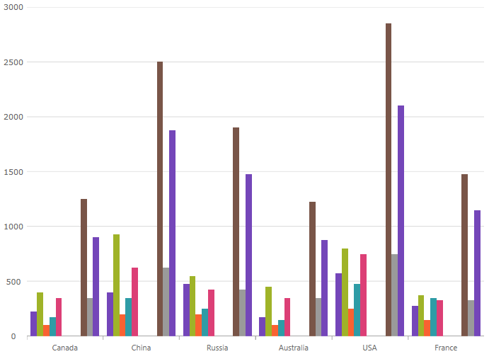

////
|metadata|
{
    "name": "categorychart-walkthrough",
    "controlName": ["{CategoryChartName}"],
    "tags": [],
    "buildFlags": []
}
|metadata|
////

= Getting Started with {CategoryChartName}

=== Purpose

This topic explains using a code example how to add the link:{CategoryChartLink}.{CategoryChartName}.html[{CategoryChartName}] control to {PlatformName} applications.

=== In this topic

This topic contains the following sections:

* <<Adding,Adding {CategoryChartName} to the {PlatformName} application>>

** <<Introduction,Introduction>>
** <<Preview,Preview>>
** <<Prerequisites,Requirements>>
** <<Overview,Overview>>
** <<Steps,Steps>>

* <<RelatedContent,Related Content>>

[[Adding]]
== Adding {CategoryChartName} to the {PlatformName} application

[[Introduction]]

=== Introduction

The following procedure demonstrates adding the {CategoryChartName} to {PlatformName} applications.

[[Preview]]

=== Preview

The following is a screenshot of the  {CategoryChartName}

[[Prerequisites]]
== Requirements

Following are the general requirements for adding the {CategoryChartName} control.

ifdef::android[]
Add the following Infragistics jars to your main project:

** Infragistics.Chart.jar
** Infragistics.Core.jar
** Infragistics.UI.jar
** DV.Shared.jar
endif::android[]

ifdef::wpf[]

Add the following NuGet package reference to your main project:

** Infragistics.WPF.Charts

For more information on setting up the NuGet feed and adding NuGet packages, you can take a look at the following documentation: link:nuget-feeds.html[NuGet Feeds].

endif::wpf[]

ifdef::win-forms[]
Add the following Infragistics assemblies to your main project:

** {ApiPlatform}{CategoryChartAssembly}.{DllVersion}dll 
** {ApiPlatform}{DataVizAssembly}.{DllVersion}dll 
** {ApiPlatform}Win.Portable.Core.{DllVersion}dll 
endif::win-forms[]

ifdef::xamarin[]
1. Add assembly references by following instructions in the link:xamarin-project-with-infragistics-controls.html#NuGetPackages[Add References Through NuGet Packages] topic.

2. You can add the {CategoryChartName} by using either of the following:
* The link:getting-started-with-toolbox.html[Infragistics Toolbox].
* The code-snippets below.

endif::xamarin[]

ifdef::xamarin[]
*In XAML:*
[source,xaml]
----
xmlns:ig="clr-namespace:{CategoryChartNamespace};assembly={ApiPlatform}Charts"
---- 
endif::xamarin[]

ifdef::wpf[]
*In XAML:*
[source,xaml]
----
xmlns:ig="http://schemas.infragistics.com/xaml"
----  
endif::wpf[]
 
ifdef::wpf,win-forms,xamarin[] 
*In C#:* 
[source,csharp]
----
using {CategoryChartNamespace};  
----  
endif::wpf,win-forms,xamarin[]
 
ifdef::wpf,win-forms[] 
*In VB:* 
[source,vb]
----
Imports {CategoryChartNamespace}
---- 
endif::wpf,win-forms[]
 
ifdef::android[] 
*In Java:* 
[source,js]
----
import {CategoryChartNamespace}.{CategoryChartName};
---- 
endif::android[] 
  
[[Overview]]

=== Overview

Following is a conceptual overview of the process:

*1. Adding the {CategoryChartName} control to {PlatformName} applications*

*2. Verifying the results*

[[Steps]]

=== Steps

The following procedure takes you through the steps necessary for adding the  {CategoryChartName} control to a page.

=== 1. Add the {CategoryChartName} control to the page.

The following code demonstrates adding the {CategoryChartName} control with the minimum code and property settings required for display. The below code sample uses the link:resources-sample-energy-data.html[Sample Energy Data] resource.

ifdef::xaml[]

*In XAML:*

[source,xaml]
----
<Grid x:Name=”LayoutRoot”>
 <ig:{CategoryChartName} ItemsSource="{Binding DataCollection}" />
</Grid>
----

endif::xaml[]

ifdef::wpf[]
*In Visual Basic:*
[source,vb]
----
Dim categoryChart As New {CategoryChartName}()
categoryChart.ItemsSource = data
Me.LayoutRoot.Children.Add(categoryChart)  
----

*In C#:*
[source,csharp]
----
var categoryChart = new {CategoryChartName}();
categoryChart.ItemsSource = data;
this.LayoutRoot.Children.Add(categoryChart);  
----
endif::wpf[]

ifdef::win-forms[]
*In Visual Basic:*
[source,vb]
----
Dim categoryChart As New {CategoryChartName}()
categoryChart.DataSource = data
Me.Controls.Add(categoryChart)  
----

*In C#:*
[source,csharp]
----
var categoryChart = new {CategoryChartName}();
categoryChart.DataSource = data;
this.Controls.Add(categoryChart);  
----
endif::win-forms[]
ifdef::android[]

*In Java:*

[source,js]
----
View rootView = inflater.inflate(R.layout.fragment_main, container, false);
CategoryChartView categoryChart = new CategoryChartView(rootView.getContext());
return (categoryChart);
----

endif::android[]

=== 2. Verify the results.

Build and run your project to verify the result. If you have implemented the steps correctly, the displayed {CategoryChartName} should look like the one in the Preview section above.

[[_Ref348111483]]

[[RelatedContent]]

== Related Content

=== Topics

The following topics provide additional information related to this topic:

[options="header", cols="a,a"]
|====
|Topic|Purpose

| link:categorychart-binding-to-data.html[Data Binding]
|This topic describes in detail how to bind the control to data.

| link:categorychart-overview.html[Overview]
|This topic provides a conceptual overview of the Category Chart control.

|====