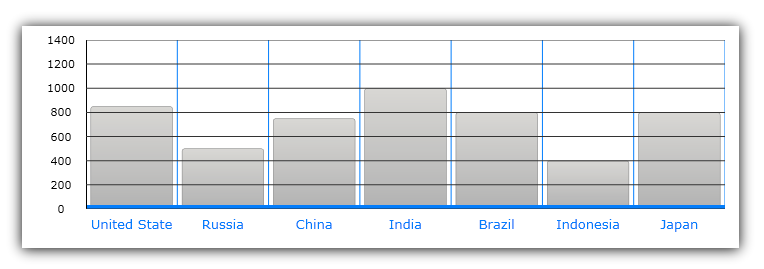
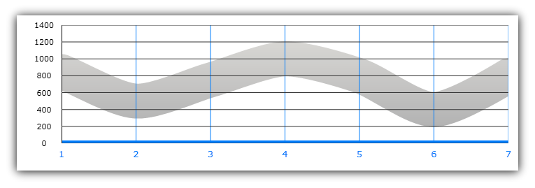
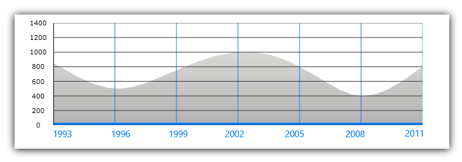

////
|metadata|
{
    "name": "datachart-axes",
    "controlName": ["{DataChartName}"],
    "tags": ["Charting"],
    "guid": "e0c1a537-ee33-4389-a939-eab0cea8fade",
    "buildFlags": [],
    "createdOn": "2014-06-05T19:39:00.5863526Z"
}
|metadata|
////

= Chart Axes

=== Purpose

This topic provides conceptual information about link:{DataChartLink}.axis.html[Axis] objects used in the link:{DataChartLink}.{DataChartName}.html[{DataChartName}]™ control.

=== Required Background

The following topics are prerequisites to understanding this topic:

[options="header", cols="a,a"]
|====
|Topic|Purpose

| link:datachart-datachart.html[{DataChartName}]
|This topic provides a general overview of the _{DataChartName}_ control

| link:datachart-getting-started-with-datachart.html[Getting Started with Data Chart]
|This topic provides information on how to get started with the _{DataChartName}_ control.

| link:datachart-series-requirements.html[Series Requirements]
|This topic provides information on requirements of Series objects in the _{DataChartName}_ control.

|====

=== In this topic

This topic contains the following sections:

* <<Overview,Overview>>

** <<Introduction,Introduction>>
** <<AxisProperties,Axis Properties>>
** <<AxisTypes,Axis Types>>

* <<CartesianAxes,Cartesian Axes>>
* <<PolarAxes,Polar Axes>>
* <<RelatedContent,Related Content>>

[[Overview]]
== _Overview_

[[Introduction]]

=== Introduction

In the {DataChartName} control, an link:{DataChartLink}.axis.html[Axis] provides base properties for specifying appearance of axis main lines, gridlines, tickmarks, titles, stripes, and axis labels. There are several types of axes which are used by different types of link:datachart-series.html[Chart Series] supported in the chart control. The type of series determines what axes can be used with them. For more information on what axis types are required by a specific series, refer to the link:datachart-series-requirements.html[Series Requirements] topic

[[AxisProperties]]

=== Axis Properties

All types of axis object in the chart control have set of common properties and the following table list these properties:

[options="header", cols="a,a,a"]
|====
|Property Name|Property Type|Description

| link:{DataChartLink}.axis{ApiProp}crossingaxis.html[CrossingAxis]
| link:{DataChartLink}.axis.html[Axis]
|Determines which axis will cross the current axis (see also link:datachart-axis-crossing.html[Configuring Axis Crossing])

| link:{DataChartLink}.axis{ApiProp}crossingvalue.html[CrossingValue]
|double
|Determines crossing location with another axis (see also link:datachart-axis-crossing.html[Configuring Axis Crossing])

| link:{DataChartLink}.axis{ApiProp}isinverted.html[IsInverted]
|bool
|Determines whether or not orientation of axis is inverted (see also link:datachart-axis-orientation.html[Configuring Axis Orientation])

| link:{DataChartLink}.axis{ApiProp}label.html[Label]
|string
|Determines data mapping (category axis) and formatting (all axis) of labels

ifdef::wpf,win-universal[]
| link:{DataChartLink}.axis{ApiProp}labelsettings.html[LabelSettings]
| link:{DataChartLink}.axislabelsettings.html[AxisLabelSettings]
|Determines labels’ settings such foreground, font, alignment, margins, angle and many more. See also link:datachart-axis-label-settings.html[Configuring Axis Label Settings]
endif::wpf,win-universal[]

|
ifdef::win-forms,xamarin,android[] 
link:{DataChartLink}.axis{ApiProp}labelangle.html[LabelAngle] 
endif::win-forms,xamarin,android[] 

ifdef::wpf,win-universal[] 
 link:{DataChartLink}.axislabelsettings{ApiProp}angle.html[LabelSettings.Angle] 
endif::wpf,win-universal[] 

|double
|Determines angle rotation of axis labels

|
ifdef::win-forms,xamarin,android[] 
link:{DataChartLink}.axis{ApiProp}labelextent.html[LabelExtent] 
endif::win-forms,xamarin,android[] 

ifdef::wpf,win-universal[] 
link:{DataChartLink}.axislabelsettings{ApiProp}extent.html[LabelSettings.Extent] 
endif::wpf,win-universal[] 

|double
|Determines empty space that extents between axis labels and the axis main line

|
ifdef::xamarin,win-forms,android[] 
link:{DataChartLink}.axis{ApiProp}labelfontfamily.html[LabelFontFamily] 
endif::xamarin,win-forms,android[] 

ifdef::wpf,win-universal[] 
link:{DataChartLink}.axislabelsettings{ApiProp}fontfamily.html[LabelSettings.FontFamily] 
endif::wpf,win-universal[]
|
ifdef::win-forms[] 
Font 
endif::win-forms[] 

ifdef::xamarin[] 
string 
endif::xamarin[] 

ifdef::sl,wpf,win-phone,win-universal[] 
link:{DataChartLink}.axislabelsettings{ApiProp}fontfamily.html[FontFamily] 
endif::sl,wpf,win-phone,win-universal[]

|Determines font of axis labels

|
ifdef::win-forms,xamarin,android[] 
link:{DataChartLink}.axis{ApiProp}labelhorizontalalignment.html[LabelHorizontalAlignment] 
endif::win-forms,xamarin,android[] 

ifdef::wpf,win-universal[] 
link:{DataChartLink}.axislabelsettings{ApiProp}horizontalalignment.html[LabelSettings.HorizontalAlignment] 
endif::wpf,win-universal[]

|HorizontalAlignment
|Determines horizontal alignment of labels on CategoryYAxis and NumericYAxis only

|
ifdef::win-forms,xamarin,android[] 
link:{DataChartLink}.axis{ApiProp}labelverticalalignment.html[LabelVerticalAlignment] 
endif::win-forms,xamarin,android[] 

ifdef::wpf,win-universal[] 
link:{DataChartLink}.axislabelsettings{ApiProp}verticalalignment.html[LabelSettings.VerticalAlignment] 
endif::wpf,win-universal[]

|VerticalAlignment
|Determines vertical alignment of labels on CategoryXAxis and NumericXAxis only

|
ifdef::win-forms,xamarin,android[] 
link:{DataChartLink}.axis{ApiProp}labellocation.html[LabelLocation] 
endif::win-forms,xamarin,android[] 

ifdef::wpf,win-universal[] 
 link:{DataChartLink}.axislabelsettings{ApiProp}location.html[LabelSettings.Location] 
endif::wpf,win-universal[]
|
ifdef::xamarin,win-forms[] 
link:{DataChartLinkBase}.axislabelslocation.html[AxisLabelsLocation] 
endif::xamarin,win-forms[] 

ifdef::android,wpf,win-universal[] 
link:{DataChartLink}.axislabelslocation.html[AxisLabelsLocation] 
endif::android,wpf,win-universal[]

|Determines location of axis labels in relation to axis main line and chart plot area

|
ifdef::win-forms,android[] 
link:{DataChartLink}.axis{ApiProp}labelsvisible.html[LabelsVisible] 
endif::win-forms,android[] 

ifdef::xamarin[] 
link:{DataChartLink}.axis{ApiProp}LabelVisibility.html[LabelVisibility] 
endif::xamarin[] 

ifdef::wpf,win-universal[] 
 link:{DataChartLink}.axislabelsettings{ApiProp}visibility.html[LabelSettings.Visibility] 
endif::wpf,win-universal[]
|
ifdef::win-forms[] 
bool 
endif::win-forms[] 

ifdef::sl,wpf,win-phone,win-universal,xamarin[] 
Visibility 
endif::sl,wpf,win-phone,win-universal,xamarin[] 
|Determines whether or not axis labels are visible

|
ifdef::win-forms,xamarin,android[] 
link:{DataChartLink}.axis{ApiProp}labeltextcolor.html[LabelTextColor] 
endif::win-forms,xamarin,android[] 

ifdef::wpf,win-universal[] 
 link:{DataChartLink}.axislabelsettings{ApiProp}foreground.html[LabelSettings.Foreground] 
endif::wpf,win-universal[]
|Brush
|Determines text color of axis labels

| link:{DataChartLink}.axis{ApiProp}majorstroke.html[MajorStroke]
|Brush
|Determines brush of major gridlines on an axis

| link:{DataChartLink}.axis{ApiProp}majorstrokethickness.html[MajorStrokeThickness]
|double
|Determines thickness of major gridlines on an axis

ifdef::wpf,win-universal[]
| link:{DataChartLink}.axis{ApiProp}majorstrokedasharray.html[MajorStrokeDashArray]
|DoubleCollection
|Determines pattern and spaces between dashes of major gridlines on an axis
endif::wpf,win-universal[]

| link:{DataChartLink}.axis{ApiProp}minorstroke.html[MinorStroke]
|Brush
|Determines brush of major gridlines on an axis

| link:{DataChartLink}.axis{ApiProp}minorstrokethickness.html[MinorStrokeThickness]
|double
|Determines thickness of major gridlines on an axis

ifdef::wpf,win-universal[]
| link:{DataChartLink}.axis{ApiProp}minorstrokedasharray.html[MinorStrokeDashArray]
|DoubleCollection
|Determines pattern and spaces between dashes of major gridlines on an axis
endif::wpf,win-universal[]

| link:{DataChartLink}.axis{ApiProp}strip.html[Strip]
|Brush
|Determines brush of alternating strips between major gridlines on an axis

| link:{DataChartLink}.axis{ApiProp}stroke.html[Stroke]
|Brush
|Determines brush of main axis line

| link:{DataChartLink}.axis{ApiProp}strokethickness.html[StrokeThickness]
|double
|Determines thickness of main axis line

ifdef::wpf,win-universal[]
| link:{DataChartLink}.axis{ApiProp}strokedasharray.html[StrokeDashArray]
|DoubleCollection
|Determines pattern and spaces between dashes of main axis line
endif::wpf,win-universal[]

| link:{DataChartLink}.axis{ApiProp}ticklength.html[TickLength]
|double
|Determines length of tick marks on an axis

| link:{DataChartLink}.axis{ApiProp}tickstroke.html[TickStroke]
|Brush
|Determines brush of tick marks on an axis

| link:{DataChartLink}.axis{ApiProp}tickstrokethickness.html[TickStrokeThickness]
|double
|Determines thickness of tick marks on an axis

ifdef::wpf,win-universal[]
| link:{DataChartLink}.axis{ApiProp}tickstrokedasharray.html[TickStrokeDashArray]
|DoubleCollection
|Determines pattern and spaces between dashes of tickmarks on an axis
endif::wpf,win-universal[]

| link:{DataChartLink}.axis{ApiProp}title.html[Title]
|string
|Determines title text on an axis

ifdef::wpf,win-universal[]
| link:{DataChartLink}.axis{ApiProp}titlesettings.html[TitleSettings]
| link:{DataChartLink}.titlesettings.html[TitleSettings]
|Determines title settings such foreground, font, alignment, margins, angle and many more.
endif::wpf,win-universal[]

|
ifdef::win-forms,xamarin,android[] 
link:{DataChartLink}.axis{ApiProp}titleangle.html[TitleAngle] 
endif::win-forms,xamarin,android[] 

ifdef::wpf,win-universal[] 
 link:{DataChartLink}.titlesettings{ApiProp}angle.html[TitleSettings.Angle] 
endif::wpf,win-universal[]
|double
|Determines angle rotation of axis title

|
ifdef::win-forms,xamarin,android[] 
link:{DataChartLink}.axis{ApiProp}titlefontfamily.html[TitleFontFamily] 
endif::win-forms,xamarin,android[] 

ifdef::wpf,win-universal[] 
 link:{DataChartLink}.titlesettings{ApiProp}fontfamily.html[TitleSettings.FontFamily] 
endif::wpf,win-universal[]
|
ifdef::win-forms[] 
Font 
endif::win-forms[] 

ifdef::xamarin[] 
string 
endif::xamarin[] 

ifdef::sl,wpf,win-phone,win-universal[] 
link:{DataChartLink}.titlesettings{ApiProp}fontfamily.html[FontFamily] 
endif::sl,wpf,win-phone,win-universal[]

|Determines font of axis title

|
ifdef::win-forms,xamarin,android[] 
link:{DataChartLink}.axis{ApiProp}titlehorizontalalignment.html[TitleHorizontalAlignment] 
endif::win-forms,xamarin,android[] 

ifdef::wpf,win-universal[] 
 link:{DataChartLink}.titlesettings{ApiProp}horizontalalignment.html[TitleSettings.HorizontalAlignment] 
endif::wpf,win-universal[]
|HorizontalAlignment
|Determines horizontal alignment of title on CategoryXAxis and NumericXAxis only

|
ifdef::win-forms,xamarin,android[] 
link:{DataChartLink}.axis{ApiProp}titleverticalalignment.html[TitleVerticalAlignment] 
endif::win-forms,xamarin,android[] 

ifdef::wpf,win-universal[] 
 link:{DataChartLink}.titlesettings{ApiProp}verticalalignment.html[TitleSettings.VerticalAlignment] 
endif::wpf,win-universal[]
|VerticalAlignment
|Determines vertical alignment of title on CategoryYAxis and NumericYAxis only

|
ifdef::win-forms,xamarin,android[] 
link:{DataChartLink}.axis{ApiProp}titleposition.html[TitlePosition] 
endif::win-forms,xamarin,android[] 

ifdef::wpf,win-universal[] 
 link:{DataChartLink}.titlesettings{ApiProp}position.html[TitleSettings.Position] 
endif::wpf,win-universal[]
|
ifdef::xamarin,win-forms[] 
link:{DataChartLinkBase}.axistitleposition.html[AxisTitlePosition] 
endif::xamarin,win-forms[] 

ifdef::wpf,win-universal,android[] 
link:{DataChartLink}.axistitleposition.html[AxisTitlePosition] 
endif::wpf,win-universal,android[]
|Determines position of axis title in relation to axis labels

|
ifdef::win-forms,xamarin,android[] 
link:{DataChartLink}.axis{ApiProp}titletextcolor.html[TitleTextColor] 
endif::win-forms,xamarin,android[] 

ifdef::wpf,win-universal[] 
 link:{DataChartLink}.titlesettings{ApiProp}foreground.html[TitleSettings.Foreground] 
endif::wpf,win-universal[]
|Brush
|Determines text color of axis title

|====

[[AxisTypes]]

=== Axis Types

The chart control supports various types of axis. These axes are categorized in two groups based on their shape and orientation in the chart plot area. The following table lists these axis groups and all supported types of axis as well as applicable types of series.

[options="header", cols="a,a"]
|====
|Cartesian Axes|Applicable Types of Series

| link:{DataChartLink}.categoryxaxis.html[CategoryXAxis]
| link:datachart-category-series-overview.html[Category Series], link:datachart-financial-indicators-overview.html[Financial Indicators], and link:datachart-series-financial-price-series-overview.html[Financial Series]

| link:{DataChartLink}.categoryyaxis.html[CategoryYAxis]
| link:datachart-category-bar-series.html[Bar Series]

| link:{DataChartLink}.categorydatetimexaxis.html[CategoryDateTimeXAxis]
| link:datachart-category-series-overview.html[Category Series], link:datachart-financial-indicators-overview.html[Financial Indicators], and link:datachart-series-financial-price-series-overview.html[Financial Series]

| link:{DataChartLink}.numericxaxis.html[NumericXAxis]
| link:datachart-scatter-series-overview.html[Scatter Series] and link:datachart-category-bar-series.html[Bar Series]

| link:{DataChartLink}.numericyaxis.html[NumericYAxis]
| link:datachart-category-series-overview.html[Category Series] , link:datachart-scatter-series-overview.html[Scatter Series], link:datachart-financial-indicators-overview.html[Financial Indicators], and link:datachart-series-financial-price-series-overview.html[Financial Series]

ifdef::sl,wpf[]
| link:{ApiPlatform}controls.charts.olap{ApiVersion}{ApiProp}{DataChartNamespace}.olapxaxis_members.html[OlapXAxis]
| link:datachart-category-series-overview.html[Category Series]
endif::sl,wpf[]

ifdef::wpf,win-forms[]

| link:{DataChartLink}.timexaxis.html[TimeXAxis]
| link:datachart-category-series-overview.html[Category Series], link:datachart-financial-indicators-overview.html[Financial Indicators], and link:datachart-series-financial-price-series-overview.html[Financial Series]

|link:{DataChartLink}.ordinaltimexaxis.html[OrdinalTimeXAxis]
|link:datachart-category-series-overview.html[Category Series], link:datachart-financial-indicators-overview.html[Financial Indicators], and link:datachart-series-financial-price-series-overview.html[Financial Series]

|link:{DataChartLink}.percentchangeyaxis.html[PercentChangeYAxis]
| link:datachart-category-series-overview.html[Category Series] , link:datachart-scatter-series-overview.html[Scatter Series], link:datachart-financial-indicators-overview.html[Financial Indicators], and link:datachart-series-financial-price-series-overview.html[Financial Series]

endif::wpf,win-forms[]

|====

[options="header", cols="a,a"]
|====
|Polar Axes|Applicable Types of Series

| link:{DataChartLink}.numericradiusaxis.html[NumericRadiusAxis]
| link:datachart-polar-series-overview.html[Polar Series] and link:datachart-radial-series-overview.html[Radial Series]

| link:{DataChartLink}.numericangleaxis.html[NumericAngleAxis]
| link:datachart-polar-series-overview.html[Polar Series]

| link:{DataChartLink}.categoryangleaxis.html[CategoryAngleAxis]
| link:datachart-radial-series-overview.html[Radial Series]

|====

.Note:
[NOTE]
====
All category axes require data binding and data mapping in order to show labels on the axis lines. Refere to the link:datachart-getting-started-with-datachart.html[Getting Started with Data Chart] topic for code example how to bind data to the category.
====

[[CartesianAxes]]
== _Cartesian Axes_

[[Introduction]]

=== Overview

Cartesian axes are used only with series that display data points in Cartesian coordinate system. These axes are displayed as horizontal or vertical lines. By default, horizontal and vertical axes are drawn from left to right and from bottom to top, respectively. However, the orientation of axes can be changed in chart control by using the link:{DataChartLink}.axis{ApiProp}isinverted.html[IsInverted] property on an individual axis. Perpendicular lines to these axes are called axis major gridlines and they can be spaced evenly by configuring the link:{DataChartLink}.numericaxisbase{ApiProp}interval.html[Interval] axis property. Following sections provide descriptions of all Cartesian axes as well as illustrations of how they look with applicable series in the {DataChartName} control.

[[CategoryXAxis]]

=== CategoryXAxis

The link:{DataChartLink}.categoryxaxis.html[CategoryXAxis] treats the data as a sequence of category data items. Labels on this axis are placed along the X-axis, according to their position in the sequence. This type of axis can display almost any type of data including strings and numbers.

[[CategoryYAxis]]

=== CategoryYAxis

The link:{DataChartLink}.categoryyaxis.html[CategoryYAxis] treats the data as a sequence of category data items. Labels on this axis are placed along the Y-axis, according to their position in the sequence. This type of axis can display almost any type of data including strings and numbers.

image::images/xamDataChart_Axes_01b.png[]

[[CategoryDateTimeXAxis]]

=== CategoryDateTimeXAxis

The link:{DataChartLink}.categorydatetimexaxis.html[CategoryDateTimeXAxis] treats the data as a sequence category data items that are sorted by date. Labels on this axis are placed along the X-axis, according to the value in a data column that is mapped using the link:{DataChartLink}.timeaxisbase{ApiProp}datetimememberpath.html[DateTimeMemberPath] property of this axis. 

[[NumericXAxis]]

=== NumericXAxis

The link:{DataChartLink}.numericxaxis.html[NumericXAxis] treats the data as continuously varying numerical data items. Labels on this axis are placed along the X-axis. Location of labels varies according to the value in a data column that is mapped using the link:{DataChartLink}.scatterbase{ApiProp}xmemberpath.html[XMemberPath] property of link:datachart-scatter-series-overview.html[Scatter Series] or link:{DataChartLink}.anchoredcategoryseries{ApiProp}valuememberpath.html[ValueMemberPath] property of link:datachart-category-bar-series.html[Bar Series].

[[NumericYAxis]]

=== NumericYAxis

The link:{DataChartLink}.numericyaxis.html[NumericYAxis] treats the data as continuously varying numerical data items. Labels on this axis are placed along the Y-axis. Location of labels varies according to the value in a data column that is mapped using the link:{DataChartLink}.scatterbase{ApiProp}ymemberpath.html[YMemberPath] property for link:datachart-scatter-series-overview.html[Scatter Series] or link:{DataChartLink}.anchoredcategoryseries{ApiProp}valuememberpath.html[ValueMemberPath] property for link:datachart-category-series-overview.html[Category Series]

image::images/xamDataChart_Axes_04.png[]

ifdef::wpf,win-forms[]

[[TimeXAxis]]

=== TimeXAxis

The link:{DataChartLink}.timexaxis.html[TimeXAxis] treats the data as a sequence of data items, sorted by date.  Labels on this axis are dates, and can be formatted and arranged according to date intervals.  The date range is determined by the date values in a data column that is mapped using the link:{DataChartLink}.timeaxisbase{ApiProp}datetimememberpath.html[DateTimeMemberPath] property.  For details on the link:{DataChartLink}.timexaxis.html[TimeXAxis] refer to link:datachart-using-time-x-axis.html[Using Time X-Axis].

endif::wpf,win-forms[]

ifdef::sl,wpf[]

[[OlapXAxis]]

=== OlapXAxis

The link:{ApiPlatform}controls.charts.olap{ApiVersion}{ApiProp}{DataChartNamespace}.olapxaxis_members.html[OlapXAxis] is specifically designed for visualizing OLAP data. It also enables you to drill-down into the data and choose an axis (columns or rows) whose values the series will be plotted. For details on the OlapXAxis refer to link:datachart-working-with-multi-dimensional-data-(olap-data)-(xamdatachart).html[Working With Multi-Dimensional Data (OLAP Data) in Chart]

image::images/xamDataChart_Visualizing_Multi_Dimensional_Data_02.png[]

endif::sl,wpf[]

[[PolarAxes]]
== _Polar Axes_

=== Overview

Polar axes are used exclusively with link:datachart-polar-series-overview.html[Polar Series] and link:datachart-radial-series-overview.html[Radial Series] types and they are displayed as lines along either the radius or the angle coordinates of the chart. The following sections provide descriptions of all polar axes as well as illustrations of how they look with applicable series in the chart control.

=== NumericRadiusAxis

The link:{DataChartLink}.numericradiusaxis.html[NumericRadiusAxis] treats the data as continuously varying numerical data items. The labels on this axis are placed around a circle. The location of labels varies according to the value in a data column mapped using the link:{DataChartLink}.polarbase{ApiProp}anglememberpath.html[AngleMemberPath] property of Polar Series object. For details on the NumericAngleAxis, refer to the link:datachart-using-numeric-radius-axis.html[Using Numeric Radius Axis] topic.

image::images/xamDataChart_Axes_06.png[]

=== NumericAngleAxis

The link:{DataChartLink}.numericangleaxis.html[NumericAngleAxis] treats the data as continuously varying numerical data items. The labels on this axis are placed along a radius line starting from the center of circle Location of labels varies according to the value in the data column mapped using the link:{DataChartLink}.polarbase{ApiProp}radiusmemberpath.html[RadiusMemberPath] property of the Polar Series object or the link:{DataChartLink}.anchoredradialseries{ApiProp}valuememberpath.html[ValueMemberPath] property of the Radial Series object. For details on NumericRadiusAxis, refer to the link:datachart-using-numeric-angle-axis.html[Using Numeric Angle Axis] topic

image::images/xamDataChart_Axes_05.png[]

=== CategoryAngleAxis

The link:{DataChartLink}.categoryangleaxis.html[CategoryAngleAxis] treats the data as a sequence of category data items. The labels on this axis are placed along the edge of a circle according to their position in the sequence. This type of axis can display almost any type of data including strings and numbers. For details on the CategoryAngleAxis, refer to the link:datachart-using-category-angle-axis.html[Using Category Angle Axis] topic

image::images/xamDataChart_Axes_07.png[]

=== ProportionalCategoryAngleAxis

The link:{DataChartLink}.proportionalcategoryangleaxis.html[ProportionalCategoryAngleAxis] treats the data category slices, similar to a pie chart. The labels on this axis are placed along the edge of a circle according to their position in the sequence. This type of axis can display almost any type of data including strings and numbers. For details on the ProportionalCategoryAngleAxis, refer to the link:datachart-radial-pie-series.html[Using Radial Pie Series] topic

image::images/xamDataChart_Axes_09.png[]

[[RelatedContent]]
== Related Content

[[_Ref386478106]]

=== Topics

The following topics provide additional information related to this topic.

* link:datachart-axis-crossing.html[Configuring Axis Crossing]
* link:datachart-axis-label-format.html[Configuring Axis Label Format]

ifdef::wpf,win-universal[]
* link:datachart-axis-label-templates.html[Configuring Axis Label Templates]

endif::wpf,win-universal[]

* link:datachart-axis-label-settings.html[Configuring Axis Label Settings]
* link:datachart-axis-orientation.html[Configuring Axis Orientation]
* link:datachart-configuring-major-and-minor-intervals.html[Configuring Major and Minor Intervals]

ifdef::wpf,win-universal,win-forms[]
* link:datachart-axis-tick-marks.html[Configuring Axis Tick Marks]

endif::wpf,win-universal,win-forms[]

ifdef::wpf,win-universal,win-forms,xamarin[]
* link:datachart-axis-title.html[Configuring Axis Title]

endif::wpf,win-universal,win-forms,xamarin[]

* link:datachart-axis-range.html[Configuring Axis Range]

ifdef::wpf,win-universal[]
* link:datachart-using-axis-scales.html[Configuring Axis Scales]

endif::wpf,win-universal[]

ifdef::sl,wpf[]
* link:datachart-creating-custom-axis-scalers.html[Creating Custom Axis Scalers]

endif::sl,wpf[]

ifdef::sl,wpf[]
* link:datachart-creating-custom-axis-tickmark-values.html[Creating Custom Axis Tickmark Values]

endif::sl,wpf[]

* link:datachart-multiple-axes.html[Using Multiple Axes]

ifdef::sl,wpf,win-phone,win-universal,xamarin[]
* link:datachart-using-numeric-angle-axis.html[Using Numeric Angle Axis]

endif::sl,wpf,win-phone,win-universal,xamarin[]

ifdef::sl,wpf,win-phone,win-universal,xamarin[]
* link:datachart-using-numeric-radius-axis.html[Using Numeric Radius Axis]

endif::sl,wpf,win-phone,win-universal,xamarin[]

ifdef::sl,wpf,win-phone,win-universal,xamarin[]
* link:datachart-using-category-angle-axis.html[Using Category Angle Axis]
endif::sl,wpf,win-phone,win-universal,xamarin[]

ifdef:wpf,win-forms[]
* link:datachart-using-percent-change-y-axis.html[Using Percent Change YAxis]
* link:datachart-using-ordinal-time-x-axis.html[Using Ordinal Time XAxis]
endif::wpf,win-forms[]