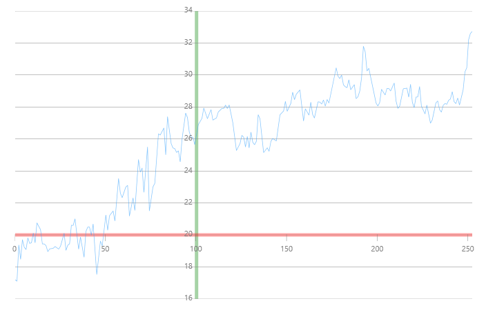

////
|metadata|
{
    "name": "datachart-axis-crossing",
    "controlName": ["{DataChartName}"],
    "tags": ["Application Scenarios","Charting","How Do I"],
    "guid": "9d54f719-d82e-4c12-9501-80b0bfdba634",
    "buildFlags": [],
    "createdOn": "2014-06-05T19:39:00.5883533Z"
}
|metadata|
////

= Configuring Axis Crossing

In the link:{DataChartLink}.{DataChartName}.html[{DataChartName}]™ control, you can use the link:{DataChartLink}.categoryxaxis.html[CategoryXAxis] object’s link:{DataChartLink}.axis{ApiProp}crossingaxis.html[CrossingAxis] and link:{DataChartLink}.axis{ApiProp}crossingvalue.html[CrossingValue] properties to change where the XAxis crosses the YAxis. The CrossingAxis property must be bound to the link:{DataChartLink}.numericyaxis.html[NumericYAxis] using the ElementName attribute and the CrossingValue must be set to the value at which you want the XAxis to cross YAxis. The following can be applied to the NumericYAxis object’s link:{DataChartLink}.axis{ApiProp}crossingaxis.html[CrossingAxis] and link:{DataChartLink}.axis{ApiProp}crossingvalue.html[CrossingValue] properties to change where the YAxis crosses the XAxis.

The following code example shows how to set axis crossing values for CategoryXAxis and NumericYAxis in the Data Chart control.

ifdef::sl,wpf,win-universal[]

*In XAML:*
[source, xaml]
----
<ig:{DataChartName} x:Name="DataChart"  >
    <ig:{DataChartName}.Axes>
        <ig:CategoryXAxis x:Name="xAxis" StrokeThickness="5" Stroke="Red" 
                           CrossingValue="100"
                           CrossingAxis="{Binding ElementName=yAxis}">
            <ig:CategoryXAxis.LabelSettings>
                <ig:AxisLabelSettings Location="InsideBottom"/>
            </ig:CategoryXAxis.LabelSettings>
        </ig:CategoryXAxis>
        <ig:NumericYAxis x:Name="yAxis" StrokeThickness="5" Stroke="Green" 
                         CrossingValue="20"
                         CrossingAxis="{Binding ElementName=xAxis}">
            <ig:NumericYAxis.LabelSettings>
                <ig:AxisLabelSettings Location="InsideLeft"/>
            </ig:NumericYAxis.LabelSettings>
        </ig:NumericYAxis>
     </ig:{DataChartName}.Axes>
</ig:{DataChartName}>
----

endif::sl,wpf,win-universal[]

ifdef::xamarin[]

*In XAML:*
[source, xaml]
----
<ig:CategoryXAxis x:Name="xAxis"
                  StrokeThickness="5"
                  Stroke="Red"
                  CrossingValue="20"
                  LabelLocation="InsideBottom"
                  CrossingAxis="{x:Reference yAxis}"
                  ItemsSource="{StaticResource DataSource}"
                  Label="Label">
</ig:CategoryXAxis>
<ig:NumericYAxis x:Name="yAxis"
                 StrokeThickness="5"
                 Stroke="Green"
                 CrossingValue="100"
                 LabelLocation="InsideLeft"
                 CrossingAxis="{x:Reference xAxis}">
</ig:NumericYAxis>
----

endif::xamarin[]

ifdef::sl,wpf,win-universal,win-forms,xamarin[]

*In C#:*
[source, csharp]
ifdef::win-forms[]
----
var yAxis = new NumericYAxis();
var xAxis = new CategoryXAxis();
xAxis.CrossingAxis = yAxis;
yAxis.CrossingAxis = xAxis;
xAxis.CrossingValue = 100;
yAxis.CrossingValue = 20;
xAxis.LabelLocation = AxisLabelsLocation.InsideBottom;
yAxis.LabelLocation = AxisLabelsLocation.InsideLeft;
----
endif::win-forms[]

ifdef::xamarin[]
----
var yAxis = new NumericYAxis()
{
    StrokeThickness = 5,
    Stroke = new SolidColorBrush(Color.Green),
    CrossingValue = 100,
    LabelLocation = AxisLabelsLocation.InsideLeft
};
var xAxis = new CategoryXAxis()
{
    StrokeThickness = 5,
    Stroke = new SolidColorBrush(Color.Red),
    ItemsSource = data,
    Label = "Label",
    CrossingValue = 20,
    LabelLocation = AxisLabelsLocation.InsideBottom
};
xAxis.CrossingAxis = yAxis;
yAxis.CrossingAxis = xAxis;
----
endif::xamarin[]

ifdef::sl,wpf,win-universal[]
----
var yAxis = new NumericYAxis();
var xAxis = new CategoryXAxis();
xAxis.CrossingAxis = yAxis;
yAxis.CrossingAxis = xAxis;
xAxis.CrossingValue = 100;
yAxis.CrossingValue = 20;
xAxis.LabelLocation = AxisLabelsLocation.InsideBottom;
yAxis.LabelLocation = AxisLabelsLocation.InsideLeft;
xAxis.LabelSettings.Location = AxisLabelsLocation.InsideBottom;
yAxis.LabelSettings.Location = AxisLabelsLocation.InsideLeft;
----
endif::sl,wpf,win-universal[]

endif::sl,wpf,win-universal,win-forms,xamarin[]

ifdef::sl,wpf,win-universal,win-forms[]

*In Visual Basic:*

ifdef::win-forms[]
----
Dim yAxis As New NumericYAxis()
Dim xAxis As New CategoryXAxis()
xAxis.CrossingAxis = yAxis
yAxis.CrossingAxis = xAxis
xAxis.CrossingValue = 100
yAxis.CrossingValue = 20
xAxis.LabelLocation = AxisLabelsLocation.InsideBottom
yAxis.LabelLocation = AxisLabelsLocation.InsideLeft
----
endif::win-forms[]

ifdef::sl,wpf,win-universal[]
----
Dim yAxis As New NumericYAxis()
Dim xAxis As New CategoryXAxis()
xAxis.CrossingAxis = yAxis
yAxis.CrossingAxis = xAxis
xAxis.CrossingValue = 100
yAxis.CrossingValue = 20
xAxis.LabelLocation = AxisLabelsLocation.InsideBottom
yAxis.LabelLocation = AxisLabelsLocation.InsideLeft
xAxis.LabelSettings.Location = AxisLabelsLocation.InsideBottom
yAxis.LabelSettings.Location = AxisLabelsLocation.InsideLeft
----
endif::sl,wpf,win-universal[]

endif::sl,wpf,win-universal,win-forms[]

ifdef::android[]

*In Java:*

[source,js]
----
NumericXAxis xAxis = new NumericXAxis();
NumericYAxis yAxis = new NumericYAxis();
xAxis.setCrossingAxis(yAxis);
yAxis.setCrossingAxis(xAxis);
xAxis.setCrossingValue(100.0);
yAxis.setCrossingValue(20.0);
xAxis.setLabelLocation(AxisLabelsLocation.INSIDEBOTTOM);
yAxis.setLabelLocation(AxisLabelsLocation.INSIDELEFT);
----

endif::android[]

The following image shows how the {DataChartName} control might look with the axis crossing values set for CategoryXAxis and NumericYAxis.

== Related Content:

* link:datachart-axis-range.html[Configuring Axis Range]
* link:datachart-axis-label-settings.html[Configuring Axis Label Settings]
* link:datachart-multiple-axes.html[Using Multiple Axes]