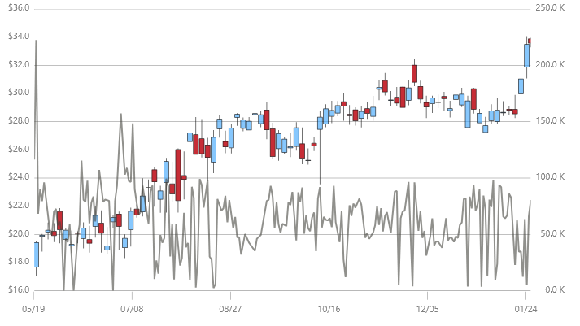

////
|metadata|
{
    "name": "datachart-axis-label-format",
    "controlName": ["{DataChartName}"],
    "tags": ["Application Scenarios","Charting","How Do I"],
    "guid": "d35b5e49-d706-46cb-80e4-f11f244538d1",
    "buildFlags": [],
    "createdOn": "2014-06-05T19:39:00.6003586Z"
}
|metadata|
////

= Configuring Axis Label Format

In the {DataChartName}™ control, axis labels always display simple text without any formatting applied to them. However, you can change the format of axis labels by setting a formatting string on the
ifdef::sl,wpf,win-forms,win-universal[]
link:{DataChartLink}.Axis{ApiProp}Label.html[Label] property of any type of link:{DataChartLink}.Axis.html[Axis].
endif::sl,wpf,win-forms,win-universal[]
ifdef::xamarin[]
link:{DataChartLink}.AxisFormatLabelEventArgs{ApiProp}Label.html[Label] property of the link:{DataChartLink}.AxisFormatLabelEventArgs.html[AxisFormatLabelEventArgs] in a handler for the link:{DataChartLink}.Axis{ApiProp}FormatLabel_EV.html[Axis.FormatLabel] event.
endif::xamarin[]

For example, if you are plotting monetary data along y-axis, the default labels will simply display a decimal representation of your monetary values. If you want to display these values with currency symbols, you need to use C format specifier, followed by a number, specifying decimal precision. For detailed information on .NET Framework composite format strings please refer to the following online resources:

* link:http://msdn.microsoft.com/en-us/library/dwhawy9k.aspx[Standard Numeric Format Strings]
* link:http://msdn.microsoft.com/en-us/library/az4se3k1(v=VS.100).aspx[Standard Date and Time Format Strings]

The following code example shows how to format labels on `CategoryXAxis` and `NumericYAxis` using date formatting and currency formatting:

ifdef::sl,wpf,win-universal[]
.Note:
[NOTE]
====
Curly braces ('{' and '}') in XAML are special characters for markup extensions. If the first value of a string needs to be a curly brace, an empty set of curly braces must be used as an escape sequence. This allows the text following the empty set of curly braces to be taken as a literal value.
====
endif::sl,wpf,win-universal[]

ifdef::sl,wpf,win-universal[]
*In XAML:*
[source, xaml]
----
<ig:{DataChartName} x:Name="DataChart"   >
    <ig:{DataChartName}.Axes>
        <ig:CategoryXAxis x:Name="commonXAxis" Label="{}{Date:MM/dd}"
                         ItemsSource="{Binding}" >
            <ig:CategoryXAxis.LabelSettings>
                <ig:AxisLabelSettings Location="OutsideBottom"/>
            </ig:CategoryXAxis.LabelSettings>
        </ig:CategoryXAxis>
        <ig:NumericYAxis x:Name="priceYAxis" Label="{}{0:C1}">
            <ig:NumericYAxis.LabelSettings>
                <ig:AxisLabelSettings Location="OutsideLeft"/>
            </ig:NumericYAxis.LabelSettings>
        </ig:NumericYAxis>
        <ig:NumericYAxis x:Name="volumeYAxis" Label="{}{0:#,0} K" >
            <ig:NumericYAxis.LabelSettings>
                <ig:AxisLabelSettings Location="OutsideRight"/>
            </ig:NumericYAxis.LabelSettings>
        </ig:NumericYAxis>
    </ig:{DataChartName}.Axes>
</ig:{DataChartName}>
----
endif::sl,wpf,win-universal[]

ifdef::xamarin[]
*In XAML:*
[source, xaml]
----
<ig:{DataChartName}.Axes>
    <ig:CategoryXAxis FormatLabel="OnCategoryAxisFormatLabel" />
    <ig:NumericYAxis FormatLabel="OnPricesAxisFormatLabel" />
    <ig:NumericYAxis FormatLabel="OnVolumeAxisFormatLabel" />
</ig:{DataChartName}.Axes>
----

This subscribes the `FormatLabel` event to event handlers for each axis. These event handlers are then written in the code behind in the same way as they are in the code snippet below.
endif::xamarin[]

ifdef::xamarin[]
*In C#:*
[source, csharp]
----
var commonAxis = new CategoryXAxis();
commonAxis.FormatLabel += OnCategoryAxisFormatLabel;

var pricesAxis = new NumericYAxis();
pricesAxis.FormatLabel += OnPricesAxisFormatLabel;

var volumeAxis = new NumericYAxis();
volumeAxis.FormatLabel += OnVolumeAxisFormatLabel;

...

private void OnVolumeAxisFormatLabel(object sender, AxisFormatLabelEventArgs e)
{
    e.Label = string.Format("{0:#,0} K", (double)e.Item);
}

private void OnPricesAxisFormatLabel(object sender, AxisFormatLabelEventArgs e)
{
    e.Label = string.Format("{0:C1}", (double)e.Item);
}

private void OnCategoryAxisFormatLabel(object sender, AxisFormatLabelEventArgs e)
{
    var dataItem = (Sale)e.Item;
    e.Label = string.Format("{0:MMM dd}", dataItem.Date);
}
----
 
.Note:
[NOTE]
====
Type of `Item` property of `AxisFormatLabelEventArgs` is always of type `double` for all numeric axes. However, for category axes, the type of `Item` property is the same as the data item’s type. In this case, the Item is a `Sale` object because a list of `Sale` objects was bound to the link:{DataChartLink}.CategoryAxisBase~{ApiDataSource}.html[{ApiDataSource}] property of the `CategoryXAxis`.
==== 

endif::xamarin[]

ifdef::sl,wpf,win-universal[]
*In C#:*
[source, csharp]
----
var commonAxis = new CategoryXAxis();
var pricesAxis = new NumericYAxis();
var volumeAxis = new NumericYAxis();
commonAxis.Label = "{Date:MM/dd}";
pricesAxis.Label = "{0:C1}";
volumeAxis.Label = "{0:#,0} K";
----
endif::sl,wpf,win-universal[]

ifdef::win-forms[]
*In C#:*
[source, csharp]
----
var commonAxis = new CategoryXAxis();
var pricesAxis = new NumericYAxis();
var volumeAxis = new NumericYAxis();

commonAxis.Label = "Date:MM/dd";
// or using an event
commonAxis.FormatLabel += OnCategoryAxisFormatLabel;

pricesAxis.Label = "Price:C1";
// or using an event
pricesAxis.FormatLabel += OnPricesAxisFormatLabel;

volumeAxis.Label = "Value:#,0 K";
// or using an event
volumeAxis.FormatLabel += OnVolumeAxisFormatLabel;

// Event handlers
string OnCategoryAxisFormatLabel(AxisLabelInfo info)
{
    return string.Format("{0:MM/dd}", info.DateValue);
}

string OnPricesAxisFormatLabel(AxisLabelInfo info)
{
    return string.Format("{0:C1}", info.Value);
}

string OnVolumeAxisFormatLabel(AxisLabelInfo info)
{
    return string.Format("{0:#,0} K", info.Value);
}
----
endif::win-forms[]

ifdef::sl,wpf,win-universal[]
*In Visual Basic#:*
[source, vb]
----
Dim commonAxis As New CategoryXAxis()
Dim pricesAxis As New NumericYAxis()
Dim volumeAxis As New NumericYAxis()
commonAxis.Label = "{Date:MM/dd}"
pricesAxis.Label = "{0:C1}"
volumeAxis.Label = "{0:#,0} K"
----
endif::sl,wpf,win-universal[]

ifdef::win-forms[]
*In Visual Basic:*
[source, vb]
----
Dim commonAxis As New CategoryXAxis()
Dim pricesAxis As New NumericYAxis()
Dim volumeAxis As New NumericYAxis()

commonAxis.Label = "Date:MM/dd"
' or using an event
AddHandler commonAxis.FormatLabel, AddressOf OnCategoryAxisFormatLabel

pricesAxis.Label = "Price:C1"
' or using an event
AddHandler pricesAxis.FormatLabel, AddressOf OnPricesAxisFormatLabel

volumeAxis.Label = "Value:#,0 K"
' or using an event
AddHandler volumeAxis.FormatLabel, AddressOf OnVolumeAxisFormatLabel
        
' Event handlers
Function OnCategoryAxisFormatLabel(info As AxisLabelInfo) As String
    Return String.Format("{0:MM/dd}", info.DateValue)
End Function

Function OnPricesAxisFormatLabel(info As AxisLabelInfo) As String
    Dim value = CType(info.Value, Double)
    Return String.Format("{0:C1}", value)
End Function

Function OnVolumeAxisFormatLabel(info As AxisLabelInfo) As String
    Dim value = info.Value
    Return String.Format("{0:#,0} K", value)
End Function
----
endif::win-forms[]

ifdef::android[]
*In Java:*
[source,js]
----
CategoryXAxis commonAxis = new CategoryXAxis();
NumericYAxis pricesAxis = new NumericYAxis(); 
NumericYAxis volumeAxis = new NumericYAxis();
commonAxis.setLabel("Date:MM/dd");
pricesAxis.setLabel("0:C1");
volumeAxis.setLabel("0:#,0");
----
endif::android[]

The following image shows how the {DataChartName} control might look with formatted date on CategoryXAxis and formatted currency on NumericYAxis.

== Related Content:

* link:datachart-axis-label-settings.html[Configuring Axis Label Settings]