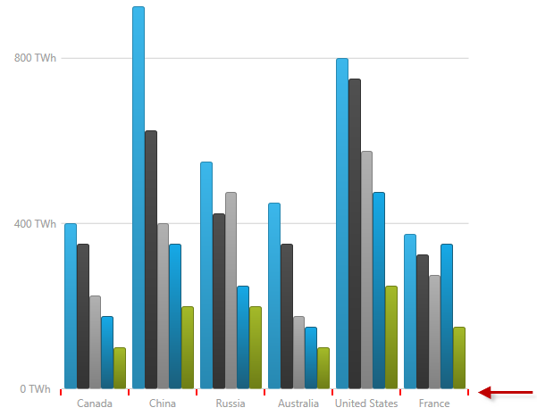
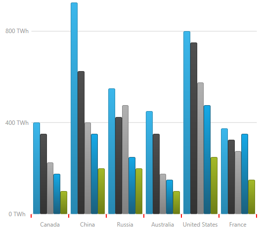

////
|metadata|
{
    "name": "datachart-axis-tick-marks",
    "tags": ["Charting","Data Presentation"],
    "controlName": ["{DataChartName}"],
    "guid": "7ae01fc6-c2c7-4caf-a244-cbf33594aac5",
    "buildFlags": [],
    "createdOn": "2014-06-05T19:39:00.6103627Z"
}
|metadata|
////

= Configuring Axis Tick Marks

== Topic Overview

=== Purpose

This topic explains, with code examples, how to configure the tick marks for a chart axis of the  _{DataChartName}_™ control.

=== Required background

The following topics are prerequisites to understanding this topic:

[options="header", cols="a,a"]
|====
|Topic|Purpose

| link:datachart-getting-started-with-datachart.html[Getting Started with Data Chart]
|The _{DataChartName}_ control requires a Data set and data binding. This topic demonstrates how to provide a simple Data Object Model.

| link:datachart-axes.html[Chart Axes]
|This topic introduces the types of axes supported by the _{DataChartName}_ control.

|====

[[_Ref367456508]]
== Configuring Axis Tick Marks

[[_Ref367456519]]

=== Overview

Axis tick marks can be displayed along all horizontal and vertical axes of the  _{DataChartName}_   control. When axis tick marks are enabled, a tick mark is displayed for every label (at all major line positions).

Axis tick marks are enabled by setting the link:{DataChartLink}.axis{ApiProp}ticklength.html[TickLength] property of an axis to a value greater than 0. (This property specifies the length of the line segments forming the tick marks.)

Tick marks are always displayed at the axis stroke line and point to the direction of the labels. Labels are offset by the value of the link:{DataChartLink}.axis{ApiProp}ticklength.html[TickLength] property to avoid overlapping. For example, for a horizontal axis where the label location is AxisLabelsLocation.OutsideBottom, if the link:{DataChartLink}.axis{ApiProp}ticklength.html[TickLength] is set to  _5_, labels will be shifted down by that amount.

ifdef::wpf,sl,win-forms,win-universal,android[]
.Note:
[NOTE]
====
Tick marks will not be displayed (even if they have valid properties) when the  pick:[wpf,win-universal=" link:{DataChartLink}.axislabelsettings{ApiProp}visibility.html[LabelSettings]"]   pick:[wpf,win-universal="property is collapsed"]  pick:[win-forms=" link:{DataChartLink}.axis{ApiProp}labelsvisible.html[LabelSettings]"]   pick:[win-forms="property is false"]
====

endif::wpf,sl,win-forms,win-universal,android[]

[[_Ref367456522]]

=== Property settings

The following table maps the desired configuration to its respective property settings.

[options="header", cols="a,a,a"]
|====
|In order to configure:|Use this property:|And set it to:

|The length of the axis tick marks
| link:{DataChartLink}.axis{ApiProp}ticklength.html[TickLength]
|The desired length of the axis tick marks

|The thickness of the axis tick marks
| link:{DataChartLink}.axis{ApiProp}tickstrokethickness.html[TickStrokeThickness]
|The desired thickness of the axis tick marks set as a double value

|The color of the axis tick marks
| link:{DataChartLink}.axis{ApiProp}tickstroke.html[TickStroke]
|The desired color

ifdef::wpf,win-universal,win-forms[]
|The line style for the tick marks (dashed/continuous).
| link:{DataChartLink}.axis{ApiProp}tickstrokedasharray.html[TickStrokeDashArray]
|A collection of even number of double values in which the odd-position numbers represent the length of the dashes and the even-position numbers represent the gap sizes between the dashes, both in pixels. 

For instance, if values of _"2_ _,1_ _"_ are specified, tick marks will be rendered as dashed lines with a repeating pattern of 2-px long dash followed by an 1-px gap. 

If `TickStrokeDashArray` is not set (default), the line style for the tick marks will be continuous.
endif::wpf,win-universal,win-forms[]

|====

[[_Ref367456525]]

=== Example

The screenshot below demonstrates how the category x-axis in a  _{DataChartName}_   control looks as a result of the following tick-marks-related settings:

[options="header", cols="a,a"]
|====
|Property|Value

| link:{DataChartLink}.axis{ApiProp}ticklength.html[TickLength]
| _"7"_ 

| link:{DataChartLink}.axis{ApiProp}tickstroke.html[TickStroke]
| _"Red"_ 

| link:{DataChartLink}.axis{ApiProp}tickstrokethickness.html[TickStrokeThickness]
| _"2"_ 

|====

Following is the code snippet for the chart’s x-axis:

ifdef::xaml[]

*In XAML:*

[source,xaml]
----
<ig:CategoryXAxis x:Name="XAxis"  
    TickLength="7" 
    TickStroke="Red" 
    TickStrokeThickness="2" />
----

endif::xaml[]

ifdef::xaml,win-forms[]
*In C#:*
[source, csharp]
var xAxis = new CategoryXAxis()
{
    TickLength = 7,
    TickStroke = new SolidColorBrush(Color.Red),
    TickStrokeThickness = 2
};
endif::xaml,win-forms[]

ifdef::sl[]

*In Visual Basic:*

----
Dim xAxis As New CategoryXAxis()
xAxis.TickLength = 7
xAxis.TickStrokeThickness = 2
----

endif::sl[]

ifdef::wpf[]

*In Visual Basic:*

----
Dim xAxis As New CategoryXAxis()
xAxis.TickLength = 7
xAxis.TickStrokeThickness = 2
----

endif::wpf[]

ifdef::win-forms[]

*In Visual Basic:*

----
Dim xAxis As New CategoryXAxis()
xAxis.TickLength = 7
xAxis.TickStrokeThickness = 2
----

endif::win-forms[]

ifdef::win-universal[]

*In Visual Basic:*

----
Dim xAxis As New CategoryXAxis()
xAxis.TickLength = 7
xAxis.TickStrokeThickness = 2
----

endif::win-universal[]

ifdef::android[]

*In Java:*

[source,js]
----
CategoryXAxis xAxis = new CategoryXAxis();
xAxis.setTickLength(7);
xAxis.setTickStrokeThickness(2);
----

endif::android[]

[[_Ref367456536]]
== Related Content

[[_Ref367456541]]

=== Topics

The following topic provides additional information related to this topic.

[options="header", cols="a,a"]
|====
|Topic|Purpose

| link:datachart-axis-label-settings.html[Configuring Axis Label Settings]
|In the _{DataChartName}_ control, you can change the location, orientation angle, visibility and appearance of the axis label using the AxisLabelSettings object’s properties on any axis.

|====