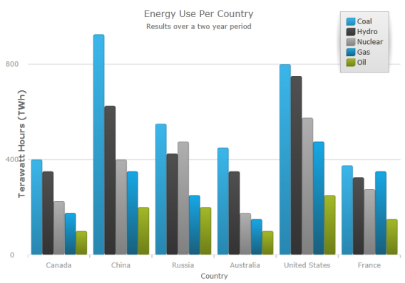

////
|metadata|
{
    "name": "datachart-axis-title",
    "controlName": [],
    "tags": [],
    "guid": "2c429d69-56ef-44e2-ad27-631b71f3843b",
    "buildFlags": [],
    "createdOn": "2014-06-05T19:39:00.611363Z"
}
|metadata|
////

= Configuring Axis Title
 
=== Purpose

This topic provides information on setting an axis title on the link:{DataChartLink}.{DataChartName}.html[{DataChartName}]™ control.

=== Required background

The following topics are prerequisites to understanding this topic:

[options="header", cols="a,a"]
|====
|Topic|Purpose

| link:datachart-getting-started-with-datachart.html[Getting Started with Data Chart]
|The {DataChartName} requires a data object model to be mapped to control's DataContext property. This article will provide a simple data object model but you can create your own and use it with this sample code instead.

| link:datachart-axis-label-settings.html[Configuring Axis Label Settings]
|This topic provides information on setting appearance properties of axis labels.

|====

=== In this topic

This topic contains the following sections:

* <<AxisTitle,Axis Title>>

** <<Overview,Overview>>
** <<Preview,Preview>>
** <<Properties,Properties>>
** <<Example,Example>>

* <<RelatedContent,Related Content>>

[[AxisTitle]]
== Axis Title

[[Overview]]

=== Overview

The axis title feature of the  _{DataChartName}_  control allows you to add contextual information to the x and y axes of the  _{DataChartName}_  control.

ifdef::wpf,win-universal[]
You can customize the axis title by specifying properties of the link:{DataChartLink}.axis{ApiProp}titlesettings.html[TitleSettings] object such as the angle, font size and position.
endif::wpf,win-universal[]

[[Preview]]

=== Preview

The following screenshot is a preview of the  _{DataChartName}_  control with a title set on the y-axis.

image::images/xamDataChart_Axis_Title_01.png[]

[[Properties]]

=== Properties

The link:{DataChartLink}.axis{ApiProp}title.html[Title] property sets the value of the information areas of the axis.

[options="header", cols="a,a,a"]
|====
|*Property Name*|*Property Type*|* Description*

| link:{DataChartLink}.axis{ApiProp}title.html[Title]
|`String`
|Defines the title of the axis.

|====

The following table summarizes the properties  pick:[wpf,win-universal="of the"]   pick:[wpf,win-universal=" link:{DataChartLink}.axis{ApiProp}titlesettings.html[TitleSettings]"]   pick:[wpf,win-universal="object available to the axis’s"]   pick:[wpf,win-universal=" link:{DataChartLink}.axis{ApiProp}titlesettings.html[TitleSettings]"]   pick:[wpf,win-universal="property"] .

[options="header", cols="a,a,a"]
|====
|*Property Name*|*Property Type*|* Description*

ifdef::wpf,win-universal[]
|pick:[wpf,win-universal=" link:{DataChartLink}.axis{ApiProp}titlesettings.html[TitleSettings]"]
|`TitleSettings`
|Defines a set of visual settings such foreground, font, alignment, margins, angle and many more for the axis title.
endif::wpf,win-universal[]

| pick:[wpf,win-universal=" link:{DataChartLink}.titlesettings{ApiProp}position.html[TitleSettings.Position]"] pick:[xamarin,win-forms=" link:{DataChartLink}.axis{ApiProp}titleposition.html[TitlePosition]"] pick:[android=" link:{DataChartLink}.axis{ApiProp}titleposition.html[setTitlePosition]"] 
|`AxisTitlePosition`
|Defines the position of the title according to the position of the labels. 

By default this property is set to Auto, meaning that the axis title will always be on opposite sides of the axis stroke and the axis labels. In other words, axis labels will be always between axis title and axis stroke even if you change the location of axis labels. For example, changing location of an axis label to OutsideRight automatically position the axis title to the right side of the axis labels.

| pick:[wpf,win-universal=" link:{DataChartLink}.titlesettings{ApiProp}angle.html[TitleSettings.Angle]"] pick:[xamarin,win-forms=" link:{DataChartLink}.axis{ApiProp}titleangle.html[TitleAngle]"] pick:[android=" link:{DataChartLink}.axis{ApiProp}titleangle.html[setTitleAngle]"] 
|`double`
|Defines the rotation of the title around the center of axis title in degrees. For example, value of -90 rotates the title vertically and value of zero will render the title horizontally.

ifdef::wpf,win-universal[]
|pick:[wpf,win-universal=" link:{DataChartLink}.titlesettings{ApiProp}effect.html[TitleSettings.Effect]"]
|`Effect`
|Defines the effect applied to the axis title.
endif::wpf,win-universal[]

|pick:[wpf,win-universal=" link:{DataChartLink}.titlesettings{ApiProp}foreground.html[TitleSettings.Foreground]"] pick:[xamarin,win-forms=" link:{DataChartLink}.axis{ApiProp}titletextcolor.html[TitleTextColor]"] pick:[android=" link:{DataChartLink}.axis{ApiProp}titletextcolor.html[setTitleTextColor]"]
|`Brush`
|Defines the color applied to the foreground of the axis title.

|pick:[wpf,win-universal=" link:{DataChartLink}.titlesettings{ApiProp}fontfamily.html[TitleSettings.FontFamily]"] pick:[xamarin,win-forms=" link:{DataChartLink}.axis{ApiProp}titlefontfamily.html[TitleFontFamily]"] pick:[android=" link:{DataChartLink}.axis{ApiProp}titlefontfamily.html[setTitleFontFamily]"]
|  
pick:[wpf,win-universal="`FontFamily`"]
pick:[android,xamarin,win-forms="`string`"]

|Defines the font applied to the text of the axis title.

|pick:[wpf,win-universal=" link:{DataChartLink}.titlesettings{ApiProp}fontsize.html[TitleSettings.FontSize]"] pick:[xamarin,win-forms=" link:{DataChartLink}.axis{ApiProp}titlefontsize.html[TitleFontSize]"] pick:[android=" link:{DataChartLink}.axis{ApiProp}titletextsize.html[setTitleFontSize]"]
|`double`
|Defines the font size used rendering text of the axis title.

ifdef::wpf,win-universal[]
|pick:[wpf,win-universal=" link:{DataChartLink}.titlesettings{ApiProp}fontstretch.html[TitleSettings.FontStretch]"]
|`FontStretch`
|Defines the face of the font, for example normal, condensed or expanded.
endif::wpf,win-universal[]

|pick:[wpf,win-universal=" link:{DataChartLink}.titlesettings{ApiProp}fontstyle.html[TitleSettings.FontStyle]"] pick:[xamarin=" link:{DataChartLink}.axis{ApiProp}titlefontattributes.html[TitleFontAttributes]"] pick:[win-forms=" link:{DataChartLink}.axis{ApiProp}titletextstyle.html[TitleTextStyle]"] pick:[android=" link:{DataChartLink}.axis{ApiProp}titlefontstyle.html[setTitleFontStyle]"]
|
pick:[wpf,win-universal="`FontStyle`"]
pick:[xamarin,win-forms="`FontAttributes`"]
pick:[android="`int`"]

|Defines the font attributes used rendering text of the axis title, for example Regular, Bold, Italic, etc.

ifdef::wpf,win-universal[]
|pick:[wpf,win-universal=" link:{DataChartLink}.titlesettings{ApiProp}fontweight.html[TitleSettings.FontWeight]"]
|`FontWeight`
|Defines the thickness of the characters used for the axis title text, for example bold, normal, etc.
endif::wpf,win-universal[]

|pick:[wpf,win-universal=" link:{DataChartLink}.titlesettings{ApiProp}horizontalalignment.html[TitleSettings.HorizontalAlignment]"] pick:[xamarin,win-forms=" link:{DataChartLink}.axis{ApiProp}titlehorizontalalignment.html[TitleHorizontalAlignment]"] pick:[android=" link:{DataChartLink}.axis{ApiProp}titlehorizontalalignment.html[setTitleHorizontalAlignment]"]
|`HorizontalAlignment`
|Defines the horizontal alignment of the axis title in the axis info panel. This property only applies to a title on x-axis.

|pick:[wpf,win-universal=" link:{DataChartLink}.titlesettings{ApiProp}verticalalignment.html[TitleSettings.VerticalAlignment]"] pick:[xamarin,win-forms=" link:{DataChartLink}.axis{ApiProp}titleverticalalignment.html[TitleVerticalAlignment]"] pick:[android=" link:{DataChartLink}.axis{ApiProp}titleverticalalignment.html[setTitleVerticalAlignment]"]
|`VerticalAlignment`
|Defines the vertical alignment of the axis title in the axis info panel. This property only applies to a title on y-axis.

ifdef::wpf,win-universal[]
|pick:[wpf,win-universal=" link:{DataChartLink}.titlesettings{ApiProp}opacity.html[TitleSettings.Opacity]"]
|`double`
|Defines the opacity of the axis title.
endif::wpf,win-universal[]

ifdef::wpf,win-universal[]
|pick:[wpf,win-universal=" link:{DataChartLink}.titlesettings{ApiProp}opacitymask.html[TitleSettings.OpacityMask]"]
|`Brush`
|Defines the opacity mask of the axis title.
endif::wpf,win-universal[]

|pick:[wpf,win-universal=" link:{DataChartLink}.titlesettings{ApiProp}margin.html[TitleSettings.Margin]"] pick:[win-forms=" link:{DataChartLink}.axis{ApiProp}titlemargin.html[TitleMargin]"] 
pick:[android=" link:{DataChartLink}.axis{ApiProp}titlemargin.html[setTitleMargin]"]

ifdef::xamarin[]
link:{DataChartLink}.axis{ApiProp}TitleTopMargin.html[TitleTopMargin]

link:{DataChartLink}.axis{ApiProp}TitleBottomMargin.html[TitleBottomMargin]

link:{DataChartLink}.axis{ApiProp}TitleLeftMargin.html[TitleLeftMargin]

link:{DataChartLink}.axis{ApiProp}TitleRightMargin.html[TitleRightMargin]
endif::xamarin[]
|
pick:[wpf,win-universal="`Thickness`"]
pick:[android,xamarin,win-forms="`double`"]
 
|Defines the size of the margin set around the axis title.

|====

[[Example]]

=== Example

The screenshot, following the table, demonstrates how the  _{DataChartName}_   control with axis link:{DataChartLink}.axis{ApiProp}title.html[Title] and title settings looks as a result of the following settings:

[options="header", cols="a,a"]
|====
|Property|Value

| 
link:{DataChartLink}.axis{ApiProp}title.html[Title]

|Terawatt Hours (TWh)

| pick:[wpf,win-universal=" link:{DataChartLink}.titlesettings{ApiProp}position.html[TitleSettings.Position]"] pick:[xamarin,win-forms=" link:{DataChartLink}.axis{ApiProp}titleposition.html[TitlePosition]"] pick:[android=" link:{DataChartLink}.axis{ApiProp}titleposition.html[setTitlePosition]"] 
|Bottom

| pick:[wpf,win-universal=" link:{DataChartLink}.titlesettings{ApiProp}angle.html[TitleSettings.Angle]"] pick:[xamarin,win-forms=" link:{DataChartLink}.axis{ApiProp}titleangle.html[TitleAngle]"] pick:[android=" link:{DataChartLink}.axis{ApiProp}titleangle.html[setTitleAngle]"] 
|270

|pick:[wpf,win-universal=" link:{DataChartLink}.titlesettings{ApiProp}fontsize.html[TitleSettings.FontSize]"] pick:[xamarin,win-forms=" link:{DataChartLink}.axis{ApiProp}titlefontsize.html[TitleFontSize]"] pick:[android=" link:{DataChartLink}.axis{ApiProp}titletextsize.html[setTitleTextSize]"]
|15

|====

Following is the code that implements this example:

ifdef::wpf,sl,win-universal[]

*In XAML:*

[source,xaml]
----
<ig:NumericYAxis x:Name="yAxis" Title="Terawatt Hours (TWh)">
      <ig:NumericYAxis.TitleSettings >
         <ig:TitleSettings  FontSize="15" Angle="270" Position="Bottom" />
      </ig:NumericYAxis.TitleSettings>
</ig:NumericYAxis>
----

endif::wpf,sl,win-universal[]

ifdef::xamarin[]
*In XAML:*
[source,xaml]
<ig:NumericYAxis x:Name="yAxis"
                 TitleFontSize="15"
                 TitleAngle="270"
                 TitlePosition="Bottom"
                 Title="Terawatt Hours (TWh)" />
endif::xamarin[]

ifdef::wpf,win-universal,sl[]

*In C#:*

----
var yAxis = new NumericYAxis();
yAxis.Title = "Terawatt Hours (TWh)";
yAxis.TitleSettings = new AxisTitleSettings();
yAxis.TitleSettings.Position = AxisTitlePosition.Bottom;
yAxis.TitleSettings.Angle = 270;
yAxis.TitleSettings.FontSize = 15;
----

endif::wpf,win-universal,sl[]

ifdef::win-forms[]

*In C#:*

----
var yAxis = new NumericYAxis();
yAxis.Title = "Terawatt Hours (TWh)";
yAxis.TitlePosition = AxisTitlePosition.Bottom;
yAxis.TitleAngle = 270;
yAxis.TitleFontSize = 15;
----

endif::win-forms[]

ifdef::xamarin[]

*In C#:*

----
var yAxis = new NumericYAxis();
yAxis.Title = "Terawatt Hours (TWh)";
yAxis.TitlePosition = AxisTitlePosition.Bottom;
yAxis.TitleAngle = 270;
yAxis.TitleFontSize = 15;
----

endif::xamarin[]

ifdef::wpf,win-universal,sl[]

*In Visual Basic:*

----
Dim yAxis As New NumericYAxis()
yAxis.Title = "Terawatt Hours (TWh)"
yAxis.TitleSettings = new AxisTitleSettings()
yAxis.TitleSettings.Position = AxisTitlePosition.Bottom
yAxis.TitleSettings.Angle = 270
yAxis.TitleSettings.FontSize = 15
----

endif::wpf,win-universal,sl[]

ifdef::win-forms[]

*In Visual Basic:*

----
Dim yAxis As New NumericYAxis()
yAxis.Title = "Terawatt Hours (TWh)"
yAxis.TitlePosition = AxisTitlePosition.Bottom
yAxis.TitleAngle = 270
yAxis.TitleFontSize = 15
----

endif::win-forms[]

ifdef::android[]

*In Java:*

[source,js]
----
yAxis.setTitle("Terawatt Hours (Twh)");
yAxis.setTitleTextSize(15);
yAxis.setTitleTypeface(Typeface.DEFAULT_BOLD);
yAxis.setTitleAngle(270);
yAxis.setTitlePosition(AxisTitlePosition.BOTTOM);
----

endif::android[]

[[RelatedContent]]
== Related Content

The following topics provide additional information related to this topic:

[options="header", cols="a,a"]
|====
|Topic|Purpose

| link:datachart-getting-started-with-datachart.html[Getting Started with Data Chart]
|The _{DataChartName}_ requires a data object model to be mapped to control's `DataContext` property. This article will provide a simple data object model but you can create your own and use it with this sample code instead.

| link:datachart-axis-label-settings.html[Configuring Axis Label Settings]
|This topic provides information on setting appearance properties of axis labels.

|====