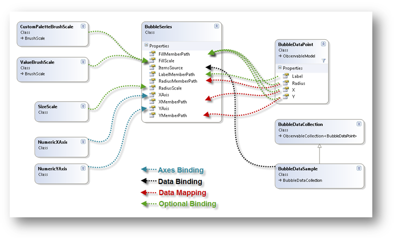
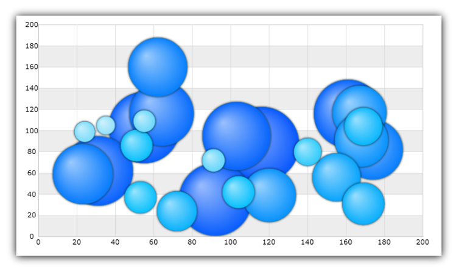

////
|metadata|
{
    "name": "datachart-bubble-series",
    "controlName": ["{DataChartName}"],
    "tags": ["Charting","Data Binding","Data Presentation","Sample Data Source"],
    "guid": "9a664e4b-d479-424c-a3cf-d7d051ff0788",
    "buildFlags": [],
    "createdOn": "2014-06-05T19:39:00.5613429Z"
}
|metadata|
////

= Scatter Bubble Series

This topic explains, with code examples, how to use link:{DataChartLink}.BubbleSeries.html[BubbleSeries] in the link:{DataChartLink}.{DataChartName}.html[{DataChartName}]™ control. Some important conceptual information is provided as well.

=== In This Topic

This topic contains the following sections:

* <<Introduction,Introduction>>
* <<Preview,Preview>>
* <<DataBinding,Data Binding>>
* <<BubbleSizeScaleFeature,Configuring Bubble Size>>
* <<BubbleBrushScaleFeature,Configuring Bubble Brush>>
* <<SupportedTypesLegends,Supported Types of Legends>>
* <<RelatedContent,Related Content>>

[[Introduction]]
== Introduction

The `BubbleSeries` belongs to a family of link:datachart-scatter-series-overview.html[Scatter Series] that use the Cartesian (x, y) coordinate system to plot data. This series displays the data as a collection of scaled bubbles, each having a pair of numeric X/Y values that determines its location in the Cartesian coordinate system and 3rd value that determines its size. 

Scatter Series draw attention to uneven intervals or clusters of data. They can highlight the deviation of collected data from predicted results and they are often used to plot scientific and statistical data. In addition to these characteristics of Scatter Series, the sizes of `BubbleSeries` markers (bubbles) in are data-driven. The following sections list important conceptual and task-based information on how to use the `BubbleSeries` and its features.
 
[[Preview]]
== Preview    

image::images/xamDataChart_Scatter_Bubble_Series_02.png[]

Figure 1: Sample implementation of the `BubbleSeries`

[[DataBinding]]
== Data Binding   

The `BubbleSeries` uses the link:{DataChartLink}.series~{ApiDataSource}.html[{ApiDataSource}] property to bind any data object that implements the IEnumerable interface (e.g. List, Collection, Queue, Stack). However, each data item in this object must have one numeric data column (for the size of a bubble) in addition to two numeric data columns (for X and Y values to position a bubble in the Cartesian coordinate system). These data columns are mapped using link:{DataChartLink}.BubbleSeries{ApiProp}RadiusMemberPath.html[RadiusMemberPath], link:{DataChartLink}.ScatterBase{ApiProp}XMemberPath.html[XMemberPath], and link:{DataChartLink}.ScatterBase{ApiProp}YMemberPath.html[YMemberPath] properties.

An example of object that meets the criteria listed above is the link:resources-sample-bubble-data.html[BubbleDataSource] which you can download use it in your project. 
 

ifdef::xaml[]

Figure 2: Schematic representation of binding data to BubbleSeries in the {DataChartName} control.
endif::xaml[]

ifdef::win-forms[]

Figure 2: Schematic representation of binding data to BubbleSeries in the {DataChartName} control.
endif::win-forms[]
 

==== Code Example
This code snippet below demonstrates how to bind sample bubble data to the `BubbleSeries`.

ifdef::wpf,win-universal[]
*In XAML:*
[source,xaml]
----
xmlns:local="clr-namespace:Infragistics.Models;assembly=YourAppName"
...
<ig:{DataChartName} >
    <ig:{DataChartName}.Resources>
        <local:BubbleDataSource x:Key="data"/> 
    </ig:{DataChartName}.Resources>
    <ig:{DataChartName}.Axes>
        <ig:NumericXAxis x:Name="XAxis" />
        <ig:NumericYAxis x:Name="YAxis" />
    </ig:{DataChartName}.Axes>
    <ig:{DataChartName}.Series> 
        <ig:BubbleSeries ItemsSource="{StaticResource data}"
                         XAxis="{Binding ElementName=XAxis}"
                         YAxis="{Binding ElementName=YAxis}"
                         XMemberPath="X" 
                         YMemberPath="Y"
                         RadiusMemberPath="Radius">
        </ig:BubbleSeries> 
    </ig:{DataChartName}.Series>
</ig:{DataChartName}>
----
endif::wpf,win-universal[]
 
ifdef::xamarin[]
*In XAML:*
[source,xaml]
----
xmlns:local="clr-namespace:Infragistics.Models;assembly=YourAppName"
...
<ig:{DataChartName} x:Name="DataChart" >
    <ig:{DataChartName}.Resources>
		<ResourceDictionary>
			<local:BubbleDataSource x:Key="data" />
		</ResourceDictionary>
    </ig:{DataChartName}.Resources>
    <ig:{DataChartName}.Axes>
        <ig:NumericXAxis x:Name="XAxis" />
        <ig:NumericYAxis x:Name="YAxis" />
    </ig:{DataChartName}.Axes>
    <ig:{DataChartName}.Series>
        <ig:BubbleSeries ItemsSource="{StaticResource data}"
                         XAxis="{x:Reference XAxis}"
                         YAxis="{x:Reference YAxis}"
                         XMemberPath="X" 
                         YMemberPath="Y"
                         RadiusMemberPath="Radius"> 
        </ig:BubbleSeries> 
    </ig:{DataChartName}.Series>
</ig:{DataChartName}>
----
endif::xamarin[]

ifdef::wpf,win-universal,xamarin[]
*In C#:*
[source,csharp]
----
var data = new BubbleDataSource();
var xAxis = new NumericXAxis();
var yAxis = new NumericYAxis();

var series = new BubbleSeries();
series.XAxis = xAxis;
series.YAxis = yAxis;
series.XMemberPath = "X";
series.YMemberPath = "Y";
series.RadiusMemberPath = "Radius";
series.ItemsSource = data; 
DataChart.Axes.Add(xAxis);
DataChart.Axes.Add(yAxis);
DataChart.Series.Add(series);
----
endif::wpf,win-universal,xamarin[]
 
ifdef::win-forms[]
*In C#:*
[source,csharp]
----
var data = new BubbleDataSource();
var xAxis = new NumericXAxis();
var yAxis = new NumericYAxis();

var series = new BubbleSeries();
series.XAxis = xAxis;
series.YAxis = yAxis;
series.XMemberPath = "X";
series.YMemberPath = "Y";
series.RadiusMemberPath = "Radius";
series.DataSource = data; 
DataChart.Axes.Add(xAxis);
DataChart.Axes.Add(yAxis);
DataChart.Series.Add(series);
----
endif::win-forms[]
 
ifdef::wpf,win-universal[]
*In Visual Basic:*
[source,vb]
----
Dim data As New BubbleDataSource()
Dim xAxis As New NumericXAxis()
Dim yAxis As New NumericYAxis()

Dim series As New BubbleSeries()
series.ItemsSource = data
series.XMemberPath = "X"
series.YMemberPath = "Y"
series.RadiusMemberPath = "Radius" 
series.XAxis = xAxis
series.YAxis = yAxis
Dim chart As New {DataChartName}()
chart.Axes.Add(xAxis)
chart.Axes.Add(yAxis)
chart.Series.Add(series)
----
endif::wpf,win-universal[]

ifdef::win-forms[]
*In Visual Basic:*
[source,vb]
----
Dim data As New BubbleDataSource()
Dim xAxis As New NumericXAxis() 
Dim yAxis As New NumericYAxis() 

Dim series As New BubbleSeries()
series.DataSource = data
series.XMemberPath = "X"
series.YMemberPath = "Y"
series.RadiusMemberPath = "Radius" 
series.XAxis = xAxis
series.YAxis = yAxis
Dim chart As New {DataChartName}()
chart.Axes.Add(xAxis)
chart.Axes.Add(yAxis)
chart.Series.Add(series)
----
endif::win-forms[]

ifdef::android[]
*In Java:*
[source,java]
----
BubbleDataSource data = new BubbleDataSource();
NumericYAxis yAxis = new NumericYAxis();
NumericXAxis xAxis = new NumericXAxis();

BubbleSeries series = new BubbleSeries();
series.setXAxis(xAxis);
series.setYAxis(yAxis);
series.setXMemberPath("X");
series.setYMemberPath("Y");
series.setRadiusMemberPath("Radius");
series.setDataSource(data);
chart.addAxis(xAxis);
chart.addAxis(yAxis);
chart.addSeries(series);
----
endif::android[]

[[BubbleSizeScaleFeature]]
== Configuring Bubble Size  

Bubble Size Scale is an optional feature of `BubbleSeries` that determines the sizes of bubbles though the link:{DataChartLink}.BubbleSeries{ApiProp}RadiusScale.html[RadiusScale] property of the series. This feature is implemented through the link:{DataChartLink}.SizeScale.html[SizeScale] object. When the radius scale is set, the smallest bubble will be equal to link:{DataChartLink}.SizeScale{ApiProp}MinimumValue.html[MinimumValue], the largest bubble will be equal to link:{DataChartLink}.SizeScale{ApiProp}MaximumValue.html[MaximumValue], and all the remaining bubbles will be scaled accordingly. The size scale can be either linear or logarithmic. When the radius scale is not set, each bubble’s size is equal to the value of data column mapped to `RadiusMemberPath` property.

image::images/xamDataChart_Scatter_Bubble_Series_03.png[]

Figure 3: Sample implementation of the Bubble Size Scale

==== Code Example

This code snippet demonstrates how to scale size of bubbles in the BubbleSeries using SizeScale object.

ifdef::xaml[]
*In XAML:*
[source,xaml]
----
ig:BubbleSeries.RadiusScale>
    <ig:SizeScale IsLogarithmic="False" MaximumValue="120" MinimumValue="20"/>
</ig:BubbleSeries.RadiusScale>
----
endif::xaml[]

ifdef::wpf,win-forms,win-universal[]
*In Visual Basic:*
[source,vb]
----
Dim sizeScale As New SizeScale()
sizeScale.IsLogarithmic = False
sizeScale.MinimumValue = 20
sizeScale.MaximumValue = 120
Dim series As New BubbleSeries() 
series.RadiusScale = sizeScale
----
endif::wpf,win-forms,win-universal[]

ifdef::wpf,win-forms,win-universal,xamarin[]
*In C#:*
[source,csharp]
----
SizeScale sizeScale = new SizeScale();
sizeScale.IsLogarithmic = false;
sizeScale.MinimumValue = 20;
sizeScale.MaximumValue = 120;
BubbleSeries series = new BubbleSeries(); 
series.RadiusScale = sizeScale;
----
endif::wpf,win-forms,win-universal,xamarin[]

[[BubbleBrushScaleFeature]]
== Configuring Bubble Brush 

The Bubble Brush Scale is an optional feature which determines the color pattern within a single `BubbleSeries` though the series object’s link:{DataChartLink}.BubbleSeries{ApiProp}FillScale.html[FillScale] property. The `BubbleSeries` supports the following brush scales:

* Custom Brush Scale
* Value Brush Scale

Each scale has a collection of brushes which defines color pattern. The scales are explained in the sub-sections that follow.

[[CustomBrushScale]]
=== Custom Brush Scale
 
The link:{DataChartLink}.CustomPaletteBrushScale.html[CustomPaletteBrushScale] uses the index of a bubble marker to select a brush from the link:{DataChartLink}.BrushScale{ApiProp}brushes.html[Brushes] collection. When the link:{DataChartLink}.CustomPaletteBrushScale{ApiProp}BrushSelectionMode.html[BrushSelectionMode] property is set to the link:{DataChartLink}.BrushSelectionMode.html[Select] enumerable value, the bubbles are colored sequentially. When BrushSelectionMode is set to link:{DataChartLink}.BrushSelectionMode.html[Interpolate], the brush is interpolated based on the bubble’s index and the number of brushes in the collection.

image::images/xamDataChart_Scatter_Bubble_Series_04.png[]

Figure 4: Sample implementation of the Custom Brush Scale

==== Code Example

This code snippet demonstrates how to fill the color of the bubbles in the BubbleSeries using CustomPaletteBrushScale object.

ifdef::wpf,win-universal[]
*In XAML:*
[source,xaml]
----
xmlns:ig="http://schemas.infragistics.com/xaml" 
...
<ig:BubbleSeries XMemberPath="X" 
                 YMemberPath="Y"
                 FillMemberPath="Radius"
                 RadiusMemberPath="Radius"> 
    <ig:BubbleSeries.FillScale>
        <ig:CustomPaletteBrushScale BrushSelectionMode="Interpolate">
            <ig:CustomPaletteBrushScale.Brushes>
                <ig:BrushCollection>
                    <SolidColorBrush Color="#FFC6EEFB" />
                    <SolidColorBrush Color="#FF08C3FE" />
                    <SolidColorBrush Color="#FF08A5FE" />
                    <SolidColorBrush Color="#FF086AFE" />
                    <SolidColorBrush Color="#FF084CFE" />
                </ig:BrushCollection>
            </ig:CustomPaletteBrushScale.Brushes>
        </ig:CustomPaletteBrushScale>
    </ig:BubbleSeries.FillScale> 
</ig:BubbleSeries>
----
endif::wpf,win-universal[]

ifdef::xamarin[]
*In XAML:*
[source,xaml]
----
xmlns:ig="clr-namespace:Infragistics.XamarinForms.Controls.Charts;assembly=Infragistics.XF.Charts"
xmlns:dv="clr-namespace:Infragistics.XamarinForms;assembly=Infragistics.XF.DataVisualization"
...
<ig:BubbleSeries XMemberPath="X" 
                 YMemberPath="Y"
                 FillMemberPath="Radius"
                 RadiusMemberPath="Radius"> 
    <ig:BubbleSeries.FillScale>
        <ig:CustomPaletteBrushScale BrushSelectionMode="Interpolate">
            <ig:CustomPaletteBrushScale.Brushes>
                <dv:BrushCollection>
                    <dv:SolidColorBrush Color="#FFC6EEFB" />
                    <dv:SolidColorBrush Color="#FF08C3FE" />
                    <dv:SolidColorBrush Color="#FF08A5FE" />
                    <dv:SolidColorBrush Color="#FF086AFE" />
                    <dv:SolidColorBrush Color="#FF084CFE" />
                </dv:BrushCollection>
            </ig:CustomPaletteBrushScale.Brushes>
        </ig:CustomPaletteBrushScale>
    </ig:BubbleSeries.FillScale> 
</ig:BubbleSeries>
----
endif::xamarin[]
 
ifdef::wpf,win-forms,win-universal[]
*In C#:*
[source,csharp]
----
var brushCollection = new BrushCollection();
brushCollection.Add(new SolidColorBrush(Color.FromArgb(0xFF, 0xC6, 0xEE, 0xFB)));
brushCollection.Add(new SolidColorBrush(Color.FromArgb(0xFF, 0x08, 0xC3, 0xFE)));
brushCollection.Add(new SolidColorBrush(Color.FromArgb(0xFF, 0x08, 0xA5, 0xFE)));
brushCollection.Add(new SolidColorBrush(Color.FromArgb(0xFF, 0x08, 0x6A, 0xFE)));
brushCollection.Add(new SolidColorBrush(Color.FromArgb(0xFF, 0x08, 0x4C, 0xFE)));
var brushScale = new CustomPaletteBrushScale();
brushScale.BrushSelectionMode = BrushSelectionMode.Interpolate;
brushScale.Brushes = brushCollection;
var series = new BubbleSeries();
series.FillScale = brushScale;
series.FillMemberPath = "Radius";
----
endif::wpf,win-forms,win-universal[]

ifdef::xamarin[]
*In C#:*
[source,csharp]
----
var brushCollection = new BrushCollection();
brushCollection.Add(new SolidColorBrush(Color.FromHex("FFC6EEFB")));
brushCollection.Add(new SolidColorBrush(Color.FromHex("FF08C3FE")));
brushCollection.Add(new SolidColorBrush(Color.FromHex("FF08A5FE")));
brushCollection.Add(new SolidColorBrush(Color.FromHex("FF086AFE")));
brushCollection.Add(new SolidColorBrush(Color.FromHex("FF084CFE")));
var brushScale = new CustomPaletteBrushScale();
brushScale.BrushSelectionMode = BrushSelectionMode.Interpolate;
brushScale.Brushes = brushCollection;
var series = new BubbleSeries();
series.FillScale = brushScale;
series.FillMemberPath = "Radius";
----
endif::xamarin[]

ifdef::wpf,win-forms,win-universal[]
*In Visual Basic:*
[source,vb]
----
Dim brushCollection As New BrushCollection()
brushCollection.Add(New SolidColorBrush(Color.FromArgb(&HFF, &HC6, &HEE, &HFB)))
brushCollection.Add(New SolidColorBrush(Color.FromArgb(&HFF, &H08, &HC3, &HFE)))
brushCollection.Add(New SolidColorBrush(Color.FromArgb(&HFF, &H08, &HA5, &HFE)))
brushCollection.Add(New SolidColorBrush(Color.FromArgb(&HFF, &H08, &H6A, &HFE)))
brushCollection.Add(New SolidColorBrush(Color.FromArgb(&HFF, &H08, &H4C, &HFE)))
Dim brushScale As New CustomPaletteBrushScale()
brushScale.BrushSelectionMode = BrushSelectionMode.Interpolate
brushScale.Brushes = brushCollection
Dim series As New BubbleSeries()
series.FillScale = brushScale
series.FillMemberPath = "Radius"
----
endif::wpf,win-forms,win-universal[]
 
 
[[ValueBrushScale]]
=== Value Brush Scale
 
The link:{DataChartLink}.valueBrushScale.html[ValueBrushScale] uses a set of values from one of the numeric columns in the ItemsSource to determine an interpolated brush for bubbles. The column is specified with link:{DataChartLink}.BubbleSeries{ApiProp}FillMemberPath.html[FillMemberPath] property. This axis scale can be linear or logarithmic. Also, it can have user-specified link:{DataChartLink}.valueBrushScale{ApiProp}MinimumValue.html[MinimumValue] and link:{DataChartLink}.valueBrushScale{ApiProp}MaximumValue.html[MaximumValue]. When a range is set on this scale, bubbles with values that fall outside the range do not get a brush from the link:{DataChartLink}.BrushScale{ApiProp}brushes.html[Brushes] collection and are not colored.

Figure 5: Sample implementation of the Value Brush Scale

==== Code Example

This code snippet demonstrates how to fill the color of the bubbles in the BubbleSeries using ValueBrushScale object.

ifdef::wpf,win-universal[]
*In XAML:*
[source,xaml]
----
xmlns:ig="http://schemas.infragistics.com/xaml" 
...
<ig:BubbleSeries XMemberPath="X" 
                 YMemberPath="Y"
                 FillMemberPath="Radius"
                 RadiusMemberPath="Radius"> 
    <ig:BubbleSeries.FillScale>
        <ig:ValueBrushScale IsLogarithmic=" MaximumValue="200" MinimumValue="5">
            <ig:ValueBrushScale.Brushes>
                <ig:BrushCollection>
                    <SolidColorBrush Color="#FFC6EEFB" />
                    <SolidColorBrush Color="#FF08C3FE" />
                    <SolidColorBrush Color="#FF08A5FE" />
                    <SolidColorBrush Color="#FF086AFE" />
                    <SolidColorBrush Color="#FF084CFE" />
                </igCommon:BrushCollection>
            </ig:ValueBrushScale.Brushes>
        </ig:ValueBrushScale>
    </ig:BubbleSeries.FillScale> 
</ig:BubbleSeries>
----
endif::wpf,win-universal[]

ifdef::xamarin[]
*In XAML:*
[source,xaml]
----
xmlns:ig="clr-namespace:Infragistics.XamarinForms.Controls.Charts;assembly=Infragistics.XF.Charts"
xmlns:dv="clr-namespace:Infragistics.XamarinForms;assembly=Infragistics.XF.DataVisualization"
...
<ig:BubbleSeries XMemberPath="X" 
                 YMemberPath="Y"
                 FillMemberPath="Radius"
                 RadiusMemberPath="Radius"> 
    <ig:BubbleSeries.FillScale>
        <ig:ValueBrushScale IsLogarithmic=" MaximumValue="200" MinimumValue="5">
            <ig:ValueBrushScale.Brushes>
                <dv:BrushCollection>
                    <dv:SolidColorBrush Color="#FFC6EEFB" />
                    <dv:SolidColorBrush Color="#FF08C3FE" />
                    <dv:SolidColorBrush Color="#FF08A5FE" />
                    <dv:SolidColorBrush Color="#FF086AFE" />
                    <dv:SolidColorBrush Color="#FF084CFE" />
                </dv:BrushCollection>
            </ig:ValueBrushScale.Brushes>
        </ig:ValueBrushScale>
    </ig:BubbleSeries.FillScale> 
</ig:BubbleSeries>
----
endif::xamarin[]

ifdef::wpf,win-forms,win-universal[]
*In C#:*
[source,csharp]
----
var brushCollection = new BrushCollection();
brushCollection.Add(new SolidColorBrush(Color.FromArgb(0xFF, 0xC6, 0xEE, 0xFB)));
brushCollection.Add(new SolidColorBrush(Color.FromArgb(0xFF, 0x08, 0xC3, 0xFE)));
brushCollection.Add(new SolidColorBrush(Color.FromArgb(0xFF, 0x08, 0xA5, 0xFE)));
brushCollection.Add(new SolidColorBrush(Color.FromArgb(0xFF, 0x08, 0x6A, 0xFE)));
brushCollection.Add(new SolidColorBrush(Color.FromArgb(0xFF, 0x08, 0x4C, 0xFE)));
var brushScale = new ValueBrushScale();
brushScale.IsLogarithmic = False
brushScale.MinimumValue = 5
brushScale.MaximumValue = 200
brushScale.Brushes = brushCollection;
var series = new BubbleSeries();
series.FillScale = brushScale;
series.FillMemberPath = "Radius";
----
endif::wpf,win-forms,win-universal[]

ifdef::xamarin[]
*In C#:*
[source,csharp]
----
var brushCollection = new BrushCollection();
brushCollection.Add(new SolidColorBrush(Color.FromHex("FFC6EEFB")));
brushCollection.Add(new SolidColorBrush(Color.FromHex("FF08C3FE")));
brushCollection.Add(new SolidColorBrush(Color.FromHex("FF08A5FE")));
brushCollection.Add(new SolidColorBrush(Color.FromHex("FF086AFE")));
brushCollection.Add(new SolidColorBrush(Color.FromHex("FF084CFE")));
var brushScale = new ValueBrushScale();
brushScale.IsLogarithmic = False
brushScale.MinimumValue = 5
brushScale.MaximumValue = 200
brushScale.Brushes = brushCollection;
var series = new BubbleSeries();
series.FillScale = brushScale;
series.FillMemberPath = "Radius";
----
endif::xamarin[]
 
ifdef::wpf,win-forms,win-universal[]
*In Visual Basic:*
[source,vb]
----
Dim brushCollection As New BrushCollection()
brushCollection.Add(New SolidColorBrush(Color.FromArgb(&HFF, &HC6, &HEE, &HFB)))
brushCollection.Add(New SolidColorBrush(Color.FromArgb(&HFF, &H08, &HC3, &HFE)))
brushCollection.Add(New SolidColorBrush(Color.FromArgb(&HFF, &H08, &HA5, &HFE)))
brushCollection.Add(New SolidColorBrush(Color.FromArgb(&HFF, &H08, &H6A, &HFE)))
brushCollection.Add(New SolidColorBrush(Color.FromArgb(&HFF, &H08, &H4C, &HFE)))
Dim brushScale As New ValueBrushScale()
brushScale.Brushes = brushCollection
brushScale.IsLogarithmic = False
brushScale.MinimumValue = 5
brushScale.MaximumValue = 200
Dim series As New BubbleSeries()
series.FillScale = brushScale
series.FillMemberPath = "Radius"
----
endif::wpf,win-forms,win-universal[]
 

[[SupportedTypesLegends]]
== Supported Types of Legends

The BubbleSeries supports the following types of legends:

** link:datachart-configuring-basiclegend.html[Basic Legend] 
** link:datachart-configuring-itemlegend.html[Item Legend]
ifdef::wpf,win-forms,win-universal,xamarin[]
** link:datachart-configuring-scalelegend.html[Scale Legend] 
endif::wpf,win-forms,win-universal,xamarin[]

For details on the supported legends and how to use them with BubbleSeries, refer to the link:datachart-legends.html[Chart Legends] topic.

[[RelatedContent]]
== Related Content

** link:datachart-axes.html[Chart Axes]
** link:datachart-legends.html[Chart Legends]
** link:datachart-series-requirements.html[Series Requirements]
** link:datachart-scatter-series-overview.html[Scatter Series]