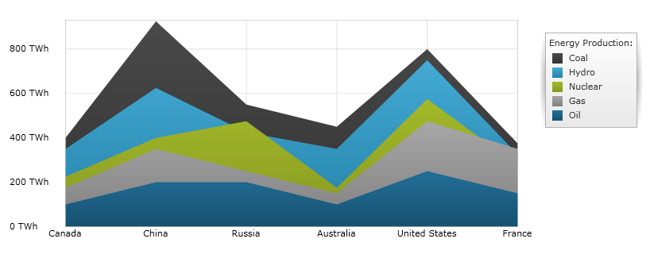
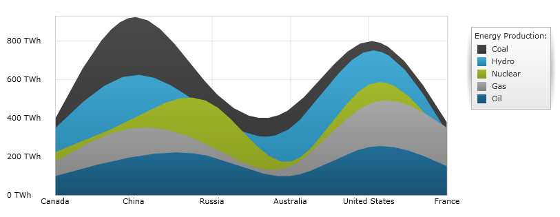

////
|metadata|
{
    "name": "datachart-category-area-series",
    "controlName": ["{DataChartName}"],
    "tags": ["Application Scenarios","Charting","How Do I"],
    "guid": "f28e6391-9f36-4957-874b-81db925c97ba",
    "buildFlags": [],
    "createdOn": "2014-06-05T19:39:00.4502956Z"
}
|metadata|
////

= Area Series

This topic explains, with code examples, how to use the link:{DataChartLink}.AreaSeries.html[AreaSeries] in the link:{DataChartLink}.{DataChartName}.html[{DataChartName}]™ control.

== Overview

The topic is organized as follows:

* <<Introduction,Introduction>>
* <<SeriesPreview,Series Preview>>
* <<SeriesRecommendations,Series Recommendations>>
* <<DataRequirements,Data Requirements>>
* <<DataRenderingRules,Data Rendering Rules>>
* <<DataBindingExample,Data Binding Example>>
* <<RelatedContent,Related Content>>

** link:datachart-axes.html[Axes]
** link:datachart-category-series-overview.html[Category Series]
** link:datachart-category-spline-area-series.html[Spline Area Series]
** link:datachart-series-requirements.html[Series Requirements]

[[Introduction]]
== Introduction

Area Series belongs to a group of link:datachart-category-series-overview.html[Category Series] and it is rendered using a collection of points connected by line segments with the area below the line filled in. Values are represented on the y-axis (NumericYAxis) and categories are displayed on the x-axis (CategoryXAxis or CategoryDateTimeXAxis). Area Series emphasizes the amount of change over a period of time or compares multiple items as well as the relationship of parts to a whole by displaying the total of the plotted values. The link:{DataChartLink}.AreaSeries.html[AreaSeries] is identical to the link:{DataChartLink}.splineAreaSeries.html[SplineAreaSeries] in all aspects except that line connecting data points do not have spline interpolation and smoothing for improved presentation of data. For more conceptual information, comprehension with other types of series, and supported types of axes, refer to the link:datachart-category-series-overview.html[Category Series] and link:datachart-axes.html[Chart Axes] topics.

[[SeriesPreview]]
== Series Preview

Figures 1 and 2 demonstrate how the link:{DataChartLink}.AreaSeries.html[AreaSeries] and link:{DataChartLink}.splineAreaSeries.html[SplineAreaSeries] look when plotted in the {DataChartName} control.

Figure 1: Sample implementation of the link:{DataChartLink}.AreaSeries.html[AreaSeries] type.

Figure 2: Sample implementation of the link:{DataChartLink}.splineAreaSeries.html[SplineAreaSeries] type.

[[SeriesRecommendations]]
== Series Recommendations

Although the {DataChartName} supports plotting unlimited number of various types of series, it is recommended to use the `AreaSeries` with similar types of series. Refer to the link:datachart-multiple-series.html[Multiple Series] topic for information on what types of series are recommended with the Area Series and how to plot multiple types of series.

[[DataRequirements]]
== Data Requirements

While the {DataChartName} control allows you to easily bind it to your own data item, make sure to supply the appropriate amount and type of data that the series requires. If the data does not meet the minimum requirements based on the type of series that you are using, an error is generated by the control. Refer to the link:datachart-series-requirements.html[Series Requirements] and link:datachart-category-series-overview.html[Category Series] topics for more information on data series requirements.

The following is a list of data requirements for the `AreaSeries` type:

* The data item must contain at least one numeric property.  
* The data item may contain an optional string or date time property for labels.
* The data source should contain two or more data items in order to render a line between them.

[[DataRenderingRules]]
== Data Rendering Rules

The Area Series renders data using the following rules:

* Each row in the data column specified as the  link:{DataChartLink}.AnchoredCategorySeries{ApiProp}ValueMemberPath.html[ValueMemberPath] property of the data mapping is plotted as a point of a single line (or area) on the chart, with the number of points in the line equal to the count of rows in the data source.
* The data points delineating the top of the area region connect adjacent rows within the value column.
* The string or date time column that is mapped to the `Label` property on the x-axis is used as the category labels. If the data mapping for `Label` is not specified, default labels are used.
* Category labels are drawn on the x-axis. Data values are drawn on the y-axis.
* When rendering multiple series, the `AreaSeries` type is rendered in layers with each successive series rendered in front of the previous one in the Series collection of the {DataChartName} control. For more information on this feature, refer to the link:datachart-multiple-series.html[Multiple Series] topic.
* The `AreaSeries` type supports plotting their data values above or below specific reference value using the `ReferenceValue` property of the y-axis. For more information on this feature refer to the Axis Reference Value topic.

[[DataBindingExample]]
== Data Binding Example

The code snippet below shows how to bind the link:{DataChartLink}.AreaSeries.html[AreaSeries] object to sample of category data (which is available for download from link:resources-sample-energy-data.html[Sample Energy Data] resource). Refer to the data requirements section of this topic for information about data requirements of the `AreaSeries`.

ifdef::sl,wpf,win-universal[]
*In XAML:*
[source,xaml]
----
xmlns:local="clr-namespace:Infragistics.Models;assembly=YourAppName"
...
<ig:{DataChartName} x:Name="DataChart" >
    <ig:{DataChartName}.Resources>
        <local:EnergyDataSource x:Key="data" />
    </ig:{DataChartName}.Resources>
    <ig:{DataChartName}.Axes>
        <ig:NumericYAxis x:Name="YAxis"  />
        <ig:CategoryXAxis x:Name="XAxis" ItemsSource="{StaticResource data}" 
                          Label="{}{Country}" />
    </ig:{DataChartName}.Axes>
    <ig:{DataChartName}.Series>
        <ig:AreaSeries ItemsSource="{StaticResource data}" ValueMemberPath="Coal" Title="Coal" 
                       XAxis="{Binding ElementName=XAxis}"
                       YAxis="{Binding ElementName=YAxis}">
        </ig:AreaSeries>
        <ig:AreaSeries ItemsSource="{StaticResource data}" ValueMemberPath="Hydro" Title="Hydro" 
                       XAxis="{Binding ElementName=XAxis}"
                       YAxis="{Binding ElementName=YAxis}"
        </ig:AreaSeries>           
        <ig:AreaSeries ItemsSource="{StaticResource data}" ValueMemberPath="Nuclear" Title="Nuclear" 
                       XAxis="{Binding ElementName=XAxis}"
                       YAxis="{Binding ElementName=YAxis}">
        </ig:AreaSeries>
        <ig:AreaSeries ItemsSource="{StaticResource data}" ValueMemberPath="Gas" Title="Gas" 
                       XAxis="{Binding ElementName=XAxis}"
                       YAxis="{Binding ElementName=YAxis}">
        </ig:AreaSeries>
        <ig:AreaSeries ItemsSource="{StaticResource data}" ValueMemberPath="Oil"  Title="Oil" 
                       XAxis="{Binding ElementName=XAxis}"
                       YAxis="{Binding ElementName=YAxis}">
        </ig:AreaSeries>
    </ig:{DataChartName}.Series>
</ig:{DataChartName}>
----
endif::sl,wpf,win-universal[]

ifdef::xamarin[]
*In XAML:*
[source,xaml]
----
xmlns:local="clr-namespace:Infragistics.Models;assembly=YourAppName"
...
<ig:{DataChartName} x:Name="DataChart" >
    <ig:{DataChartName}.Resources>
		<ResourceDictionary>
			<local:EnergyDataSource x:Key="data" />
		</ResourceDictionary>
    </ig:{DataChartName}.Resources>
    <ig:{DataChartName}.Axes>
        <ig:NumericYAxis x:Name="YAxis"  />
        <ig:CategoryXAxis x:Name="XAxis" ItemsSource="{StaticResource data}" 
                          Label="Country" />
    </ig:{DataChartName}.Axes>
    <ig:{DataChartName}.Series>
        <ig:AreaSeries ItemsSource="{StaticResource data}" ValueMemberPath="Coal" Title="Coal" 
                       XAxis="{x:Reference XAxis}" 
                       YAxis="{x:Reference YAxis}">
        </ig:AreaSeries>
        <ig:AreaSeries ItemsSource="{StaticResource data}" ValueMemberPath="Hydro" Title="Hydro" 
                       XAxis="{x:Reference XAxis}" 
                       YAxis="{x:Reference YAxis}">
        </ig:AreaSeries>           
        <ig:AreaSeries ItemsSource="{StaticResource data}" ValueMemberPath="Nuclear" Title="Nuclear" 
                       XAxis="{x:Reference XAxis}" 
                       YAxis="{x:Reference YAxis}">
        </ig:AreaSeries>
        <ig:AreaSeries ItemsSource="{StaticResource data}" ValueMemberPath="Gas" Title="Gas" 
                       XAxis="{x:Reference XAxis}" 
                       YAxis="{x:Reference YAxis}">
        </ig:AreaSeries>
        <ig:AreaSeries ItemsSource="{StaticResource data}" ValueMemberPath="Oil" Title="Oil" 
                       XAxis="{x:Reference XAxis}" 
                       YAxis="{x:Reference YAxis}">
        </ig:AreaSeries>
    </ig:{DataChartName}.Series>
</ig:{DataChartName}>
----
endif::xamarin[]
 
ifdef::wpf,win-universal,xamarin[]
*In C#:*
[source,csharp]
----
var data = new EnergyDataSource(); 
var yAxis = new NumericYAxis();
var xAxis = new CategoryXAxis();
xAxis.{ApiDataSource} = data;
xAxis.Label = "{Country}";

var series = new AreaSeries();
series.{ApiDataSource} = data;
series.ValueMemberPath = "Coal";
series.Title = "Coal";
series.XAxis = xAxis;
series.YAxis = yAxis;
var chart = new {DataChartName}();
chart.Axes.Add(xAxis);
chart.Axes.Add(yAxis);
chart.Series.Add(series);
----
endif::wpf,win-universal,xamarin[]

ifdef::win-forms[]
*In C#:*
[source,csharp]
----
var data = new EnergyDataSource(); 
var yAxis = new NumericYAxis();
var xAxis = new CategoryXAxis();
xAxis.{ApiDataSource} = data;
xAxis.Label = "Country";

var series = new AreaSeries();
series.{ApiDataSource} = data;
series.ValueMemberPath = "Coal";
series.Title = "Coal";
series.XAxis = xAxis;
series.YAxis = yAxis;
var chart = new {DataChartName}();
chart.Axes.Add(xAxis);
chart.Axes.Add(yAxis);
chart.Series.Add(series);
----
endif::win-forms[]
  
ifdef::wpf,win-universal[]
*In Visual Basic:*
[source,vb]
----
Dim data As New EnergyDataSource()
Dim yAxis As New NumericYAxis()
Dim xAxis As New CategoryXAxis()
xAxis.{ApiDataSource} = data
xAxis.Label = "{Country}"

Dim series As New AreaSeries()
series.{ApiDataSource} = data
series.ValueMemberPath = "Coal"
series.Title = "Coal"
series.XAxis = xAxis
series.YAxis = yAxis
Dim chart As New {DataChartName}()
chart.Axes.Add(xAxis)
chart.Axes.Add(yAxis)
chart.Series.Add(series)
----
endif::wpf,win-universal[]

ifdef::win-forms[]
*In Visual Basic:*
[source,vb]
----
Dim data As New EnergyDataSource()
Dim yAxis As New NumericYAxis()
Dim xAxis As New CategoryXAxis()
xAxis.{ApiDataSource} = data
xAxis.Label = "Country"

Dim series As New AreaSeries()
series.{ApiDataSource} = data
series.ValueMemberPath = "Coal"
series.Title = "Coal"
series.XAxis = xAxis
series.YAxis = yAxis
Dim chart As New {DataChartName}()
chart.Axes.Add(xAxis)
chart.Axes.Add(yAxis)
chart.Series.Add(series)

Me.Controls.Add(chart)
----
endif::win-forms[]
 
ifdef::android[]
*In Java:*
[source,java]
----
EnergyDataSource data = new EnergyDataSource();
NumericYAxis yAxis = new NumericYAxis();
CategoryXAxis xAxis = new CategoryXAxis();
xAxis.setDataSource(data);
xAxis.setLabel("Country");

AreaSeries series = new AreaSeries();
series.setDataSource(data);
series.setValueMemberPath("Coal");
series.setTitle("Coal");
series.setXAxis(xAxis);
series.setYAxis(yAxis);
DataChartView chart = new DataChartView(rootView.getContext());
chart.addAxis(xAxis);
chart.addAxis(yAxis);
chart.addSeries(series);
----
endif::android[]

[[RelatedContent]]
== Related Content

* link:datachart-axes.html[Chart Axes]
* link:datachart-category-series-overview.html[Category Series]
* link:datachart-category-spline-area-series.html[Spline Area Series]
* link:datachart-series-requirements.html[Series Requirements]