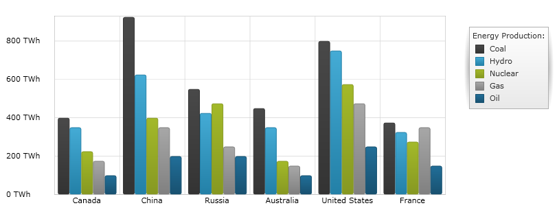
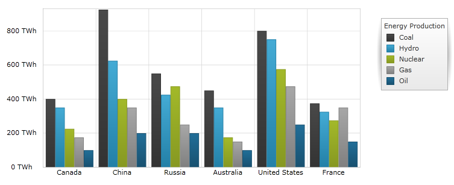

////
|metadata|
{
    "name": "datachart-category-column-series",
    "controlName": ["{DataChartName}"],
    "tags": ["Application Scenarios","Charting","How Do I"],
    "guid": "e176fecc-7f11-4415-9212-913e31a52df4",
    "buildFlags": [],
    "createdOn": "2014-06-05T19:39:00.442293Z"
}
|metadata|
////

= Column Series

This topic explains, with code example, how to use the link:{DataChartLink}.ColumnSeries.html[ColumnSeries] in the link:{DataChartLink}.{DataChartName}.html[{DataChartName}]™ control.

== Overview

The topic is organized as follows:

* <<Introduction,Introduction>>
* <<SeriesPreview,Series Preview>>
* <<SeriesRecommendations,Series Recommendations>>
* <<DataRequirements,Data Requirements>>
* <<DataRenderingRules,Data Rendering Rules>>
* <<CodeExamples,Code Examples>>

** Data Binding
** Corners of Column Series

* <<RelatedContent,Related Content>>

[[Introduction]]
== Introduction

Column Series belongs to a group of link:datachart-category-series-overview.html[Category Series] and it is rendered using a collection of rectangles that extend from the bottom to top of the chart towards the values of data points. Column Series emphasizes the amount of change over a period of time or compares multiple items. Values are represented on the y-axis (NumericYAxis) and categories are displayed on the x-axis (CategoryXAxis or CategoryDateTimeXAxis). Column Series uses the same concepts of data plotting as Bar Series but data points are stretched along a horizontal line (x-axis) rather than vertical line (y-axis). In other words, the link:{DataChartLink}.ColumnSeries.html[ColumnSeries] is rendered like the link:{DataChartLink}.BarSeries.html[BarSeries] but with 90 degrees counter-clockwise rotation. For more conceptual information and comprehension with other types of series and supported types of axes, refer to the link:datachart-category-series-overview.html[Category Series] and link:datachart-axes.html[Chart Axes] topics.

[[SeriesPreview]]
== Series Preview

Figures 1 and 2 demonstrate how the link:{DataChartLink}.ColumnSeries.html[ColumnSeries] and the link:{DataChartLink}.BarSeries.html[BarSeries] look when plotted in the {DataChartName} control.

Figure 1: Sample implementation of the link:{DataChartLink}.ColumnSeries.html[ColumnSeries] series type.

image::images/Column_Series__02.png[]

Figure 2: Sample implementation of the link:{DataChartLink}.BarSeries.html[BarSeries] series type.

[[SeriesRecommendations]]
== Series Recommendations

Although the {DataChartName} control supports plotting unlimited number of various types of series, it is recommended to use the link:{DataChartLink}.ColumnSeries.html[ColumnSeries] with similar types of series. Refer to the link:datachart-multiple-series.html[Multiple Series] topic for information on what types of series are recommended with the link:{DataChartLink}.ColumnSeries.html[ColumnSeries] and how to plot multiple types of series.

[[DataRequirements]]
== Data Requirements

While the {DataChartName} control allows you to easily bind it to your own data model, make sure you supply the appropriate amount and type of data that the series requires. If the data does not meet the minimum requirements based on the type of series that you are using, the control will encounter an error. Refer to the link:datachart-series-requirements.html[Series Requirements] and link:datachart-category-series-overview.html[Category Series] topics for more information on data series requirements.

The following is a list of data requirements for the `ColumnSeries` type:

* The data model must contain at least one numeric property.
* The data model may contain an optional string or date time property for labels.
* The data source should contain at least one data item.

[[DataRenderingRules]]
== Data Rendering Rules

The `ColumnSeries` renders data using the following rules:

* Each row in the data column specified as the  link:{DataChartLink}.AnchoredCategorySeries{ApiProp}ValueMemberPath.html[ValueMemberPath] property of the data mapping is drawn as a separate vertical bar.
* The string or date time field that is specified as the `Label` property of data mapping on the x-axis is used as the category labels. If the `Label` token is not specified, default labels are used.
* Category labels are drawn on the x-axis. Data values are drawn on the y-axis.
* When rendering, multiple series of the `ColumnSeries` type that share the same x-axis (see the link:datachart-multiple-series.html[Multiple Series] topic) are rendered in clusters where each cluster represents a data point. The first series in the Series collection of the {DataChartName} control renders as a column on the left of the cluster. Each successive series gets rendered on the right of the previous series. However, if series do not share x-axis, they are rendered in layers with each successive series rendered in front of the previous one.
* The `ColumnSeries` type supports plotting their columns above or below specific reference value using the ReferenceValue property of the y-axis. 

[[CodeExamples]]
== Code Examples

=== Data Binding  

The code snippet below shows how to bind the link:{DataChartLink}.ColumnSeries.html[ColumnSeries] object to a sample of category data (which is available for download from link:resources-sample-energy-data.html[Sample Energy Data] resource). Refer to the data requirements section of this topic for information about data requirements for the `ColumnSeries`.
 

ifdef::sl,wpf,win-universal[]
*In XAML:*
[source,xaml]
----
xmlns:local="clr-namespace:Infragistics.Models;assembly=YourAppName"
...
<ig:{DataChartName} x:Name="DataChart" >
    <ig:{DataChartName}.Resources>
        <local:EnergyDataSource x:Key="data" />
    </ig:{DataChartName}.Resources>
    <ig:{DataChartName}.Axes>
        <ig:NumericYAxis x:Name="YAxis"  />
        <ig:CategoryXAxis x:Name="XAxis" ItemsSource="{StaticResource data}" 
                          Label="{}{Country}" />
    </ig:{DataChartName}.Axes>
    <ig:{DataChartName}.Series>
        <ig:ColumnSeries ItemsSource="{StaticResource data}" ValueMemberPath="Coal" Title="Coal" 
                       XAxis="{Binding ElementName=XAxis}"
                       YAxis="{Binding ElementName=YAxis}">
        </ig:ColumnSeries>
        <ig:ColumnSeries ItemsSource="{StaticResource data}" ValueMemberPath="Hydro" Title="Hydro" 
                       XAxis="{Binding ElementName=XAxis}"
                       YAxis="{Binding ElementName=YAxis}"
        </ig:ColumnSeries>           
        <ig:ColumnSeries ItemsSource="{StaticResource data}" ValueMemberPath="Nuclear" Title="Nuclear" 
                       XAxis="{Binding ElementName=XAxis}"
                       YAxis="{Binding ElementName=YAxis}">
        </ig:ColumnSeries>
        <ig:ColumnSeries ItemsSource="{StaticResource data}" ValueMemberPath="Gas" Title="Gas" 
                       XAxis="{Binding ElementName=XAxis}"
                       YAxis="{Binding ElementName=YAxis}">
        </ig:ColumnSeries>
        <ig:ColumnSeries ItemsSource="{StaticResource data}" ValueMemberPath="Oil"  Title="Oil" 
                       XAxis="{Binding ElementName=XAxis}"
                       YAxis="{Binding ElementName=YAxis}">
        </ig:ColumnSeries>
    </ig:{DataChartName}.Series>
</ig:{DataChartName}>
----
endif::sl,wpf,win-universal[]

ifdef::xamarin[]
*In XAML:*
[source,xaml]
----
xmlns:local="clr-namespace:Infragistics.Models;assembly=YourAppName"
...
<ig:{DataChartName} x:Name="DataChart" >
    <ig:{DataChartName}.Resources>
		<ResourceDictionary>
			<local:EnergyDataSource x:Key="data" />
		</ResourceDictionary>
    </ig:{DataChartName}.Resources>
    <ig:{DataChartName}.Axes>
        <ig:NumericYAxis x:Name="YAxis"  />
        <ig:CategoryXAxis x:Name="XAxis" ItemsSource="{StaticResource data}" 
                          Label="Country" />
    </ig:{DataChartName}.Axes>
    <ig:{DataChartName}.Series>
        <ig:ColumnSeries ItemsSource="{StaticResource data}" ValueMemberPath="Coal" Title="Coal" 
                       XAxis="{x:Reference XAxis}" 
                       YAxis="{x:Reference YAxis}">
        </ig:ColumnSeries>
        <ig:ColumnSeries ItemsSource="{StaticResource data}" ValueMemberPath="Hydro" Title="Hydro" 
                       XAxis="{x:Reference XAxis}" 
                       YAxis="{x:Reference YAxis}">
        </ig:ColumnSeries>           
        <ig:ColumnSeries ItemsSource="{StaticResource data}" ValueMemberPath="Nuclear" Title="Nuclear" 
                       XAxis="{x:Reference XAxis}" 
                       YAxis="{x:Reference YAxis}">
        </ig:ColumnSeries>
        <ig:ColumnSeries ItemsSource="{StaticResource data}" ValueMemberPath="Gas" Title="Gas" 
                       XAxis="{x:Reference XAxis}" 
                       YAxis="{x:Reference YAxis}">
        </ig:ColumnSeries>
        <ig:ColumnSeries ItemsSource="{StaticResource data}" ValueMemberPath="Oil" Title="Oil" 
                       XAxis="{x:Reference XAxis}" 
                       YAxis="{x:Reference YAxis}">
        </ig:ColumnSeries>
    </ig:{DataChartName}.Series>
</ig:{DataChartName}>
----
endif::xamarin[]
 
ifdef::wpf,win-universal,xamarin[]
*In C#:*
[source,csharp]
----
var data = new EnergyDataSource(); 
var yAxis = new NumericYAxis();
var xAxis = new CategoryXAxis();
xAxis.{ApiDataSource} = data;
xAxis.Label = "{Country}";

var series = new ColumnSeries();
series.{ApiDataSource} = data;
series.ValueMemberPath = "Coal";
series.Title = "Coal";
series.XAxis = xAxis;
series.YAxis = yAxis;
var chart = new {DataChartName}();
chart.Axes.Add(xAxis);
chart.Axes.Add(yAxis);
chart.Series.Add(series);
----
endif::wpf,win-universal,xamarin[]

ifdef::win-forms[]
*In C#:*
[source,csharp]
----
var data = new EnergyDataSource(); 
var yAxis = new NumericYAxis();
var xAxis = new CategoryXAxis();
xAxis.{ApiDataSource} = data;
xAxis.Label = "Country";

var series = new ColumnSeries();
series.{ApiDataSource} = data;
series.ValueMemberPath = "Coal";
series.Title = "Coal";
series.XAxis = xAxis;
series.YAxis = yAxis;
var chart = new {DataChartName}();
chart.Axes.Add(xAxis);
chart.Axes.Add(yAxis);
chart.Series.Add(series);
----
endif::win-forms[]
  
ifdef::wpf,win-universal[]
*In Visual Basic:*
[source,vb]
----
Dim data As New EnergyDataSource()
Dim yAxis As New NumericYAxis()
Dim xAxis As New CategoryXAxis()
xAxis.{ApiDataSource} = data
xAxis.Label = "Country"

Dim series As New ColumnSeries()
series.{ApiDataSource} = data
series.ValueMemberPath = "Coal"
series.Title = "Coal"
series.XAxis = xAxis
series.YAxis = yAxis
Dim chart As New {DataChartName}()
chart.Axes.Add(xAxis)
chart.Axes.Add(yAxis)
chart.Series.Add(series)
----
endif::wpf,win-universal[]

ifdef::win-forms[]
*In Visual Basic:*
[source,vb]
----
Dim data As New EnergyDataSource()
Dim yAxis As New NumericYAxis()
Dim xAxis As New CategoryXAxis()
xAxis.{ApiDataSource} = data
xAxis.Label = "{Country}"

Dim series As New ColumnSeries()
series.{ApiDataSource} = data
series.ValueMemberPath = "Coal"
series.Title = "Coal"
series.XAxis = xAxis
series.YAxis = yAxis
Dim chart As New {DataChartName}()
chart.Axes.Add(xAxis)
chart.Axes.Add(yAxis)
chart.Series.Add(series)

Me.Controls.Add(chart)
----
endif::win-forms[] 

ifdef::android[]
*In Java:*
[source,java]
----
EnergyDataSource data = new EnergyDataSource();
NumericYAxis yAxis = new NumericYAxis();
CategoryXAxis xAxis = new CategoryXAxis();
xAxis.setDataSource(data);
xAxis.setLabel("Country");

ColumnSeries series = new ColumnSeries();
series.setDataSource(data);
series.setValueMemberPath("Coal");
series.setTitle("Coal");
series.setXAxis(xAxis);
series.setYAxis(yAxis);
DataChartView chart = new DataChartView(rootView.getContext());
chart.addAxis(xAxis);
chart.addAxis(yAxis);
chart.addSeries(series);
----
endif::android[]

ifdef::sl,wpf,win-universal,xamarin,android[]
=== Corners of Column Series

Column Series allow setting corners of visual bar elements using the RadiusX and RadiusY properties. Increasing values of these properties will curve the corners of column elements while decreasing the value makes columns more rectangular. The following code snippet demonstrates how to set round corners on the ColumnSeries.

ifdef::xaml[]
*In XAML:*
[source,xaml]
----
<ig:ColumnSeries RadiusX="10" RadiusY="10" />
----
endif::xaml[]

ifdef::sl,wpf,win-universal,xamarin[]
*In C#:*
[source,csharp]
----
var series = new ColumnSeries();
series.RadiusX = 10;
series.RadiusY = 10;
...
DataChart.Series.Add(series);
----
endif::sl,wpf,win-universal,xamarin[]

ifdef::sl,wpf,win-universal[]
*In Visual Basic:*
[source,vb]
----
Dim series As New ColumnSeries()
series.RadiusX = 10
series.RadiusY = 10
...
chart.Series.Add(series)
----
endif::sl,wpf,win-universal[]

ifdef::android[]
*In Java:*
[source,java]
----
ColumnSeries series = new ColumnSeries();
series.setRadiusX(10);
series.setRadiusY(10);
...
chart.addSeries(series);
----
endif::android[]

image::images/Column_Series__03.png[]

Figure 3: The link:{DataChartLink}.ColumnSeries.html[ColumnSeries] with round corners.

Figure 4: The link:{DataChartLink}.ColumnSeries.html[ColumnSeries] with rectangular corners.

endif::sl,wpf,win-universal,xamarin,android[]

[[RelatedContent]]
== Related Content

* link:datachart-series.html[Series]
* link:datachart-category-series-overview.html[Category Series]
* link:datachart-series-requirements.html[Series Requirements]