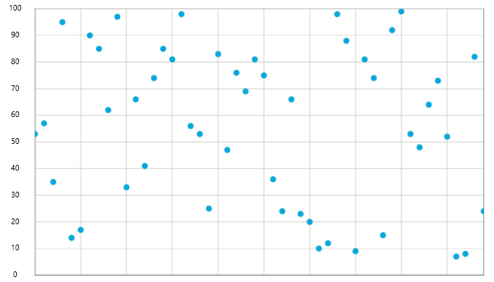

////
|metadata|
{
    "name": "datachart-category-point-series",
    "controlName": ["{DataChartName}"],
    "tags": ["Charting","Data Binding","Data Presentation"],
    "guid": "ba055edf-a657-4212-ab9f-f2d3935015be",
    "buildFlags": [],
    "createdOn": "2014-06-05T19:39:00.4522967Z"
}
|metadata|
////

= Point Series

=== Purpose

This topic demonstrates the procedure with code examples, how to display Point series in link:{DataChartLink}.{DataChartName}.html[{DataChartName}]™.

=== Required Background

The following table lists the materials required as a prerequisite to understanding this topic.

[options="header", cols="a,a"]
|====
| *Topic* | *Purpose* 

| link:datachart-using-datachart.html[Configuring {DataChartName}]
|This section is your gateway to important conceptual and task-based information that will help you to use the various features and functionalities provided by the _{DataChartName}_™ control.

|====

=== In This Topic

This topic contains the following sections:
 
* <<_Ref321919323,Introduction>>
* <<SeriesRecommendations,Series Recommendations>>
* <<DataRequirements,Data Requirements>>
* <<DataRenderingRules,Data Rendering Rules>>
* <<DataBindingExample,Data Binding Example>>
* <<_Ref321919425,Related Content>>
 

[[_Ref321919323]]

=== Introduction

The Point Series is one of the chart types in _{DataChartName}’s_  family of category series. It is designed to render the data as points or markers on the chart. The numeric values correspond to Y axis, and the X axis is used for displaying the labels.

The {DataChartName} supports single or multiple point series objects to be rendered, meaning one collection or more than one collection of data.

Figure 1: Sample implementation of a single `PointSeries` type.

image::images/xamDataChart_RT_Point_Series_2.png[]

Figure 2: Sample implementation of multiple `PointSeries` types.

[[SeriesRecommendations]]
=== Series Recommendations

Although the {DataChartName} supports plotting unlimited number of various types of series, it is recommended to use the `PointSeries` with similar types of series. Refer to the link:datachart-multiple-series.html[Multiple Series] topic for information on what types of series are recommended with the Area Series and how to plot multiple types of series.

[[DataRequirements]]
=== Data Requirements

While the {DataChartName} control allows you to easily bind it to your own data item, make sure to supply the appropriate amount and type of data that the series requires. If the data does not meet the minimum requirements based on the type of series that you are using, an error is generated by the control. Refer to the link:datachart-series-requirements.html[Series Requirements] and link:datachart-category-series-overview.html[Category Series] topics for more information on data series requirements.

The following is a list of data requirements for the `PointSeries` type:

* The data item must contain at least one numeric property.  
* The data item may contain an optional string or date time property for labels.
* The data source should contain at least one data item in order to render points/markers of the series.

[[DataRenderingRules]]
=== Data Rendering Rules

The `PointSeries` renders data using the following rules:

* Each row in the data column specified as the link:{DataChartLink}.AnchoredCategorySeries{ApiProp}ValueMemberPath.html[ValueMemberPath] property of the data mapping is plotted as a point/marker in the chart, with the number of points equal to the count of rows in the data source.
* The string or date time column that is mapped to the `Label` property on the x-axis is used as the category labels. If the data mapping for `Label` is not specified, default labels are used.
* Category labels are drawn on the x-axis. Data values are drawn on the y-axis.
* When rendering, multiple instances of the `PointSeries` type is rendered in layers with each successive series rendered in front of the previous one in the `Series` collection of the {DataChartName} control. For more information on this feature, refer to the link:datachart-multiple-series.html[Multiple Series] topic.
 
[[DataBindingExample]]
=== Data Binding Example

The code snippet below shows how to bind the link:{DataChartLink}.PointSeries.html[PointSeries] object to sample of category data (which is available for download from link:resources-sample-energy-data.html[Sample Energy Data] resource). Refer to the data requirements section of this topic for information about data requirements of the `PointSeries`.
 

ifdef::sl,wpf,win-universal[]
*In XAML:*
[source,xaml]
----
xmlns:local="clr-namespace:Infragistics.Models;assembly=YourAppName"
...
<ig:{DataChartName} x:Name="DataChart" >
    <ig:{DataChartName}.Resources>
        <local:EnergyDataSource x:Key="data" />
    </ig:{DataChartName}.Resources>
    <ig:{DataChartName}.Axes>
        <ig:NumericYAxis x:Name="YAxis"  />
        <ig:CategoryXAxis x:Name="XAxis" ItemsSource="{StaticResource data}" 
                          Label="{}{Country}" />
    </ig:{DataChartName}.Axes>
    <ig:{DataChartName}.Series>
        <ig:PointSeries ItemsSource="{StaticResource data}" ValueMemberPath="Coal" Title="Coal" 
                       XAxis="{Binding ElementName=XAxis}"
                       YAxis="{Binding ElementName=YAxis}">
        </ig:PointSeries>
        <ig:PointSeries ItemsSource="{StaticResource data}" ValueMemberPath="Hydro" Title="Hydro" 
                       XAxis="{Binding ElementName=XAxis}"
                       YAxis="{Binding ElementName=YAxis}"
        </ig:PointSeries>           
        <ig:PointSeries ItemsSource="{StaticResource data}" ValueMemberPath="Nuclear" Title="Nuclear" 
                       XAxis="{Binding ElementName=XAxis}"
                       YAxis="{Binding ElementName=YAxis}">
        </ig:PointSeries>
        <ig:PointSeries ItemsSource="{StaticResource data}" ValueMemberPath="Gas" Title="Gas" 
                       XAxis="{Binding ElementName=XAxis}"
                       YAxis="{Binding ElementName=YAxis}">
        </ig:PointSeries>
        <ig:PointSeries ItemsSource="{StaticResource data}" ValueMemberPath="Oil"  Title="Oil" 
                       XAxis="{Binding ElementName=XAxis}"
                       YAxis="{Binding ElementName=YAxis}">
        </ig:PointSeries>
    </ig:{DataChartName}.Series>
</ig:{DataChartName}>
----
endif::sl,wpf,win-universal[]

ifdef::xamarin[]
*In XAML:*
[source,xaml]
----
xmlns:local="clr-namespace:Infragistics.Models;assembly=YourAppName"
...
<ig:{DataChartName} x:Name="DataChart" >
    <ig:{DataChartName}.Resources>
		<ResourceDictionary>
			<local:EnergyDataSource x:Key="data" />
		</ResourceDictionary>
    </ig:{DataChartName}.Resources>
    <ig:{DataChartName}.Axes>
        <ig:NumericYAxis x:Name="YAxis"  />
        <ig:CategoryXAxis x:Name="XAxis" ItemsSource="{StaticResource data}" 
                          Label="Country" />
    </ig:{DataChartName}.Axes>
    <ig:{DataChartName}.Series>
        <ig:PointSeries ItemsSource="{StaticResource data}" ValueMemberPath="Coal" Title="Coal" 
                       XAxis="{x:Reference XAxis}" 
                       YAxis="{x:Reference YAxis}">
        </ig:PointSeries>
        <ig:PointSeries ItemsSource="{StaticResource data}" ValueMemberPath="Hydro" Title="Hydro" 
                       XAxis="{x:Reference XAxis}" 
                       YAxis="{x:Reference YAxis}">
        </ig:PointSeries>           
        <ig:PointSeries ItemsSource="{StaticResource data}" ValueMemberPath="Nuclear" Title="Nuclear" 
                       XAxis="{x:Reference XAxis}" 
                       YAxis="{x:Reference YAxis}">
        </ig:PointSeries>
        <ig:PointSeries ItemsSource="{StaticResource data}" ValueMemberPath="Gas" Title="Gas" 
                       XAxis="{x:Reference XAxis}" 
                       YAxis="{x:Reference YAxis}">
        </ig:PointSeries>
        <ig:PointSeries ItemsSource="{StaticResource data}" ValueMemberPath="Oil" Title="Oil" 
                       XAxis="{x:Reference XAxis}" 
                       YAxis="{x:Reference YAxis}">
        </ig:PointSeries>
    </ig:{DataChartName}.Series>
</ig:{DataChartName}>
----
endif::xamarin[]
 
ifdef::wpf,win-universal,win-forms,xamarin[]
*In C#:*
[source,csharp]
----
var data = new EnergyDataSource(); 
var yAxis = new NumericYAxis();
var xAxis = new CategoryXAxis();
xAxis.{ApiDataSource} = data;
xAxis.Label = "{Country}";

var series = new PointSeries();
series.{ApiDataSource} = data;
series.ValueMemberPath = "Coal";
series.Title = "Coal";
series.XAxis = xAxis;
series.YAxis = yAxis;
var chart = new {DataChartName}();
chart.Axes.Add(xAxis);
chart.Axes.Add(yAxis);
chart.Series.Add(series);
----
endif::wpf,win-universal,win-forms,xamarin[]
  
ifdef::wpf,win-universal,win-forms[]
*In Visual Basic:*
[source,vb]
----
Dim data As New EnergyDataSource()
Dim yAxis As New NumericYAxis()
Dim xAxis As New CategoryXAxis()
xAxis.{ApiDataSource} = data;
xAxis.Label = "{Country}"

Dim series As New PointSeries()
series.{ApiDataSource} = data
series.ValueMemberPath = "Coal"
series.Title = "Coal"
series.XAxis = xAxis
series.YAxis = yAxis
Dim chart As New {DataChartName}()
chart.Axes.Add(xAxis)
chart.Axes.Add(yAxis)
chart.Series.Add(series)
----
endif::wpf,win-universal,win-forms[]

ifdef::android[]
*In Java:*
[source,java]
----
EnergyDataSource data = new EnergyDataSource();
NumericYAxis yAxis = new NumericYAxis();
CategoryXAxis xAxis = new CategoryXAxis();
xAxis.setDataSource(data);
xAxis.setLabel("Country");

PointSeries series = new PointSeries();
series.setDataSource(data);
series.setValueMemberPath("Coal");
series.setTitle("Coal");
series.setXAxis(xAxis);
series.setYAxis(yAxis);
DataChartView chart = new DataChartView(rootView.getContext());
chart.addAxis(xAxis);
chart.addAxis(yAxis);
chart.addSeries(series);
----
endif::android[]
 
[[_Ref321919425]]
=== Related Content
 

The following topics provide additional information related to this topic.

[options="header", cols="a,a"]
|====
| *Topic* | *Purpose* 

| link:datachart-category-series-overview.html[Category Series]
|This topic explains various types of Category Series in the _{DataChartName}_ control.

| link:datachart-series-requirements.html[Series Requirements]
|The _{DataChartName}_ control supports a number of various series, and some of these series require specific axis types and data mapping in order for them to render correctly on the chart plot area.

|====