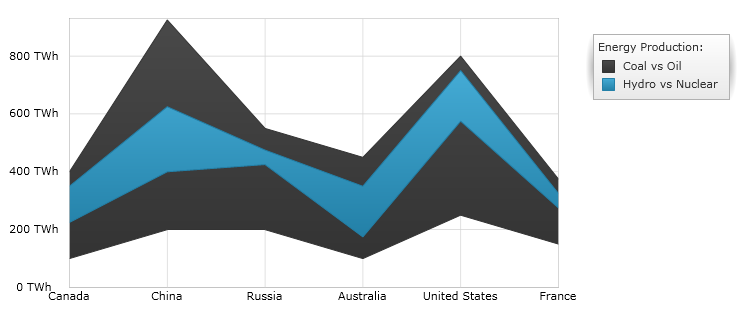
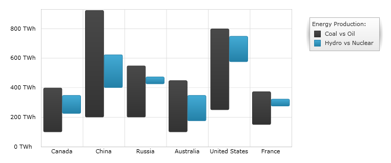

////
|metadata|
{
    "name": "datachart-category-range-area-series",
    "controlName": ["{DataChartName}"],
    "tags": ["Application Scenarios","Charting","How Do I"],
    "guid": "671e9cba-a555-4c0a-87f3-965bee173f75",
    "buildFlags": [],
    "createdOn": "2014-06-05T19:39:00.4462945Z"
}
|metadata|
////

= Range Area Series

This topic explains, with code examples, how to use the link:{DataChartLink}.rangeAreaSeries.html[RangeAreaSeries] in the link:{DataChartLink}.{DataChartName}.html[{DataChartName}]™ control.

== Overview

The topic is organized as follows:

* <<Introduction,Introduction>>
* <<SeriesPreview,Series Preview>>
* <<SeriesRecommendations,Series Recommendations>>
* <<DataRequirements,Data Requirements>>
* <<DataRenderingRules,Data Rendering Rules>>
* <<DataBindingExample,Data Binding Example>>
* <<RelatedContent,Related Content>>

[[Introduction]]
== Introduction

Range Area Series belongs to a group of link:datachart-category-series-overview.html[Category Series] and it is rendered using two lines with the area between the lines filled in. This type of series emphasizes the amount of change between low values and high values in the same data point over a period of time or compares multiple items. Range values are represented on the y-axis (NumericYAxis) and categories are displayed on the x-axis (CategoryXAxis or CategoryDateTimeXAxis). The link:{DataChartLink}.rangeAreaSeries.html[RangeAreaSeries] is identical to the link:{DataChartLink}.RangeColumnSeries.html[RangeColumnSeries] in all aspects except that the ranges are represented as filled area rather than a set of vertical columns. For more conceptual information, comprehension with other types of series, and supported types of axes, refer to the link:datachart-category-series-overview.html[Category Series] and link:datachart-axes.html[Chart Axes] topics.

[[SeriesPreview]]
== Series Preview

Figures 1 and 2 demonstrate how the link:{DataChartLink}.rangeAreaSeries.html[RangeAreaSeries] and link:{DataChartLink}.RangeColumnSeries.html[RangeColumnSeries] look when plotted in the {DataChartName} control.

Figure 1: Sample implementation of the link:{DataChartLink}.rangeAreaSeries.html[RangeAreaSeries] type.

Figure 2: Sample implementation of the link:{DataChartLink}.RangeColumnSeries.html[RangeColumnSeries] type.

[[SeriesRecommendations]]
== Series Recommendations

Although the {DataChartName} supports plotting unlimited number of various types of series, it is recommended to use the link:{DataChartLink}.rangeAreaSeries.html[RangeAreaSeries] with similar types of series. Refer to the link:datachart-multiple-series.html[Multiple Series] topic for information on what types of series are recommended with the link:{DataChartLink}.rangeAreaSeries.html[RangeAreaSeries] and how to plot multiple types of series.

[[DataRequirements]]
== Data Requirements

While the {DataChartName} control allows you to easily bind it to your own data model, make sure to supply the appropriate amount and type of data that the series requires. If the data does not meet the minimum requirements based on the type of series that you are using, an error is generated by the control. Refer to the link:datachart-series-requirements.html[Series Requirements] and link:datachart-category-series-overview.html[Category Series] topics for more information on data series requirements.

The following is a list of data requirements for the `RangeAreaSeries` type:

* The data model must contain at least two numeric data columns for rendering the range between the values.
* The data model may contain an optional string or date time field for labels
* The data source should contain at least two data items.

[[DataRenderingRules]]
== Data Rendering Rules

The `RangeAreaSeries` renders data using the following rules:

* Each row with two data values specified as the  link:{DataChartLink}.RangeCategorySeries{ApiProp}LowMemberPath.html[LowMemberPath] and  link:{DataChartLink}.RangeCategorySeries{ApiProp}HighMemberPath.html[HighMemberPath] properties of the data mapping is drawn as a pair of lines representing the difference between of these data values.
* The string or DateTime column that is mapped to the `Label` property of data mapping on the x-axis is used as the category labels. If the data mapping for `Label` is not specified, default labels are used.
* Category labels are drawn on the x-axis. Data values are drawn on the y-axis.
* When rendering, multiple series of the `RangeAreaSeries` type is rendered in layers with each successive series rendered in front of the previous one in the `Series` collection of the {DataChartName} control.

[[DataBindingExample]]
== Data Binding Example

The code snippet below shows how to bind the link:{DataChartLink}.rangeAreaSeries.html[RangeAreaSeries] object to sample of category data (which is available for download from link:resources-sample-energy-data.html[Sample Energy Data] resource). Refer to the data requirements section of this topic for information about data requirements for the `RangeAreaSeries`.
 

ifdef::sl,wpf,win-universal[]
*In XAML:*
[source,xaml]
----
xmlns:local="clr-namespace:Infragistics.Models;assembly=YourAppName"
...
<ig:{DataChartName} x:Name="DataChart" >
    <ig:{DataChartName}.Resources>
        <local:EnergyDataSource x:Key="data" />
    </ig:{DataChartName}.Resources>
    <ig:{DataChartName}.Axes>
        <ig:NumericYAxis x:Name="YAxis"  />
        <ig:CategoryXAxis x:Name="XAxis" ItemsSource="{StaticResource data}" 
                          Label="{}{Country}" />
    </ig:{DataChartName}.Axes>
    <ig:{DataChartName}.Series>
        <ig:RangeAreaSeries ItemsSource="{StaticResource data}" 
                            HighemberPath="Coal" LowMemberPath="Oil"  
                            Title="Coal vs Oil" 
                            XAxis="{Binding ElementName=XAxis}" 
                            YAxis="{Binding ElementName=YAxis}" >
        </ig:RangeAreaSeries >
        <ig:RangeAreaSeries ItemsSource="{StaticResource data}" 
                            HighemberPath="Hydro" LowMemberPath="Nuclear"  
                            Title="Hydro vs Nuclear" 
                            XAxis="{Binding ElementName=XAxis}" 
                            YAxis="{Binding ElementName=YAxis}" >
        </ig:RangeAreaSeries >          
    </ig:{DataChartName}.Series>
</ig:{DataChartName}>
----
endif::sl,wpf,win-universal[]

ifdef::xamarin[]
*In XAML:*
[source,xaml]
----
xmlns:local="clr-namespace:Infragistics.Models;assembly=YourAppName"
...
<ig:{DataChartName} x:Name="DataChart" >
    <ig:{DataChartName}.Resources>
		<ResourceDictionary>
			<local:EnergyDataSource x:Key="data" />
		</ResourceDictionary>	
    </ig:{DataChartName}.Resources>
    <ig:{DataChartName}.Axes>
        <ig:NumericYAxis x:Name="YAxis"  />
        <ig:CategoryXAxis x:Name="XAxis" ItemsSource="{StaticResource data}" 
                          Label="Country" />
    </ig:{DataChartName}.Axes>
    <ig:{DataChartName}.Series>
        <ig:RangeAreaSeries ItemsSource="{StaticResource data}" 
                            HighemberPath="Coal" LowMemberPath="Oil"  
                            Title="Coal vs Oil"  
                            XAxis="{x:Reference XAxis}"  
                            YAxis="{x:Reference YAxis}">
        </ig:RangeAreaSeries >
        <ig:RangeAreaSeries ItemsSource="{StaticResource data}" 
                            HighemberPath="Hydro" LowMemberPath="Nuclear"  
                            Title="Hydro vs Nuclear"  
                            XAxis="{x:Reference XAxis}"  
                            YAxis="{x:Reference YAxis}">
        </ig:RangeAreaSeries >     
    </ig:{DataChartName}.Series>
</ig:{DataChartName}>
----
endif::xamarin[]
  

ifdef::win-forms[]
*In C#:*
[source,csharp]
----
var data = new EnergyDataSource(); 
var yAxis = new NumericYAxis();
var xAxis = new CategoryXAxis();
xAxis.DataSource = data;
xAxis.Label = "{Country}";

var series1 = new RangeAreaSeries();
series1.DataSource = data;
series1.HighMemberPath = "Coal";
series1.LowMemberPath = "Oil";
series1.Title = "Coal vs Oil";
series1.XAxis = xAxis;
series1.YAxis = yAxis;
var series2 = new RangeAreaSeries();
series2.DataSource = data;
series2.HighMemberPath = "Hydro";
series2.LowMemberPath = "Nuclear";
series2.Title = "Hydro vs Nuclear";
series2.XAxis = xAxis;
series2.YAxis = yAxis;
var chart = new {DataChartName}();
chart.Axes.Add(xAxis);
chart.Axes.Add(yAxis);
chart.Series.Add(series1);
chart.Series.Add(series2);
----
endif::win-forms[]

ifdef::xaml[]
*In C#:*
[source,csharp]
----
var data = new EnergyDataSource(); 
var yAxis = new NumericYAxis();
var xAxis = new CategoryXAxis();
xAxis.ItemsSource = data;
xAxis.Label = "Country";

var series1 = new RangeAreaSeries();
series1.ItemsSource = data;
series1.HighMemberPath = "Coal";
series1.LowMemberPath = "Oil";
series1.Title = "Coal vs Oil";
series1.XAxis = xAxis;
series1.YAxis = yAxis;
var series2 = new RangeAreaSeries();
series2.ItemsSource = data;
series2.HighMemberPath = "Hydro";
series2.LowMemberPath = "Nuclear";
series2.Title = "Hydro vs Nuclear";
series2.XAxis = xAxis;
series2.YAxis = yAxis;
var chart = new {DataChartName}();
chart.Axes.Add(xAxis);
chart.Axes.Add(yAxis);
chart.Series.Add(series1);
chart.Series.Add(series2);
----
endif::xaml[]

ifdef::win-forms[]
*In Visual Basic:*
[source,vb]
----
Dim data As New EnergyDataSource()
Dim yAxis As New NumericYAxis()
Dim xAxis As New CategoryXAxis()
xAxis.DataSource = data;
xAxis.Label = "{Country}"

Dim series1 As New RangeAreaSeries()
series1.DataSource = data
series1.HighemberPath = "Coal"
series1.LowMemberPath = "Oil"
series1.Title = "Coal vs Oil"
series1.XAxis = xAxis
series1.YAxis = yAxis
Dim series2 As New RangeAreaSeries()
series2.DataSource = data
series2.HighemberPath = "Hydro"
series2.LowMemberPath = "Nuclear"
series2.Title = "Hydro vs Nuclear"
series2.XAxis = xAxis
series2.YAxis = yAxis
Dim chart As New {DataChartName}()
chart.Axes.Add(xAxis)
chart.Axes.Add(yAxis)
chart.Series.Add(series1)
chart.Series.Add(series2)
----
endif::win-forms[]

ifdef::sl,wpf,win-universal[]
*In Visual Basic:*
[source,vb]
----
Dim data As New EnergyDataSource()
Dim yAxis As New NumericYAxis()
Dim xAxis As New CategoryXAxis()
xAxis.ItemsSource = data;
xAxis.Label = "Country"

Dim series1 As New RangeAreaSeries()
series1.ItemsSource = data
series1.HighemberPath = "Coal"
series1.LowMemberPath = "Oil"
series1.Title = "Coal vs Oil"
series1.XAxis = xAxis
series1.YAxis = yAxis
Dim series2 As New RangeAreaSeries()
series2.ItemsSource = data
series2.HighemberPath = "Hydro"
series2.LowMemberPath = "Nuclear"
series2.Title = "Hydro vs Nuclear"
series2.XAxis = xAxis
series2.YAxis = yAxis
Dim chart As New {DataChartName}()
chart.Axes.Add(xAxis)
chart.Axes.Add(yAxis)
chart.Series.Add(series1)
chart.Series.Add(series2)
----
endif::sl,wpf,win-universal[]

ifdef::android[]
*In Java:*
[source,java]
----
EnergyDataSource data = new EnergyDataSource();
NumericYAxis yAxis = new NumericYAxis();
CategoryXAxis xAxis = new CategoryXAxis();
xAxis.setDataSource(data);
xAxis.setLabel("Country");

RangeAreaSeries series1 = new RangeAreaSeries();
series1.setDataSource(data);
series1.setHighemberPath("Coal");
series1.setLowMemberPath("Oil");
series1.setTitle("Coal vs Oil");
series1.setXAxis(xAxis);
series1.setYAxis(yAxis);
RangeAreaSeries series2 = new RangeAreaSeries();
series2.setDataSource(data);
series2.setHighemberPath("Hydro");
series2.setLowMemberPath("Nuclear");
series2.setTitle("Hydro vs Nuclear");
series2.setXAxis(xAxis);
series2.setYAxis(yAxis);
DataChartView chart = new DataChartView(rootView.getContext());
chart.addAxis(xAxis);
chart.addAxis(yAxis);
chart.addSeries(series1);
chart.addSeries(series2);
----
endif::android[]  
   
[[RelatedContent]]
== Related Content

* link:datachart-axes.html[Axes]
* link:datachart-category-series-overview.html[Category Series]
* link:datachart-category-range-column-series.html[Range Column Series]
* link:datachart-series-requirements.html[Series Requirements]