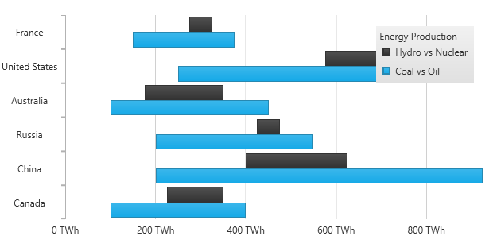
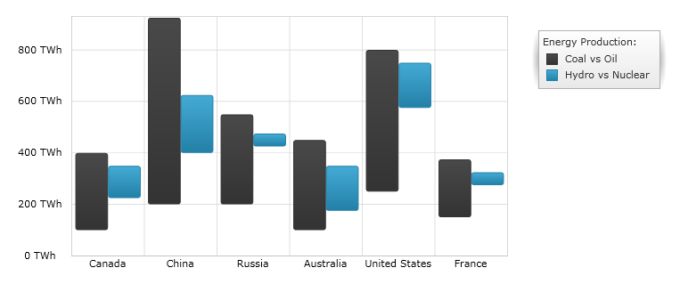

////
|metadata|
{
    "name": "datachart-category-range-bar-series",
    "controlName": ["{DataChartName}"],
    "tags": ["Application Scenarios","Charting","How Do I"],
    "guid": "f0cd173a-e80d-47d8-a96b-577b30d9ecdc",
    "buildFlags": [],
    "createdOn": "2026-05-21T00:00:00Z"
}
|metadata|
////

= Range Bar Series

This topic explains, with code examples, how to use the link:{DataChartLink}.RangeBarSeries.html[RangeBarSeries] in the link:{DataChartLink}.{DataChartName}.html[{DataChartName}]™ control.

== Overview

The topic is organized as follows:

* <<Introduction,Introduction>>
* <<SeriesPreview,Series Preview>>
* <<SeriesRecommendations,Series Recommendations>>
* <<DataRequirements,Data Requirements>>
* <<DataRenderingRules,Data Rendering Rules>>
* <<DataBindingExample,Data Binding Example>>
* <<RelatedContent,Related Content>>

[[Introduction]]
== Introduction

Range Bar Series belongs to a group of link:datachart-category-series-overview.html[Category Series] and it is rendered using a collection of horizontal bars that show the difference between two values of a data point. This type of series emphasizes the amount of change between low values and high values in the same data point or compares multiple items. Range values are represented on the x-axis (NumericXAxis) and categories are displayed on the y-axis (CategoryYAxis). The link:{DataChartLink}.RangeBarSeries.html[RangeBarSeries] is the vertical counterpart to the link:{DataChartLink}.RangeColumnSeries.html[RangeColumnSeries] in the same way that the link:{DataChartLink}.BarSeries.html[BarSeries] is the vertical counterpart to the link:{DataChartLink}.ColumnSeries.html[ColumnSeries]. For more conceptual information, comprehension with other types of series, and supported types of axes, refer to the link:datachart-category-series-overview.html[Category Series] and link:datachart-axes.html[Chart Axes] topics.

[[SeriesPreview]]
== Series Preview

Figures 1 and 2 demonstrate how the link:{DataChartLink}.RangeBarSeries.html[RangeBarSeries] and link:{DataChartLink}.RangeColumnSeries.html[RangeColumnSeries] look when plotted in the {DataChartName} control.

Figure 1: Sample implementation of the link:{DataChartLink}.RangeBarSeries.html[RangeBarSeries] type.

Figure 2: Sample implementation of the link:{DataChartLink}.RangeColumnSeries.html[RangeColumnSeries] type.

[[SeriesRecommendations]]
== Series Recommendations

Although the {DataChartName} supports plotting unlimited number of various types of series, it is recommended to use the Range Bar Series with similar types of series. Refer to the link:datachart-multiple-series.html[Multiple Series] topic for information on what types of series are recommended with the Range Bar Series and how to plot multiple types of series.

[[DataRequirements]]
== Data Requirements

While the {DataChartName} control allows you to easily bind it to your own data model, make sure to supply the appropriate amount and type of data that the series requires. If the data does not meet the minimum requirements based on the type of series that you are using, an error is generated by the control. Refer to the link:datachart-series-requirements.html[Series Requirements] and link:datachart-category-series-overview.html[Category Series] topics for more information on data series requirements.

The following is a list of data requirements for the `RangeBarSeries` type:

* The data model must contain at least two numeric data columns for rendering the range between the values.
* The data model may contain an optional string or date time field for labels.
* The data source should contain at least one data item.

[[DataRenderingRules]]
== Data Rendering Rules

The `RangeBarSeries` renders data using the following rules:

* Each row with two data values specified as the link:{DataChartLink}.RangeCategorySeries{ApiProp}LowMemberPath.html[LowMemberPath] and link:{DataChartLink}.RangeCategorySeries{ApiProp}HighMemberPath.html[HighMemberPath] properties of the data mapping is drawn as a separate horizontal bar representing the difference between these data values.
* The string or date time column that is mapped to the `Label` property of data mapping on the y-axis is used as the category labels. If the data mapping for `Label` is not specified, default labels are used.
* Category labels are drawn on the y-axis. Data values are drawn on the x-axis.
* When rendering, multiple series of the `RangeBarSeries` type will get rendered in clusters where each cluster represents a data point. The first series in the `Series` collection of the {DataChartName} control renders at the bottom of the cluster. Each successive series is rendered above the previous series. For more information, refer to the link:datachart-multiple-series.html[Multiple Series] topic.

[[DataBindingExample]]
== Data Binding Example

The code snippet below shows how to bind the link:{DataChartLink}.RangeBarSeries.html[RangeBarSeries] object to sample of category data (which is available for download from link:resources-sample-energy-data.html[Sample Energy Data] resource). Refer to the data requirements section of this topic for information about data requirements for the `RangeBarSeries`.
 

ifdef::sl,wpf,win-universal[]
*In XAML:*
[source,xaml]
----
xmlns:local="clr-namespace:Infragistics.Models;assembly=YourAppName"
...
<ig:{DataChartName} x:Name="DataChart" >
    <ig:{DataChartName}.Resources>
        <local:EnergyDataSource x:Key="data" />
    </ig:{DataChartName}.Resources>
    <ig:{DataChartName}.Axes>
        <ig:NumericXAxis x:Name="XAxis"  />
        <ig:CategoryYAxis x:Name="YAxis" ItemsSource="{StaticResource data}"
                          Label="{}{Country}" />
    </ig:{DataChartName}.Axes>
    <ig:{DataChartName}.Series>
        <ig:RangeBarSeries ItemsSource="{StaticResource data}"
                            HighMemberPath="Coal" LowMemberPath="Oil"
                            Title="Coal vs Oil"
                            XAxis="{Binding ElementName=XAxis}"
                            YAxis="{Binding ElementName=YAxis}" >
        </ig:RangeBarSeries >
        <ig:RangeBarSeries ItemsSource="{StaticResource data}"
                            HighMemberPath="Hydro" LowMemberPath="Nuclear"
                            Title="Hydro vs Nuclear"
                            XAxis="{Binding ElementName=XAxis}"
                            YAxis="{Binding ElementName=YAxis}" >
        </ig:RangeBarSeries >
    </ig:{DataChartName}.Series>
</ig:{DataChartName}>
----
endif::sl,wpf,win-universal[]

ifdef::xamarin[]
*In XAML:*
[source,xaml]
----
xmlns:local="clr-namespace:Infragistics.Models;assembly=YourAppName"
...
<ig:{DataChartName} x:Name="DataChart" >
    <ig:{DataChartName}.Resources>
		<ResourceDictionary>
			<local:EnergyDataSource x:Key="data" />
		</ResourceDictionary>	
    </ig:{DataChartName}.Resources>
    <ig:{DataChartName}.Axes>
        <ig:NumericXAxis x:Name="XAxis"  />
        <ig:CategoryYAxis x:Name="YAxis" ItemsSource="{StaticResource data}"
                          Label="Country" />
    </ig:{DataChartName}.Axes>
    <ig:{DataChartName}.Series>
        <ig:RangeBarSeries ItemsSource="{StaticResource data}"
                            HighMemberPath="Coal" LowMemberPath="Oil"
                            Title="Coal vs Oil"
                            XAxis="{x:Reference XAxis}"
                            YAxis="{x:Reference YAxis}">
        </ig:RangeBarSeries >
        <ig:RangeBarSeries ItemsSource="{StaticResource data}"
                            HighMemberPath="Hydro" LowMemberPath="Nuclear"
                            Title="Hydro vs Nuclear"
                            XAxis="{x:Reference XAxis}"
                            YAxis="{x:Reference YAxis}">
        </ig:RangeBarSeries >
    </ig:{DataChartName}.Series>
</ig:{DataChartName}>
----
endif::xamarin[]
  

ifdef::win-forms[]
*In C#:*
[source,csharp]
----
var data = new EnergyDataSource();
var xAxis = new NumericXAxis();
var yAxis = new CategoryYAxis();
yAxis.DataSource = data;
yAxis.Label = "{Country}";

var series1 = new RangeBarSeries();
series1.DataSource = data;
series1.HighMemberPath = "Coal";
series1.LowMemberPath = "Oil";
series1.Title = "Coal vs Oil";
series1.XAxis = xAxis;
series1.YAxis = yAxis;
var series2 = new RangeBarSeries();
series2.DataSource = data;
series2.HighMemberPath = "Hydro";
series2.LowMemberPath = "Nuclear";
series2.Title = "Hydro vs Nuclear";
series2.XAxis = xAxis;
series2.YAxis = yAxis;
var chart = new {DataChartName}();
chart.Axes.Add(xAxis);
chart.Axes.Add(yAxis);
chart.Series.Add(series1);
chart.Series.Add(series2);
----
endif::win-forms[]

ifdef::xaml[]
*In C#:*
[source,csharp]
----
var data = new EnergyDataSource();
var xAxis = new NumericXAxis();
var yAxis = new CategoryYAxis();
yAxis.ItemsSource = data;
yAxis.Label = "Country";

var series1 = new RangeBarSeries();
series1.ItemsSource = data;
series1.HighMemberPath = "Coal";
series1.LowMemberPath = "Oil";
series1.Title = "Coal vs Oil";
series1.XAxis = xAxis;
series1.YAxis = yAxis;
var series2 = new RangeBarSeries();
series2.ItemsSource = data;
series2.HighMemberPath = "Hydro";
series2.LowMemberPath = "Nuclear";
series2.Title = "Hydro vs Nuclear";
series2.XAxis = xAxis;
series2.YAxis = yAxis;
var chart = new {DataChartName}();
chart.Axes.Add(xAxis);
chart.Axes.Add(yAxis);
chart.Series.Add(series1);
chart.Series.Add(series2);
----
endif::xaml[]

ifdef::win-forms[]
*In Visual Basic:*
[source,vb]
----
Dim data As New EnergyDataSource()
Dim xAxis As New NumericXAxis()
Dim yAxis As New CategoryYAxis()
yAxis.DataSource = data
yAxis.Label = "{Country}"

Dim series1 As New RangeBarSeries()
series1.DataSource = data
series1.HighMemberPath = "Coal"
series1.LowMemberPath = "Oil"
series1.Title = "Coal vs Oil"
series1.XAxis = xAxis
series1.YAxis = yAxis
Dim series2 As New RangeBarSeries()
series2.DataSource = data
series2.HighMemberPath = "Hydro"
series2.LowMemberPath = "Nuclear"
series2.Title = "Hydro vs Nuclear"
series2.XAxis = xAxis
series2.YAxis = yAxis
Dim chart As New {DataChartName}()
chart.Axes.Add(xAxis)
chart.Axes.Add(yAxis)
chart.Series.Add(series1)
chart.Series.Add(series2)
----
endif::win-forms[]

ifdef::sl,wpf,win-universal[]
*In Visual Basic:*
[source,vb]
----
Dim data As New EnergyDataSource()
Dim xAxis As New NumericXAxis()
Dim yAxis As New CategoryYAxis()
yAxis.ItemsSource = data
yAxis.Label = "Country"

Dim series1 As New RangeBarSeries()
series1.ItemsSource = data
series1.HighMemberPath = "Coal"
series1.LowMemberPath = "Oil"
series1.Title = "Coal vs Oil"
series1.XAxis = xAxis
series1.YAxis = yAxis
Dim series2 As New RangeBarSeries()
series2.ItemsSource = data
series2.HighMemberPath = "Hydro"
series2.LowMemberPath = "Nuclear"
series2.Title = "Hydro vs Nuclear"
series2.XAxis = xAxis
series2.YAxis = yAxis
Dim chart As New {DataChartName}()
chart.Axes.Add(xAxis)
chart.Axes.Add(yAxis)
chart.Series.Add(series1)
chart.Series.Add(series2)
----
endif::sl,wpf,win-universal[]

ifdef::android[]
*In Java:*
[source,java]
----
EnergyDataSource data = new EnergyDataSource();
NumericXAxis xAxis = new NumericXAxis();
CategoryYAxis yAxis = new CategoryYAxis();
yAxis.setDataSource(data);
yAxis.setLabel("Country");

RangeBarSeries series1 = new RangeBarSeries();
series1.setDataSource(data);
series1.setHighMemberPath("Coal");
series1.setLowMemberPath("Oil");
series1.setTitle("Coal vs Oil");
series1.setXAxis(xAxis);
series1.setYAxis(yAxis);
RangeBarSeries series2 = new RangeBarSeries();
series2.setDataSource(data);
series2.setHighMemberPath("Hydro");
series2.setLowMemberPath("Nuclear");
series2.setTitle("Hydro vs Nuclear");
series2.setXAxis(xAxis);
series2.setYAxis(yAxis);
DataChartView chart = new DataChartView(rootView.getContext());
chart.addAxis(xAxis);
chart.addAxis(yAxis);
chart.addSeries(series1);
chart.addSeries(series2);
----
endif::android[]  

[[RelatedContent]]
== Related Content

* link:datachart-axes.html[Axes]
* link:datachart-category-bar-series.html[Bar Series]
* link:datachart-category-range-column-series.html[Range Column Series]
* link:datachart-category-range-area-series.html[Range Area Series]
* link:datachart-series-requirements.html[Series Requirements]
