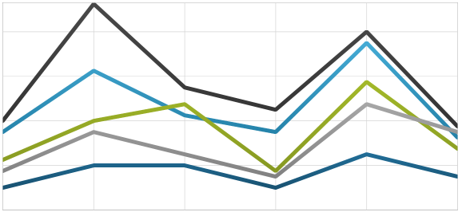
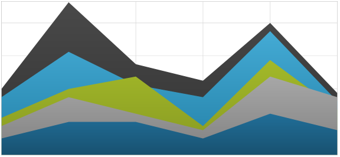
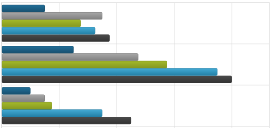
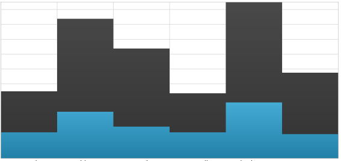

////
|metadata|
{
    "name": "datachart-category-series-overview",
    "controlName": ["{DataChartName}"],
    "tags": ["Charting"],
    "guid": "afeced41-35ad-487b-ba37-98e3b8240d1e",
    "buildFlags": [],
    "createdOn": "2014-06-05T19:39:00.3992752Z"
}
|metadata|
////

= Category Series

This topic explains various types of Category Series in the link:{DataChartLink}.{DataChartName}.html[{DataChartName}]™ control.

=== In This Topic

This topic contains the following sections:

* <<_Introduction,Introduction>>
* <<_Types,Types of Category Series>>
* <<_Preview,Preview of Category Series>>
* <<_SupportedAxes,Supported Axes>>
* <<_DataBinding,Data Binding>>
** <<_DataRequirements,Data Requirements>>
** <<_DataSample,Data Sample>>
* <<_RelatedContent,Related Content>>

[[_Introduction]]
== Introduction

Category Series is a group of the simplest and most common form of chart series that take data and render it as collection of data points stretched along a horizontal line (e.g. column series) or vertical line (e.g. bar series).

[[_Types]]
== Types of Category Series

The {DataChartName} control supports the following types of Category Series and each of them is discussed in an individual topic:

* link:datachart-category-area-series.html[Area Series]
* link:datachart-category-bar-series.html[Bar Series]
* link:datachart-category-column-series.html[Column Series]
* link:datachart-category-line-series.html[Line Series]
* link:datachart-category-point-series.html[Point Series]
* link:datachart-category-step-area-series.html[Step Area Series]
* link:datachart-category-step-line-series.html[Step Line Series]
* link:datachart-category-spline-series.html[Spline Series]
* link:datachart-category-spline-area-series.html[Spline Area Series]
* link:datachart-category-waterfall-series.html[Waterfall Series]

These topics will provide you with useful information on how to use create a specific type of Category Series and bind data to it.
This section provides preview images for all types of Category Series.

You can also use multiple types of Category Series with link:datachart-series-financial-price-series-overview.html[Financial Series] or link:datachart-financial-indicators-overview.html[Financial Indicators] to create complex charts visuals. Refer to the link:datachart-multiple-series.html[Adding Multiple Series] and link:datachart-multiple-axes.html[Using Multiple Axes] topics for more information on this feature of the {DataChartName} control. 

[[_Preview]]
== Preview of Category Series

This section provides preview images for all types of Category Series.

[options="header", cols="a,a"]
|====
|Series Type|Description

| link:datachart-category-line-series.html[Line Series]

|Displays a set of evenly placed points connected by a line. Categories are arranged horizontally and values are plotted vertically. 

Used for showing data or information that changes continuously over time. Useful when emphasizing the relationship between the points is required.

| link:datachart-category-area-series.html[Area Series]

|Same as the Line Series type with except that the area below the line is filled in. Categories are arranged horizontally and values – vertically.

| link:datachart-category-spline-series.html[Spline Series]

image::images/Using_xamDataChart_Category_Series_03.png[]
|Same as the Line Series type with the added feature of spline interpolation and smoothing for improved presentation of data.

| link:datachart-category-spline-area-series.html[Spline Area Series]

image::images/Using_xamDataChart_Category_Series_04.png[]
|Same as the Area Series type with the added feature of spline interpolation and smoothing for improved presentation of data.

ifdef::wpf,win-universal[]
| link:datachart-category-bar-series.html[Bar Series]

|Displays discrete data in separate rows. Categories are arranged vertically and values are plotted horizontally. 

Used for showing the changes in a data series over time or for comparing multiple items.
endif::wpf,win-universal[]

| link:datachart-category-column-series.html[Column Series]

image::images/Using_xamDataChart_Category_Series_08.png[]
|Displays discrete data in separate columns. Categories are arranged horizontally and values are plotted vertically. 

Used for showing the changes in a data series over time or for comparing multiple items.

| link:datachart-category-step-line-series.html[Step Line Series]

image::images/Using_xamDataChart_Category_Series_13.png[]
|Same as the Line Series type, except that the values are connected by continuous vertical and horizontal lines forming a step-like progression instead of a straight line tracing the shortest path between points.

| link:datachart-category-step-area-series.html[Step Area Series]

|Same as the Step Line Series type, except that the area below values is filled out instead of continuous vertical and horizontal lines forming a step-like progression for the changes between data points.

| link:datachart-category-waterfall-series.html[Waterfall Series]

image::images/Using_xamDataChart_Category_Series_15.png[]
|Displays a set of points as vertical columns that show the difference between values of consecutive data points. The columns are color coded for distinguishing between positive and negative changes in value. Categories are arranged horizontally and values are plotted vertically. 

Used for showing the changes in a consecutive data points over time or for comparing multiple items.

|====

Each linked topic demonstrates, with code examples, how to create a specific type of Category Series and bind data to it.

[[_SupportedAxes]] 
== Supported Axes

The {DataChartName} control provides various types of axes but only the following types of axes can be used with specific types of Category Series. The following table lists these supported axes:

[options="header", cols="a,a,a"]
|====
|Series Type| XAxis Type | YAxis Type 

| `BarSeries`
|link:{DataChartLink}.NumericXAxis.html[NumericXAxis]
|link:{DataChartLink}.CategoryYAxis.html[CategoryYAxis]
| 
`AreaSeries` 

`ColumnSeries` 

`LineSeries` 

`SplineSeries` 

`SplineAreaSeries` 

`StepAreaSeries` 

`StepLineSeries` 

`WaterfallSeries`

|
link:{DataChartLink}.CategoryXAxis.html[CategoryXAxis]

link:{DataChartLink}.CategoryDateTimeXAxis.html[CategoryDateTimeXAxis]

ifdef::wpf,win-forms[]

link:{DataChartLink}.TimeXAxis.html[TimeXAxis] 

link:{DataChartLink}.OrdinalTimeXAxis.html[OrdinalTimeXAxis]

endif::wpf,win-forms[]

|link:{DataChartLink}.NumericYAxis.html[NumericYAxis]
 
ifdef::wpf,win-forms[]

link:{DataChartLink}.PercentChangeYAxis.html[PercentChangeYAxis]

endif::wpf,win-forms[]
 
|====

In addition, each of Category Series must have binding set to one x-axis using the property link:{DataChartLink}.HorizontalAnchoredCategorySeries{ApiProp}XAxis.html[XAxis] and one y-axis using link:{DataChartLink}.HorizontalAnchoredCategorySeries{ApiProp}XAxis.html[YAxis] property. For more information on axes, refer to the link:datachart-axes.html[Axes] topic.

[[_DataBinding]] 
== Data Binding

This section provides information about binding data for all types of Category Series from data requirements through data sample to binding diagrams.

[[_DataRequirements]] 
==== Data Requirements

Similarly to other types of series in the {DataChartName} control, Category Series also use link:{DataChartLink}.Series~{ApiDataSource}.html[{ApiDataSource}] property to bind data. The following is a list of data requirements for Category Series:

* The data model should contain one data column (string or date time) which is mapped to the  link:{DataChartLink}.Axis{ApiProp}Label.html[Label] property of the category axis (e.g. link:{DataChartLink}.CategoryXAxis.html[CategoryXAxis])pick:[wpf,win-forms=" or the link:{DataChartLink}.TimeAxisBase{ApiProp}DateTimeMemberPath.html[DateTimeMemberPath] when using link:{DataChartLink}.TimeXAxis.html[TimeXAxis]"].
* The data model must contain at least one numeric data column which is mapped using the link:{DataChartLink}.AnchoredCategorySeries{ApiProp}ValueMemberPath.html[ValueMemberPath] property of category series (e.g. link:{DataChartLink}.LineSeries.html[LineSeries])
* The data source must contain at least one data items otherwise the chart will not render the category series.
* The data source must implement the link:http://msdn.microsoft.com/en-us/library/system.collections.ienumerable.aspx[IEnumerable] interface (e.g. link:http://msdn.microsoft.com/en-us/library/6sh2ey19.aspx[List], link:http://msdn.microsoft.com/en-us/library/ms132397.aspx[Collection], link:http://msdn.microsoft.com/en-us/library/7977ey2c.aspx[Queue], or link:http://msdn.microsoft.com/en-us/library/system.collections.stack.aspx[Stack])
 
For more information on the requirements for the specific types of series, refer to the link:datachart-series-requirements.html[Series Requirements] topic.

[[_DataSample]] 
==== Data Sample

An example of object that meets above criteria is the link:resources-sample-energy-data.html[Sample Energy Data] which you can download and use it in your project.

[[_RelatedContent]] 
== Related Content

* link:datachart-axes.html[Axes]
* link:datachart-multiple-axes.html[Using Multiple Axes]
* link:datachart-multiple-series.html[Adding Multiple Series]
* link:datachart-series-requirements.html[Series Requirements]