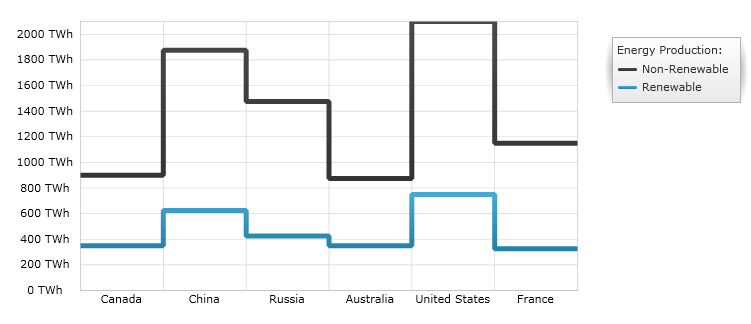
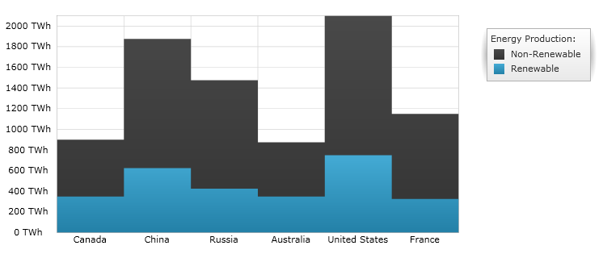

////
|metadata|
{
    "name": "datachart-category-step-line-series",
    "controlName": ["{DataChartName}"],
    "tags": ["Application Scenarios","Charting","How Do I"],
    "guid": "b1eb35d3-40a6-4179-b757-6bb739cb360f",
    "buildFlags": [],
    "createdOn": "2014-06-05T19:39:00.4272867Z"
}
|metadata|
////

= Step Line Series

This topic explains, with code examples, how to use the link:{DataChartLink}.StepLineSeries.html[StepLineSeries] in the link:{DataChartLink}.{DataChartName}.html[{DataChartName}]™ control.

== Overview

The topic is organized as follows:

* <<Introduction,Introduction>>
* <<SeriesPreview,Series Preview>>
* <<SeriesRecommendations,Series Recommendations>>
* <<DataRequirements,Data Requirements>>
* <<DataRenderingRules,Data Rendering Rules>>
* <<DataBindingExample,Data Binding Example>>
* <<RelatedContent,Related Content>>

[[Introduction]]
== Introduction

Step Line Series belongs to a group of link:datachart-category-series-overview.html[Category Series] and it is rendered using a collection of points connected by continuous vertical and horizontal lines forming a step-like progression. Values are represented on the y-axis (NumericYAxis) and categories are displayed on the x-axis (CategoryXAxis or CategoryDateTimeXAxis). Step Line Series emphasizes the amount of change over a period of time or compares multiple items. The link:{DataChartLink}.StepLineSeries.html[StepLineSeries] is identical to the link:{DataChartLink}.stepAreaSeries.html[StepAreaSeries] in all aspects except that the area below the step lines is not filled in. For more conceptual information, comprehension with other types of series, and supported types of axes, refer to the link:datachart-category-series-overview.html[Category Series] and link:datachart-axes.html[Chart Axes] topics.

[[SeriesPreview]]
== Series Preview

Figures 1 and 2 demonstrate how the link:{DataChartLink}.StepLineSeries.html[StepLineSeries] and link:{DataChartLink}.stepAreaSeries.html[StepAreaSeries] look when plotted in the {DataChartName} control.

Figure 1: Sample implementation of the link:{DataChartLink}.StepLineSeries.html[StepLineSeries] type.

Figure 2: Sample implementation of the link:{DataChartLink}.stepAreaSeries.html[StepAreaSeries] type.

[[SeriesRecommendations]]
== Series Recommendations

Although the {DataChartName} supports plotting unlimited number of various types of series, it is recommended to use the Step Line Series with similar types of series. Refer to the link:datachart-multiple-series.html[Multiple Series] topic for information on what types of series are recommended with the Step Line Series and how to plot multiple types of series.

[[DataRequirements]]
== Data Requirements

While the {DataChartName} control allows you to easily bind it to your own data model, it is important that you are supplying the appropriate amount and type of data that the series requires. If the data does not meet the minimum requirements based on the type of series that you are using, an error is generated by the control. Refer to the link:datachart-series-requirements.html[Series Requirements] and link:datachart-category-series-overview.html[Category Series] topics for more information on data series requirements.

The following is a list of data requirements for the `StepLineSeries` type:

* The data model must contain at least one numeric property.
* The data model may contain an optional string or date time property for labels.
* The data source should contain at least one data item.

[[DataRenderingRules]]
== Data Rendering Rules

The `StepLineSeries` renders data using the following rules:

* Each row in the data column specified as the  link:{DataChartLink}.AnchoredCategorySeries{ApiProp}ValueMemberPath.html[ValueMemberPath] property of the data mapping is plotted as horizontal line connected with other horizontal lines by vertical lines forming a step-like progression on the chart.
* The string or date time column that is mapped to the `Label` property of data mapping on the x-axis is used as the category labels. If the data mapping for `Label` is not specified, default labels are used.
* Category labels are drawn on the x-axis. Data values are drawn on the y-axis.
* When rendering, multiple series of the `StepLineSeries` type are rendered in layers with each successive series rendered in front of the previous one in the `Series` collection of the {DataChartName} control. For more information on this feature, refer to the link:datachart-multiple-series.html[Multiple Series] topic.

[[DataBindingExample]]
== Data Binding Example

The code snippet below shows how to bind the link:{DataChartLink}.StepLineSeries.html[StepLineSeries] object to sample of category data (which is available for download from link:resources-sample-energy-data.html[Sample Energy Data] resource). Refer to the data requirements section of this topic for information about data requirements for the StepLineSeries.
 

ifdef::sl,wpf,win-universal[]
*In XAML:*
[source,xaml]
----
xmlns:local="clr-namespace:Infragistics.Models;assembly=YourAppName"
...
<ig:{DataChartName} x:Name="DataChart" >
    <ig:{DataChartName}.Resources>
        <local:EnergyDataSource x:Key="data" />
    </ig:{DataChartName}.Resources>
    <ig:{DataChartName}.Axes>
        <ig:NumericYAxis x:Name="YAxis"  />
        <ig:CategoryXAxis x:Name="XAxis" ItemsSource="{StaticResource data}" 
                          Label="{}{Country}" />
    </ig:{DataChartName}.Axes>
    <ig:{DataChartName}.Series>
        <ig:StepLineSeries ItemsSource="{StaticResource data}" 
                           ValueMemberPath="NonRenewable" Title="Non-Renewable" 
                           XAxis="{Binding ElementName=XAxis}"
                           YAxis="{Binding ElementName=YAxis}">
        </ig:StepLineSeries>
        <ig:StepLineSeries ItemsSource="{StaticResource data}" 
                           ValueMemberPath="Renewable" Title="Renewable" 
                           XAxis="{Binding ElementName=XAxis}"
                           YAxis="{Binding ElementName=YAxis}">
        </ig:StepLineSeries>
        </ig:StepLineSeries>
    </ig:{DataChartName}.Series>
</ig:{DataChartName}>
----
endif::sl,wpf,win-universal[]

ifdef::xamarin[]
*In XAML:*
[source,xaml]
----
xmlns:local="clr-namespace:Infragistics.Models;assembly=YourAppName"
...
<ig:{DataChartName} x:Name="DataChart" >
    <ig:{DataChartName}.Resources>
		<ResourceDictionary>
			<local:EnergyDataSource x:Key="data" />
		</ResourceDictionary>
    </ig:{DataChartName}.Resources>
    <ig:{DataChartName}.Axes>
        <ig:NumericYAxis x:Name="YAxis"  />
        <ig:CategoryXAxis x:Name="XAxis" ItemsSource="{StaticResource data}" 
                          Label="Country" />
    </ig:{DataChartName}.Axes>
    <ig:{DataChartName}.Series>
        <ig:StepLineSeries ItemsSource="{StaticResource data}" 
                           ValueMemberPath="NonRenewable" Title="Non-Renewable" 
                           XAxis="{x:Reference XAxis}" 
                           YAxis="{x:Reference YAxis}">
        </ig:StepLineSeries>
        <ig:StepLineSeries ItemsSource="{StaticResource data}" 
                           ValueMemberPath="NonRenewable" Title="Non-Renewable" 
                           XAxis="{x:Reference XAxis}" 
                           YAxis="{x:Reference YAxis}">
        </ig:StepLineSeries>
    </ig:{DataChartName}.Series>
</ig:{DataChartName}>
----
endif::xamarin[]
 
ifdef::wpf,win-universal,win-forms,xamarin[]
*In C#:*
[source,csharp]
----
var data = new EnergyDataSource(); 
var yAxis = new NumericYAxis();
var xAxis = new CategoryXAxis();
xAxis.{ApiDataSource} = data;
xAxis.Label = "{Country}";

var series1 = new StepLineSeries();
series1.{ApiDataSource} = data;
series1.ValueMemberPath = "NonRenewable";
series1.Title = "Non-Renewable";
series1.XAxis = xAxis;
series1.YAxis = yAxis;
var series2 = new StepLineSeries();
series2.{ApiDataSource} = data;
series2.ValueMemberPath = "Renewable";
series2.Title = "Renewable";
series2.XAxis = xAxis;
series2.YAxis = yAxis;
var chart = new {DataChartName}();
chart.Axes.Add(xAxis);
chart.Axes.Add(yAxis);
chart.Series.Add(series1);
chart.Series.Add(series2);
----
endif::wpf,win-universal,win-forms,xamarin[]

ifdef::wpf,win-universal,win-forms[]
*In Visual Basic:*
[source,vb]
----
Dim data As New EnergyDataSource()
Dim yAxis As New NumericYAxis()
Dim xAxis As New CategoryXAxis()
xAxis.{ApiDataSource} = data;
xAxis.Label = "{Country}"

Dim series1 As New StepLineSeries()
series1.{ApiDataSource} = data
series1.ValueMemberPath = "NonRenewable"
series1.Title = "Non-Renewable"
series1.XAxis = xAxis
series1.YAxis = yAxis
Dim series2 As New StepLineSeries()
series2.{ApiDataSource} = data
series2.ValueMemberPath = "Renewable"
series2.Title = "Renewable"
series2.XAxis = xAxis
series2.YAxis = yAxis
Dim chart As New {DataChartName}()
chart.Axes.Add(xAxis)
chart.Axes.Add(yAxis)
chart.Series.Add(series1)
chart.Series.Add(series2)
----
endif::wpf,win-universal,win-forms[]

ifdef::android[]
*In Java:*
[source,java]
----
EnergyDataSource data = new EnergyDataSource();
NumericYAxis yAxis = new NumericYAxis();
CategoryXAxis xAxis = new CategoryXAxis();
xAxis.setDataSource(data);
xAxis.setLabel("Country");

StepLineSeries series1 = new StepLineSeries();
series1.setDataSource(data);
series1.setValueMemberPath("NonRenewable");
series1.setTitle("Non-Renewable");
series1.setXAxis(xAxis);
series1.setYAxis(yAxis);
StepLineSeries series2 = new StepLineSeries();
series2.setDataSource(data);
series2.setValueMemberPath("Renewable");
series2.setTitle("Renewable");
series2.setXAxis(xAxis);
series2.setYAxis(yAxis);
DataChartView chart = new DataChartView(rootView.getContext());
chart.addAxis(xAxis);
chart.addAxis(yAxis);
chart.addSeries(series1);
chart.addSeries(series2);
----
endif::android[]

[[RelatedContent]]
== Related Content

link:datachart-axes.html[Axes]

link:datachart-category-series-overview.html[Category Series]

link:datachart-category-step-area-series.html[Step Area Series]

link:datachart-series-requirements.html[Series Requirements]