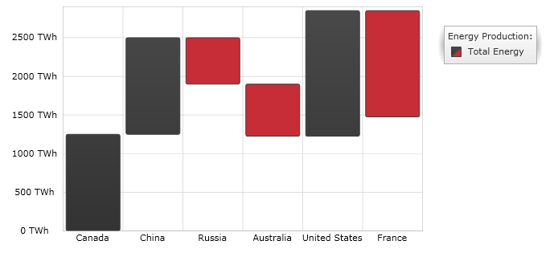

////
|metadata|
{
    "name": "datachart-category-waterfall-series",
    "controlName": ["{DataChartName}"],
    "tags": ["Application Scenarios","Charting","How Do I"],
    "guid": "f9c350d3-9dc2-46da-b669-8005c46fb800",
    "buildFlags": [],
    "createdOn": "2014-06-05T19:39:00.4292878Z"
}
|metadata|
////

= Waterfall Series

This topic explains, with code examples, how to use the WaterfallSeries in the link:{DataChartLink}.{DataChartName}.html[{DataChartName}]™ control.

== Overview

The topic is organized as follows:

* <<Introduction,Introduction>>
* <<SeriesPreview,Series Preview>>
* <<SeriesRecommendations,Series Recommendations>>
* <<DataRequirements,Data Requirements>>
* <<DataRenderingRules,Data Rendering Rules>>
* <<DataBindingExample,Data Binding Example>>
* <<RelatedContent,Related Content>>

[[Introduction]]
== Introduction

Waterfall Series belongs to a group of link:datachart-category-series-overview.html[Category Series] and it is rendered using a collection of vertical columns that show the difference between consecutive data points. The columns are color coded for distinguishing between positive and negative changes in value. Values are represented on the y-axis (NumericYAxis) and categories are displayed on the x-axis (CategoryXAxis or CategoryDateTimeXAxis). The WaterfallSeries is similar in appearance to the Range Column Series but it requires only one numeric data column rather than two columns for each data point. For more conceptual information, comprehension with other types of series, and supported types of axes, refer to the link:datachart-category-series-overview.html[Category Series] and link:datachart-axes.html[Chart Axes] topics.

[[SeriesPreview]]
== Series Preview

Figure 1 demonstrates how the WaterfallSeries looks when plotted in the {DataChartName} control.

Figure 1: Sample implementation of the WaterfallSeries type.

[[SeriesRecommendations]]
== Series Recommendations

Although the {DataChartName} supports plotting unlimited number of various types of series, it is recommended to use the Waterfall Series with similar types of series. Refer to the link:datachart-multiple-series.html[Multiple Series] topic for information on what types of series are recommended with the Waterfall Series and how to plot multiple types of series.

[[DataRequirements]]
== Data Requirements

While the {DataChartName} control allows you to easily bind it to your own data model, make sure you supply the appropriate amount and type of data that the series requires. If the data does not meet the minimum requirements based on the type of series that you are using, an error is generated by the control. Refer to the link:datachart-series-requirements.html[Series Requirements] and link:datachart-category-series-overview.html[Category Series] topics for more information on data series requirements.

The following is a list of data requirements for the `WaterfallSeries` type:

* The data model must contain at least one numeric data column.
* The data model may contain an optional string or date time field for labels.

[[DataRenderingRules]]
== Data Rendering Rules

The `WaterfallSeries` renders data using the following rules:

* Each row in the data column specified as the  link:{DataChartLink}.AnchoredCategorySeries{ApiProp}ValueMemberPath.html[ValueMemberPath] property of the data mapping is drawn as a separate vertical column representing the difference between values of the current and the previous rows in the data model.
* The string or date time column that is mapped to the `Label` property of data mapping on the x-axis is used as the category labels. If the data mapping for `Label` is not specified, default labels are used.
* Category labels are drawn on the x-axis. Data values are drawn on the y-axis.
* When rendering, multiple series of the `WaterfallSeries` type will get rendered in clusters where each cluster represents a data point. The first series in the `Series` collection of the {DataChartName} control will render as a column on the left of the cluster. Each successive series is rendered on the right of the previous series. For more information on this feature, refer to the link:datachart-multiple-series.html[Multiple Series] topic.

[[DataBindingExample]]
== Data Binding Example

The code snippet below shows how to bind the `WaterfallSeries` object to sample of category data (which is available for download from link:resources-sample-energy-data.html[Sample Energy Data] resource). Refer to the data requirements section of this topic for information about data requirements for the `WaterfallSeries`.
 

ifdef::sl,wpf,win-universal[]
*In XAML:*
[source,xaml]
----
xmlns:local="clr-namespace:Infragistics.Models;assembly=YourAppName"
...
<ig:{DataChartName} x:Name="DataChart" >
    <ig:{DataChartName}.Resources>
        <local:EnergyDataSource x:Key="data" />
    </ig:{DataChartName}.Resources>
    <ig:{DataChartName}.Axes>
        <ig:NumericYAxis x:Name="YAxis"  />
        <ig:CategoryXAxis x:Name="XAxis" ItemsSource="{StaticResource data}" 
                          Label="{}{Country}" />
    </ig:{DataChartName}.Axes>
    <ig:{DataChartName}.Series>
        <ig:WaterfallSeries ItemsSource="{StaticResource data}" ValueMemberPath="Total" 
                            Title="Total Energy" 
                            XAxis="{Binding ElementName=XAxis}"
                            YAxis="{Binding ElementName=YAxis}">
        </ig:WaterfallSeries> 
    </ig:{DataChartName}.Series>
</ig:{DataChartName}>
----
endif::sl,wpf,win-universal[]

ifdef::xamarin[]
*In XAML:*
[source,xaml]
----
xmlns:local="clr-namespace:Infragistics.Models;assembly=YourAppName"
...
<ig:{DataChartName} x:Name="DataChart" >
    <ig:{DataChartName}.Resources>
		<ResourceDictionary>
			<local:EnergyDataSource x:Key="data" />
		</ResourceDictionary>
    </ig:{DataChartName}.Resources>
    <ig:{DataChartName}.Axes>
        <ig:NumericYAxis x:Name="YAxis"  />
        <ig:CategoryXAxis x:Name="XAxis" ItemsSource="{StaticResource data}" 
                          Label="Country" />
    </ig:{DataChartName}.Axes>
    <ig:{DataChartName}.Series>
        <ig:WaterfallSeries ItemsSource="{StaticResource data}" ValueMemberPath="Total" 
                            Title="Total Energy" 
                            XAxis="{x:Reference XAxis}"
                            YAxis="{x:Reference YAxis}">
        </ig:WaterfallSeries> 
    </ig:{DataChartName}.Series>
</ig:{DataChartName}>
----
endif::xamarin[]
 
ifdef::wpf,win-universal,win-forms,xamarin[]
*In C#:*
[source,csharp]
----
var data = new EnergyDataSource(); 
var yAxis = new NumericYAxis();
var xAxis = new CategoryXAxis();
xAxis.{ApiDataSource} = data;
xAxis.Label = "{Country}";

var series = new WaterfallSeries();
series.{ApiDataSource} = data;
series.ValueMemberPath = "Total";
series.Title = "Total Energy";
series.XAxis = xAxis;
series.YAxis = yAxis;
var chart = new {DataChartName}();
chart.Axes.Add(xAxis);
chart.Axes.Add(yAxis);
chart.Series.Add(series);
----
endif::wpf,win-universal,win-forms,xamarin[]
  
ifdef::wpf,win-universal,win-forms[]
*In Visual Basic:*
[source,vb]
----
Dim data As New EnergyDataSource()
Dim yAxis As New NumericYAxis()
Dim xAxis As New CategoryXAxis()
xAxis.{ApiDataSource} = data;
xAxis.Label = "{Country}"

Dim series As New WaterfallSeries()
series.{ApiDataSource} = data
series.ValueMemberPath = "Total"
series.Title = "Total Energy"
series.XAxis = xAxis
series.YAxis = yAxis
Dim chart As New {DataChartName}()
chart.Axes.Add(xAxis)
chart.Axes.Add(yAxis)
chart.Series.Add(series)
----
endif::wpf,win-universal,win-forms[]

ifdef::android[]
*In Java:*
[source,java]
----
EnergyDataSource data = new EnergyDataSource();
NumericYAxis yAxis = new NumericYAxis();
CategoryXAxis xAxis = new CategoryXAxis();
xAxis.setDataSource(data);
xAxis.setLabel("Country");

WaterfallSeries series = new WaterfallSeries();
series.setDataSource(data);
series.setValueMemberPath("Total");
series.setTitle("Total Energy");
series.setXAxis(xAxis);
series.setYAxis(yAxis);
DataChartView chart = new DataChartView(rootView.getContext());
chart.addAxis(xAxis);
chart.addAxis(yAxis);
chart.addSeries(series);
----
endif::android[]
endif::android[]

[[RelatedContent]]
== Related Content

link:datachart-axes.html[Axes]

link:datachart-category-range-column-series.html[Range Column Series]

link:datachart-category-series-overview.html[Category Series]

link:datachart-series-requirements.html[Series Requirements]