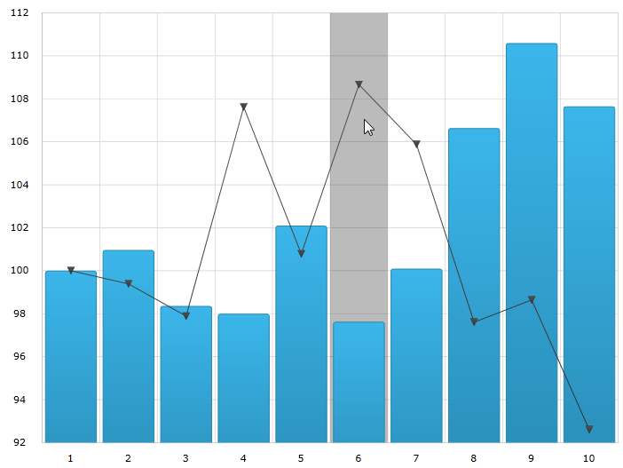
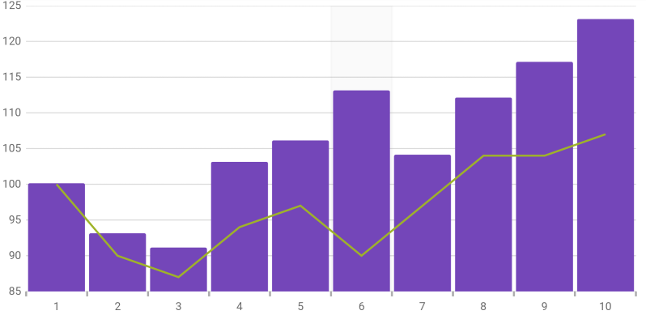
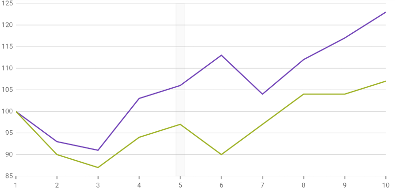

////
|metadata|
{
    "name": "datachart-categoryhighlightlayer",
    "controlName": ["{DataChartName}"],
    "tags": ["Charting","Getting Started","How Do I"],
    "guid": "4fb63863-ed39-497c-a8eb-9cb0b17e16cd",
    "buildFlags": ["ANDROID","SL","WPF","WINFORMS"],
    "createdOn": "2014-06-05T19:39:00.6213683Z"
}
|metadata|
////

= Category Highlight Layer

== Topic Overview

=== Purpose

This topic provides information about the category highlight layer which is used for pick:[wpf,win-universal="hover"]pick:[xamarin="touch"] interactions. It describes the properties of the category highlight layer and provides an example of its implementation.

=== Required background

The following topics are prerequisites to understanding this topic:

[options="header", cols="a,a"]
|====
|Topic|Purpose

|link:datachart-getting-started-with-datachart.html[Getting Started with Data Chart]
|The _{DataChartName}_ control requires a data object model to be mapped to control's DataContext property. This article will provide a simple data object model but you can create your own and use it with this sample code instead.

| link:datachart-category-series-overview.html[Category Series]
|This topic explains various types of Category Series in the _{DataChartName}_ control.

|====

=== In this topic

This topic contains the following sections:

* <<Overview,Overview>>
* <<Preview,Preview>>
* <<Properties,Properties>>
* <<Example,Example>>
* <<RelatedContent,Related Content>>

[[Overview]]
== Overview

=== Category highlight layer overview

The link:{DataChartLink}.categoryhighlightlayer_members.html[CategoryHighlightLayer] targets a category axis, or all category axes in the  _{DataChartName}_  control. If the axis contains any series that are aligned between major gridlines of the axis, for example, link:{DataChartLink}.columnseries.html[ColumnSeries] series, this will render a shape that fills the current category.

For other series, such as link:{DataChartLink}.lineseries.html[LineSeries] series, it will render a band with an adjustable thickness at the closest gridline to the pointer position. In this situation if the link:{DataChartLink}.categoryhighlightlayer{ApiProp}useinterpolation.html[UseInterpolation] property is enabled this will cause the x position to become affixed to the x position of the pointer.

You can change the color of the highlighting area by setting the link:{DataChartLink}.series{ApiProp}brush.html[Brush] property. For more information on this property see the link:datachart-commonproperties.html[Common Properties] topic.

[[Preview]]

=== Preview

The following image is a preview of the  _{DataChartName}_  control rendered with the link:{DataChartLink}.categoryhighlightlayer_members.html[CategoryHighlightLayer] added.

ifdef::wpf,win-universal[]

endif::wpf,win-universal[]

ifdef::xamarin[]

endif::xamarin[]

[[Properties]]
== Properties

=== Category highlight layer summary

The following table summarizes the properties of the link:{DataChartLink}.categoryhighlightlayer_members.html[CategoryHighlightLayer] layer.

[options="header", cols="a,a,a"]
|====
|Property Name|Property Type|Description

| link:{DataChartLink}.categoryhighlightlayer{ApiProp}bandhighlightwidth.html[BandHighlightWidth]
|`double`
|This property specifies the width of the highlight area for series that are aligned on gridlines. For example, link:{DataChartLink}.lineseries.html[LineSeries], link:{DataChartLink}.areaseries.html[AreaSeries] and link:{DataChartLink}.splineseries.html[SplineSeries]. 

This property has no effect if there are series present aligned between gridlines. For example link:{DataChartLink}.columnseries.html[ColumnSeries] and link:{DataChartLink}.waterfallseries.html[WaterfallSeries]. 

When this property is set, it highlights a banded shape of the specified size around the gridline.

| link:{DataChartLink}.categoryhighlightlayer{ApiProp}targetaxis.html[TargetAxis]
|`CategoryAxisBase`
|This property specifies which axis should have the enabled category highlight layer.

| link:{DataChartLink}.categoryhighlightlayer{ApiProp}useinterpolation.html[UseInterpolation]
|`bool`
|This property specifies if the highlight band should snap-to-cursor, instead of snap-to-gridlines. 

This property has no effect if there are series present aligned between gridlines. For example, link:{DataChartLink}.columnseries.html[ColumnSeries] and link:{DataChartLink}.waterfallseries.html[WaterfallSeries].

|====

[[Example]]
== Example

=== Example

The following screenshot illustrates how the  _{DataChartName}_  control with the link:{DataChartLink}.CategoryHighlightLayer{ApiProp}BandHighlightWidth.html[BandHighlightWidth] property of the link:{DataChartLink}.CategoryHighlightLayer_members.html[CategoryHighlightLayer] object looks as a result of the following setting:

[options="header", cols="a,a"]
|====
|Property|Value

|link:{DataChartLink}.CategoryHighlightLayer{ApiProp}BandHighlightWidth.html[BandHighlightWidth]
|`50`

|====

ifdef::wpf,win-universal[]
image::images/Category_Highlight_Layer_2.png[]
endif::wpf,win-universal[]

ifdef::xamarin[]

endif::xamarin[]

Following is the code used to implement this example

ifdef::wpf,win-universal[]

*In XAML:*

[source,xaml]
----
<ig:{DataChartName} x:Name="theChart" Margin="5,0,5,0" >
    <ig:{DataChartName}.Axes>
        <ig:CategoryXAxis x:Name="xmCategoryXAxis"
                          ItemsSource="{StaticResource CategoryData1}"
                          Label="{}{Category}">
            <ig:CategoryXAxis.LabelSettings>
                <ig:AxisLabelSettings x:Name="xmCategoryXAxisLabel"
                                      Extent="25"
                                      VerticalAlignment="Bottom"
                                      FontSize="11" />
            </ig:CategoryXAxis.LabelSettings>
        </ig:CategoryXAxis>
        <ig:NumericYAxis x:Name="xmNumericYAxis1">
            <ig:NumericYAxis.LabelSettings>
                <ig:AxisLabelSettings x:Name="xmNumericYAxisLabel"
                                      Extent="50"
                                      Location="OutsideLeft" />
            </ig:NumericYAxis.LabelSettings>
        </ig:NumericYAxis>
    </ig:{DataChartName}.Axes>
    <ig:{DataChartName}.Series>
        <ig:CategoryHighlightLayer BandHighlightWidth="50" />
       
        <ig:LineSeries ItemsSource="{StaticResource CategoryData1}"
                       ValueMemberPath="Value" 
                       XAxis="{Binding ElementName=xmCategoryXAxis}"
                       YAxis="{Binding ElementName=xmNumericYAxis1}">
        </ig:LineSeries>
        <ig:LineSeries ItemsSource="{StaticResource CategoryData2}"
                       ValueMemberPath="Value" 
                       XAxis="{Binding ElementName=xmCategoryXAxis}"
                       YAxis="{Binding ElementName=xmNumericYAxis1}">
        </ig:LineSeries>
    </ig:{DataChartName}.Series>
</ig:{DataChartName}>
----

endif::wpf,win-universal[]

ifdef::xamarin[]

*In XAML:*

[source,xaml]
----
<ig:{DataChartName} x:Name="theChart">
  <ig:{DataChartName}.Axes>
    <ig:CategoryXAxis x:Name="xAxis"
                      ItemsSource="{Binding CategoryData1}"
                      Label="Category"/>
    <ig:NumericYAxis x:Name="yAxis"/>
  </ig:{DataChartName}.Axes>
  <ig:{DataChartName}.Series>
    <ig:CategoryHighlightLayer BandHighlightWidth="50"/>
    
    <ig:LineSeries XAxis="{x:Reference xAxis}"
                   YAxis="{x:Reference yAxis}"
                   ItemsSource="{Binding CategoryData1}"
                   ValueMemberPath="Value">
    </ig:LineSeries>
    <ig:LineSeries XAxis="{x:Reference xAxis}"
                   YAxis="{x:Reference yAxis}"
                   ItemsSource="{Binding CategoryData2}"
                   ValueMemberPath="Value">
    </ig:LineSeries>
  </ig:{DataChartName}.Series>
</ig:{DataChartName}>
----

endif::xamarin[]

*In C#:*

----
var catHighlightLayerSeries = new CategoryHighlightLayer();
catHighlightLayerSeries.BandHighlightWidth = 50;
theChart.Series.Add(catHighlightLayerSeries);
----

ifdef::wpf,win-universal,win-forms[]

*In VB:*

----
Dim catHighlightLayerSeries As New CategoryHighlightLayer()
catHighlightLayerSeries.BandHighlightWidth = 50
theChart.Series.Add(catHighlightLayerSeries)
----

endif::wpf,win-universal,win-forms[]

[[RelatedContent]]
== Related Content

[options="header", cols="a,a"]
|====
|Topic|Purpose

| link:datachart-commonproperties.html[Common Properties]
|This topic provides information about the properties and methods that the pick:[wpf,win-universal="hover"]pick:[xamarin="touch"] interaction feature uses for highlighting, pick:[wpf,win-universal="hovering"]pick:[xamarin="touch"] and interacting with the tooltip interactions inherited from the link:{DataChartLink}.series_members.html[Series] class.

| link:datachart-crosshairlayer.html[Crosshair Layer]
|This topic provides information about the crosshair layer used for pick:[wpf,win-universal="hover"]pick:[xamarin="touch"] interactions. It describes the properties of the crosshair layer and provides an implementation example.

| link:datachart-categoryitemhighlightlayer.html[Category Item Highlight Layer]
|This topic provides information about the category item highlight layer used for pick:[wpf,win-universal="hover"]pick:[xamarin="touch"] interactions. It describes the properties of the category item highlight layer and provides an example of its implementation.

| link:datachart-categorytooltiplayer.html[Category Tooltip Layer]
|This topic provides information about the category tooltip layer used for pick:[wpf,win-universal="hover"]pick:[xamarin="touch"] interactions. It describes the properties of the category tooltip layer and provides an example of its implementation.

| link:datachart-itemtooltiplayer.html[Item Tooltip Layer]
|This topic provides information about the item tooltip layer which is used for pick:[wpf,win-universal="hover"]pick:[xamarin="touch"] interactions. It describes the properties of the item tooltip layer and also provides an example of its implementation.

|====