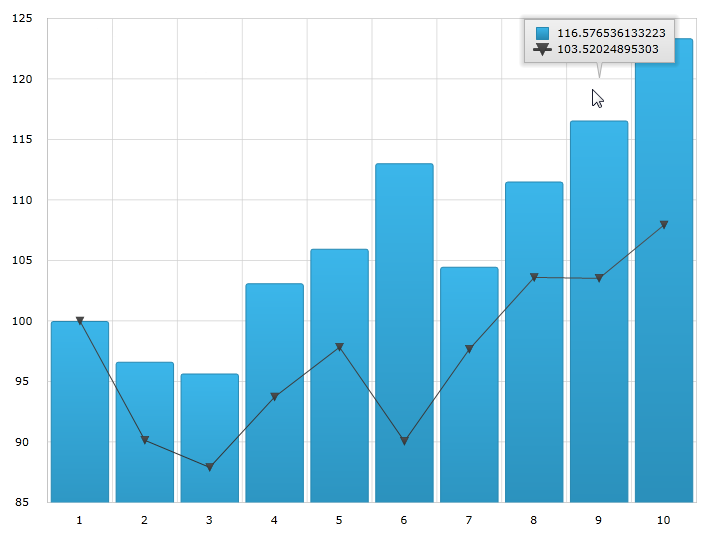
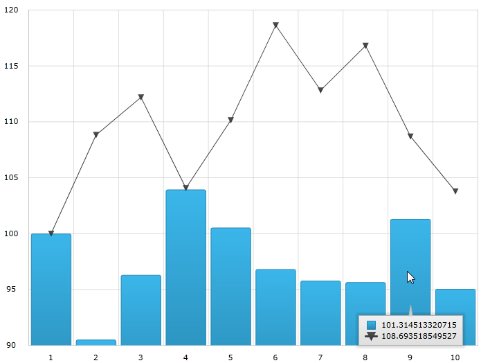
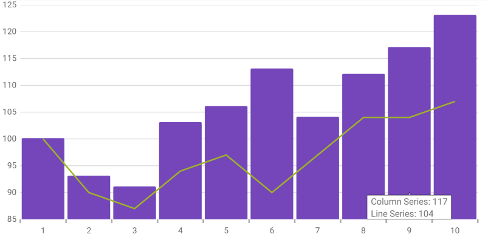

////
|metadata|
{
    "name": "datachart-categorytooltiplayer",
    "controlName": ["{DataChartName}"],
    "tags": ["Charting","How Do I"],
    "guid": "b6b81c4b-3335-437c-9a8b-2c3ee36c3514",
    "buildFlags": ["ANDROID","WINFORMS","WPF","SL"],
    "createdOn": "2014-06-05T19:39:00.6263705Z"
}
|metadata|
////

= Category Tooltip Layer

== Topic Overview

=== Purpose

This topic provides information about the category tooltip layer used for pick:[wpf,win-universal="hover"]pick:[xamarin="touch"] interactions. It describes the properties of the category tooltip layer and provides an example of its implementation.

=== Required background

The following topics are prerequisites to understanding this topic:

[options="header", cols="a,a"]
|====
|Topic|Purpose

| link:datachart-getting-started-with-datachart.html[Getting Started with Data Chart]
|The _{DataChartName}_ control requires a data object model to be mapped to control's DataContext property. This article will provide a simple data object model but you can create your own and use it with this sample code instead.

| link:datachart-category-series-overview.html[Category Series]
|This topic explains various types of Category Series in the _{DataChartName}_ control.

|====

=== In this topic

This topic contains the following sections:

* <<Overview,Overview>>
* <<Preview,Preview>>
* <<Properties,Properties>>
* <<Example,Example>>
* <<_Ref345510469,Related Content>>

[[Overview]]
== Overview

=== Category tooltip layer overview

The link:{DataChartLink}.categorytooltiplayer.html[CategoryToolTipLayer] displays grouped tooltips for the series on the  _{DataChartName}_  control using a category axis.

You can configure tooltips to target a specific axis. This can be done be setting the TargetAxis property. For more information on this property, see the <<Properties,Properties>> section below.

By default the grouped tooltips appear at the top of the {DataChartName} control; however this default value can be overridden by setting the ToolTipPosition property. For more information on this property, see the CategoryToolTipLayer properties section below.

[[Preview]]

=== Preview

The following image is a preview of the  _{DataChartName}_  control renders with the link:{DataChartLink}.categorytooltiplayer.html[CategoryToolTipLayer] added.

ifdef::wpf,win-universal[]

endif::wpf,win-universal[]

ifdef::xamarin,win-forms[]
image::images/Category_Tooltip_Layer_3.png[]
endif::xamarin,win-forms[]

[[Properties]]
== Properties

=== Category tooltip layer summary

The following table summarizes the properties of the link:{DataChartLink}.categorytooltiplayer.html[CategoryToolTipLayer] layer.

[options="header", cols="a,a,a"]
|====
|Property Name|Property Type|Description

| link:{DataChartLink}.categorytooltiplayer{ApiProp}targetaxis.html[TargetAxis]
|`Axis`
|This property specifies which axis should have an enabled category tooltip layer.

ifdef::wpf,win-universal[]
| link:{DataChartLink}.categorytooltiplayer{ApiProp}tooltipstyle.html[ToolTipStyle]
|`Style`
|This property specifies a style to apply to the displayed tooltip. By default the tooltip inherits its style from the chart, but setting this property overrides this default setting.
endif::wpf,win-universal[]

| link:{DataChartLink}.categorytooltiplayer{ApiProp}useinterpolation.html[UseInterpolation]
|`bool`
|This property specifies if the tooltip’s x position should be interpolated rather than snapping to the gridlines or the center spaces.

ifdef::xaml,android[]
| link:{DataChartLink}.categorytooltiplayer{ApiProp}tooltipposition.html[ToolTipPosition]
| link:{DataChartLink}.categorytooltiplayerposition.html[CategoryToolTipLayerPosition]
|This property specifies the location of the tooltip. It can be set to: 

* Auto – A position is selected automatically 

* OutsideStart - Displays at the outside start of the axis 

* InsideStart - Displays at the inside start of the axis 

* InsideEnd - Displays at the inside end of the axis 

* OutsideEnd - Displays at the outside end of the axis 

endif::xaml,android[]

|====

ifdef::xaml,android[]

[[Example]]
== Example

endif::xaml,android[]

//ifdef::xaml,android[]

=== Example

The following screenshot illustrates how the  _{DataChartName}_  control renders with the link:{DataChartLink}.categorytooltiplayer.html[CategoryToolTipLayer] object’s link:{DataChartLink}.categorytooltiplayer{ApiProp}tooltipposition.html[ToolTipPosition] property configured with the following setting:

[options="header", cols="a,a"]
|====
|Property|Value

| link:{DataChartLink}.categorytooltiplayer{ApiProp}tooltipposition.html[ToolTipPosition]
|`InsideStart`

|====

ifdef::wpf,win-universal[]

endif::wpf,win-universal[]

ifdef::xamarin,win-forms[]

endif::xamarin,win-forms[]

Following is the code used in this implementation

ifdef::wpf,win-universal[]

*In XAML:*

[source,xaml]
----
<ig:{DataChartName} x:Name="theChart" Margin="5,0,5,0" >
   <ig:{DataChartName}.Axes>
      <ig:CategoryXAxis x:Name="xmCategoryXAxis"
                        ItemsSource="{StaticResource CategoryData1}"
                        Label="{}{Category}">
         <ig:CategoryXAxis.LabelSettings>
            <ig:AxisLabelSettings x:Name="xmCategoryXAxisLabel"
                                  Extent="25"                
                                  VerticalAlignment="Bottom"
                                  FontSize="11" />
         </ig:CategoryXAxis.LabelSettings>
      </ig:CategoryXAxis>
      <ig:NumericYAxis x:Name="xmNumericYAxis1">
         <ig:NumericYAxis.LabelSettings>
            <ig:AxisLabelSettings x:Name="xmNumericYAxisLabel"
                                  Extent="50" 
                                  Location="OutsideLeft" />
         </ig:NumericYAxis.LabelSettings>
      </ig:NumericYAxis>
   </ig:{DataChartName}.Axes>
   <ig:{DataChartName}.Series>
      <ig:ColumnSeries ItemsSource="{StaticResource CategoryData1}"
                       ValueMemberPath="Value" 
                       XAxis="{Binding ElementName=xmCategoryXAxis}" 
                       YAxis="{Binding ElementName=xmNumericYAxis1}">
         <ig:ColumnSeries.ToolTip>
            <TextBlock Text="{Binding Item.Value}" />
         </ig:ColumnSeries.ToolTip>
      </ig:ColumnSeries>
      <ig:LineSeries ItemsSource="{StaticResource CategoryData2}"
                     ValueMemberPath="Value" 
                     XAxis="{Binding ElementName=xmCategoryXAxis}" 
                     YAxis="{Binding ElementName=xmNumericYAxis1}">
         <ig:LineSeries.ToolTip>
            <TextBlock Text="{Binding Item.Value}" />
         </ig:LineSeries.ToolTip>
      </ig:LineSeries>
      
      <ig:CategoryToolTipLayer ToolTipPosition="InsideStart"
                               TransitionDuration="0:00:00.1"/>
   </ig:{DataChartName}.Series>
</ig:{DataChartName}>
----

endif::wpf,win-universal[]

ifdef::xamarin[]

[source,xaml]
----
<ig:{DataChartName} x:Name="theChart">
    <ig:{DataChartName}.Axes>
        <ig:CategoryXAxis x:Name="xAxis"
                          ItemsSource="{Binding CategoryData1}"
                          Label="Category"/>
        <ig:NumericYAxis x:Name="yAxis"/>
    </ig:{DataChartName}.Axes>
    <ig:{DataChartName}.Series>
        <ig:ColumnSeries ItemsSource="{Binding CategoryData1}"
                         ValueMemberPath="Value"
                         XAxis="{x:Reference xAxis}"
                         YAxis="{x:Reference yAxis}">
            <ig:ColumnSeries.ToolTipTemplate>
                <DataTemplate>
                    <Label Text="{Binding Item.Value}" FontSize="12" Margin="5,0,5,0" />
                </DataTemplate>
            </ig:ColumnSeries.ToolTipTemplate>
        </ig:ColumnSeries>
        <ig:LineSeries ItemsSource="{Binding CategoryData2}"
                       ValueMemberPath="Value"
                       XAxis="{x:Reference xAxis}"
                       YAxis="{x:Reference yAxis}">
            <ig:LineSeries.ToolTipTemplate>
                <DataTemplate>
                    <Label Text="{Binding Item.Value}" FontSize="12" Margin="5,0,5,0" />
                </DataTemplate>
            </ig:LineSeries.ToolTipTemplate>
        </ig:LineSeries>
        
        <ig:CategoryToolTipLayer ToolTipPosition="InsideStart"/>
    </ig:{DataChartName}.Series>
</ig:{DataChartName}>
----

endif::xamarin[]

ifdef::wpf[]

*In C#:*

----
var catToolTipLayerSeries = new CategoryToolTipLayer();
catToolTipLayerSeries.ToolTipPosition = CategoryTooltipLayerPosition.InsideStart;
chart.Series.Add(catToolTipLayerSeries);
----

endif::wpf[]

ifdef::win-forms[]

First, enable the default tooltip.

*In C#*

----
series.ShowDefaultTooltip = true;
----

Next, set up the `CategoryToolTipLayer`.

*In C#:*

----
var catToolTipLayerSeries = new CategoryToolTipLayer();
catToolTipLayerSeries.ToolTipPosition = CategoryTooltipLayerPosition.InsideStart;
chart.Series.Add(catToolTipLayerSeries);
----

endif::win-forms[]

ifdef::xamarin[]

*In C#:*

----
var catToolTipLayerSeries = new CategoryToolTipLayer();
catToolTipLayerSeries.ToolTipPosition = CategoryTooltipLayerPosition.InsideStart;
chart.Series.Add(catToolTipLayerSeries);
----

endif::xamarin[]

[[_Ref345510469]]
== Related Content

[options="header", cols="a,a"]
|====
|Topic|Purpose

ifdef::wpf[]
| link:datachart-commonproperties.html[Common Properties]
|This topic provides information about the properties and methods that the hover interaction feature uses for highlighting, hovering and interacting with the tooltip interactions inherited from the link:{DataChartLink}.series_members.html[Series] class.
endif::wpf[]

| link:datachart-crosshairlayer.html[Crosshair Layer]
|This topic provides information about the crosshair layer used for hover interactions. It describes the properties of the crosshair layer and provides an implementation example.

| link:datachart-categoryitemhighlightlayer.html[Category Item Highlight Layer]
|This topic provides information about the category item highlight layer used for hover interactions. It describes the properties of the category item highlight layer and provides an example of its implementation.

| link:datachart-itemtooltiplayer.html[Item Tooltip Layer]
|This topic provides information about the item tooltip layer which is used for hover interactions. It describes the properties of the item tooltip layer and also provides an example of its implementation.

|====