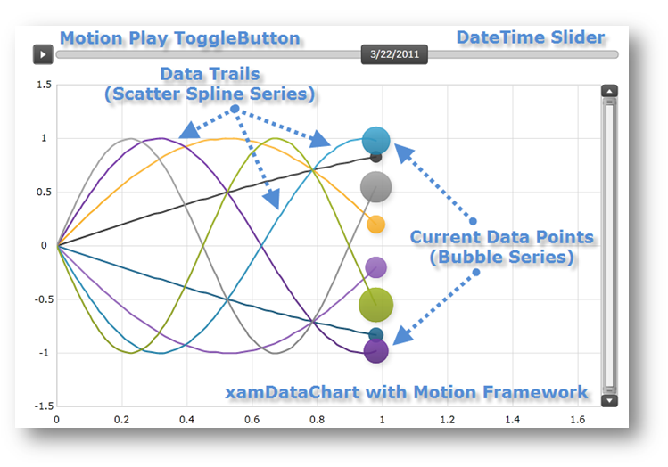

////
|metadata|
{
    "name": "datachart-chart-motion-framework",
    "controlName": ["{DataChartName}"],
    "tags": ["Application Scenarios","Data Presentation","How Do I"],
    "guid": "ba73c345-40d4-4442-b07a-3230d0787114",
    "buildFlags": ["SL","WPF"],
    "createdOn": "2014-06-05T19:39:00.6703857Z"
}
|metadata|
////

= Chart Motion Framework

This topic demonstrates, with code examples, how to animate your charts using the Motion Framework™ in the link:{DataChartLink}.{DataChartName}.html[{DataChartName}]™ control. Procedures for both general and custom implementations are provided.

The topic is organized as follows:

* <<Introduction,Introduction>>
* <<Limitations,Limitations>>
* <<UsingMotionFramework,Using the Motion Framework>>

** <<GeneralImplementation,General Implementation>>
** <<CustomImplementation,Custom Implementation>>

* <<RelatedContent,Related Content>>

[[Introduction]]
== Introduction

The Motion Framework allows you to animate changes in data over time in the {DataChartName} control, creating an immersive and animated user experience that "tells the story" of your data.

Figure 1: The {DataChartName} control with the Motion Framework animating six data sources over time

The Motion Framework is managed by the link:{DataChartLink}.series{ApiProp}transitionduration.html[TransitionDuration] and the link:{DataChartLink}.series{ApiProp}transitioneasingfunction.html[TransitionEasingFunction] properties of Series object. These properties are available on all types of series in the Data Chart.

Table 1: Properties of the Motion Framework

[options="header", cols="a,a,a"]
|====
|Series Property Name|Property Type|Description

| link:{DataChartLink}.series{ApiProp}transitionduration.html[TransitionDuration]
|TimeSpan
|Determines time duration between series's morph. The idea behind this property is to provide smooth transition of a data point from one value to another

| link:{DataChartLink}.series{ApiProp}transitioneasingfunction.html[TransitionEasingFunction]
|EasingFunctionBase
|Determines the Easing Function used to morph the current series. By default, the Motion Framework uses linear easing function, but you can change it by providing other easing functions that are available in the System.Windows.Media.Animation namespace.

|====

[[Limitations]]
== Limitations

The Motion Framework has the following limitation in the {DataChartName} control: if the range of an axis changes as a result of a data change, no animation will begin.

[[UsingMotionFramework]]
== Using the Motion Framework

[[GeneralImplementation]]
== General Implementation

The general implementation of the Motion Framework gives you full control over how the {DataChartName} will animate data bound to it. However this implementation requires configuring each series in the {DataChartName} control individually and providing a method for updating data. To start using the Motion Framework in the {DataChartName}:

[start=1]
. Set the TransitionDuration property. The TransitionDuration property controls the time for shifting the points of the series from their previous values to their next values. On the series you want to animate, set that property to a timespan that would provide smooth series's transition. A of 0.5 seconds would be a good choice in most cases.
[start=2]
. Set the TransitionEasingFunction property to the desired easing function or linear easing function that will be used to morph the series.

The code snippet below shows how to set TransitionDuration TransitionEasingFunction properties on ScatterLineSeries. The same logic can be applied to any other type of series supported in the {DataChartName}.

ifdef::wpf,win-universal[]

*In XAML:*

----
<ig:{DataChartName} x:Name="DataChart" >
      <ig:{DataChartName}.Series>
            <ig:ScatterLineSeries TransitionDuration="0:0:0.5">
                  <ig:ScatterLineSeries.TransitionEasingFunction>
                        <CubicEase EasingMode="EaseOut" />
                  </ig:ScatterLineSeries.TransitionEasingFunction>
            </ig:ScatterLineSeries >
      </ig:{DataChartName}.Series>
</ig:{DataChartName}>
----

endif::wpf,win-universal[]

ifdef::wpf[]

*In Visual Basic:*

----
Imports System.Windows.Media.Animation
Imports {DataChartNamespace}
' ...
Dim series As New ScatterLineSeries()
series.TransitionDuration = TimeSpan.FromSeconds(0.5)
series.TransitionEasingFunction = New CubicEase() With { .EasingMode = EasingMode.EaseOut }
Me.DataChart.Series.Add(series)
----

endif::wpf[]

ifdef::win-forms[]

*In Visual Basic:*

----
Imports System.Windows.Media.Animation
Imports {DataChartNamespace}
' ...
Dim series As New ScatterLineSeries()
series.TransitionDuration = TimeSpan.FromSeconds(0.5)
series.TransitionEasingFunction = New CubicEase() With { .EasingMode = EasingMode.EaseOut }
Me.DataChart.Series.Add(series)
----

endif::win-forms[]

ifdef::xamarin[]

*In Visual Basic:*

----
Imports System.Windows.Media.Animation
Imports {DataChartNamespace}
' ...
Dim series As New ScatterLineSeries()
series.TransitionDuration = TimeSpan.FromSeconds(0.5)
series.TransitionEasingFunction = New CubicEase() With { .EasingMode = EasingMode.EaseOut }
Me.DataChart.Series.Add(series)
----

endif::xamarin[]

ifdef::wpf[]

*In C#:*

----
using System.Windows.Media.Animation;
using {DataChartNamespace};
// ...
ScatterLineSeries series = new ScatterLineSeries();
series.TransitionDuration = TimeSpan.FromSeconds(0.5);
series.TransitionEasingFunction = new CubicEase {EasingMode = EasingMode.EaseOut};
this.DataChart.Series.Add(series);
----

endif::wpf[]

ifdef::win-forms[]

*In C#:*

----
using System.Windows.Media.Animation;
using {DataChartNamespace};
// ...
ScatterLineSeries series = new ScatterLineSeries();
series.TransitionDuration = TimeSpan.FromSeconds(0.5);
series.TransitionEasingFunction = new CubicEase {EasingMode = EasingMode.EaseOut};
this.DataChart.Series.Add(series);
----

endif::win-forms[]

ifdef::xamarin[]

*In C#:*

----
using System.Windows.Media.Animation;
using {DataChartNamespace};
// ...
ScatterLineSeries series = new ScatterLineSeries();
series.TransitionDuration = TimeSpan.FromSeconds(0.5);
series.TransitionEasingFunction = new CubicEase {EasingMode = EasingMode.EaseOut};
this.DataChart.Series.Add(series);
----

endif::xamarin[]

[start=3]
. Make sure that your data notifies the chart when it changes. For example, if your items bound to the chart implement the INotifyPropertyChanged interface, then modifying one of their properties will notify the chart, and the change will be animated. For a collection, if it implements the INotifyCollectionChanged interface, then additions, removals, and changes to the collection will also be animated.

.Note:
[NOTE]
====
You should review the link:datachart-chart-performance.html[Chart Performance] topic to see how data implementation affects performance of the {DataChartName} control.
====

The following code snippet shows an example of data that will notify the Data Chart when items are added, removed, replaced, and when their values are changed.

ifdef::wpf[]

*In Visual Basic:*

----
Imports System.Collections.ObjectModel
Imports System.ComponentModel
''' 

''' Represents observable collection of data points 
''' 

Public Class ObservableDataSource
    Inherits ObservableCollection(Of ObservableDataPoint)
End Class
''' 

''' Represents observable data point 
''' 

Public Class ObservableDataPoint
    Implements INotifyPropertyChanged
#Region "Properties"
    Private _x As Double
    Public Property X() As Double
        Get 
            Return _x
        End Get
        Set(ByVal value As Double)
            If _x = value Then Return
            _x = value
            OnPropertyChanged("X")
        End Set
    End Property
    Private _y As Double
    Public Property Y() As Double
        Get
            Return _y
        End Get
        Set(ByVal value As Double)
            If _y = value Then Return
            _y = value 
            OnPropertyChanged("Y")
        End Set
    End Property
#End Region
#Region "INotifyPropertyChanged"
    Public Event PropertyChanged As PropertyChangedEventHandler Implements INotifyPropertyChanged.PropertyChanged
    Protected Sub OnPropertyChanged(ByVal propertyName As String)
        Me.OnPropertyChanged(New PropertyChangedEventArgs(propertyName))
    End Sub
    Protected Sub OnPropertyChanged(ByVal propertyChangedEventArgs As PropertyChangedEventArgs)
        RaiseEvent PropertyChanged(Me, propertyChangedEventArgs)
    End Sub
#End Region
End Class
----

endif::wpf[]

ifdef::win-forms[]

*In Visual Basic:*

----
Imports System.Collections.ObjectModel
Imports System.ComponentModel
''' 

''' Represents observable collection of data points 
''' 

Public Class ObservableDataSource
    Inherits ObservableCollection(Of ObservableDataPoint)
End Class
''' 

''' Represents observable data point 
''' 

Public Class ObservableDataPoint
    Implements INotifyPropertyChanged
#Region "Properties"
    Private _x As Double
    Public Property X() As Double
        Get 
            Return _x
        End Get
        Set(ByVal value As Double)
            If _x = value Then Return
            _x = value
            OnPropertyChanged("X")
        End Set
    End Property
    Private _y As Double
    Public Property Y() As Double
        Get
            Return _y
        End Get
        Set(ByVal value As Double)
            If _y = value Then Return
            _y = value 
            OnPropertyChanged("Y")
        End Set
    End Property
#End Region
#Region "INotifyPropertyChanged"
    Public Event PropertyChanged As PropertyChangedEventHandler Implements INotifyPropertyChanged.PropertyChanged
    Protected Sub OnPropertyChanged(ByVal propertyName As String)
        Me.OnPropertyChanged(New PropertyChangedEventArgs(propertyName))
    End Sub
    Protected Sub OnPropertyChanged(ByVal propertyChangedEventArgs As PropertyChangedEventArgs)
        RaiseEvent PropertyChanged(Me, propertyChangedEventArgs)
    End Sub
#End Region
End Class
----

endif::win-forms[]

ifdef::xamarin[]

*In Visual Basic:*

----
Imports System.Collections.ObjectModel
Imports System.ComponentModel
''' 

''' Represents observable collection of data points 
''' 

Public Class ObservableDataSource
    Inherits ObservableCollection(Of ObservableDataPoint)
End Class
''' 

''' Represents observable data point 
''' 

Public Class ObservableDataPoint
    Implements INotifyPropertyChanged
#Region "Properties"
    Private _x As Double
    Public Property X() As Double
        Get 
            Return _x
        End Get
        Set(ByVal value As Double)
            If _x = value Then Return
            _x = value
            OnPropertyChanged("X")
        End Set
    End Property
    Private _y As Double
    Public Property Y() As Double
        Get
            Return _y
        End Get
        Set(ByVal value As Double)
            If _y = value Then Return
            _y = value 
            OnPropertyChanged("Y")
        End Set
    End Property
#End Region
#Region "INotifyPropertyChanged"
    Public Event PropertyChanged As PropertyChangedEventHandler Implements INotifyPropertyChanged.PropertyChanged
    Protected Sub OnPropertyChanged(ByVal propertyName As String)
        Me.OnPropertyChanged(New PropertyChangedEventArgs(propertyName))
    End Sub
    Protected Sub OnPropertyChanged(ByVal propertyChangedEventArgs As PropertyChangedEventArgs)
        RaiseEvent PropertyChanged(Me, propertyChangedEventArgs)
    End Sub
#End Region
End Class
----

endif::xamarin[]

ifdef::wpf[]

*In C#:*

----
using System.Collections.ObjectModel;
using System.ComponentModel;
/// 

/// Represents observable collection of data points 
/// 

public class ObservableDataSource : ObservableCollection<ObservableDataPoint>
{ }
/// 

/// Represents observable data point 
/// 

public class ObservableDataPoint : INotifyPropertyChanged
{
    #region Porperties
    private double _x;
    private double _y;
    public double X
    {
        get { return _x; }
        set { if (_x == value) return; _x = value; this.OnPropertyChanged("X"); }
    }
    public double Y
    {
        get { return _y; }
        set { if (_y == value) return; _y = value; this.OnPropertyChanged("Y"); }
    } 
    #endregion
    #region Event Handlers
    public event PropertyChangedEventHandler PropertyChanged;
    protected void OnPropertyChanged(string propertyName)
    {
        this.OnPropertyChanged(new PropertyChangedEventArgs(propertyName));
    }
    protected void OnPropertyChanged(PropertyChangedEventArgs propertyChangedEventArgs)
    {
        PropertyChangedEventHandler handler = this.PropertyChanged;
        if (handler != null)
            handler(this, propertyChangedEventArgs);
    }
    #endregion
}
----

endif::wpf[]

ifdef::win-forms[]

*In C#:*

----
using System.Collections.ObjectModel;
using System.ComponentModel;
/// 

/// Represents observable collection of data points 
/// 

public class ObservableDataSource : ObservableCollection<ObservableDataPoint>
{ }
/// 

/// Represents observable data point 
/// 

public class ObservableDataPoint : INotifyPropertyChanged
{
    #region Porperties
    private double _x;
    private double _y;
    public double X
    {
        get { return _x; }
        set { if (_x == value) return; _x = value; this.OnPropertyChanged("X"); }
    }
    public double Y
    {
        get { return _y; }
        set { if (_y == value) return; _y = value; this.OnPropertyChanged("Y"); }
    } 
    #endregion
    #region Event Handlers
    public event PropertyChangedEventHandler PropertyChanged;
    protected void OnPropertyChanged(string propertyName)
    {
        this.OnPropertyChanged(new PropertyChangedEventArgs(propertyName));
    }
    protected void OnPropertyChanged(PropertyChangedEventArgs propertyChangedEventArgs)
    {
        PropertyChangedEventHandler handler = this.PropertyChanged;
        if (handler != null)
            handler(this, propertyChangedEventArgs);
    }
    #endregion
}
----

endif::win-forms[]

ifdef::xamarin[]

*In C#:*

----
using System.Collections.ObjectModel;
using System.ComponentModel;
/// 

/// Represents observable collection of data points 
/// 

public class ObservableDataSource : ObservableCollection<ObservableDataPoint>
{ }
/// 

/// Represents observable data point 
/// 

public class ObservableDataPoint : INotifyPropertyChanged
{
    #region Porperties
    private double _x;
    private double _y;
    public double X
    {
        get { return _x; }
        set { if (_x == value) return; _x = value; this.OnPropertyChanged("X"); }
    }
    public double Y
    {
        get { return _y; }
        set { if (_y == value) return; _y = value; this.OnPropertyChanged("Y"); }
    } 
    #endregion
    #region Event Handlers
    public event PropertyChangedEventHandler PropertyChanged;
    protected void OnPropertyChanged(string propertyName)
    {
        this.OnPropertyChanged(new PropertyChangedEventArgs(propertyName));
    }
    protected void OnPropertyChanged(PropertyChangedEventArgs propertyChangedEventArgs)
    {
        PropertyChangedEventHandler handler = this.PropertyChanged;
        if (handler != null)
            handler(this, propertyChangedEventArgs);
    }
    #endregion
}
----

endif::xamarin[]

Ideally, you should update the data only as frequently as the TransitionDuration period. If you update the data more frequently, your chart will animate smoothly but will not be able to refresh to display the updated values: it will not be able to interpret them due to insufficient time to perform the necessary interpolations.

The following code shows how to use a timer to trigger updates in data animated in the {DataChartName}.

ifdef::wpf[]

*In Visual Basic:*

----
Imports System.Windows.Threading
Imports {DataChartNamespace}
' ...
Protected ObservableDataSource As New ObservableDataSource()
' ...
Private Sub Initialize()
    ' ...
    Me.Chart.Series(0).YMemberPath = "X"
    Me.Chart.Series(0).XMemberPath = "Y"
    Me.Chart.Series(0).ItemsSource = Me.DataSource
    ' ...
    Dim dataUpdateTimer As New DispatcherTimer()
    dataUpdateTimer.Interval = TimeSpan.FromSeconds(0.5)
    AddHandler dataUpdateTimer.Tick, AddressOf OnDataUpdateTimerTick
    dataUpdateTimer.Start()
End Sub
Private Sub OnDataUpdateTimerTick(sender As Object, e As EventArgs)
    Dim newDataPoint As New ObservableDataPoint()
    ' remove the first item
    Me.DataSource.RemoveAt(0)
    ' add the new item at the end
    Me.DataSource.Add(newDataPoint)
End Sub
----

endif::wpf[]

ifdef::win-forms[]

*In Visual Basic:*

----
Imports System.Windows.Threading
Imports {DataChartNamespace}
' ...
Protected ObservableDataSource As New ObservableDataSource()
' ...
Private Sub Initialize()
    ' ...
    Me.Chart.Series(0).YMemberPath = "X"
    Me.Chart.Series(0).XMemberPath = "Y"
    Me.Chart.Series(0).ItemsSource = Me.DataSource
    ' ...
    Dim dataUpdateTimer As New DispatcherTimer()
    dataUpdateTimer.Interval = TimeSpan.FromSeconds(0.5)
    AddHandler dataUpdateTimer.Tick, AddressOf OnDataUpdateTimerTick
    dataUpdateTimer.Start()
End Sub
Private Sub OnDataUpdateTimerTick(sender As Object, e As EventArgs)
    Dim newDataPoint As New ObservableDataPoint()
    ' remove the first item
    Me.DataSource.RemoveAt(0)
    ' add the new item at the end
    Me.DataSource.Add(newDataPoint)
End Sub
----

endif::win-forms[]

ifdef::xamarin[]

*In Visual Basic:*

----
Imports System.Windows.Threading
Imports {DataChartNamespace}
' ...
Protected ObservableDataSource As New ObservableDataSource()
' ...
Private Sub Initialize()
    ' ...
    Me.Chart.Series(0).YMemberPath = "X"
    Me.Chart.Series(0).XMemberPath = "Y"
    Me.Chart.Series(0).ItemsSource = Me.DataSource
    ' ...
    Dim dataUpdateTimer As New DispatcherTimer()
    dataUpdateTimer.Interval = TimeSpan.FromSeconds(0.5)
    AddHandler dataUpdateTimer.Tick, AddressOf OnDataUpdateTimerTick
    dataUpdateTimer.Start()
End Sub
Private Sub OnDataUpdateTimerTick(sender As Object, e As EventArgs)
    Dim newDataPoint As New ObservableDataPoint()
    ' remove the first item
    Me.DataSource.RemoveAt(0)
    ' add the new item at the end
    Me.DataSource.Add(newDataPoint)
End Sub
----

endif::xamarin[]

ifdef::wpf[]

*In C#:*

----
using System.Windows.Threading;
using {DataChartNamespace};
// ...
protected ObservableDataSource DataSource = new ObservableDataSource();
// ...
private void Initialize()
{
     // ...
     this.Chart.Series[0].YMemberPath = "X";
     this.Chart.Series[0].XMemberPath = "Y";
     this.Chart.Series[0].ItemsSource = this.DataSource;
     // ...
     DispatcherTimer dataUpdateTimer = new DispatcherTimer();
     dataUpdateTimer.Interval = TimeSpan.FromSeconds(0.5);
     dataUpdateTimer.Tick += OnDataUpdateTimerTick;
     dataUpdateTimer.Start();
}
private void OnDataUpdateTimerTick(object sender, EventArgs e)
{
     ObservableDataPoint newDataPoint = new ObservableDataPoint();
     this.DataSource.RemoveAt(0);        // remove the first item
     this.DataSource.Add(newDataPoint);  // add the new item at the end
}
----

endif::wpf[]

ifdef::win-forms[]

*In C#:*

----
using System.Windows.Threading;
using {DataChartNamespace};
// ...
protected ObservableDataSource DataSource = new ObservableDataSource();
// ...
private void Initialize()
{
     // ...
     this.Chart.Series[0].YMemberPath = "X";
     this.Chart.Series[0].XMemberPath = "Y";
     this.Chart.Series[0].ItemsSource = this.DataSource;
     // ...
     DispatcherTimer dataUpdateTimer = new DispatcherTimer();
     dataUpdateTimer.Interval = TimeSpan.FromSeconds(0.5);
     dataUpdateTimer.Tick += OnDataUpdateTimerTick;
     dataUpdateTimer.Start();
}
private void OnDataUpdateTimerTick(object sender, EventArgs e)
{
     ObservableDataPoint newDataPoint = new ObservableDataPoint();
     this.DataSource.RemoveAt(0);        // remove the first item
     this.DataSource.Add(newDataPoint);  // add the new item at the end
}
----

endif::win-forms[]

ifdef::xamarin[]

*In C#:*

----
using System.Windows.Threading;
using {DataChartNamespace};
// ...
protected ObservableDataSource DataSource = new ObservableDataSource();
// ...
private void Initialize()
{
     // ...
     this.Chart.Series[0].YMemberPath = "X";
     this.Chart.Series[0].XMemberPath = "Y";
     this.Chart.Series[0].ItemsSource = this.DataSource;
     // ...
     DispatcherTimer dataUpdateTimer = new DispatcherTimer();
     dataUpdateTimer.Interval = TimeSpan.FromSeconds(0.5);
     dataUpdateTimer.Tick += OnDataUpdateTimerTick;
     dataUpdateTimer.Start();
}
private void OnDataUpdateTimerTick(object sender, EventArgs e)
{
     ObservableDataPoint newDataPoint = new ObservableDataPoint();
     this.DataSource.RemoveAt(0);        // remove the first item
     this.DataSource.Add(newDataPoint);  // add the new item at the end
}
----

endif::xamarin[]

[[CustomImplementation]]
== Custom Implementation

Another approach to using the Motion Framework in the {DataChartName} is through our custom MotionFrameworkManager object which provides the following features:

* Simpler configuration and interaction with the Motion Framework

* Handling and synchronizing data updates for multiple data sources
* Interactive experience through controls that start/stop data animation and display current state of the Motion Framework
* Playback of data changes

You can download the link:resources-motionframeworkmanager.html[Motion Framework Manager] object and use it in your project. The following section explains how to use the manager for the Motion Framework.

=== Preview

The final result is shown in Figure 1 above.

=== Instructions

[start=1]
. Add a ToggleButton control and a Slider control to the root layout.

This button will control the animation playback of changes in data using the Motion Framework.

ifdef::wpf,win-universal[]

*In XAML:*

----
<Grid x:Name="LayoutRoot" >
      <Grid.RowDefinitions>
            <RowDefinition Height="auto" />
            <RowDefinition Height="*" />
      </Grid.RowDefinitions>
      <Grid Grid.Row="0"  >
      <Grid.ColumnDefinitions>
                <ColumnDefinition Width="auto" />
                <ColumnDefinition Width="*" />
      </Grid.ColumnDefinitions>
      <ToggleButton x:Name="MotionPlayToggleButton" Grid.Column="0" >
      </ToggleButton>
      <Slider x:Name="MotionSlider" Grid.Column="1" Value="{Binding CurrentElementShown}" >
      </Slider>
      </Grid>
      <!--TODO: Add the {DataChartName} control -->
</Grid>
----

endif::wpf,win-universal[]

[start=2]
. Add the {DataChartName} control with horizontal and vertical axes:

ifdef::wpf,win-universal[]

*In XAML:*

----
<Grid x:Name="LayoutRoot" >
        <!-- ... -->
        <ig:{DataChartName} x:Name="DataChart" 
                         HorizontalZoomable="True" 
                         HorizontalZoombarVisibility="Visible" 
                         VerticalZoomable="True" 
                         VerticalZoombarVisibility="Visible">
            <ig:{DataChartName}.Axes>
                <ig:NumericXAxis x:Name="axisX" >
                </ig:NumericXAxis>
                <ig:NumericYAxis x:Name="axisY" >
                </ig:NumericYAxis>
            </ig:{DataChartName}.Axes>
        </ig:{DataChartName}>
</Grid>
----

endif::wpf,win-universal[]

[start=3]
. Add the MotionFrameworkManager object to your project.
[start=4]
. Declare MotionFrameworkManager and DataSources members.

ifdef::wpf[]

*In Visual Basic:*

----
Imports System
Imports System.Windows.Media.Animation
Imports System.Collections.Generic
Imports {DataChartNamespace}
Imports Infragistics.Samples.Common.Framework
' ...
Protected MotionFrameworkManger As MotionFrameworkManger
Protected DataSources As Dictionary(Of Integer, IList)
----

endif::wpf[]

ifdef::win-forms[]

*In Visual Basic:*

----
Imports System
Imports System.Windows.Media.Animation
Imports System.Collections.Generic
Imports {DataChartNamespace}
Imports Infragistics.Samples.Common.Framework
' ...
Protected MotionFrameworkManger As MotionFrameworkManger
Protected DataSources As Dictionary(Of Integer, IList)
----

endif::win-forms[]

ifdef::xamarin[]

*In Visual Basic:*

----
Imports System
Imports System.Windows.Media.Animation
Imports System.Collections.Generic
Imports {DataChartNamespace}
Imports Infragistics.Samples.Common.Framework
' ...
Protected MotionFrameworkManger As MotionFrameworkManger
Protected DataSources As Dictionary(Of Integer, IList)
----

endif::xamarin[]

ifdef::wpf[]

*In C#:*

----
using System;
using System.Windows.Media.Animation;
using System.Collections.Generic;
using {DataChartNamespace};
using Infragistics.Samples.Common.Framework;
// ...
protected MotionFrameworkManger MotionFrameworkManger;
protected Dictionary<int, IList> DataSources;
----

endif::wpf[]

ifdef::win-forms[]

*In C#:*

----
using System;
using System.Windows.Media.Animation;
using System.Collections.Generic;
using {DataChartNamespace};
using Infragistics.Samples.Common.Framework;
// ...
protected MotionFrameworkManger MotionFrameworkManger;
protected Dictionary<int, IList> DataSources;
----

endif::win-forms[]

ifdef::xamarin[]

*In C#:*

----
using System;
using System.Windows.Media.Animation;
using System.Collections.Generic;
using {DataChartNamespace};
using Infragistics.Samples.Common.Framework;
// ...
protected MotionFrameworkManger MotionFrameworkManger;
protected Dictionary<int, IList> DataSources;
----

endif::xamarin[]

[start=5]
. Create an instance of the MotionFrameworkManager object in code-behind.

ifdef::wpf[]

*In Visual Basic:*

----
Me.MotionFrameworkManger = New MotionFrameworkManger()
----

endif::wpf[]

ifdef::win-forms[]

*In Visual Basic:*

----
Me.MotionFrameworkManger = New MotionFrameworkManger()
----

endif::win-forms[]

ifdef::xamarin[]

*In Visual Basic:*

----
Me.MotionFrameworkManger = New MotionFrameworkManger()
----

endif::xamarin[]

ifdef::wpf[]

*In C#:*

----
this.MotionFrameworkManger = new MotionFrameworkManger();
----

endif::wpf[]

ifdef::win-forms[]

*In C#:*

----
this.MotionFrameworkManger = new MotionFrameworkManger();
----

endif::win-forms[]

ifdef::xamarin[]

*In C#:*

----
this.MotionFrameworkManger = new MotionFrameworkManger();
----

endif::xamarin[]

[start=6]
. Configure the MotionFrameworkManager object:

Set the TransitionFunction property to ExponentialEase animation function.
** 

Set the TransitionDuration property to 1 second.
** 

Set the DataUpdateInterval property to 1 second.

ifdef::wpf[]

*In Visual Basic:*

----
Me.MotionFrameworkManger.TransitionFunction = New ExponentialEase() With { .EasingMode = EasingMode.EaseInOut }
Me.MotionFrameworkManger.TransitionDuration = TimeSpan.FromMilliseconds(1000)
Me.MotionFrameworkManger.DataUpdateInterval = TimeSpan.FromMilliseconds(1000)
----

endif::wpf[]

ifdef::win-forms[]

*In Visual Basic:*

----
Me.MotionFrameworkManger.TransitionFunction = New ExponentialEase() With { .EasingMode = EasingMode.EaseInOut }
Me.MotionFrameworkManger.TransitionDuration = TimeSpan.FromMilliseconds(1000)
Me.MotionFrameworkManger.DataUpdateInterval = TimeSpan.FromMilliseconds(1000)
----

endif::win-forms[]

ifdef::xamarin[]

*In Visual Basic:*

----
Me.MotionFrameworkManger.TransitionFunction = New ExponentialEase() With { .EasingMode = EasingMode.EaseInOut }
Me.MotionFrameworkManger.TransitionDuration = TimeSpan.FromMilliseconds(1000)
Me.MotionFrameworkManger.DataUpdateInterval = TimeSpan.FromMilliseconds(1000)
----

endif::xamarin[]

ifdef::wpf[]

*In C#:*

----
this.MotionFrameworkManger.TransitionFunction = new ExponentialEase { EasingMode = EasingMode.EaseInOut };
this.MotionFrameworkManger.TransitionDuration = TimeSpan.FromMilliseconds(1000);
this.MotionFrameworkManger.DataUpdateInterval = TimeSpan.FromMilliseconds(1000);
----

endif::wpf[]

ifdef::win-forms[]

*In C#:*

----
this.MotionFrameworkManger.TransitionFunction = new ExponentialEase { EasingMode = EasingMode.EaseInOut };
this.MotionFrameworkManger.TransitionDuration = TimeSpan.FromMilliseconds(1000);
this.MotionFrameworkManger.DataUpdateInterval = TimeSpan.FromMilliseconds(1000);
----

endif::win-forms[]

ifdef::xamarin[]

*In C#:*

----
this.MotionFrameworkManger.TransitionFunction = new ExponentialEase { EasingMode = EasingMode.EaseInOut };
this.MotionFrameworkManger.TransitionDuration = TimeSpan.FromMilliseconds(1000);
this.MotionFrameworkManger.DataUpdateInterval = TimeSpan.FromMilliseconds(1000);
----

endif::xamarin[]

[start=7]
. Bind your own data source(s) that will be animated or use the DataSourceGenerator to generate random data.

ifdef::wpf[]

*In Visual Basic:*

----
Me.DataSources = DataSourceGenerator.GetDataSources(8, 160)
' set data sources
Me.MotionFrameworkManger.DataSources = Me.DataSources
' set the properties of bound objects to be used in the chart
Me.MotionFrameworkManger.SeriesRadiusMemberPath = MotionDataPoint.PropertyNameValueR
Me.MotionFrameworkManger.SeriesXMemberPath = MotionDataPoint.PropertyNameValueX
Me.MotionFrameworkManger.SeriesYMemberPath = MotionDataPoint.PropertyNameValueY
Me.MotionFrameworkManger.SeriesTimeMemberPath = MotionDataPoint.PropertyNameValueDateTime
----

endif::wpf[]

ifdef::win-forms[]

*In Visual Basic:*

----
Me.DataSources = DataSourceGenerator.GetDataSources(8, 160)
' set data sources
Me.MotionFrameworkManger.DataSources = Me.DataSources
' set the properties of bound objects to be used in the chart
Me.MotionFrameworkManger.SeriesRadiusMemberPath = MotionDataPoint.PropertyNameValueR
Me.MotionFrameworkManger.SeriesXMemberPath = MotionDataPoint.PropertyNameValueX
Me.MotionFrameworkManger.SeriesYMemberPath = MotionDataPoint.PropertyNameValueY
Me.MotionFrameworkManger.SeriesTimeMemberPath = MotionDataPoint.PropertyNameValueDateTime
----

endif::win-forms[]

ifdef::xamarin[]

*In Visual Basic:*

----
Me.DataSources = DataSourceGenerator.GetDataSources(8, 160)
' set data sources
Me.MotionFrameworkManger.DataSources = Me.DataSources
' set the properties of bound objects to be used in the chart
Me.MotionFrameworkManger.SeriesRadiusMemberPath = MotionDataPoint.PropertyNameValueR
Me.MotionFrameworkManger.SeriesXMemberPath = MotionDataPoint.PropertyNameValueX
Me.MotionFrameworkManger.SeriesYMemberPath = MotionDataPoint.PropertyNameValueY
Me.MotionFrameworkManger.SeriesTimeMemberPath = MotionDataPoint.PropertyNameValueDateTime
----

endif::xamarin[]

ifdef::wpf[]

*In C#:*

----
this.DataSources = DataSourceGenerator.GetDataSources(8, 160);
// set data sources
this.MotionFrameworkManger.DataSources = this.DataSources;
// set the properties of bound objects to be used in the chart
this.MotionFrameworkManger.SeriesRadiusMemberPath = MotionDataPoint.PropertyNameValueR;
this.MotionFrameworkManger.SeriesXMemberPath = MotionDataPoint.PropertyNameValueX;
this.MotionFrameworkManger.SeriesYMemberPath = MotionDataPoint.PropertyNameValueY;
this.MotionFrameworkManger.SeriesTimeMemberPath = MotionDataPoint.PropertyNameValueDateTime;
----

endif::wpf[]

ifdef::win-forms[]

*In C#:*

----
this.DataSources = DataSourceGenerator.GetDataSources(8, 160);
// set data sources
this.MotionFrameworkManger.DataSources = this.DataSources;
// set the properties of bound objects to be used in the chart
this.MotionFrameworkManger.SeriesRadiusMemberPath = MotionDataPoint.PropertyNameValueR;
this.MotionFrameworkManger.SeriesXMemberPath = MotionDataPoint.PropertyNameValueX;
this.MotionFrameworkManger.SeriesYMemberPath = MotionDataPoint.PropertyNameValueY;
this.MotionFrameworkManger.SeriesTimeMemberPath = MotionDataPoint.PropertyNameValueDateTime;
----

endif::win-forms[]

ifdef::xamarin[]

*In C#:*

----
this.DataSources = DataSourceGenerator.GetDataSources(8, 160);
// set data sources
this.MotionFrameworkManger.DataSources = this.DataSources;
// set the properties of bound objects to be used in the chart
this.MotionFrameworkManger.SeriesRadiusMemberPath = MotionDataPoint.PropertyNameValueR;
this.MotionFrameworkManger.SeriesXMemberPath = MotionDataPoint.PropertyNameValueX;
this.MotionFrameworkManger.SeriesYMemberPath = MotionDataPoint.PropertyNameValueY;
this.MotionFrameworkManger.SeriesTimeMemberPath = MotionDataPoint.PropertyNameValueDateTime;
----

endif::xamarin[]

[start=8]
. Bind {DataChartName} and map its axes to the manager of the Motion Framework.

ifdef::wpf[]

*In Visual Basic:*

----
Me.MotionFrameworkManger.Chart = Me.DataChart
Me.MotionFrameworkManger.XAxisName = "axisX"
Me.MotionFrameworkManger.YAxisName = "axisY"
----

endif::wpf[]

ifdef::win-forms[]

*In Visual Basic:*

----
Me.MotionFrameworkManger.Chart = Me.DataChart
Me.MotionFrameworkManger.XAxisName = "axisX"
Me.MotionFrameworkManger.YAxisName = "axisY"
----

endif::win-forms[]

ifdef::xamarin[]

*In Visual Basic:*

----
Me.MotionFrameworkManger.Chart = Me.DataChart
Me.MotionFrameworkManger.XAxisName = "axisX"
Me.MotionFrameworkManger.YAxisName = "axisY"
----

endif::xamarin[]

ifdef::wpf[]

*In C#:*

----
this.MotionFrameworkManger.Chart = this.DataChart;
this.MotionFrameworkManger.XAxisName = "axisX";
this.MotionFrameworkManger.YAxisName = "axisY";
----

endif::wpf[]

ifdef::win-forms[]

*In C#:*

----
this.MotionFrameworkManger.Chart = this.DataChart;
this.MotionFrameworkManger.XAxisName = "axisX";
this.MotionFrameworkManger.YAxisName = "axisY";
----

endif::win-forms[]

ifdef::xamarin[]

*In C#:*

----
this.MotionFrameworkManger.Chart = this.DataChart;
this.MotionFrameworkManger.XAxisName = "axisX";
this.MotionFrameworkManger.YAxisName = "axisY";
----

endif::xamarin[]

[start=9]
. Bind the Slider control created in the first step to the DateTimeSlider property of MotionFrameworkManager.

ifdef::wpf[]

*In Visual Basic:*

----
Me.MotionFrameworkManger.DateTimeSlider = Me.MotionSlider
----

endif::wpf[]

ifdef::win-forms[]

*In Visual Basic:*

----
Me.MotionFrameworkManger.DateTimeSlider = Me.MotionSlider
----

endif::win-forms[]

ifdef::xamarin[]

*In Visual Basic:*

----
Me.MotionFrameworkManger.DateTimeSlider = Me.MotionSlider
----

endif::xamarin[]

ifdef::wpf[]

*In C#:*

----
this.MotionFrameworkManger.DateTimeSlider = this.MotionSlider;
----

endif::wpf[]

ifdef::win-forms[]

*In C#:*

----
this.MotionFrameworkManger.DateTimeSlider = this.MotionSlider;
----

endif::win-forms[]

ifdef::xamarin[]

*In C#:*

----
this.MotionFrameworkManger.DateTimeSlider = this.MotionSlider;
----

endif::xamarin[]

[start=10]
. 

Set the current DataContext to the MotionFrameworkManager object.

ifdef::wpf[]

*In Visual Basic:*

----
Me.DataContext = Me.MotionFrameworkManger
----

endif::wpf[]

ifdef::win-forms[]

*In Visual Basic:*

----
Me.DataContext = Me.MotionFrameworkManger
----

endif::win-forms[]

ifdef::xamarin[]

*In Visual Basic:*

----
Me.DataContext = Me.MotionFrameworkManger
----

endif::xamarin[]

ifdef::wpf[]

*In C#:*

----
this.DataContext = this.MotionFrameworkManger;
----

endif::wpf[]

ifdef::win-forms[]

*In C#:*

----
this.DataContext = this.MotionFrameworkManger;
----

endif::win-forms[]

ifdef::xamarin[]

*In C#:*

----
this.DataContext = this.MotionFrameworkManger;
----

endif::xamarin[]

[start=11]
. 

Initialize the MotionFrameworkManager object.

ifdef::wpf[]

*In Visual Basic:*

----
Me.MotionFrameworkManger.Initialize()
----

endif::wpf[]

ifdef::win-forms[]

*In Visual Basic:*

----
Me.MotionFrameworkManger.Initialize()
----

endif::win-forms[]

ifdef::xamarin[]

*In Visual Basic:*

----
Me.MotionFrameworkManger.Initialize()
----

endif::xamarin[]

ifdef::wpf[]

*In C#:*

----
this.MotionFrameworkManger.Initialize();
----

endif::wpf[]

ifdef::win-forms[]

*In C#:*

----
this.MotionFrameworkManger.Initialize();
----

endif::win-forms[]

ifdef::xamarin[]

*In C#:*

----
this.MotionFrameworkManger.Initialize();
----

endif::xamarin[]

[start=12]
. 

Add event handler for the Click event of the button that toggles play animation of the Motion Framework.

ifdef::wpf[]

*In Visual Basic:*

----
Imports System.Windows
' ...
AddHandler MotionPlayToggleButton.Click, AddressOf OnMotionPlayButtonClick
' ...
Private Sub OnMotionPlayButtonClick(sender As Object, e As RoutedEventArgs)
    If Not Me.MotionFrameworkManger.IsPlaying Then
        Me.MotionFrameworkManger.Play()
        Me.MotionPlayToggleButton.IsChecked = True
    Else
        Me.MotionFrameworkManger.Pause()
        Me.MotionPlayToggleButton.IsChecked = False
    End If
End Sub
----

endif::wpf[]

ifdef::win-forms[]

*In Visual Basic:*

----
Imports System.Windows
' ...
AddHandler MotionPlayToggleButton.Click, AddressOf OnMotionPlayButtonClick
' ...
Private Sub OnMotionPlayButtonClick(sender As Object, e As RoutedEventArgs)
    If Not Me.MotionFrameworkManger.IsPlaying Then
        Me.MotionFrameworkManger.Play()
        Me.MotionPlayToggleButton.IsChecked = True
    Else
        Me.MotionFrameworkManger.Pause()
        Me.MotionPlayToggleButton.IsChecked = False
    End If
End Sub
----

endif::win-forms[]

ifdef::xamarin[]

*In Visual Basic:*

----
Imports System.Windows
' ...
AddHandler MotionPlayToggleButton.Click, AddressOf OnMotionPlayButtonClick
' ...
Private Sub OnMotionPlayButtonClick(sender As Object, e As RoutedEventArgs)
    If Not Me.MotionFrameworkManger.IsPlaying Then
        Me.MotionFrameworkManger.Play()
        Me.MotionPlayToggleButton.IsChecked = True
    Else
        Me.MotionFrameworkManger.Pause()
        Me.MotionPlayToggleButton.IsChecked = False
    End If
End Sub
----

endif::xamarin[]

ifdef::wpf[]

*In C#:*

----
using System.Windows;
// ...
this.MotionPlayToggleButton.Click += OnMotionPlayButtonClick;
// ...
private void OnMotionPlayButtonClick(object sender, RoutedEventArgs e)
{
    if (!this.MotionFrameworkManger.IsPlaying)
    {
        this.MotionFrameworkManger.Play();
        this.MotionPlayToggleButton.IsChecked = true;
    }
    else
    {
        this.MotionFrameworkManger.Pause();
        this.MotionPlayToggleButton.IsChecked = false;
    }
}           
----

endif::wpf[]

ifdef::win-forms[]

*In C#:*

----
using System.Windows;
// ...
this.MotionPlayToggleButton.Click += OnMotionPlayButtonClick;
// ...
private void OnMotionPlayButtonClick(object sender, RoutedEventArgs e)
{
    if (!this.MotionFrameworkManger.IsPlaying)
    {
        this.MotionFrameworkManger.Play();
        this.MotionPlayToggleButton.IsChecked = true;
    }
    else
    {
        this.MotionFrameworkManger.Pause();
        this.MotionPlayToggleButton.IsChecked = false;
    }
}           
----

endif::win-forms[]

ifdef::xamarin[]

*In C#:*

----
using System.Windows;
// ...
this.MotionPlayToggleButton.Click += OnMotionPlayButtonClick;
// ...
private void OnMotionPlayButtonClick(object sender, RoutedEventArgs e)
{
    if (!this.MotionFrameworkManger.IsPlaying)
    {
        this.MotionFrameworkManger.Play();
        this.MotionPlayToggleButton.IsChecked = true;
    }
    else
    {
        this.MotionFrameworkManger.Pause();
        this.MotionPlayToggleButton.IsChecked = false;
    }
}           
----

endif::xamarin[]

[start=13]
. 

Save your project.
[start=14]
. 

(Optional) Verify the result. If you have implemented the code correctly, your animated chart should look like the one shown in Figure 1 above.

[[RelatedContent]]
== Related Content

* link:datachart-chart-performance.html[Chart Performance]
* link:datachart-series-requirements.html[Series Requirements]
* link:datachart-series-types.html[Series Types]