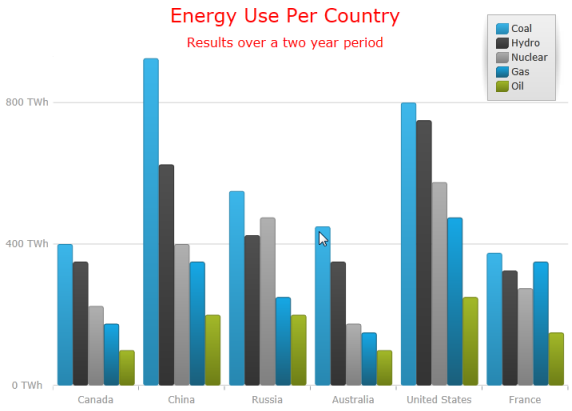

////
|metadata|
{
    "name": "datachart-chart-title-and-subtitle",
    "tags": ["Getting Started","How Do I"],
    "controlName": ["{DataChartName}"],
    "guid": "0202c82c-63da-456c-9022-76d15ccfac7d",
    "buildFlags": ["wpf","win-universal","WINFORMS","ANDROID"],
    "createdOn": "2014-06-05T19:39:00.7224077Z"
}
|metadata|
////

= Chart Title and Subtitle

== Topic Overview

=== Purpose

This topic provides information on using the chart title and subtitle feature of the link:{DataChartLink}.{DataChartName}.html[{DataChartName}™] chart control.

=== Required background

The following topic is a prerequisite to understanding this topic:

[options="header", cols="a,a"]
|====
|Topic|Purpose

| link:datachart-getting-started-with-datachart.html[Getting Started with Data Chart]
|The _{DataChartName}_ requires a data object model to be mapped to the control’s `DataContext` property. This article will provide a simple data object model but you can create your own and use it with this sample code instead.

|====

=== In this topic

This topic contains the following sections:

* <<ChartTitleSubtitle,Chart Title and Subtitle>>

** <<Overview,Overview>>
** <<Preview,Preview>>
** <<TitleSubtitle,Title and Subtitle>>
** <<StylingTitleSubtitle,Styling the Title and Subtitle>>
** <<Example,Example>>

* <<RelatedContent,Related Content>>

[[ChartTitleSubtitle]]
== Chart Title and Subtitle

[[Overview]]

=== Overview

The title and subtitle feature of the  _{DataChartName}_   control allows you to add information to the top section of the chart control.

When adding a title or subtitle to the chart control, the content of the chart automatically resizes allowing for the title and subtitle information.

[[Preview]]

=== Preview

The following screenshot is a preview of the chart control with a title and subtitle set.

image::images/xamDataChart_Chart_Title_01.png[]

[[TitleSubtitle]]
=== Title and Subtitle

In order to add a title and subtitle to the chart control there is a set of properties added to the  _{DataChartName}_ .

[options="header", cols="a,a,a"]
|====
|*Property Name*|*Property Type*|*Description*

| link:{DataChartLinkBase}.{DataChartBase}{ApiProp}title.html[Title]
|`String`
|Defines the title of the chart.

| link:{DataChartLinkBase}.{DataChartBase}{ApiProp}subtitle.html[Subtitle]
|`String`
|Defines the subtitle of the chart.

|====

[[StylingTitleSubtitle]]
=== Styling the Title and Subtitle

There are properties provided that allows you to style the text color, the text font style and the text font size of the titles and subtitles.

[options="header", cols="a,a,a"]
|====
|*Property Name*|*Property Type*|*Description*

 

| 
ifdef::wpf,win-universal[] 
link:{DataChartLinkBase}.{DataChartBase}{ApiProp}TitleForeground.html[TitleForeground]
endif::wpf,win-universal[] 

ifdef::win-forms,android,xamarin[] 
link:{DataChartLinkBase}.{DataChartBase}{ApiProp}TitleTextColor.html[TitleTextColor]
endif::win-forms,android,xamarin[] 
 
|`Brush`
|Title’s text color.

| link:{DataChartLinkBase}.{DataChartBase}{ApiProp}titlefontfamily.html[TitleFontFamily]
|`FontFamily`
|Title’s font name.

| 
ifdef::wpf,win-universal,xamarin,win-forms[] 
link:{DataChartLinkBase}.{DataChartBase}{ApiProp}TitleFontSize.html[TitleFontSize]
endif::wpf,win-universal,xamarin,win-forms[] 
ifdef::android[] 
link:{DataChartLinkBase}.{DataChartBase}{ApiProp}TitleTextSize.html[TitleTextSize]
endif::android[] 
 
|`double`
|Title’s font size.

ifdef::wpf,win-universal,android[]
| link:{DataChartLinkBase}.{DataChartBase}{ApiProp}TitleFontStyle.html[TitleFontStyle]
|`FontStyle`
| Title’s font style such as italic.
endif::wpf,win-universal,android[]

ifdef::win-forms[]
| link:{DataChartLinkBase}.{DataChartBase}{ApiProp}TitleTextStyle.html[TitleTextStyle]
|`FontStyle`
| Title’s font style such as italic.
endif::win-forms[]

ifdef::xamarin[]
| link:{DataChartLinkBase}.{DataChartBase}{ApiProp}TitleFontAttributes.html[TitleFontAttributes]
|`FontAttributes`
| Title’s font style such as italic.
endif::xamarin[]

ifdef::wpf,win-universal[]
| link:{DataChartLinkBase}.{DataChartBase}{ApiProp}titlefontstretch.html[TitleFontStretch]
|`FontStretch`
| Title’s font stretch.
endif::wpf,win-universal[]

ifdef::wpf,win-universal[]
| link:{DataChartLinkBase}.{DataChartBase}{ApiProp}TitleFontWeight.html[TitleFontWeight]
|`TitleFontWeight`
| Title’s font weight such as bold.
endif::wpf,win-universal[]

ifdef::android[]
| link:{DataChartLinkBase}.{DataChartBase}{ApiProp}TitleTypeface.html[TitleTypeface]
|`Typeface`
| Title’s font weight such as bold.
endif::android[]

 

| link:{DataChartLinkBase}.{DataChartBase}{ApiProp}titlehorizontalalignment.html[TitleHorizontalAlignment]
|`HorizontalAlignment`
|Title’s horizontal alignment.

ifdef::android,xamarin[]
| 
link:{DataChartLinkBase}.{DataChartBase}{ApiProp}titlebottommargin.html[TitleBottomMargin] 

link:{DataChartLinkBase}.{DataChartBase}{ApiProp}titletopmargin.html[TitleTopMargin]

link:{DataChartLinkBase}.{DataChartBase}{ApiProp}titlerightmargin.html[TitleRightMargin] 

link:{DataChartLinkBase}.{DataChartBase}{ApiProp}titleleftmargin.html[TitleLeftMargin] 
|`double`
| Title’s margin.
endif::android,xamarin[]

ifdef::wpf[]
| link:{DataChartLinkBase}.{DataChartBase}{ApiProp}titlemargin.html[TitleMargin] 
|`Thickness`
| Title’s margin.
endif::wpf[]

ifdef::win-forms[]
| link:{DataChartLinkBase}.{DataChartBase}{ApiProp}titlemargin.html[TitleMargin] 
|`Padding`
| Title’s margin.
endif::win-forms[]

 

| 
ifdef::wpf,win-universal[] 
link:{DataChartLinkBase}.{DataChartBase}{ApiProp}SubtitleForeground.html[SubtitleForeground]
endif::wpf,win-universal[] 

ifdef::win-forms,android,xamarin[] 
link:{DataChartLinkBase}.{DataChartBase}{ApiProp}SubtitleTextColor.html[SubtitleTextColor]
endif::win-forms,android,xamarin[] 
 
|`Brush`
|Subtitle’s text color.

| link:{DataChartLinkBase}.{DataChartBase}{ApiProp}Subtitlefontfamily.html[SubtitleFontFamily]
|`FontFamily`
|Subtitle’s font name.

| 
ifdef::wpf,win-universal,xamarin,win-forms[] 
link:{DataChartLinkBase}.{DataChartBase}{ApiProp}SubtitleFontSize.html[SubtitleFontSize]
endif::wpf,win-universal,xamarin,win-forms[] 
ifdef::android[] 
link:{DataChartLinkBase}.{DataChartBase}{ApiProp}SubtitleTextSize.html[SubtitleTextSize]
endif::android[] 
 
|`double`
|Subtitle’s font size.

ifdef::wpf,win-universal,android[]
| link:{DataChartLinkBase}.{DataChartBase}{ApiProp}SubtitleFontStyle.html[SubtitleFontStyle]
|`FontStyle`
| Subtitle’s font style such as italic.
endif::wpf,win-universal,android[]

ifdef::win-forms[]
| link:{DataChartLinkBase}.{DataChartBase}{ApiProp}SubtitleTextStyle.html[SubtitleTextStyle]
|`FontStyle`
| Subtitle’s font style such as italic.
endif::win-forms[]

ifdef::xamarin[]
| link:{DataChartLinkBase}.{DataChartBase}{ApiProp}SubtitleFontAttributes.html[SubtitleFontAttributes]
|`FontAttributes`
| Subtitle’s font style such as italic.
endif::xamarin[]

ifdef::wpf,win-universal[]
| link:{DataChartLinkBase}.{DataChartBase}{ApiProp}Subtitlefontstretch.html[SubtitleFontStretch]
|`FontStretch`
| Subtitle’s font stretch.
endif::wpf,win-universal[]

ifdef::wpf,win-universal[]
| link:{DataChartLinkBase}.{DataChartBase}{ApiProp}SubtitleFontWeight.html[SubtitleFontWeight]
|`SubtitleFontWeight`
| Subtitle’s font weight such as bold.
endif::wpf,win-universal[]

ifdef::android[]
| link:{DataChartLinkBase}.{DataChartBase}{ApiProp}SubtitleTypeface.html[SubtitleTypeface]
|`Typeface`
| Subtitle’s font weight such as bold.
endif::android[]

 

| link:{DataChartLinkBase}.{DataChartBase}{ApiProp}Subtitlehorizontalalignment.html[SubtitleHorizontalAlignment]
|`HorizontalAlignment`
|Subtitle’s horizontal alignment.

ifdef::android,xamarin[]
| 
link:{DataChartLinkBase}.{DataChartBase}{ApiProp}Subtitlebottommargin.html[SubtitleBottomMargin] 

link:{DataChartLinkBase}.{DataChartBase}{ApiProp}Subtitletopmargin.html[SubtitleTopMargin]

link:{DataChartLinkBase}.{DataChartBase}{ApiProp}Subtitlerightmargin.html[SubtitleRightMargin] 

link:{DataChartLinkBase}.{DataChartBase}{ApiProp}Subtitleleftmargin.html[SubtitleLeftMargin] 
|`double`
| Subtitle’s margin.
endif::android,xamarin[]

ifdef::wpf[]
| link:{DataChartLinkBase}.{DataChartBase}{ApiProp}Subtitlemargin.html[SubtitleMargin] 
|`Thickness`
| Subtitle’s margin.
endif::wpf[]

ifdef::win-forms[]
| link:{DataChartLinkBase}.{DataChartBase}{ApiProp}Subtitlemargin.html[SubtitleMargin] 
|`Padding`
| Subtitle’s margin.
endif::win-forms[]

|====

[[Example]]
=== Example
 
The following code example shows how to set title and subtitle properties on the chart control:

ifdef::wpf,win-universal[]
*In XAML:*
[source,xaml]
----
<ig:XamDataChart x:Name="DataChart" 
                 Title="Energy Use Per Country"
                 TitleForeground="Red"
                 TitleFontFamily="Verdana"
                 TitleFontSize="24"
                 Subtitle="Results over a two year period"
                 SubtitleForeground="Red"
                 SubtitleFontFamily="Verdana"
                 SubtitleFontSize="16" >
</ig:XamDataChart>
----
endif::wpf,win-universal[]

ifdef::xamarin[]
*In XAML:*
[source,xaml]
----
<ig:XamDataChart x:Name="DataChart" 
                 Title="Energy Use Per Country"
                 TitleTextColor="Red" 
                 TitleFontSize="24"
                 Subtitle="Results over a two year period"
                 SubtitleTextColor="Red" 
                 SubtitleFontSize="16" >
</ig:XamDataChart>
----
endif::xamarin[]

ifdef::android[]
*In Java:*
[source,js]
----
chart.setTitle("Energy Use Per Country");
chart.setTitleTextColor(Brushes.Red);
chart.setTitleFontFamily("Verdana");
chart.setTitleTextSize(24);
chart.setSubtitle("Results over a two year period");
chart.setSubtitleTextColor(Brushes.Red);
chart.setSubtitleFontFamily("Verdana");
chart.setSubtitleTextSize(16);
----
endif::android[]

The screenshot demonstrates how the chart control, with the title and subtitle, looks as a result of the above code snippet.
 

[[RelatedContent]]
== Related Content

The following topic provides additional information related to this topic:

[options="header", cols="a,a"]
|====
|Topic|Purpose

| link:datachart-getting-started-with-datachart.html[Getting Started with Data Chart]
|Information on how to start using the {DataChartName} control.

|====