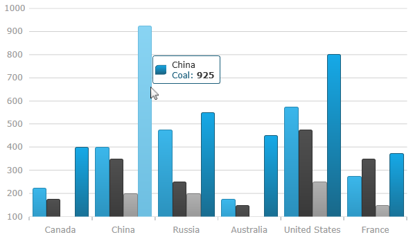

////
|metadata|
{
    "name": "datachart-chart-tooltips",
    "controlName": ["{DataChartName}"],
    "tags": ["Application Scenarios","Charting","How Do I"],
    "guid": "01682312-7c06-469f-87e6-c0cea516c9a6",
    "buildFlags": ["wpf","win-universal"],
    "createdOn": "2014-06-05T19:39:00.6673846Z"
}
|metadata|
////

= Chart Tooltips

This topic explains, with code examples, pick:[sl,wpf="how to enable the default tooltips in the link:{DataChartLink}.{DataChartName}.html[{DataChartName}]™ control and how to create custom ones."]
pick:[xamarin="how to display tooltips in the link:{DataChartLink}.{DataChartName}.html[{DataChartName}]™ control."]

== Introduction

In the {DataChartName} control,  pick:[sl,wpf="tooltips are displayed as long as mouse cursor hovers over series in the {DataChartName} control"]   pick:[xamarin,win-phone,win-universal="tooltips are displayed when the tap and hold gesture is performed within the chart's plot area. Also, tapping and holding and then moving the finger without releasing will update tooltips values"].

== Tooltips Overview

ifdef::sl,wpf[]
The {DataChartName} control provides default tooltips for each type of series. Default tooltips are enabled by setting the link:{DataChartLink}.series{ApiProp}showdefaulttooltip.html[ShowDefaultTooltip] property to True. The default tooltips display all the information relevant to the particular series item (series title, data values, axis values etc.) and are styled to match the series' style.
endif::sl,wpf[]

pick:[sl,wpf="If default tooltips are not sufficient, custom tooltips can be configured as well. "]Tooltips can be customized in the following aspects:

* tooltip content
* tooltip look-and-feel

ifdef::xamarin[]

The tooltip content is provided through the link:{DataChartLink}.Series{ApiProp}ToolTipTemplate.html[ToolTipTemplate] property of the link:{DataChartLink}.Series.html[Series] object.  In {PlatformName} this is done using a link:https://developer.xamarin.com/guides/xamarin-forms/application-fundamentals/templates/data-templates/creating/[DataTemplate] which contains the visual elements that make up the tooltip.

Additionally you can further customize the look and feel of the tooltip by setting the link:{DataChartLinkBase}.{DataChartBase}{ApiProp}ToolTipBackgroundColor.html[ToolTipBackgroundColor], link:{DataChartLinkBase}.{DataChartBase}{ApiProp}ToolTipBorderColor.html[ToolTipBorderColor] and link:{DataChartLinkBase}.{DataChartBase}{ApiProp}ToolTipBorderThickness.html[ToolTipBorderThickness] properties.

*Note:*
Tooltips are not currently supported for link:datachart-scatter-series-overview.html[Scatter Series] and link:datachart-polar-series-overview.html[Polar Series].

If your application has implemented navigation and it is possible for you to navigate away from the {DataChartName} while a tooltip is visible then the tooltip will remain on screen during the transition until it has finished.  The {DataChartName} has a method called link:{DataChartLinkBase}.{DataChartBase}{ApiProp}HideToolTip.html[HideToolTip] which you can call before navigation starts if you want to hide the tooltip before then.

When you call link:{DataChartLinkBase}.{DataChartBase}{ApiProp}HideToolTip.html[HideToolTip] you may need to follow it with a call to link:{DataChartLinkBase}.{DataChartBase}{ApiProp}Flush.html[Flush] depending on whether the framework gives the {DataChartName} a chance to act before it transitions away.  Many actions are deferred in the {DataChartName} including the act of hiding the tooltips so if the framework doesn't give the control a chance to act the tooltips won't hide right away.  In these cases calling link:{DataChartLinkBase}.{DataChartBase}{ApiProp}Flush.html[Flush] will execute the deferred actions immediately and hide the tooltip.

endif::xamarin[]

ifdef::wpf[]

The tooltip content is customized by providing custom content to the pick:[sl,wpf="link:{DataChartLink}.Series{ApiProp}ToolTip.html[ToolTip]"] property of the Series object.  pick:[sl,wpf="Tooltip look-and-feel is managed through the"]   pick:[xaml=" link:{DataChartLinkBase}.{DataChartBase}{ApiProp}tooltipstyle.html[ToolTipStyle]"]   pick:[xaml="property"]   pick:[win-phone="and"]   pick:[win-phone=" link:{DataChartLinkBase}{ApiProp}tooltipinfoboxstyle.html[ToolTipInfoBoxStyle]"]   pick:[win-phone="property"]   pick:[xaml="of the {DataChartName} control."]

endif::wpf[]

ifdef::sl,wpf[]
*Note:* If a custom link:{DataChartLink}.series{ApiProp}tooltip.html[ToolTip] is set, the link:{DataChartLink}.series{ApiProp}showdefaulttooltip.html[ShowDefaultTooltip] setting is disregarded.
endif::sl,wpf[]

ifdef::sl,wpf[]
== Default Tooltip
endif::sl,wpf[]

ifdef::sl,wpf[]
The following screenshot demontrates the default tooltip for category series.
endif::sl,wpf[]

ifdef::sl,wpf,win-phone[]

endif::sl,wpf,win-phone[]

== Code Example: Displaying Custom Tooltips

This example demonstrates how to display tooltip information about the open, high, low, and close sales volumes for any point in a financial graph. This is achieved by creating custom tooltips that will display the volume value on link:{DataChartLink}.lineseries.html[LineSeries] and the open, high, low, and close values on link:{DataChartLink}.financialpriceseries.html[FinancialPriceSeries].

=== Preview

ifdef::wpf,win-universal[]
image::images/xamDataChart_Chart_Tooltips_01.png[]
endif::wpf,win-universal[]

ifdef::xamarin[]
image::images/xamDataChart_Chart_Tooltips_02.png[]
endif::xamarin[]

Figure 1: The {DataChartName} control with custom tooltip showing values of Financial Price Series

== Steps

ifdef::xamarin[]

[start=1]
. Set the tooltip background and border settings.

*In XAML:*
[source,xaml]
----
<ig:{DataChartName} x:Name="dataChart1"
                   ToolTipBackgroundColor="#80F4F4F4"
                   ToolTipBorderColor="#1E000000"
                   ToolTipBorderThickness="2">
   <!--TODO: Add Series with custom tooltip content -->
</ig:{DataChartName}>
----

[start=2]
. Add custom tooltip content to the link:{DataChartLink}.Series{ApiProp}ToolTipTemplate.html[ToolTipTemplate] property of the link:{DataChartLink}.Series.html[Series] object.

*In XAML:*
[source,xaml]
----
<ig:XamDataChart.Series>
  <ig:LineSeries ItemsSource="{Binding}"
                 ValueMemberPath="Volume"
                 XAxis="{x:Reference commonXAxis}"
                 YAxis="{x:Reference volumnYAxis}"
                 Title="Volume Series">
    <ig:LineSeries.ToolTipTemplate>
      <DataTemplate>
        <StackLayout Orientation="Vertical" Margin="5">
          <Label Text="{Binding Series.Title}" FontAttributes="Bold" />
          <StackLayout Orientation="Horizontal">
            <Label Text="Value:" FontSize="12"/>
            <Label Text="{Binding Item.Volume}" FontSize="12"/>
          </StackLayout>
        </StackLayout>
      </DataTemplate>
    </ig:LineSeries.ToolTipTemplate>
  </ig:LineSeries>
  <ig:FinancialPriceSeries DisplayType="Candlestick"
                           ItemsSource="{Binding}"
                           OpenMemberPath="Open"
                           CloseMemberPath="Close"
                           HighMemberPath="High"
                           LowMemberPath="Low"
                           VolumeMemberPath="Volume"
                           XAxis="{x:Reference commonXAxis}"
                           YAxis="{x:Reference priceYAxis}"
                           Title="Price Series">
    <ig:FinancialPriceSeries.ToolTipTemplate>
      <DataTemplate>
        <StackLayout Orientation="Vertical" Margin="5">
          <Label Text="{Binding Series.Title}" FontAttributes="Bold" />
          <StackLayout Orientation="Horizontal">
            <Label Text="Open:" WidthRequest="40" FontSize="12"/>
            <Label Text="{Binding Item.Open}" FontSize="12"/>
          </StackLayout>
          <StackLayout Orientation="Horizontal">
            <Label Text="High:" WidthRequest="40" FontSize="12"/>
            <Label Text="{Binding Item.High, StringFormat='{0:N2}'}" FontSize="12"/>
          </StackLayout>
          <StackLayout Orientation="Horizontal">
            <Label Text="Low:" WidthRequest="40" FontSize="12"/>
            <Label Text="{Binding Item.Low, StringFormat='{0:N2}'}" FontSize="12"/>
          </StackLayout>
          <StackLayout Orientation="Horizontal">
            <Label Text="Close:" WidthRequest="40" FontSize="12"/>
            <Label Text="{Binding Item.Close}" FontSize="12"/>
          </StackLayout>
        </StackLayout>
      </DataTemplate>
    </ig:FinancialPriceSeries.ToolTipTemplate>
  </ig:FinancialPriceSeries>
</ig:XamDataChart.Series>
----

endif::xamarin[]

ifdef::wpf,win-universal[]

[start=1]
. Add a custom style for the chart’s Tooltip.

*In XAML:*
[source,xaml]
----
<UserControl.Resources>
   
</UserControl.Resources>
----

[start=2]
. Set the custom tooltip style to the {DataChartName} control.

*In XAML:*
[source,xaml]
----
<ig:{DataChartName} x:Name="DataChart"
                 ToolTipStyle="{StaticResource ToolTipStyle}">
        <!--TODO: Add Series with custom tooltip content -->
</ig:{DataChartName}>
----

[start=3]
. Add custom tooltip content to the link:{DataChartLink}.series{ApiProp}tooltip.html[ToolTip] property of the link:{DataChartLink}.series.html[Series] object.

*In XAML:*
[source,xaml]
----
<ig:{DataChartName}.Series>
    <ig:LineSeries ItemsSource="{Binding}"
                   ValueMemberPath="Volume"
                   XAxis="{Binding ElementName=commonXAxis}"
                   YAxis="{Binding ElementName=volumeYAxis}">
            <!--Simple Tooltip showing volume on LineSeries -->
        <ig:LineSeries.ToolTip>
            <StackPanel Orientation="Vertical">
                <TextBlock Text="{Binding Series.Title}" FontWeight="Bold" />
                <StackPanel Orientation="Horizontal">
                    <TextBlock Text="Value:" />
                    <TextBlock Text="{Binding Item.Volume}"/>
                </StackPanel>
            </StackPanel>
        </ig:LineSeries.ToolTip>
    </ig:LineSeries>
    <ig:FinancialPriceSeries DisplayType="Candlestick"
                             ItemsSource="{Binding}"
                             OpenMemberPath="Open"
                             CloseMemberPath="Close"
                             HighMemberPath="High"
                             LowMemberPath="Low"
                             VolumeMemberPath="Volume"
                             XAxis="{Binding ElementName=commonXAxis}"
                             YAxis="{Binding ElementName=priceYAxis}">
            <!--Complex Tooltip showing all (OHLC) values on FinancialPriceSeries  -->
        <ig:FinancialPriceSeries.ToolTip>
            <StackPanel Orientation="Vertical">
                <TextBlock Text="{Binding Series.Title}" FontWeight="Bold" />
                <StackPanel Orientation="Horizontal">
                    <TextBlock Text="Open:" Width="40" />
                    <TextBlock Text="{Binding Item.Open}" />
                </StackPanel>
                <StackPanel Orientation="Horizontal">
                    <TextBlock Text="High:" Width="40" />
                    <TextBlock Text="{Binding Item.High}" />
                </StackPanel>
                <StackPanel Orientation="Horizontal">
                    <TextBlock Text="Low:" Width="40" />
                    <TextBlock Text="{Binding Item.Low}" />
                </StackPanel>
                <StackPanel Orientation="Horizontal">
                    <TextBlock Text="Close:" Width="40" />
                    <TextBlock Text="{Binding Item.Close}" />
                </StackPanel>
            </StackPanel>
        </ig:FinancialPriceSeries.ToolTip>
    </ig:FinancialPriceSeries>
</ig:{DataChartName}.Series>
----

endif::wpf,win-universal[]

[[RelatedContent]]
== Related Content

[options="header", cols="a,a"]
|====
|Topic|Purpose

|link:datachart-chart-navigation.html[Chart Navigation]
|This article explains how navigation works in the {DataChartName}.

ifdef::wpf,win-universal,win-forms[]
|link:datachart-chart-synchronization.html[Chart Synchronization]
|This article explains how to synchronize zooming, panning, etc. across multiple charts.
endif::wpf,win-universal,win-forms[]

|link:datachart-series-types.html[Series Types]
|This article describes the various series types that the {DataChartName} supports.

|link:datachart-series-requirements.html[Series Requirements]
|This article explains the requirements for all the series types.
|====