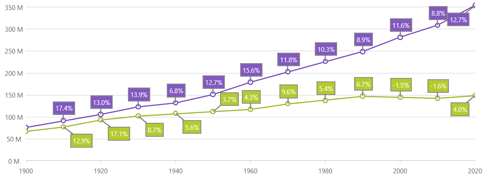
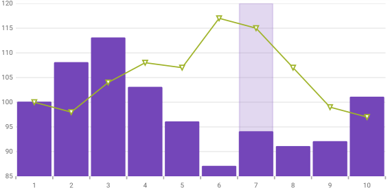
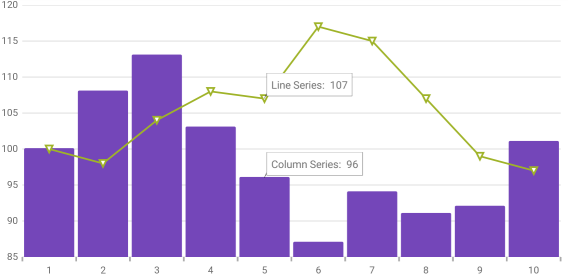
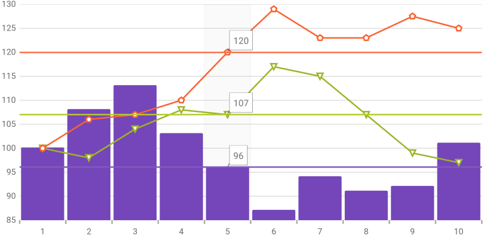

////
|metadata|
{
    "name": "datachart-chartannotationlayers",
    "controlName": ["{DataChartName}"],
    "tags": ["Charting","Getting Started","How Do I"],
    "guid": "210e57ae-6232-462f-89bf-76844d6e08f7",
    "buildFlags": ["WINFORMS","ANDROID","WPF","SL"],
    "createdOn": "2014-06-05T19:39:00.6333735Z"
}
|metadata|
////

= Chart Annotation Layers

=== Purpose

This topic provides conceptual information about the annotations and pick:[wpf,sl,win-universal,win-forms="hover"]pick:[xamarin="touch"] interactions available on the link:{DataChartLink}.{DataChartName}.html[{DataChartName}™] control including the different types of pick:[wpf,sl,win-universal,win-forms="hover"]pick:[xamarin="touch"] interaction layers available.

=== Required background

The following topics are prerequisites to understanding this topic:

[options="header", cols="a,a"]
|====
|Topic|Purpose

| link:datachart-getting-started-with-datachart.html[Getting Started with Data Chart]
|The _{DataChartName}_ control requires a data object model to be mapped to control's pick:[wpf,sl,win-universal,win-forms="DataContext"]pick:[xamarin="BindingContext"] property. This article will provide a simple data object model but you can create your own and use it with this sample code instead.

| link:datachart-category-series-overview.html[Category Series]
|This topic explains various types of Category Series in the _{DataChartName}_ control.

|====

=== In this topic

This topic contains the following sections:

* <<CommonProperties,Common Properties>>
* <<TypesofLayers,Types of Layers>>

** <<CalloutLayer,Callout Layer>>
** <<CrosshairLayer,Crosshair Layer>>
** <<CategoryHighlightLayer,Category Highlight Layer>>
** <<CategoryItemHighlightLayer,Category Item Highlight Layer>>
** <<CategoryTooltipLayer,Category Tooltip Layer>>
** <<DataTooltipLayer,Data Tooltip Layer>>
** <<DataAnnotationBandLayer,Data Annotation Band Layer (Beta)>>
** <<DataAnnotationLineLayer,Data Annotation Line Layer (Beta)>>
** <<DataAnnotationRectLayer,Data Annotation Rect Layer (Beta)>>
** <<DataAnnotationSliceLayer,Data Annotation Slice Layer (Beta)>>
** <<DataAnnotationStripLayer,Data Annotation Strip Layer (Beta)>>
** <<ItemTooltipLayer,Item Tooltip Layer>>
** <<FinalValueLayer,Final Value Layer>>
* <<HoverInteractions,Hover Interactions>>

* <<RelatedContent,Related Content>>

image::images/MultipleDataAnnotationsWithStocks.png[]

*This image is specifically showing only Data Annotations for technical analysis of Tesla Stock Data.

[[CommonProperties]]
== Common Properties

=== Common properties and methods overview

Since the pick:[wpf,sl,win-universal,win-forms="hover"]pick:[xamarin="touch"] interaction layers inherit from the link:{DataChartLink}.series_members.html[Series] object, they gain a lot of the properties and methods that are available on the link:{DataChartLink}.series_members.html[Series] base class. However, not everything from the link:{DataChartLink}.series_members.html[Series] class is meaningful for the hover interaction layers. For example, pick:[wpf,sl,win-universal,win-forms="hover"]pick:[xamarin="touch"] interaction layers are not designed to interact with the pick:[wpf,sl,win-universal,win-forms="mouse"]pick:[xamarin="touch point"] and should not be hit testable; consequently they will not raise pick:[wpf,sl,win-universal,win-forms="mouse"]pick:[xamarin="touch"] related events.

For more information on the common properties and methods, see the link:datachart-commonproperties.html[Common Properties] topic.

[[TypesofLayers]]
== Types of Layers

=== Introduction

Currently there are 5 different pick:[wpf,sl,win-universal,win-forms="hover"]pick:[xamarin="touch"] interaction layers available on the  _{DataChartName}_  control. Each of these pick:[wpf,sl,win-universal,win-forms="hover"]pick:[xamarin="touch"] interactions layers provides a different highlight, pick:[wpf,sl,win-universal,win-forms="hover"]pick:[xamarin="touch"] and tooltip interactions that may be used individually or combined with one another providing powerful pick:[wpf,sl,win-universal,win-forms="hover"]pick:[xamarin="touch"] interactions.

=== Types of Layers

The following table summarizes the different types of layers available on the  _{DataChartName}_  control.

[options="header", cols="a,a"]
|====
|Layer Type|Description

|[[CalloutLayer]]

link:{DataChartLink}.calloutlayer_members.html[CalloutLayer]
|The link:{DataChartLink}.calloutlayer_members.html[CalloutLayer] displays a callout annotation at an X/Y position. It can show a label and some extra content on mouse-over.

The CalloutLayer supports all series types.

ifdef::wpf,sl,win-universal,win-forms[]

endif::wpf,sl,win-universal,win-forms[]

For more information, see the link:datachart-calloutlayer.html[Callout Layer] topic.

|[[CrosshairLayer]] 

link:{DataChartLink}.crosshairlayer_members.html[CrosshairLayer]
|The link:{DataChartLink}.crosshairlayer_members.html[CrosshairLayer] provides crossing lines that meet at the actual value of every targeted series. 

ifdef::wpf,sl,win-universal,win-forms[]
image::images/Hover_InteractionsOverview_2.png[]
endif::wpf,sl,win-universal,win-forms[]

ifdef::xamarin[]
image::images/XF_InteractionsOverview_2.png[]
endif::xamarin[]

For more information, see the link:datachart-crosshairlayer.html[Crosshair Layer] topic.

|[[CategoryHighlightLayer]] 

link:{DataChartLink}.categoryhighlightlayer_members.html[CategoryHighlightLayer]
|The link:{DataChartLink}.categoryhighlightlayer_members.html[CategoryHighlightLayer] targets a category axis, or all category axes in the _{DataChartName}_ control. They draw a shape that illuminates the area of the axis closest to the pick:[wpf,sl,win-universal,win-forms="cursor"]pick:[xamarin="touch"] position. 

ifdef::wpf,sl,win-universal,win-forms[]
image::images/Hover_InteractionsOverview_3.png[]
endif::wpf,sl,win-universal,win-forms[]

ifdef::xamarin[]
image::images/XF_InteractionsOverview_3.png[]
endif::xamarin[]

For more information, see the link:datachart-categoryhighlightlayer.html[Category Highlight Layer] topic.

|[[CategoryItemHighlightLayer]] 

link:{DataChartLink}.categoryitemhighlightlayer_members.html[CategoryItemHighlightLayer]
|The link:{DataChartLink}.categoryitemhighlightlayer_members.html[CategoryItemHighlightLayer] layer highlights items in a series that use a category axis either by drawing a banded shape at their position or by rendering a marker at their position. 

ifdef::wpf,sl,win-universal,win-forms[]
image::images/Hover_InteractionsOverview_4.png[]
endif::wpf,sl,win-universal,win-forms[]

ifdef::xamarin[]

endif::xamarin[] 

For more information, see the link:datachart-categoryitemhighlightlayer.html[Category Item Highlight Layer] topic.

|[[CategoryToolTipLayer]] 

link:{DataChartLink}.categorytooltiplayer_members.html[CategoryToolTipLayer]
|The link:{DataChartLink}.categorytooltiplayer_members.html[CategoryToolTipLayer] displays grouped tooltips for series using a category axis. 

ifdef::wpf,sl,win-universal,win-forms[]
image::images/Hover_InteractionsOverview_5.png[]
endif::wpf,sl,win-universal,win-forms[]

ifdef::xamarin[]
image::images/XF_InteractionsOverview_5.png[]
endif::xamarin[] 

For more information, see the link:datachart-categorytooltiplayer.html[Category Tooltip Layer] topic.

|[[DataToolTipLayer]]

link:{DataChartLink}.DataToolTipLayer.html[DataToolTipLayer]

|The link:{DataChartLink}.DataToolTipLayer.html[DataToolTipLayer] displays a visualization much like the link:datachart-data-legend.html[{DataLegendName}] as you mouse over the different series of the chart.

For more information, see the link:datachart-data-tooltip.html[Data Tooltip Layer] topic.

|[[DataAnnotationBandLayer]]

link:{DataChartLink}.DataAnnotationBandLayer.html[DataAnnotationBandLayer]

|The link:{DataChartLink}.DataAnnotationBandLayer.html[DataAnnotationBandLayer] displays a visualization over the series of the chart.

For more information, see the link:datachart-data-annotation-band-layer.html[Data Annotation Band Layer] topic.

|[[DataAnnotationLineLayer]]

link:{DataChartLink}.DataAnnotationLineLayer.html[DataAnnotationLineLayer]

|The link:{DataChartLink}.DataAnnotationLineLayer.html[DataAnnotationLineLayer] displays a visualization over the series of the chart.

For more information, see the link:datachart-data-annotation-line-layer.html[Data Annotation Line Layer] topic.

|[[DataAnnotationRectLayer]]

link:{DataChartLink}.DataAnnotationRectLayer.html[DataAnnotationRectLayer]

|The link:{DataChartLink}.DataAnnotationRectLayer.html[DataAnnotationRectLayer] displays a visualization over the series of the chart.

For more information, see the link:datachart-data-annotation-rect-layer.html[Data Annotation Rect Layer] topic.

|[[DataAnnotationSliceLayer]]

link:{DataChartLink}.DataAnnotationSliceLayer.html[DataAnnotationSliceLayer]

|The link:{DataChartLink}.DataAnnotationSliceLayer.html[DataAnnotationSliceLayer] displays a visualization over the series of the chart.

For more information, see the link:datachart-data-annotation-slice-layer.html[Data Annotation Slice Layer] topic.

|[[DataAnnotationStripLayer]]

link:{DataChartLink}.DataAnnotationStripLayer.html[DataAnnotationStripLayer]

|The link:{DataChartLink}.DataAnnotationStripLayer.html[DataAnnotationStripLayer] displays a visualization over the series of the chart.

For more information, see the link:datachart-data-annotation-strip-layer.html[Data Annotation Strip Layer] topic.

|[[ItemToolTipLayer]] 

link:{DataChartLink}.itemtooltiplayer_members.html[ItemToolTipLayer]
|The link:{DataChartLink}.itemtooltiplayer_members.html[ItemToolTipLayer] displays tooltips for all target series individually. 

ifdef::wpf,sl,win-universal,win-forms[]
image::images/Hover_InteractionsOverview_6.png[]
endif::wpf,sl,win-universal,win-forms[]

ifdef::xamarin[]

endif::xamarin[] 

For more information, see the link:datachart-itemtooltiplayer.html[Item Tooltip Layer] topic.

|[[FinalValueLayer]]

link:{DataChartLink}.finalvaluelayer_members.html[FinalValueLayer]
|The link:{DataChartLink}.finalvaluelayer_members.html[FinalValueLayer] provides an annotation along the axis of the ending value displayed in a series.

ifdef::wpf,sl,win-universal,win-forms
image::images/Hover_InteractionsOverview_7.png[0,600]
endif::wpf,sl,win-universal,win-forms[]

For more information, see the link:datachart-finalvaluelayer.html[Final Value Layer] topic.

|====

[[HoverInteractions]]
== Hover Interactions

=== pick:[wpf,sl,win-universal,win-forms="Hover"]pick:[xamarin="Touch"] interactions summary

pick:[wpf,sl,win-universal,win-forms="Hover"]pick:[xamarin="Touch"] interactions are implemented through pick:[wpf,sl,win-universal,win-forms="hover"]pick:[xamarin="touch"] interaction layers which are series that are added to the series collection. These layers are dependent on the pick:[wpf,sl,win-universal,win-forms="cursor"]pick:[xamarin="touch"] position. Adding the pick:[wpf,sl,win-universal,win-forms="cursor"]pick:[xamarin="touch"] interaction layers to the  _{DataChartName}_  control disables the default behavior of the crosshairs and/or tooltips (depending on which type of layer added).

The default behavior is disabled because it prevents visual confusion as the pick:[wpf,sl,win-universal,win-forms="hover"]pick:[xamarin="touch"] interaction layers perform a similar visual function compared to the built in behavior as the pick:[wpf,sl,win-universal,win-forms="cursor"]pick:[xamarin="touch point"] moves. You can, however, override this behavior and allow the default crosshair functionality to perform in addition to the pick:[wpf,sl,win-universal,win-forms="hover"]pick:[xamarin="touch"] interaction layer functionality. Also of note, only target a series by one tooltip layer at a time. If you target more than one tooltip layer at a series, the pick:[wpf,sl,win-universal,win-forms="hover"]pick:[xamarin="touch"] interaction layers that use tooltips will not function as expected.
ifdef::wpf[]
This is due to the fact that series tooltips are `UIElements` and can only be attached to the visual tree in one place at a time.
endif::wpf[]
ifdef::xamarin[]
This is due to the fact that series tooltips can only have one parent in the visual tree.
endif::xamarin[]
Using a tooltip for a series in more than one location at once is not allowed.

The following screenshot displays the  _{DataChartName}_  control with the category highlight layer, the crosshair layer and the item tooltip layer implemented.

ifdef::wpf,sl,win-universal,win-forms[]
image::images/Hover_InteractionsOverview_1.png[]
endif::wpf,sl,win-universal,win-forms[]

ifdef::xamarin[]

endif::xamarin[]

[[RelatedContent]]
== Related Content

[options="header", cols="a,a"]
|====
|Topic|Purpose

| link:datachart-commonproperties.html[Common Properties]
|This topic provides information about the properties and methods that the pick:[wpf,sl,win-universal,win-forms="hover"]pick:[xamarin="touch"] interaction feature uses for highlightingpick:[wpf,sl,win-universal,win-forms=", hovering"] and interacting with the tooltip interactions inherited from the link:{DataChartLink}.series_members.html[Series] class.

| link:datachart-crosshairlayer.html[Crosshair Layer]
|This topic provides information about the crosshair layer used for pick:[wpf,sl,win-universal,win-forms="hover"]pick:[xamarin="touch"] interactions. It describes the properties of the crosshair layer and provides an implementation example.

| link:datachart-categoryhighlightlayer.html[Category Highlight Layer]
|This topic provides information about the category highlight layer which is used for pick:[wpf,sl,win-universal,win-forms="hover"]pick:[xamarin="touch"] interactions. It describes the properties of the category highlight layer and provides an example of its implementation.

| link:datachart-categoryitemhighlightlayer.html[Category Item Highlight Layer]
|This topic provides information about the category item highlight layer used for pick:[wpf,sl,win-universal,win-forms="hover"]pick:[xamarin="touch"] interactions. It describes the properties of the category item highlight layer and provides an example of its implementation.

| link:datachart-categorytooltiplayer.html[Category Tooltip Layer]
|This topic provides information about the category tooltip layer used for pick:[wpf,sl,win-universal,win-forms="hover"]pick:[xamarin="touch"] interactions. It describes the properties of the category tooltip layer and provides an example of its implementation.

| link:datachart-itemtooltiplayer.html[Item Tooltip Layer]
|This topic provides information about the item tooltip layer which is used for pick:[wpf,sl,win-universal,win-forms="hover"]pick:[xamarin="touch"] interactions. It describes the properties of the item tooltip layer and also provides an example of its implementation.

|====