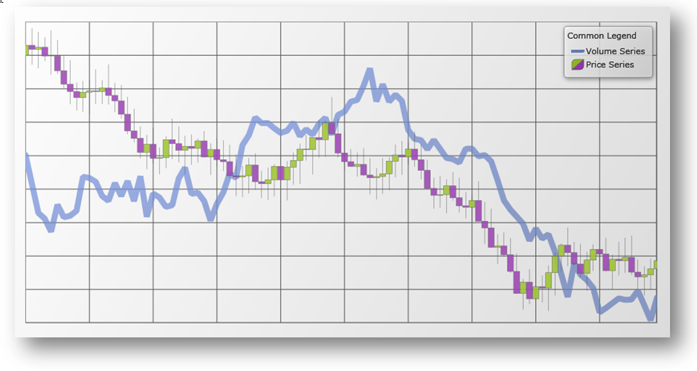

////
|metadata|
{
    "name": "datachart-common-legend",
    "controlName": ["{DataChartName}"],
    "tags": ["Application Scenarios","Charting","How Do I"],
    "guid": "41bed3d3-e267-4b63-bef1-2aefa06efc64",
    "buildFlags": ["wpf","win-universal"],
    "createdOn": "2014-06-05T19:39:00.6763883Z"
}
|metadata|
////

= Adding Common Legend

By default, the link:{DataChartLink}.{DataChartName}.html[{DataChartName}]™ does not display link:datachart-legends.html[Chart Legends] for any series in the chart control. If you want to show a common Legend for multiple Series, you need to add a legend object to your application and then bind it to the link:{DataChartLink}.series{ApiProp}legend.html[Legend] property of the {DataChartName} control. In addition, you must set the link:{DataChartLink}.Series{ApiProp}title.html[Title] property for each Series object or else its corresponding legend item will use a default Series title.

The following example code demonstrates how to add a common Legend for multiple series defined in the {DataChartName} control’s Series collection.

ifdef::wpf,win-universal[]
*In XAML:*
[source,xaml]
----
<Grid>
    <ig:XamDataChart Legend="{Binding ElementName=Legend}">
        ...
        <ig:XamDataChart.Series>
            <ig:LineSeries Title="Volume Series"/> 
            <ig:FinancialPriceSeries Title="Price Series"/> 
        </ig:XamDataChart.Series>
    </ig:XamDataChart>
    <ig:Legend x:Name="Legend"
               Content="Common Legend" 
               HorizontalAlignment="Right"
               VerticalAlignment="Top">
    </ig:Legend> 
</Grid>
----
endif::wpf,win-universal[]

ifdef::xamarin[]
*In XAML:*
[source,xaml]
----
<Grid>
    <ig:XamDataChart Legend="{x:Reference Legend}">
        ...
        <ig:XamDataChart.Series>
            <ig:LineSeries Title="Volume Series"/> 
            <ig:FinancialPriceSeries Title="Price Series"/> 
        </ig:XamDataChart.Series>
    </ig:XamDataChart>
    <ig:Legend x:Name="Legend"  
               HorizontalOptions="EndAndExpand"
               VerticalOptions="StartAndExpand">
    </ig:Legend> 
</Grid>
----
endif::xamarin[]

The following image shows how the {DataChartName} control might look like with a common legend for multiple series.

== Related Content

ifdef::wpf,win-universal[]
* link:datachart-docking-legends.html[Docking Legends]
endif::wpf,win-universal[]

* link:datachart-multiple-legends.html[Adding Multiple Legends]