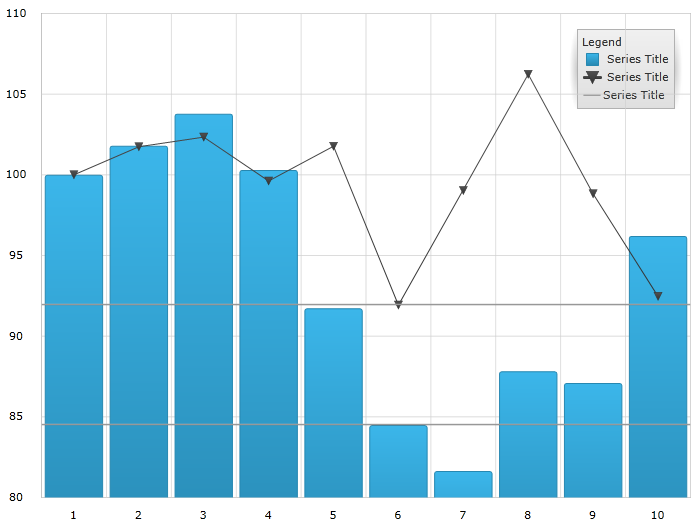
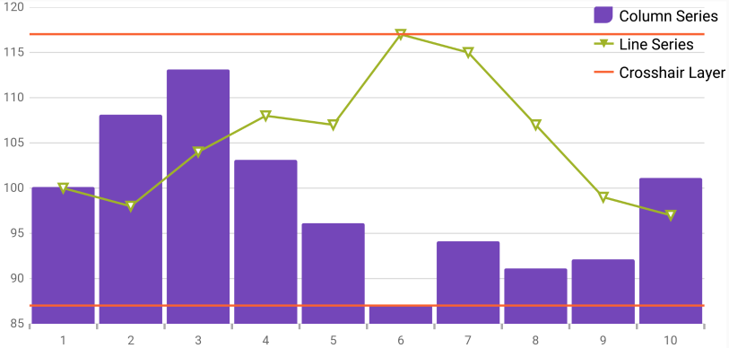

////
|metadata|
{
    "name": "datachart-commonproperties",
    "controlName": ["{DataChartName}"],
    "tags": ["Charting","Getting Started","How Do I"],
    "guid": "e082c77a-7b8f-48f8-9c9d-2db8f4a4a2cd",
    "buildFlags": ["ANDROID","SL","WPF","WINFORMS"],
    "createdOn": "2014-06-05T19:39:00.6283712Z"
}
|metadata|
////

= Common Properties

=== Purpose

This topic provides information about the properties and methods that the pick:[wpf,sl,win-universal,win-forms="hover"]pick:[xamarin="touch"] interaction feature uses for highlightingpick:[wpf,sl,win-universal,win-forms=", hovering"] and interacting with the tooltip interactions inherited from the link:{DataChartLink}.series_members.html[Series] class.

=== Required background

The following topics are prerequisites to understanding this topic:

[options="header", cols="a,a"]
|====
|Topic|Purpose

| link:datachart-getting-started-with-datachart.html[Getting Started with {DataChartName}]
|The _{DataChartName}_ control requires a data object model to be mapped to control's pick:[wpf,sl,win-universal="DataContext"]pick:[xamarin="BindingContext"]pick:[win-forms="DataSource"] property. This article will provide a simple data object model but you can create your own and use it with this sample code instead.

| link:datachart-category-series-overview.html[Category Series]
|This topic explains various types of Category Series in the _{DataChartName}_ control.

|====

toc::[]

[[Overview]]
== Overview

=== Common properties overview

The pick:[wpf,sl,win-universal,win-forms="hover"]pick:[xamarin="touch"] interactions layers inherit those link:{DataChartLink}.series_members.html[Series] base class properties and methods that are relevant in the context of pick:[wpf,sl,win-universal,win-forms="hover"]pick:[xamarin="touch"] interactions. For example, pick:[wpf,sl,win-universal,win-forms="hover"]pick:[xamarin="touch"] interactions, by design do not interact with the pick:[wpf,sl,win-universal,win-forms="mouse"]pick:[xamarin="touch position"], so they do not raise the pick:[wpf,sl,win-universal,win-forms="mouse"]pick:[xamarin="touch"] events. Also, the pick:[wpf,sl,win-universal="hover"]pick:[xamarin="touch"] interaction layers do not display data directly, so methods such as link:{DataChartLink}.series~scrollintoview.html[ScrollIntoView] are not applicable for this feature.

[[CommonProperties]]
== Common Properties

=== Common Items summary

The following table summarizes the link:{DataChartLink}.series_members.html[Series] class properties inherited by the pick:[wpf,sl,win-universal,win-forms="hover"]pick:[xamarin="touch"] interaction classes.

[options="header", cols="a,a,a"]
|====
|Property Name|Property Type|Description

| link:{DataChartLink}.series{ApiProp}brush.html[Brush]
|`Brush`
|The pick:[wpf,sl,win-universal,win-forms="hover"]pick:[xamarin="touch"] interaction layers inherit their link:{DataChartLink}.series{ApiProp}brush.html[Brush] from the series with whom they are interacting. However, this can be overridden by setting the link:{DataChartLink}.series{ApiProp}brush.html[Brush] property directly.

| link:{DataChartLink}.series{ApiProp}outline.html[Outline]
|`Brush`
|This property follows the same guidelines as the link:{DataChartLink}.series{ApiProp}brush.html[Brush] property, listed above.

| link:{DataChartLink}.annotationlayer{ApiProp}cursorposition.html[CursorPosition]
|`Point`
|This property specifies the world position to use instead of the default pick:[wpf,sl,win-universal,win-forms="mouse"]pick:[xamarin="touch"] position (NaN, NaN). When this property is set, it fixes the particular layer on the provided world position.

.Note: 

[NOTE] 

==== 

A world position contains x and y values which range from 0 to 1 representing the global position of the cursor relative to the entire ranges of the axes. 

====

ifdef::xaml,win-forms[]
| link:{DataChartLink}.series{ApiProp}isdefaultcrosshairbehaviordisabled.html[IsDefaultCrosshairBehaviorDisabled]
|`bool`
|This property specifies if the series default crosshair should be disabled when there is a pick:[wpf,sl,win-universal,win-forms="hover"]pick:[xamarin="touch"] interactions layer on the chart. The default value is True.
endif::xaml,win-forms[]

| link:{DataChartLink}.annotationlayer{ApiProp}useindex.html[UseIndex]
|`bool`
|This property specifies if the pick:[wpf,sl,win-universal,win-forms="hover"]pick:[xamarin="touch"] interactions layer should use a series index and reserve a color in the Brushes collection that is assigned to the {DataChartName} control. The default value is False.

| link:{DataChartLink}.annotationlayer{ApiProp}uselegend.html[UseLegend]
|`bool`
|This property specifies if the pick:[wpf,sl,win-universal,win-forms="hover"]pick:[xamarin="touch"] interactions layer should appear in the legend. When this property is set to true, it also indexes the series as it is required to appear in the legend. In order be recognized in the legend you must assign a single color to the series. The default value is False.

|====

[[SettingtheInheritedPropertiesonaCrosshairLayer]]
== Setting the Inherited Properties on a Crosshair Layer

=== Example

The following screenshot illustrates how the  _{DataChartName}_   control’s link:{DataChartLink}.crosshairlayer.html[CrosshairLayer] looks using the following settings:

[options="header", cols="a,a"]
|====
|Property|Value

| link:{DataChartLink}.annotationlayer{ApiProp}cursorposition.html[CursorPosition]
|0.55, 0.55

| link:{DataChartLink}.annotationlayer{ApiProp}uselegend.html[UseLegend]
|True

|====

ifdef::wpf,sl,win-universal[]

endif::wpf,sl,win-universal[]

ifdef::xamarin[]

endif::xamarin[]

ifdef::win-forms[]
image::images/WF_Common_Properties_1.png[]
endif::win-forms[]

Following is the code used in this implementation

ifdef::wpf,win-universal[]

*In XAML:*

[source,xaml]
----
<ig:CrosshairLayer VerticalLineVisiblity="Collapsed"
                   Legend="{Binding ElementName=TitleLegend}"
                   UseLegend="True"
                   CursorPosition="0.55, 0.55"/>
----

endif::wpf,win-universal[]

ifdef::xamarin[]

*In XAML:*

[source,xaml]
----
<ig:CrosshairLayer VerticalLineVisiblity="Collapsed"
                   Legend="{x:Reference TitleLegend}"
                   UseLegend="True"
                   CursorPosition="0.55, 0.55"/>
----

endif::xamarin[]

ifdef::wpf,win-universal[]

*In C#:*

[source]
----
var crosshairLayerSeries = new CrosshairLayer();
crosshairLayerSeries.UseLegend = true;
crosshairLayerSeries.CursorPosition = new Point(0.55, 0.55);
chart.Series.Add(crosshairLayerSeries);
----

endif::wpf,win-universal[]

ifdef::win-forms[]

*In C#:*

[source]
----
CrosshairLayer crosshairLayerSeries = new CrosshairLayer();
crosshairLayerSeries.UseLegend = true;
crosshairLayerSeries.CursorPosition = new Infragistics.Win.DataVisualization.Point(0.55, 0.55);
crosshairLayerSeries.Title = "CrosshairLayer";
crosshairLayerSeries.Legend = legend;
chart.Series.Add(crosshairLayerSeries);
----

endif::win-forms[]

ifdef::xamarin[]

*In C#:*

[source]
----
var crosshairLayerSeries = new CrosshairLayer();
crosshairLayerSeries.UseLegend = True;
crosshairLayerSeries.CursorPosition = new Point(0.55, 0.55);
chart.Series.Add(crosshairLayerSeries);
----

endif::xamarin[]

[[_Ref345510469]]
== Related Content

=== Topics

[options="header", cols="a,a"]
|====
|Topic|Purpose

| link:datachart-chartannotationlayers.html[Chart Annotation Layers]
|This topic provides conceptual information about the pick:[wpf,sl,win-universal,win-forms="hover"]pick:[xamarin="touch"] interactions available on the link:{DataChartLink}.{DataChartName}.html[{DataChartName}™] control including the different types of pick:[wpf,sl,win-universal,win-forms="hover"]pick:[xamarin="touch"] interaction layers available.

| link:datachart-crosshairlayer.html[Crosshair Layer]
|This topic provides information about the crosshair layer used for pick:[wpf,sl,win-universal,win-forms="hover"]pick:[xamarin="touch"] interactions. It describes the properties of the crosshair layer and provides an implementation example.

| link:datachart-categoryitemhighlightlayer.html[Category Item Highlight Layer]
|This topic provides information about the category item highlight layer used for pick:[wpf,sl,win-universal,win-forms="hover"]pick:[xamarin="touch"] interactions. It describes the properties of the category item highlight layer and provides an example of its implementation.

| link:datachart-categorytooltiplayer.html[Category Tooltip Layer]
|This topic provides information about the category tooltip layer used for pick:[wpf,sl,win-universal,win-forms="hover"]pick:[xamarin="touch"] interactions. It describes the properties of the category tooltip layer and provides an example of its implementation.

| link:datachart-itemtooltiplayer.html[Item Tooltip Layer]
|This topic provides information about the item tooltip layer which is used for pick:[wpf,sl,win-universal,win-forms="hover"]pick:[xamarin="touch"] interactions. It describes the properties of the item tooltip layer and also provides an example of its implementation.

| link:datachart-annotation-overlays.html[Chart Overlay Text]
|This topic provides conceptual information about the pick:[wpf,sl,win-universal,win-forms="hover"]pick:[xamarin="touch"] interactions available on the link:{DataChartLink}.{DataChartName}.html[{DataChartName}™] control including the different types of pick:[wpf,sl,win-universal,win-forms="hover"]pick:[xamarin="touch"] overlay text customization.

|====