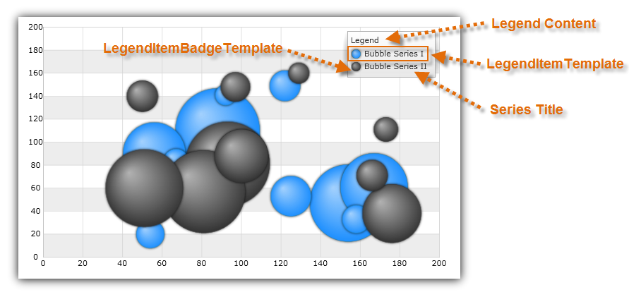

////
|metadata|
{
    "name": "datachart-configuring-basiclegend",
    "controlName": [],
    "tags": [],
    "guid": "0c3ffb62-af90-4722-91c1-c94067110757",
    "buildFlags": [],
    "createdOn": "2015-09-22T18:26:08.6567627Z"
}
|metadata|
////

= Configuring Basic Legend

This topic provides information on how to configure link:{LegendLink}.{LegendName}.html[{LegendName}] control and explains, with code examples, how to use it with link:datachart-series.html[Chart Series] in the link:{DataChartLink}.{DataChartName}.html[{DataChartName}]™ control.

[[Overview]]
== Overview

The topic is organized as follows:

* <<Introduction,Introduction>>
ifdef::android,wpf,win-universal[]
* <<Properties,Properties>>
endif::android,wpf,win-universal[]
* <<Requirements,Requirements>>
* <<CodeExample,Code Example>>

ifdef::wpf,win-universal,win-forms,android[]
* <<RelatedContent,Related Content>>
endif::wpf,win-universal,win-forms,android[]

[[Introduction]]
== Introduction

The basic Legend control identifies the title of a series with its visual representation of data in the chart plot area. Legend's visuals consist of a list of legend items that have legend badge representing color of series as well as legend text that matches title of a series. 
ifdef::wpf,win-universal[]
Also, legend has a legend title that is displayed above legend items.
endif::wpf,win-universal[]
 
ifdef::android,wpf,win-universal[]
[[Properties]]
== Properties

The basic Legend control shares common properties with other type of chart legends. Refer to the link:datachart-legends.html[Chart Legends] topic for a complete list of these common properties.  pick:[wpf,win-universal,android="The following table list all properties that are specific to the basic legend."]

[options="header", cols="a,a,a"]
|====
|Property Name|Property Type|Description

ifdef::wpf,win-universal[]
| link:{DataChartLink}.{LegendName}{ApiProp}Orientation.html[Legend.Orientation]
|`Orientation`
|Determines vertical/horizontal orientation of legend items in the legend.
endif::wpf,win-universal[]

ifdef::android[]
| link:{DataChartLink}.{LegendBaseName}{ApiProp}TextSize.html[{LegendName}.TextSize]
|`double`
|Determines text size in the legend.
endif::android[]

ifdef::android[]
| link:{DataChartLink}.{LegendBaseName}{ApiProp}TextColor.html[{LegendName}.TextColor]
|`int`
|Determines text color in the legend.
endif::android[]

ifdef::wpf,win-universal[]
|link:{DataChartLink}.series{ApiProp}LegendItemTemplate.html[Series.LegendItemTemplate]

|`DataTemplate`
|Determines a template for the legend item of a given chart series.
endif::wpf,win-universal[]

|====

endif::android,wpf,win-universal[]

[[Requirements]]
== Requirements

The Legend control supports any type of link:datachart-series.html[Chart Series] and it will display legend item for each series in the chart plot area.

[[CodeExample]]
== Code Example

This code snippet demonstrates how to share Legend between two link:{DataChartLink}.bubbleseries.html[BubbleSeries] objects as shown on Figure 1.

Figure 1: Basic Legend with two Bubble Series

ifdef::wpf,win-universal[]
*In XAML:*
[source,xaml]
----
<ig:{DataChartName} >
    ...
    <ig:{DataChartName}.Series>
        <ig:BubbleSeries Title="Bubble Series I"
                         Legend="{Binding ElementName=Legend1}">
        </ig:BubbleSeries>
        <ig:BubbleSeries Title="Bubble Series II"
                         Legend="{Binding ElementName=Legend1}" >
        </ig:BubbleSeries>
    </ig:{DataChartName}.Series>
</ig:{DataChartName}>
<ig:Legend x:Name="Legend1" Content="Legend" />
----
endif::wpf,win-universal[]

ifdef::xamarin[]
*In XAML:*
[source,xaml]
----
<ig:{DataChartName} >
    ...
    <ig:{DataChartName}.Series>
        <ig:BubbleSeries Title="Bubble Series I"
                         Legend="{x:Reference Legend1}" >
        </ig:BubbleSeries>
        <ig:BubbleSeries Title="Bubble Series II"
                         Legend="{x:Reference Legend1}" >
        </ig:BubbleSeries>
    </ig:{DataChartName}.Series>
</ig:{DataChartName}> 
<ig:Legend x:Name="Legend1"  /> 
----
endif::xamarin[]

ifdef::xamarin[]
*In C#:*
[source,csharp]
----
using {DataChartNamespace};
...
var legend = new Legend();
var series1 = new BubbleSeries();
series1.Title = "Bubble Series I";
series1.Legend = legend;
var series2 = new BubbleSeries();
series2.Title = "Bubble Series II";
series2.Legend = legend;
var DataChart = new {DataChartName}();
...
dataChart.Series.Add(series1);
dataChart.Series.Add(series2);
----
endif::xamarin[]

ifdef::wpf,win-universal[]
*In C#:*
[source,csharp]
----
using {DataChartNamespace};
using Infragistics; 
...
var legend = new Legend();
legend.Content = "Legend" 
var series1 = new BubbleSeries();
series1.Title = "Bubble Series I";
series1.Legend = legend;
var series2 = new BubbleSeries();
series2.Title = "Bubble Series II";
series2.Legend = legend;
var DataChart = new {DataChartName}();
...
dataChart.Series.Add(series1);
dataChart.Series.Add(series2);
----
endif::wpf,win-universal[]

ifdef::win-forms[]
*In C#:*
[source,csharp]
----
using Infragistics.Win.DataVisualization;
var legend = new UltraLegend;
var series1 = new BubbleSeries();
series1.Title = "Bubble Series I";
series1.Legend = legend;
var series2 = new BubbleSeries();
series2.Title = "Bubble Series II";
series2.Legend = legend;
var DataChart = new {DataChartName}();
...
dataChart.Series.Add(series1);
dataChart.Series.Add(series2);
----
endif::win-forms[]

ifdef::wpf,win-universal[]
*In Visual Basic:*
[source,vb]
----
Imports {DataChartNamespace}
Imports Infragistics
...
Dim legend As New Legend()  
legend.Content = "Legend" 
Dim series1 As New BubbleSeries()
series1.Title = "Bubble Series I"
series1.Legend = legend
Dim series2 As New BubbleSeries()
series2.Title = "Bubble Series II"
series2.Legend = legend
Dim dataChart As New {DataChartName}()
...
dataChart.Series.Add(series1)
dataChart.Series.Add(series2)
----
endif::wpf,win-universal[]

ifdef::win-forms[]
*In Visual Basic:*
[source,vb]
---- 
Dim itemLegend As New ItemLegend
Dim series As New BubbleSeries()
series.LabelMemberPath = "Label"
series.Legend = itemLegend
Dim dataChart As New {DataChartName}()
dataChart.Series.Add(series)
---- 
endif::win-forms[]

ifdef::android[]
*In Java:*
[source,js]
----
import com.infragistics.controls.LegendView;
...
DataChartView chart = new DataChartView(rootView.getContext());
chart.setId(1111); //any integer to identify the view
LegendView legend = new LegendView(rootView.getContext());
RelativeLayout.LayoutParams legendParams = new RelativeLayout.LayoutParams(ViewGroup.LayoutParams.WRAP_CONTENT, ViewGroup.LayoutParams.WRAP_CONTENT);
legend.setContentDescription("Legend");
legendParams.addRule(RelativeLayout.ALIGN_TOP, chart.getId());
legendParams.addRule(RelativeLayout.ALIGN_RIGHT, chart.getId());
legend.setLayoutParams(legendParams);
BubbleSeries series1 = new BubbleSeries();
series1.setTitle("Bubble Series I");
series1.setLegend(legend);
BubbleSeries series2 = new BubbleSeries();
series2.setTitle("Bubble Series II");
series2.setLegend(legend);
chart.addSeries(series1);
chart.addSeries(series2);
----
endif::android[]

[[RelatedContent]]
== Related Content 

ifdef::wpf,win-universal,xamarin,win-forms,android[]
* link:datachart-configuring-itemlegend.html[Configuring Item Legend]
endif::wpf,win-universal,xamarin,win-forms,android[]

ifdef::wpf,win-universal,xamarin,win-forms[]
* link:datachart-configuring-scalelegend.html[Configuring Scale Legend]
endif::wpf,win-universal,xamarin,win-forms[]

ifdef::wpf,win-universal,xamarin[]
* link:datachart-common-legend.html[Adding Common Legend]
endif::wpf,win-universal,xamarin[]

ifdef::wpf,win-universal,xamarin[]
* link:datachart-multiple-legends.html[Adding Multiple Legends]
endif::wpf,win-universal,xamarin[]

ifdef::wpf,win-universal[]
* link:datachart-docking-legends.html[Docking Legends]
endif::wpf,win-universal[]