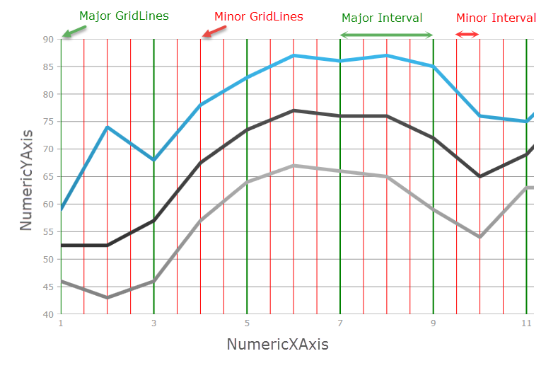
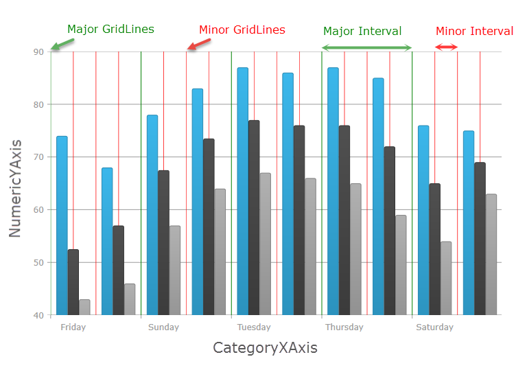
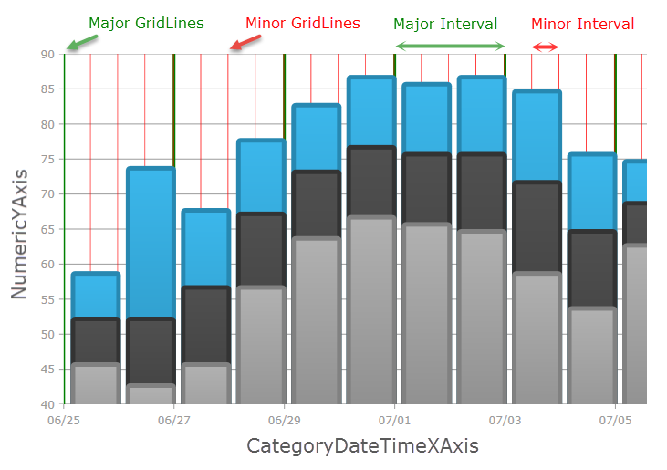

////
|metadata|
{
    "name": "datachart-configuring-major-and-minor-intervals",
    "controlName": [],
    "tags": [],
    "guid": "6d3aa20a-424c-4184-a11d-f04c7d4ff0c1",
    "buildFlags": [],
    "createdOn": "2015-07-08T17:39:16.9550036Z"
}
|metadata|
////

= Configuring Major and Minor Intervals

== Topic Overview

=== Purpose

This topic explains, with code examples, how to configure the major and minor intervals for chart axes of the  _{DataChartName}_™ control.

=== Required background

The following topics are prerequisites to understanding this topic:

[options="header", cols="a,a"]
|====
|Topic|Purpose

| link:datachart-getting-started-with-datachart.html[Getting Started with Data Chart]
|The _{DataChartName}_ control requires a Data set and data binding. This topic demonstrates how to provide a simple Data Object Model.

| link:datachart-axes.html[Chart Axes]
|This topic introduces the types of axes supported by the _{DataChartName}_ control.

|====

=== In this topic

This topic contains the following sections:

* <<_Ref421278386,Configuring Axis Major and Minor Intervals>>

** <<_Ref421279076,Feature summary>>
** <<_Ref421278621,Design Considerations>>
** <<_Ref423010055,Performance Impact>>
** <<_Ref422987569,Example using NumericYAxis>>
** <<_Ref422987654,Example using NumericXAxis>>
** <<_Ref422987623,Example using CategoryXAxis>>
** <<_Ref424054460,Example using Category-DateTimeXAxis>>

[[_Ref421278386]]
== Configuring Axis Minor Intervals

[[_Ref421279076]]

=== Feature Summary

In the {DataChartName} control, axis major interval specifies how frequent major gridlines and axis labels are rendered on an axis. Similarly, axis minor interval specifies how frequent minor gridlines are rendered on an axis.

Major and minor intervals are supported on all numeric and category, including:

* link:{DataChartLink}.numericxaxis_members.html[NumericXAxis]
* link:{DataChartLink}.numericyaxis_members.html[NumericYAxis]
* link:{DataChartLink}.categoryxaxis_members.html[CategoryXAxis]
* link:{DataChartLink}.categoryyaxis_members.html[CategoryYAxis]
* link:{DataChartLink}.categorydatetimexaxis_members.html[CategoryDateTimeXAxis]
* link:{DataChartLink}.categoryangleaxis_members.html[CategoryAngleAxis]
* link:{DataChartLink}.numericangleaxis_members.html[NumericAngleAxis]
* link:{DataChartLink}.numericradiusaxis_members.html[NumericRadiusAxis]

The following screenshot displays a major interval on the NumericYAxis, using major interval value of 10, with a green stroke; and a minor interval on the NumericYAxis, using minor interval value of 2.5, with a red stroke.

image::images/DataChart_Configuring_Major_and_Minor_Intervals_1.png[]

Axis major and minor intervals are implemented by setting the link:{DataChartLink}.numericxaxis_members.html[Interval] and link:{DataChartLink}.numericxaxis_members.html[MinorInterval] properties on an axis to a value greater than zero. In order to display minor gridlines that correspond to minor interval, one needs to set link:{DataChartLink}.numericxaxis_members.html[MinorStroke] and link:{DataChartLink}.numericxaxis_members.html[MinorStrokeThickness] properties on the axis, (as minor gridlines do not have a default color or thickness, and they will not be displayed without first assigning them).

[[_Ref421278621]]

=== Design Considerations

The following table maps the desired effects expressed by the minor interval with property changes necessary to obtain them.

[options="header", cols="a,a,a"]
|====
|In order to configure:|Use this property|And set it to:

|The frequency of major interval gridlines.
| link:{DataChartLink}.numericxaxis_members.html[Interval]
|This value provides adequate spacing for axis labels and major gridlines, if used. Note that the interval for axis labels will also be set by this value, displaying one label at the point on the axis associated with the interval. 

On category axes, this value is represented as index between first item and last category item. Generally, this value should equal to 10-20% of total numbers of category items so that all axis labels fit on axis so that they are not clipped by other axis labels. 

On numeric axes, this value is represented as double between axis minimum value and axis maximum value. By default, numeric axes will automatically calculate and find a nice and round interval based on axis minimum values and maximum value. 

On date time axes, this value is represented as time span between axis minimum value and axis maximum value.

|The color of the major interval gridlines.
| link:{DataChartLink}.numericxaxis_members.html[MajorStroke]
|A color of axis major gridlines.

|The thickness of the major interval gridlines.
| link:{DataChartLink}.numericxaxis_members.html[MajorStrokeThickness]
|A thickness in pixels of the axis major gridlines set as a double value

|A dashed line for the major interval gridlines
|link:{DataChartLink}.numericxaxis_members.html[MajorStrokeDashArray]
|A `DoubleCollection` taking a `double[]` as its parameter to describe the length of the dashes in the dash array.

|[[_Hlk356484826]] 

The frequency of minor interval gridlines.
| link:{DataChartLink}.numericxaxis_members.html[MinorInterval]
|This value provides adequate spacing for minor gridlines, which are always rendered between major gridlines. As result, a value of link:{DataChartLink}.numericxaxis_members.html[MinorInterval] property should always be much smaller (usually 2-5 time smaller) than the value of major link:{DataChartLink}.numericxaxis_members.html[Interval] property of an axis. 

On category axes, this value is represented as fraction of major link:{DataChartLink}.numericxaxis_members.html[Interval] property. Generally, this value should equal to between 0.25 and 0.5 

On numeric axes, this value is represented as double between axis minimum value and axis maximum value. By default, numeric axes will not automatically calculate minor interval based on axis minimum values and maximum value. 

On date time axes, this value is represented as time span between axis minimum value and axis maximum value. link:{DataChartLink}.numericxaxis_members.html[]

|The color of the minor interval gridlines.
| link:{DataChartLink}.numericxaxis_members.html[MinorStroke]
|A color of axis minor gridlines.

|The thickness of the minor interval gridlines.
| link:{DataChartLink}.numericxaxis_members.html[MinorStrokeThickness]
|A thickness in pixels of the axis minor gridlines set as a double value

|A dashed line for the minor interval gridlines
|link:{DataChartLink}.numericxaxis_members.html[MinorStrokeDashArray]
|A `DoubleCollection` taking a `double[]` as its parameter to describe the length of the dashes in the dash array.

|====

[[_Ref423010055]]

=== Performance Impact

Axis major and minor intervals have the following performance impact on the chart control.

Setting very small value (compared to axis range) for major link:{DataChartLink}.numericxaxis_members.html[Interval] property will cause chart to render many major gridlines and thus might decrease performance depending on range of axis or when a user is interacting with the chart by zooming or panning. It is recommended to not set this property and let chart automatically calculate appropriate major interval. Also, setting major link:{DataChartLink}.numericxaxis_members.html[Interval] property will prevent rendering of axis labels and major gridlines when a user zoom in such that the axis range is less than a value of major link:{DataChartLink}.numericxaxis_members.html[Interval] property. However, the chart will automatically re-calculate major link:{DataChartLink}.numericxaxis_members.html[Interval] property if property is not set and a user zoom in such that the axis range is less than a value of this property.

Setting very small value (compared to axis range) for link:{DataChartLink}.numericxaxis_members.html[MinorInterval] property will cause chart to render many minor gridlines and thus decrease performance even more than setting for major link:{DataChartLink}.numericxaxis_members.html[Interval] property. This might be noticeable by a user is interacting with the chart by zooming or panning.

[[_Ref421278638]]

[[_Ref418859490]]

[[_Ref422987470]]

=== Example using NumericYAxis

The screenshot below demonstrates how the NumericYAxis in a  _{DataChartName}_  control looks as a result of the following interval related settings:

[options="header", cols="a,a"]
|====
|Property|Value

|MinorInterval
|2.5

|MinorStroke
|Red

|MinorStrokeThickness
|1

|Interval
|10

|MajorStroke
|Green

|MajorStrokeThickness
|2

|====

image::images/DataChart_Configuring_Major_and_Minor_Intervals_1.png[]

ifdef::xaml[]

*In XAML:*

[source,XAML]
----
<ig:NumericYAxis x:Name="yAxis"
                  MinorInterval="2.5" 
                  MinorStroke="Red" 
                  MinorStrokeThickness="1"
                  Interval="10"
                  MajorStroke="Green" 
                  MajorStrokeThickness="2"/>
----

endif::xaml[]

ifdef::wpf[]

*In C#:*

[source,csharp]
----
var yAxis = new NumericYAxis();
yAxis.MinorInterval = 2.5;
yAxis.MinorStrokeThickness = 1;
yAxis.MinorStroke = new SolidColorBrush("Red");
yAxis.Interval = 10;
yAxis.MajorStrokeThickness = 2;
yAxis.MajorStroke = new SolidColorBrush("Green");
----

endif::wpf[]

ifdef::win-forms[]

*In C#:*

[source,csharp]
----
var yAxis = new NumericYAxis();
yAxis.MinorInterval = 2.5;
yAxis.MinorStrokeThickness = 1;
yAxis.MinorStroke = new SolidColorBrush(Color.Red);
yAxis.Interval = 10;
yAxis.MajorStrokeThickness = 2;
yAxis.MajorStroke = new SolidColorBrush(Color.Green);
----

endif::win-forms[]

ifdef::xamarin[]

*In C#:*

[source,csharp]
----
var yAxis = new NumericYAxis();
yAxis.MinorInterval = 2.5;
yAxis.MinorStrokeThickness = 1;
yAxis.MinorStroke = new SolidColorBrush("Red");
yAxis.Interval = 10;
yAxis.MajorStrokeThickness = 2;
yAxis.MajorStroke = new SolidColorBrush("Green");
----

endif::xamarin[]

ifdef::wpf[]

*In Visual Basic:*

[source,vb]
----
Dim yAxis = New NumericYAxis()
yAxis.MinorInterval = 2.5
yAxis.MinorStrokeThickness = 1
yAxis.MinorStroke = New SolidColorBrush(Red)
yAxis.Interval = 10
yAxis.MajorStrokeThickness = 1
yAxis.MajorStroke = New SolidColorBrush(Green)
----

endif::wpf[]

ifdef::win-forms[]

*In Visual Basic:*

[source,vb]
----
Dim yAxis = New NumericYAxis()
yAxis.MinorInterval = 2.5
yAxis.MinorStrokeThickness = 1
yAxis.MinorStroke = New SolidColorBrush(Color.Red)
yAxis.Interval = 10
yAxis.MajorStrokeThickness = 1
yAxis.MajorStroke = New SolidColorBrush(Color.Green)
----

endif::win-forms[]
 
ifdef::android[]

*In Java:*

[source,js]
----
NumericYAxis yAxis = new NumericYAxis();     
yAxis.MinorInterval = 2.5;
yAxis.MinorStrokeThickness = 1;
yAxis.MinorStroke = new SolidColorBrush(Red");
yAxis.Interval = 10;
yAxis.MajorStrokeThickness = 2;
yAxis.MajorStroke = new SolidColorBrush("Green");
----

endif::android[]

[[_Ref422987654]]

=== Example using NumericXAxis

The screenshot below demonstrates how the NumericXAxis in a  _{DataChartName}_  control looks as a result of the following interval related settings:

[options="header", cols="a,a"]
|====
|Property|Value

|MinorInterval
|0.5

|MinorStroke
|Red

|MinorStrokeThickness
|1

|Interval
|2

|MajorStroke
|Green

|MajorStrokeThickness
|2

|====

ifdef::xaml[]

*In XAML:*

[source,xaml]
----
<ig:NumericXAxis x:Name="xAxis"
                  MinorInterval="2.5" 
                  MinorStroke="Red" 
                  MinorStrokeThickness="1"
                  Interval="2"
                  MajorStroke="Green" 
                  MajorStrokeThickness="2"/>
----

endif::xaml[]

ifdef::wpf[]

*In C#:*

[source,csharp]
----
var xAxis = new NumericXAxis();
xAxis.MinorInterval = 2.5;
xAxis.MinorStrokeThickness = 1;
xAxis.MinorStroke = new SolidColorBrush("Red");
xAxis.Interval = 10;
xAxis.MajorStrokeThickness = 2;
xAxis.MajorStroke = new SolidColorBrush("Green");
----

endif::wpf[]

ifdef::win-forms[]

*In C#:*

[source,csharp]
----
var xAxis = new NumericXAxis();
xAxis.MinorInterval = 2.5;
xAxis.MinorStrokeThickness = 1;
xAxis.MinorStroke = new SolidColorBrush("Red");
xAxis.Interval = 10;
xAxis.MajorStrokeThickness = 2;
xAxis.MajorStroke = new SolidColorBrush("Green");
----

endif::win-forms[]

ifdef::xamarin[]

*In C#:*

[source,csharp]
----
var xAxis = new NumericXAxis();
xAxis.MinorInterval = 2.5;
xAxis.MinorStrokeThickness = 1;
xAxis.MinorStroke = new SolidColorBrush("Red");
xAxis.Interval = 10;
xAxis.MajorStrokeThickness = 2;
xAxis.MajorStroke = new SolidColorBrush("Green");
----

endif::xamarin[]

ifdef::wpf[]

*In Visual Basic:*

[source,vb]
----
Dim xAxis = New NumericXAxis()
xAxis.MinorInterval = 2.5
xAxis.MinorStrokeThickness = 1
xAxis.MinorStroke = New SolidColorBrush(Red)
xAxis.Interval = 10
xAxis.MajorStrokeThickness = 2
xAxis.MajorStroke = New SolidColorBrush(Green)
----

endif::wpf[]

ifdef::win-forms[]

*In Visual Basic:*

[source,vb]
----
Dim xAxis = New NumericXAxis()
xAxis.MinorInterval = 2.5
xAxis.MinorStrokeThickness = 1
xAxis.MinorStroke = New SolidColorBrush(Red)
xAxis.Interval = 10
xAxis.MajorStrokeThickness = 2
xAxis.MajorStroke = New SolidColorBrush(Green)
----

endif::win-forms[]
 

ifdef::android[]

*In Java:*

[source,js]
----
NumericXAxis xAxis = new NumericXAxis();     
xAxis.MinotrInterval = 2.5;
xAxis.MinorStrokeThickness = 1;
xAxis.MinorStroke = new SolidColorBrush(Red");
xAxis.Interval = 10;
xAxis.MajorStrokeThickness = 2;
xAxis.MajorStroke = new SolidColorBrush("Green");
----

endif::android[]

[[_Ref422987623]]

=== Example using CategoryXAxis

The screenshot below demonstrates how the CategoryXAxis in a  _{DataChartName}_  control looks as a result of the following minor interval related settings:

[options="header", cols="a,a"]
|====
|Property|Value

|MinorInterval
|0.5

|MinorStroke
|Red

|MinorStrokeThickness
|1

|Interval
|2

|MajorStroke
|Green

|MajorStrokeThickness
|2

|CategoryXAxis.Gap
|0.5

|====

ifdef::xaml[]

*In XAML:*

[source,xaml]
----
<ig:CategoryXAxis x:Name="xAxis"
                  MinorInterval="2.5" 
                  MinorStroke="Red" 
                  MinorStrokeThickness="2"
                  Interval="2"
                  MajorStroke="Green" 
                  MajorStrokeThickness="1"/>
----

endif::xaml[]

ifdef::wpf[]

*In C#:*

[source,csharp]
----
var xAxis= new CategoryXAxis();
xAxis.MinorInterval = 2.5;
xAxis.MinorStrokeThickness = 1;
xAxis.MinorStroke = new SolidColorBrush("Red");
xAxis.Interval = 10;
xAxis.MajorStrokeThickness = 2;
xAxis.MajorStroke = new SolidColorBrush("Green");
----

endif::wpf[]

ifdef::win-forms[]

*In C#:*

[source,csharp]
----
var xAxis= new CategoryXAxis();
xAxis.MinorInterval = 2.5;
xAxis.MinorStrokeThickness = 1;
xAxis.MinorStroke = new SolidColorBrush("Red");
xAxis.Interval = 10;
xAxis.MajorStrokeThickness = 2;
xAxis.MajorStroke = new SolidColorBrush("Green");
----

endif::win-forms[]

ifdef::xamarin[]

*In C#:*

[source,csharp]
----
var xAxis= new CategoryXAxis();
xAxis.MinorInterval = 2.5;
xAxis.MinorStrokeThickness = 1;
xAxis.MinorStroke = new SolidColorBrush("Red");
xAxis.Interval = 10;
xAxis.MajorStrokeThickness = 2;
xAxis.MajorStroke = new SolidColorBrush("Green");
----

endif::xamarin[]

ifdef::wpf[]

*In Visual Basic:*

[source,vb]
----
Dim xAxis = New CategoryXAxis()
xAxis.MinorInterval = 2.5
xAxisAxis.MinorStrokeThickness = 1
xAxis.MinorStroke = New SolidColorBrush(Red)
xAxis.Interval = 10
xAxis.MajorStrokeThickness = 2
xAxis.MajorStroke = New SolidColorBrush(Green)
----

endif::wpf[]

ifdef::win-forms[]

*In Visual Basic:*

[source,vb]
----
Dim xAxis = New CategoryXAxis()
xAxis.MinorInterval = 2.5
xAxisAxis.MinorStrokeThickness = 1
xAxis.MinorStroke = New SolidColorBrush(Red)
xAxis.Interval = 10
xAxis.MajorStrokeThickness = 2
xAxis.MajorStroke = New SolidColorBrush(Green)
----

endif::win-forms[]
 

ifdef::android[]

*In Java:*

[source,js]
----
CategoryXAxis xAxis = new CategoryXAxis();     
xAxis.MinotrInterval = 2.5;
xAxis.MinorStrokeThickness = 1;
xAxis.MinorStroke = new SolidColorBrush(Red");
xAxis.Interval = 10;
xAxis.MajorStrokeThickness = 2;
xAxis.MajorStroke = new SolidColorBrush("Green");
----

endif::android[]

[[_Ref424054460]]

=== Example using Category-DateTimeXAxis

The screenshot below demonstrates how the CategoryDateTimeXAxis in a  _{DataChartName}_  control looks as a result of the following interval related settings:

[options="header", cols="a,a"]
|====
|Property|Value

|MinorInterval
|2.5

|MinorStroke
|Red

|MinorStrokeThickness
|1

|Interval
|10

|MajorStroke
|Green

|MajorStrokeThickness
|2

|====

ifdef::xaml[]

*In XAML:*

[source,xaml]
----
<ig:CategoryDateTimeXAxis x:Name="xAxis"
                  MinorInterval="00:12:00:00.00"
                  MinorStroke="Red" 
                  MinorStrokeThickness="1"
                  Interval="02:00:00:00.00"
                  MajorStroke="Green" 
                  MajorStrokeThickness="3"/>
----

endif::xaml[]

ifdef::wpf[]

*In C#:*

[source,csharp]
----
var xAxis = new CategoryDateTimeXAxis();
xAxis.MinorInterval = new TimeSpan(0, 12, 0, 0);
xAxis.MinorStrokeThickness = 1;
xAxis.MinorStroke = new SolidColorBrush("Red");
xAxis.Interval = new TimeSpan(2, 0, 0, 0);
xAxis.MajorStrokeThickness = 3;
xAxis.MajorStroke = new SolidColorBrush("Green");
----

endif::wpf[]

ifdef::win-forms[]

*In C#:*

[source,csharp]
----
var xAxis = new CategoryDateTimeXAxis();
xAxis.MinorInterval = new TimeSpan(0, 12, 0, 0);
xAxis.MinorStrokeThickness = 1;
xAxis.MinorStroke = new SolidColorBrush("Red");
xAxis.Interval = new TimeSpan(2, 0, 0, 0);
xAxis.MajorStrokeThickness = 3;
xAxis.MajorStroke = new SolidColorBrush("Green");
----

endif::win-forms[]

ifdef::xamarin[]

*In C#:*

[source,csharp]
----
var xAxis = new CategoryDateTimeXAxis();
xAxis.MinorInterval = new TimeSpan(0, 12, 0, 0);
xAxis.MinorStrokeThickness = 1;
xAxis.MinorStroke = new SolidColorBrush("Red");
xAxis.Interval = new TimeSpan(2, 0, 0, 0);
xAxis.MajorStrokeThickness = 3;
xAxis.MajorStroke = new SolidColorBrush("Green");
----

endif::xamarin[]

ifdef::wpf[]

*In Visual Basic:*

[source,vb]
----
Dim xAxis = New CategoryDateTimeXAxis()
xAxis.MinorInterval = New TimeSpan(0, 12, 0, 0)
xAxis.MinorStrokeThickness = 1
xAxis.MinorStroke = New SolidColorBrush(Red)
xAxis.Interval = New TimeSpan(2, 0, 0, 0)
xAxis.MajorStrokeThickness = 3
xAxis.MajorStroke = New SolidColorBrush(Green)
----

endif::wpf[]

ifdef::win-forms[]

*In Visual Basic:*

[source,vb]
----
Dim xAxis = New CategoryDateTimeXAxis()
xAxis.MinorInterval = New TimeSpan(0, 12, 0, 0)
xAxis.MinorStrokeThickness = 1
xAxis.MinorStroke = New SolidColorBrush(Red)
xAxis.Interval = New TimeSpan(2, 0, 0, 0)
xAxis.MajorStrokeThickness = 3
xAxis.MajorStroke = New SolidColorBrush(Green)
----

endif::win-forms[]
 

ifdef::android[]

*In Java:*

[source,js]
----
NumericXAxis xAxis = new NumericXAxis();     
xAxis.MinotrInterval = new TimeSpan(0, 12, 0, 0);
xAxis.MinorStrokeThickness = 1;
xAxis.MinorStroke = new SolidColorBrush(Red");
xAxis.Interval = new TimeSpan(2, 0, 0, 0);
xAxis.MajorStrokeThickness = 3;
xAxis.MajorStroke = new SolidColorBrush("Green");
----

endif::android[]

== Related Content

=== Topics

The following topics provide additional information related to this topic.

[options="header", cols="a,a"]
|====
|Topic|Purpose

| link:datachart-getting-started-with-datachart.html[Getting Started with Data Chart]
|The _{DataChartName}_ control requires a Data set and data binding. This topic demonstrates how to provide a simple Data Object Model.

| link:datachart-axes.html[Chart Axes]
|This topic introduces the types of axes supported by the _{DataChartName}_ control.

| link:datachart-category-column-series.html[Column Series]
|This topic explains, with code examples, how to use the Column Series in the _{DataChartName}_ control.

| link:datachart-scatter-series-overview.html[Scatter Series]
|This topic explains, with code examples, how to use the various Scatter Series types in the _{DataChartName}_ control.

|====