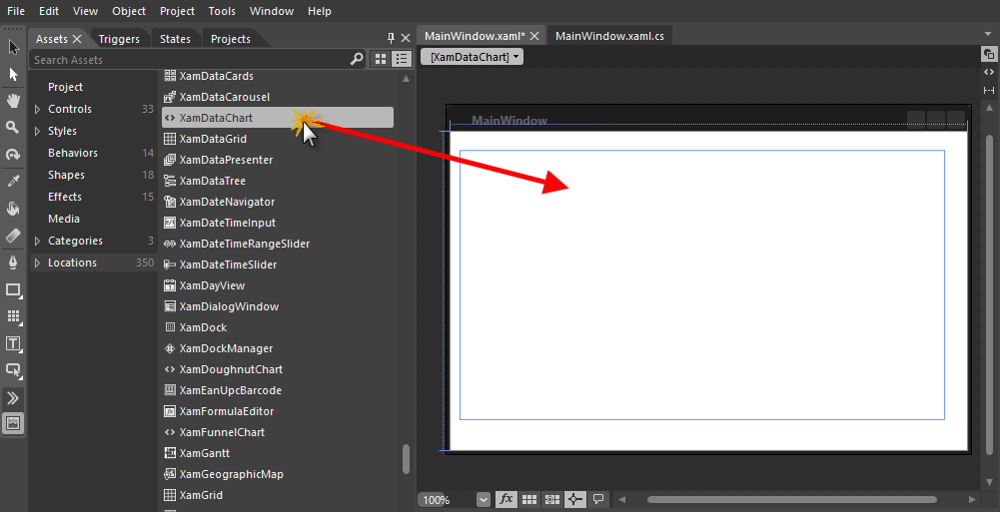
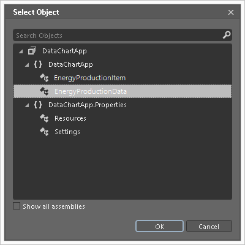
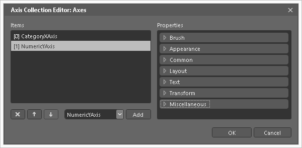
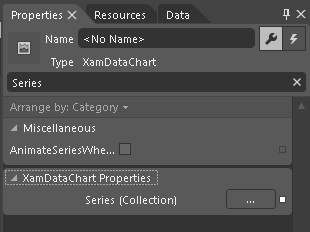

////
|metadata|
{
    "name": "datachart-creating-chart-in-ms-blend-xaml",
    "controlName": [],
    "tags": [],
    "guid": "1f70421a-83b4-409f-a7ce-4fac3b0323d6",
    "buildFlags": ["wpf","win-universal"],
    "createdOn": "2014-09-22T08:55:32.3063396Z"
}
|metadata|
////

= Creating Chart in MS Blend

== Topic Overview

=== Purpose

This topic provides detailed instruction on how to create the  _link:{DataChartLink}.{DataChartName}.html[{DataChartName}]™_   control in the Microsoft® Blend.

=== Required Background

The following topics are prerequisites to understanding this topic:

[options="header", cols="a,a"]
|====
|Topic|Purpose

| link:datachart-datachart.html[*{DataChartName}* ]
|This topic provides a general overview of the _{DataChartName}_ control

| link:datachart-getting-started-with-datachart.html[Getting Started with Data Chart]
|This topic provides information on how to get started with the _{DataChartName}_ control.

| link:datachart-series-requirements.html[Series Requirements]
|This topic provides information on requirements of Series objects in the _{DataChartName}_ control.

|====

=== In this topic

This topic contains the following sections:

* <<_Ref397371182, _Overview_  >>

** <<_Ref397371188,Preview>>
** <<_Ref396219292,Application Requirements>>
** <<_Ref397371278,Chart Requirements>>
** <<_Ref396236025,Creating Application>>
** <<_Ref396236029,Creating Data Source>>
** <<_Ref396236037,Creating Chart>>
** <<_Ref396236032,Creating Axes>>
** <<_Ref396236034,Creating Series>>

* <<_Ref388439099,Related Content>>

[[_Ref386478097]]
[[_Configuring_a_Custom]]
[[_Ref397371182]]
== _Overview_

[[_Ref397371188]]

=== Preview

The following is the preview of the result of this topic

image::images/DataChart_Creating_Chart_In_MS_Blend_1.png[]

[[_Ref396219292]]

=== Application Requirements

The following table lists requirements for creating the  _{DataChartName}_   control.

[options="header", cols="a,a"]
|====
|Requirement|Description

|Install Infragistics product
|The chart control is part of Infragistics product

|Data Source
|The chart control requires some data source and this topic provides link:resources-sample-energy-data.html[Sample Energy Data] as sample data source. You can use this data source or add your own data. Refer to link:datachart-series-requirements.html[Series Requirements] topic for information on requirements of all types of chart series.

|====

[[_Ref397371278]]

=== Chart Requirements

The chart control supports various types of data visualizations called Series. These series objects can visualize wide range of data source. Refer to the link:datachart-series-types.html[Series Types] topic for complete list of series supported in the chart control. Each type of series can plot data that meets certain requirements (such as number of data column and their types) as well as what type of axis can be used with it. Refer to the link:datachart-series-requirements.html[Series Requirements] topic for requirements for each of the series.

For demonstration purpose, this topic uses link:resources-sample-energy-data.html[Sample Energy Data] with only one link:{DataChartLink}.areaseries.html[AreaSeries] and two axes: CategoryXAxis and NumericYAxis.

[[_Ref396236025]]

=== Creating Application

Create {PlatformName} application project in the Microsoft® Blend.

.Note
[NOTE]
====
You don’t need to add any references to Infragistics components because they will be added automatically when you drag and drop Infragistics DataChart control to designer surface.
====

[[_Ref396236029]]

=== Creating Data Source

Copy sample data code from the link:resources-sample-energy-data.html[Sample Energy Data] resource and add it to your project.

[[_Ref396236037]]

=== Creating Chart

[start=1]
. In the Assets toolbox panel, navigate to the XamDataChart control.

[start=2]
. Drag and drop the XamDataChart control to design surface.

[start=3]
. Select the XamDataChart control and go to Properties panel.

The following Infragistics Libraries will be added to your project:

* {ApiPlatform}Controls.Charts.XamDataChart{ApiVersion}.dll
* {ApiPlatform}DataVisualization{ApiVersion}.dll
* {ApiPlatform}v{ProductVersion}.dll

[start=4]
. In the Properties panel, navigate to the DataContext property

[start=5]
. Click the New button.

[start=6]
. Select EnergyProductionData object and then click the OK button.

[[_Ref396236032]]

=== Creating Axes

[start=1]
. In the Properties panel, navigate to the Axes (Collection) property of the Data Chart control

[start=2]
. Click ellipses (…) button next to Axes (Collection) property.

image::images/DataChart_Creating_Chart_In_MS_Blend_4.png[]

[start=3]
. Select CategoryXAxis from drop-down control and click the Add button.

[start=4]
. Select NumericYAxis from drop-down control and click the Add button.

[start=5]
. Click the OK button to close the Axes Collection Editor.

[start=6]
. In design surface, change current selection to the CategoryXAxis object:

* Right click on center of the Data Chart
* Navigate to the Set Current Selection menu item
* Select the CategoryXAxis menu item

[start=7]
. In Properties panel, set the following properties of the CategoryXAxis object:

[options="header", cols="a,a,a,a"]
|====
|Property Name|Property Type|Property Value|Notes

|Name
|string
|xAxis
|Sets the identifying name of the axis element

| link:{DataChartLink}.categoryaxisbase~{ApiDataSource}.html[{ApiDataSource}]
|string
|{Binding}
|Sets the ItemsSource property for the axis

| link:{DataChartLink}.axis{ApiProp}label.html[Label]
|string
|{}{Country}
|Sets the axis label format string

| link:{DataChartLink}.axis{ApiProp}title.html[Title]
|string
|X-Axis
|Sets the displayed title for the axis

|====

[start=8]
. In design surface, change current selection to the NumericYAxis object:

* Right click on center of the Data Chart
* Navigate to the Set Current Selection menu item
* Select the NumericYAxis menu item

[start=9]
. In Properties panel, set the following properties of the NumericYAxis object:

[options="header", cols="a,a,a,a"]
|====
|Property Name|Property Type|Property Value|Notes

|Name
|string
|yAxis
|Sets the identifying name of the axis element

| link:{DataChartLink}.axis{ApiProp}title.html[Title]
|string
|Y-Axis
|Sets the displayed title for the axis

|====

.Note
[NOTE]
====
Numeric YAxis automatically calculates MinimumValue and MaximumValue based on range of data bound to the Series objects and you don’t have sets these properties.
====

[[_Ref396236034]]

=== Creating Series

[start=1]
. In the Properties panel, navigate to the Series (Collection) property of the Data Chart control.

[start=2]
. Click ellipses (…) button next to Series (Collection) property.

[start=3]
. Select AreaSeries from drop-down control and click the Add button.

image::images/DataChart_Creating_Chart_In_MS_Blend_7.png[]

[start=4]
. Click the OK button to close the Series Collection Editor

[start=5]
. In design surface, change current selection to the AreaSeries object

* Right click on center of the Data Chart
* Navigate to the Set Current Selection menu item
* Select the AreaSeries menu item

[start=6]
. In Properties panel, set the following properties of the AreaSeries object

[options="header", cols="a,a,a,a"]
|====
|Property Name|Property Type|Property Value|Notes

|Name
|string
|AreaSeries
|Sets the identifying name of the axis element

| link:{DataChartLink}.series~{ApiDataSource}.html[{ApiDataSource}]
|string
|{Binding}
|Sets the ItemsSource property for the axis

| link:{DataChartLink}.AnchoredCategorySeries{ApiProp}valuememberpath.html[ValueMemberPath]
|string
|Coal
|Sets the value mapping property for the series object

| link:{DataChartLink}.HorizontalAnchoredCategorySeries{ApiProp}xaxis.html[XAxis]
|string
|{Binding ElementName=xAxis}
|Sets the effective x-axis for this series

| link:{DataChartLink}.HorizontalAnchoredCategorySeries{ApiProp}yaxis.html[YAxis]
|string
|{Binding ElementName=yAxis}
|Sets the effective y-axis for this series

|====

.Note
[NOTE]
====
Element names of bindings for axis properties must match names that were set on axis objects in previous section.
====

[[_Ref388439099]]
== Related Content

[[_Ref386478106]]

=== Topics

The following topics provide additional information related to this topic.

[options="header", cols="a,a"]
|====
|Topic|Purpose

| link:datachart-datachart.html[{DataChartName}] 

|This topic provides a general overview of the _{DataChartName}_ control

| link:datachart-getting-started-with-datachart.html[Getting Started with Data Chart]
|This topic provides information on how to get started with the _{DataChartName}_ control.

| link:datachart-series-requirements.html[Series Requirements]
|This topic provides information on requirements of Series objects in the _{DataChartName}_ control.

|====