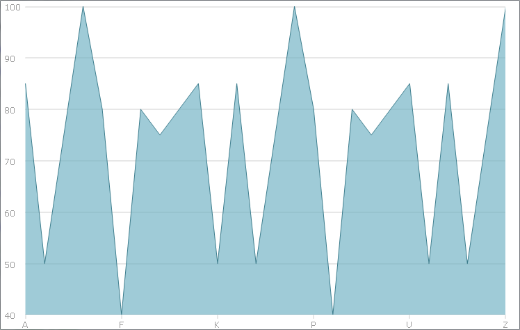
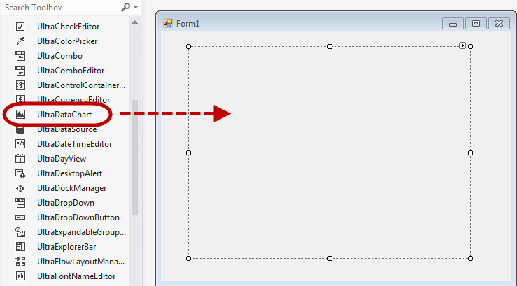
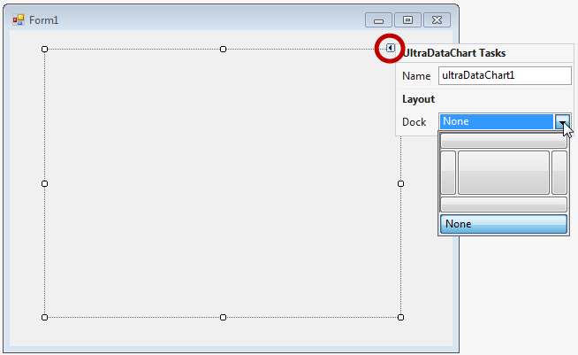
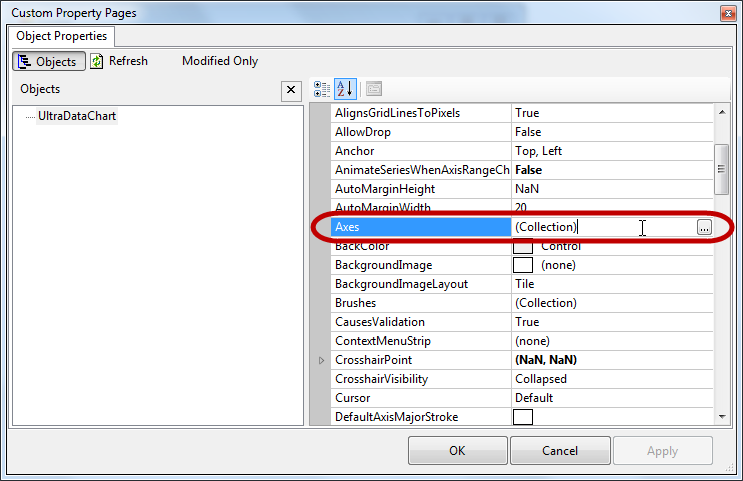
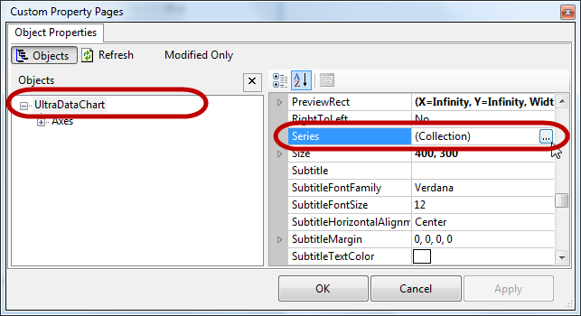
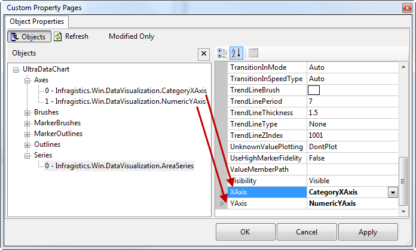

////

|metadata|
{
    "name": "datachart-creating-chart-in-vs-designer-winforms",
    "controlName": [],
    "tags": [],
    "guid": "07e9aeae-d8bc-43ae-ae1c-e29d9c61e2bd",  
    "buildFlags": ["WINFORMS"],
    "createdOn": "2014-09-22T09:18:01.3753495Z"
}
|metadata|
////

= Creating Chart In VS Designer

== Topic Overview

=== Purpose

This topic demonstrates creating the WinForms  _link:{DataChartLink}.{DataChartName}.html[{DataChartName}]™_   control using the {PlatformIDE} designer interface.

=== Required Background

The following topics are prerequisites to understanding this topic:

[options="header", cols="a,a"]
|====
|Topic|Purpose

| link:datachart-datachart.html[{DataChartName}]
|This topic provides a general overview of the _{DataChartName}_ control

| link:datachart-getting-started-with-datachart.html[Getting Started with Data Chart]
|This topic provides information on how to get started with the _{DataChartName}_ control.

| link:datachart-series-requirements.html[Series Requirements]
|This topic provides information on requirements of Series objects in the _{DataChartName}_ control.

|====

=== In this topic

This topic contains the following sections:

* <<_Ref397498693,Overview>>

* <<_Ref397435043,Preview>>
* <<_Ref397435047,Application Requirements>>
* <<_Ref396236025,Creating Application>>
* <<_Ref397435052,Adding Chart Control>>
* <<_Ref397435056,Using Smart Tags>>
* <<_Ref397435059,Custom Property Pages>>
* <<_Ref397435062,Adding Axes>>
* <<_Ref397435068,Adding Series>>
* <<_Ref396236029,Creating Data Source>>
* <<_Ref397435090,Binding Data Source>>

* <<_Ref381022312,Related Content>>

[[_Ref397498693]]
== Overview

[[_Ref397435043]]

=== Preview

The following is the preview of the result of this topic.

[[_Ref397435047]]

=== Application Requirements

The following table lists requirements for creating the  _{DataChartName}_   control

[options="header", cols="a,a"]
|====
|Requirement|Description

|Install Infragistics product
|The chart control is part of Ultimate UI for Windows Forms _2014 Volume 2_ or later version of the product.

|Add Data Source
|The chart control requires some data source and this topic provides link:resources-sample-energy-data.html[Sample Energy Data] as data source. You can use this data source or use your own data. Refer to link:datachart-series-requirements.html[Series Requirements] topic for information on requirements of all types of chart series.

|====

[[_Ref396236025]]

=== Creating Application

Create WinForms application project using {PlatformIDE} or later version.

Adding assemblies to the project is unnecessary, because when you drop the chart control on to the form, {PlatformIDE} will automatically add the following assemblies:

* {ApiPlatform}Win.DataVisualization.Shared{ApiVersion}.dll
* {ApiPlatform}Win.DataVisualization.UltraDataChart{ApiVersion}.dll
* {ApiPlatform}Win.Portable.Core{ApiVersion}.dll

[[_Ref397435052]]

=== Adding Chart Control

Drag and drop the {DataChartName} control from the {PlatformIDE} toolbox area on to a form as it is illustrated in the following screenshot:

[[_Ref397435056]]

=== Using Smart Tags

The control contains a smart tag, located in the control’s upper-right corner.

Click the arrow of the smart tag to drop down the task list. It contains  _Name_   and  _Dock_   properties for design-time customization.

[[_Ref397435059]]

=== Custom Property Pages

The {DataChartName} control exposes its properties in the {PlatformIDE} property grid as well as via "Custom Property Pages" dialog. Right-click on the chart control and select "Custom Property Pages" dialog window.

image::images/Create_DataChart_Using_the_Designer_4.png[]

This dialog window provides a convenient way of customizing the control, ability to refresh and see the changes, and view the modified properties only.

image::images/Create_DataChart_Using_the_Designer_5.png[]

[[_Ref397435062]]

=== Adding Axes

Next to the Axes property, click the ellipse (`…`) button to open a dialog editor. In this Axes Collection Editor, you can add axis objects to the chart control.

The Axes Collection Editor contains an "Add" button allowing you to select axis type from the list. Select a link:{DataChartLink}.categoryxaxis.html[CategoryXAxis] for horizontal axis, and a link:{DataChartLink}.numericyaxis.html[NumericYAxis] for the vertical axis for the purpose of this demonstration, and click OK to add both axis to Axes collection of the chart control.

image::images/Create_DataChart_Using_the_Designer_7.png[]

[[_Ref397435068]]

=== Adding Series

Next to the Series property, click the ellipse (`…`) button to open a dialog editor. In this Series Collection Editor, you can add series objects to the chart control.

The Series Collection Editor contains an "Add" button allowing you to select series type from the list. Select a link:{DataChartLink}.areaseries.html[AreaSeries] to visualize data and then click OK to add the series to Series collection of the chart control

Set XAxis and YAxis properties of the link:{DataChartLink}.areaseries.html[AreaSeries] to the names of axes that you created in previous section.

[[_Ref396236029]]

=== Creating Data Source

Copy sample data code from the link:resources-sample-energy-data.html[Sample Energy Data] resource to your project and create an instance of category sample data:

ifdef::win-forms[]

*In C#:*

[source,csharp]
----
var data = new CategorySampleData();
----

endif::win-forms[]

ifdef::win-forms[]

*In Visual Basic:*

[source,vb]
----
Dim data As New CategorySampleData()
----

endif::win-forms[]

[[_Ref397435090]]

=== Binding Data Source

Binding data requires configuration of the DataSource property exposed on a  _Series_   object, and on an  _Axis_   object of category type. The numeric axis objects do not have  _DataSource_   property and labels of this axis are automatically generated based on range of data bound to the series.

The following code example shows DataSource binding on the link:{DataChartLink}.categoryxaxis.html[CategoryXAxis] object as well as how to map labels of the axis to the Label data column.

ifdef::win-forms[]

*In C#:*

[source,csharp]
----
var xAxis = this.ultraDataChart1.Axes.OfType<CategoryXAxis>().FirstOrDefault();
xAxis.Label = "Country";  
xAxis.DataSource = data;
----

endif::win-forms[]

ifdef::win-forms[]

*In Visual Basic:*

[source,vb]
----
Dim xAxis = Me.ultraDataChart1.Axes.OfType(Of CategoryXAxis)().FirstOrDefault()
xAxis.Label = "Country"
xAxis.DataSource = data
----

endif::win-forms[]

The following example shows DataSource binding on link:{DataChartLink}.areaseries.html[AreaSeries] object as well as how to map values of the series to the Value data column.

ifdef::win-forms[]

*In C#:*

[source,csharp]
----
var series = this.ultraDataChart1.Series.OfType<AreaSeries>().FirstOrDefault();
series.ValueMemberPath = "Coal";
series.DataSource = data;
----

endif::win-forms[]

ifdef::win-forms[]

*In Visual Basic:*

[source,vb]
----
 Dim series = Me.ultraDataChart1.Series.OfType(Of AreaSeries)().FirstOrDefault()
series.ValueMemberPath = "Coal"
series.DataSource = data
----

endif::win-forms[]

[[_Ref381022312]]
== Related Content

=== Topics

The following topics provide additional information related to this topic.

[options="header", cols="a,a"]
|====
|Topic|Purpose

| link:datachart-creating-chart-in-code-behind-winforms.html[Creating Chart In Code Behind]
|This topic demonstrates, with code examples, how to create WinForms _UltraDataChart_ using the code behind.

|====