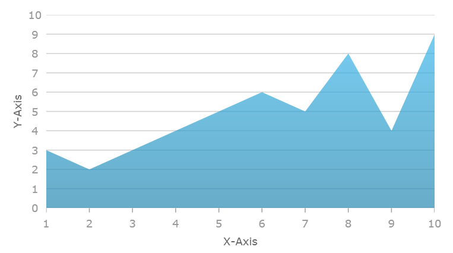

////
|metadata|
{
    "name": "datachart-creating-chart-in-xaml-code",
    "controlName": [],
    "tags": [],
    "guid": "0bf844e0-0b36-491d-b434-951a18aa3e1c",
    "buildFlags": ["XAML"],
    "createdOn": "2015-01-27T23:06:59.6613626Z"
}
|metadata|
////

= Creating Chart in XAML Code

== Topic Overview

=== Purpose

This topic provides detailed instruction on how to create the  _link:{DataChartLink}.{DataChartName}.html[{DataChartName}]™_   control in XAML code

=== Required Background

The following topics are prerequisites to understanding this topic:

[options="header", cols="a,a"]
|====
|Topic|Purpose

| link:datachart-datachart.html[{DataChartName}]
|This topic provides a general overview of the _{DataChartName}_ control

ifdef::xamarin[]
| link:xamarin-project-with-infragistics-controls.html[Creating Project with Infragistics Controls]
|This topic explains how to create application project to use with Ultimate UI for Xamarin controls.
endif::xamarin[]

| link:datachart-getting-started-with-datachart.html[Getting Started with Data Chart]
|This topic provides information on how to get started with the _{DataChartName}_ control.

| link:datachart-series-requirements.html[Series Requirements]
|This topic provides information on requirements of Series objects in the _{DataChartName}_ control.

|====

=== In this topic

This topic contains the following sections:

* <<_Ref397371182, _Overview_  >>
** <<_Ref397371188,Preview>>
ifdef::wpf,win-forms,sl,win-universal,android[]
** <<_Ref396219292,Application Requirements>>
endif::wpf,win-forms,sl,win-universal,android[]
** <<_Ref397371278,Chart Requirements>>
** <<_Ref396236025,Creating Application>>
ifdef::wpf,sl,win-universal[]
** <<_Ref396236029,Creating Data Source>>
endif::wpf,sl,win-universal[]
** <<_Ref396236037,Creating Chart>>
ifdef::xamarin[]
** <<_Ref396236029,Creating Data Source>>
endif::xamarin[]
** <<_Ref396236032,Creating Axes>>
** <<_Ref396236034,Creating Series>>

* <<_Ref388439099,Related Content>>

[[_Ref386478097]]
[[_Configuring_a_Custom]]
[[_Ref397371182]]
== _Overview_

[[_Ref397371188]]

=== Preview

The following is the preview of the result of creating chart control in XAML code.

ifdef::wpf,win-forms,sl,win-universal,android[]
[[_Ref396219292]]

=== Application Requirements

The following table lists requirements for creating the  _{DataChartName}_   control.

[options="header", cols="a,a"]
|====
|Requirement|Description

|Install the Infragistics product
|The chart control is part of the Infragistics product

|====

endif::wpf,win-forms,sl,win-universal,android[]

[[_Ref397371278]]

=== Chart Requirements

The chart control supports various types of data visualizations called Series. These series objects can visualize wide range of data source. Refer to the link:datachart-series-types.html[Series Types] topic for complete list of series supported in the chart control. Each type of series can plot data that meets certain requirements (such as number of data column and their types) as well as what type of axis can be used with it. Refer to the link:datachart-series-requirements.html[Series Requirements] topic for requirements for each of the series.

For demonstration purpose, this topic uses link:resources-sample-energy-data.html[Sample Energy Data] with only one link:{DataChartLink}.areaseries.html[AreaSeries] and two axes: CategoryXAxis and NumericYAxis.

[[_Ref396236025]]

=== Creating Application

[start=1]
. Create {PlatformName} application project using {PlatformIDE} or latest and call it *SampleApp*

[start=2]
. Add the following namespace declarations to the main XAML file:

ifdef::wpf[]

*In XAML:*

----
xmlns:ig="http://schemas.infragistics.com/xaml"
xmlns:local="clr-namespace:SampleApp"
----

endif::wpf[]

ifdef::xamarin[]

*In XAML:*

----
xmlns:ig="clr-namespace:Infragistics.XamarinForms.Controls.Charts;assembly=Infragistics.XF.Charts"
xmlns:local="clr-namespace:SampleApp;assembly=SampleApp"
----

endif::xamarin[]

ifdef::win-universal[]

*In XAML:*

----
xmlns:ig="using:Infragistics.Controls.Charts"xmlns:local="using:SampleApp"
----

endif::win-universal[]

[[_Ref396236025]]

=== Adding Assembly References

ifdef::win-forms,sl,win-universal[]
. Add the following Infragistics assemblies to the *SampleApp* project:

endif::win-forms,sl,win-universal[]

ifdef::win-universal[]
** {ApiPlatform}Controls.Charts.XamDataChart{ApiVersion}.dll

** {ApiPlatform}DataVisualization{ApiVersion}.dll

** {ApiPlatform}dll

endif::win-universal[]

ifdef::wpf[]

. Add the following NuGet package to the *SampleApp* project:

** Infragistics.WPF.Charts

+
For more information on setting up the NuGet feed and adding NuGet packages, you can take a look at the following documentation: link:nuget-feeds.html[NuGet Feeds].

endif::wpf[]

ifdef::xamarin[]
See link:xamarin-project-with-infragistics-controls.html#NuGetPackages[Add References Through NuGet Packages].

endif::xamarin[]

ifdef::wpf,sl,win-universal[]
[[_Ref396236029]]

=== Creating Data Source

[start=1]
. Copy sample data code from the link:resources-sample-energy-data.html[Sample Energy Data] resource and add it to the *SampleApp* project

[start=2]
. Create an instance of category sample data:

*In XAML:*

----
<Grid>
    <Grid.Resources>
        <local:EnergyDataSource x:Key="data"/>
    </Grid.Resources>
</Grid>
----
endif::wpf,sl,win-universal[]

[[_Ref396236037]]

=== Creating Chart

Create an instance an instance of the chart control with settings for one series and two axes.

*In XAML:*

----
<ig:{DataChartName} x:Name="Chart" >
    <ig:{DataChartName}.Axes>
        <!-- axes here -->
    </ig:{DataChartName}.Axes>
    <ig:{DataChartName}.Series>
        <!-- series here  -->
    </ig:{DataChartName}.Series>
</ig:{DataChartName} >
----

ifdef::xamarin[]
[[_Ref396236029]]

=== Creating Data Source

[start=1]
. Copy sample data code from the link:resources-sample-energy-data.html[Sample Energy Data] resource and add it to the *SampleApp* project

[start=2]
. Create an instance of category sample data:

*In XAML:*

----
<ig:XamDataChart.Resources>
    <ResourceDictionary>
        <local:EnergyDataSource x:Key="data"/>
    </ResourceDictionary>
</ig:XamDataChart.Resources>
----
endif::xamarin[]

[[_Ref396236032]]

=== Creating Axes

Create category x-axis for displaying labels and numeric y-axis for displaying values

ifdef::wpf,win-universal[]

*In XAML:*

----
<ig:{DataChartName}.Axes>
    <ig:CategoryXAxis x:Name="xAxis" ItemsSource="{StaticResource data}" Label="{}{Country}" />
    <ig:NumericYAxis  x:Name="yAxis" />
</ig:{DataChartName}.Axes>
----

endif::wpf,win-universal[]

ifdef::xamarin[]

*In XAML:*

----
<ig:XamDataChart.Axes>
    <ig:CategoryXAxis x:Name="xAxis" ItemsSource="{StaticResource data}" Label="Country" />
    <ig:NumericYAxis  x:Name="yAxis" />
</ig:XamDataChart.Axes>
----

endif::xamarin[]

[[_Ref396236034]]

=== Creating Series

Create an instance of a series and with bounding to the sample data source and set data mapping. In addition, the series must have settings for two axes created in previous section.

ifdef::wpf,win-universal[]

*In XAML:*

----
<ig:{DataChartName}.Series>
    <ig:AreaSeries ItemsSource="{StaticResource data}" 
                  ValueMemberPath="Coal" 
                  XAxis="{Binding ElementName=xAxis}" 
                  YAxis="{Binding ElementName=yAxis}">
    </ig:AreaSeries>
</ig:{DataChartName}.Series>
----

endif::wpf,win-universal[]

ifdef::xamarin[]

*In XAML:*

----
<ig:XamDataChart.Series>
    <ig:AreaSeries ItemsSource="{StaticResource data}" 
                  ValueMemberPath="Coal" 
                  XAxis="{x:Reference xAxis}" 
                  YAxis="{x:Reference yAxis}">
    </ig:AreaSeries>
</ig:XamDataChart.Series>
----

endif::xamarin[]

[[_Ref388439099]]
== Related Content

[[_Ref386478106]]

=== Topics

The following topics provide additional information related to this topic.

[options="header", cols="a,a"]
|====
|Topic|Purpose

| link:datachart-datachart.html[*{DataChartName}* ]
|This topic provides a general overview of the _{DataChartName}_ control

| link:datachart-getting-started-with-datachart.html[Getting Started with Data Chart]
|This topic provides information on how to get started with the _{DataChartName}_ control.

| link:datachart-series-requirements.html[*Series Requirements* ]
|This topic provides information on requirements of Series objects in the _{DataChartName}_ control.

|====