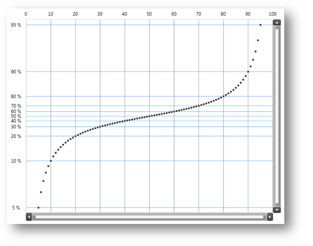

////
|metadata|
{
    "name": "datachart-creating-custom-axis-scalers",
    "controlName": ["{DataChartName}"],
    "tags": ["Charting","Data Presentation","Getting Started","How Do I"],
    "guid": "535b58d8-6ec4-4835-99a2-b3e08739040a",  
    "buildFlags": ["wpf","win-universal"],
    "createdOn": "2014-06-05T19:39:00.5823511Z"
}
|metadata|
////

= Creating Custom Axis Scalers

This topic introduces custom axis scaling feature of the link:{DataChartLink}.{DataChartName}.html[{DataChartName}]™ control and explains, with code examples, how to use it to create custom axis scaler.

== Overview

The topic is organized as follows:

* <<Introduction,Introduction>>
* <<SupportedAxes,Supported Axes>> 
* <<Example,Example>> 
 ** <<Preview,Preview>> 
 ** <<Implementation,Implementation>>
* <<RelatedContent,Related Content>>
 ** link:datachart-axes.html[Chart Axes]
 ** link:datachart-using-axis-scales.html[Configuring Axis Scales]

[[Introduction]]
== Introduction

The {DataChartName} control is designed to allow application developers to implement custom axis scales in their applications. This is accomplished by applying the custom axis scaler to the link:{DataChartLink}.straightnumericaxisbase{ApiProp}scaler.html[Scaler] property of a numeric axis. Refer to the link:datachart-using-axis-scales.html[Configuring Axis Scales] topic for basic information on using axis scale feature of the {DataChartName} control.

[[SupportedAxes]]
== Supported Axes

Table 1 – List of types of axes that support custom axis scaling feature.

[options="header", cols="a,a"]
|====
|Axes Type|Description

| link:{DataChartLink}.numericxaxis.html[NumericXAxis]
|Represents horizontal x-axis on which numeric values are plotted in the {DataChartName}

| link:{DataChartLink}.numericyaxis.html[NumericYAxis]
|Represents vertical y-axis on which numeric values are plotted in the {DataChartName}

|====

[[Example]]
== Example

An example of custom axis scaler is the ProbabilityVerticalScaler which scales values plotted along y-axis between 0% to 100% values in the {DataChartName} control.

[[Preview]]
== Preview

Figure 1 – Preview of the {DataChartName} control with ProbabilityVerticalScaler applied to y-axis.

[[Implementation]]
== Implementation

In order to implement custom axis scaler, you must create a class that inherits from the link:{DataChartLink}.numericscaler.html[NumericScaler] base class and override the following abstract methods of the base class:

[options="header", cols="a,a"]
|====
|NumericScaler Methods|Description

| link:{DataChartLink}.numericscaler{ApiProp}calculaterange.html[CalculateRange]
|Responsible for deciding the "actual minimum" and "actual maximum" values for the axis scale at runtime.

| link:{DataChartLink}.numericscaler{ApiProp}getscaledvalue.html[GetScaledValue]
|Responsible for getting the display or "pixel" position corresponding with a numeric value on the axis.

| link:{DataChartLink}.numericscaler{ApiProp}getunscaledvalue.html[GetUnscaledValue]
|Responsible for getting the numeric value corresponding to the display or "pixel" position on the axis. This is often the inverse function of the GetScaledValue method.

|====

The following code snippet shows how to create custom ProbabilityVerticalScaler by inheriting from NumericScaler class and overriding above methods with code for setting actual range of y-axis to 0-100% and scaling/un-scaling data values.

[NOTE]
====
**Note:** The CalculateRange method does not include any true calculations because the value scale has fixed range of 0-100%. This approach is used because the overridden method must return the updated the actual axis range. 
====

**In Visual Basic:**

[source,vb]
----
Imports {DataChartNamespace}
Namespace Infragistics.Samples.Common
    ''' 

    ''' Represents the probability scaler for vertical numeric axis
    ''' 

    Public Class ProbabilityVerticalScaler
        Inherits NumericScaler
        ''' 

        ''' Absolute minimum for probability value on a numeric axis
        ''' 

        Public Const AbsoluteProbabiltyMinimumValue As Double = 0.0
        ''' 

        ''' Absolute maximum for probability value on a numeric axis
        ''' 

        Public Const AbsoluteProbabiltyMaximumValue As Double = 100.0
        Protected Mu As Double = 0.5
        Protected Sigma As Double = 0.075
        ''' 

        ''' Calculates the actual minimum and actual maximum values for the axis scale
        ''' 

        Public Overrides Sub CalculateRange(target As NumericAxisBase, minimumValue As Double, maximumValue As Double, ByRef actualMinimumValue As Double, ByRef actualMaximumValue As Double)
            ' for this scaler the actual axis range is always between 0 and 100 percent 
            actualMinimumValue = AbsoluteProbabiltyMinimumValue
            actualMaximumValue = AbsoluteProbabiltyMaximumValue
        End Sub
        ''' 

        ''' Returns the display (pixel) position corresponding with a numeric value on the axis
        ''' 

        Public Overrides Function GetScaledValue(unscaledValue As Double, p As ScalerParams) As Double
            Dim scaledValue As Double = (unscaledValue - ActualMinimumValue) / (ActualMaximumValue - ActualMinimumValue)
            If Not p.IsInverted Then
                scaledValue = 1.0 - scaledValue
            End If
            scaledValue = Me.Mu + Me.Sigma * System.Math.Tan(System.Math.PI * (scaledValue - 0.5))
            Return p.ViewportRect.Top + p.ViewportRect.Height * (scaledValue - p.WindowRect.Top) / p.WindowRect.Height
        End Function
        ''' 

        ''' Returns the numeric value corresponding to the display or "pixel" position on the axis
        ''' 

        Public Overrides Function GetUnscaledValue(scaledValue As Double, p As ScalerParams) As Double
            Dim unscaledValue As Double = p.WindowRect.Top + p.WindowRect.Height * (scaledValue - p.ViewportRect.Top) / p.ViewportRect.Height
            If Not p.IsInverted Then
                unscaledValue = 1.0 - unscaledValue
            End If
            unscaledValue = 0.5 + 0.318309886183791 * System.Math.Atan2(unscaledValue - Me.Mu, Me.Sigma)
            Return ActualMinimumValue + unscaledValue * (ActualMaximumValue - ActualMinimumValue)
        End Function
    End Class
End Namespace
----

**In C#:**

[source,csharp]
----
using {DataChartNamespace};
namespace Infragistics.Samples.Common
{
    /// 

    /// Represents the probability scaler for vertical numeric axis
    /// 

    public class ProbabilityVerticalScaler : NumericScaler
    {
        /// 

        /// Absolute minimum for probability value on a numeric axis
        /// 

        public const double AbsoluteProbabiltyMinimumValue = 0.0;
        /// 

        /// Absolute maximum for probability value on a numeric axis
        /// 

        public const double AbsoluteProbabiltyMaximumValue = 100.0;
        protected double Mu = 0.5;
        protected double Sigma = 0.075;
        /// 

        /// Calculates the actual minimum and actual maximum values for the axis scale
        /// 

        public override void CalculateRange(NumericAxisBase target, double minimumValue, double maximumValue,
                                            out double actualMinimumValue,
                                            out double actualMaximumValue)
        {
            // for this scaler the actual axis range is always between 0 and 100 percent 
            actualMinimumValue = AbsoluteProbabiltyMinimumValue;
            actualMaximumValue = AbsoluteProbabiltyMaximumValue;
        }
        
        /// 

        /// Returns the display (pixel) position corresponding with a numeric value on the axis
        /// 

        public override double GetScaledValue(double unscaledValue, ScalerParams p)
        {
            double scaledValue = (unscaledValue - ActualMinimumValue)/(ActualMaximumValue - ActualMinimumValue);
            if (!p.IsInverted)
            {
                scaledValue = 1.0 - scaledValue;
            }
            scaledValue = this.Mu + this.Sigma * System.Math.Tan(System.Math.PI * (scaledValue - 0.5));
            return p.ViewportRect.Top + p.ViewportRect.Height * (scaledValue - p.WindowRect.Top) / p.WindowRect.Height;
        }
        /// 

        /// Returns the numeric value corresponding to the display or "pixel" position on the axis
        /// 

        public override double GetUnscaledValue(double scaledValue, ScalerParams p)
        {
            double unscaledValue = p.WindowRect.Top + p.WindowRect.Height * (scaledValue - p.ViewportRect.Top) / p.ViewportRect.Height;
            if (!p.IsInverted)
            {
                unscaledValue = 1.0 - unscaledValue;
            }
            unscaledValue = 0.5 + 0.318309886183790671 * System.Math.Atan2(unscaledValue - this.Mu, this.Sigma);
            return ActualMinimumValue + unscaledValue * (ActualMaximumValue - ActualMinimumValue);
        }
    }
}
----

Optionally, custom tick mark values can be implemented for the ProbabilityVerticalScaler as it is demonstrated in the following code snippet

**In Visual Basic:**

[source,vb]
----
Imports System.Collections.Generic
Imports System.Linq
Imports {DataChartNamespace}

Namespace Infragistics.Samples.Common
    Public Class ProbabilityTickmarkValues
        Inherits TickmarkValues
        Public Sub New()
            ' define probability tickmark values
           Me.ProbabilityValues = New DoubleCollection() From { 0, 5, 10, 20, 30, 40, 50, 60, 70, 80, 90, 95, 100 }
        End Sub

        Protected First As Double
        Protected Last As Double
        Protected ProbabilityValues As DoubleCollection

        ''' 

        ''' Initializes tickmark values prior to rendering axis labels, striplines, and gridlines
        ''' 

        ''' <param name="initializationParameters"></param>
        Public Overrides Sub Initialize(initializationParameters As TickmarkValuesInitializationParameters)
            MyBase.Initialize(initializationParameters)
            ' Initialize is overridden in order to store the minimum and maximum values, 
            ' which will be later used in the MajorValues() and MinorValues() methods.
            Me.First = initializationParameters.VisibleMinimum
            Me.Last = initializationParameters.VisibleMaximum
        End Sub
        ''' 

        ''' Returns values of major tickmarks
        ''' 

        ''' <returns></returns>
        Public Overrides Function MajorValues() As IEnumerable(Of Double)
            Dim values As IEnumerable(Of Double) = ProbabilityValues.Where(Function(value) value >= Me.First AndAlso value <= Me.Last)
            Return values
        End Function
        ''' 

        ''' Returns values of minor tickmarks
        ''' 

        ''' <returns></returns>
        Public Overrides Function MinorValues() As IEnumerable(Of Double)
                ' no minor tickmarks 
            Return New Double() {}
        End Function
    End Class
End Namespace
----

**In C#:**

[source,csharp]
----
using System.Collections.Generic;
using System.Linq;
using {DataChartNamespace};

namespace Infragistics.Samples.Common
{
    public class ProbabilityTickmarkValues : TickmarkValues
    {
        public ProbabilityTickmarkValues()
        {
            // define probability tickmark values
            this.ProbabilityValues = new DoubleCollection { 0, 5, 10, 20, 30, 40, 50, 60, 70, 80, 90, 95, 100 };
        }

        protected double First;
        protected double Last;
        protected DoubleCollection ProbabilityValues;
        
        /// 

        /// Initializes tickmark values prior to rendering axis labels, striplines, and gridlines
        /// 

        /// <param name="initializationParameters"></param>
        public override void Initialize(TickmarkValuesInitializationParameters initializationParameters)
        {
            base.Initialize(initializationParameters);
            // Initialize is overridden in order to store the minimum and maximum values, 
            // which will be later used in the MajorValues() and MinorValues() methods.
            this.First = initializationParameters.VisibleMinimum;
            this.Last = initializationParameters.VisibleMaximum;
        }
        /// 

        /// Returns values of major tickmarks
        /// 

        /// <returns></returns>
        public override IEnumerable<double> MajorValues()
        {
            IEnumerable<double> values = ProbabilityValues.Where((value) => value >= this.First && value <= this.Last);
            return values;
        }
        /// 

        /// Returns values of minor tickmarks
        /// 

        /// <returns></returns>
        public override IEnumerable<double> MinorValues()
        {
            return new double[] { /* no minor tickmarks */ };
        }
    }
}
----

The following code snippet shows how to apply custom ProbabilityVerticalScaler to the y-axis in the {DataChartName} control.

**In XAML:**

[source,xaml]
----
<ig:{DataChartName}.Axes>
    <ig:NumericYAxis Name="yAxis" MinimumValue="0" MaximumValue="100" Label="{}{} %" >
        <!-- ========================================================================== -->
        <ig:NumericYAxis.Scaler>
            <custom:ProbabilityVerticalScaler />
        </ig:NumericYAxis.Scaler>
        <!-- ========================================================================== -->
        <ig:NumericYAxis.TickmarkValues>
            <custom:ProbabilityTickmarkValues />
        </ig:NumericYAxis.TickmarkValues>
    </ig:NumericYAxis>
</ig:{DataChartName}.Axes>
----

[[RelatedContent]]
== Related Content

* link:datachart-axes.html[Chart Axes]
* link:datachart-using-axis-scales.html[Configuring Axis Scales]